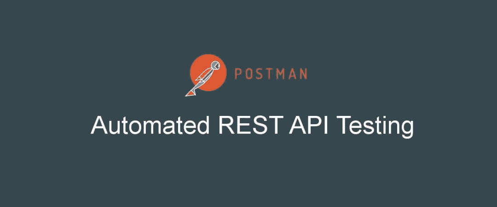
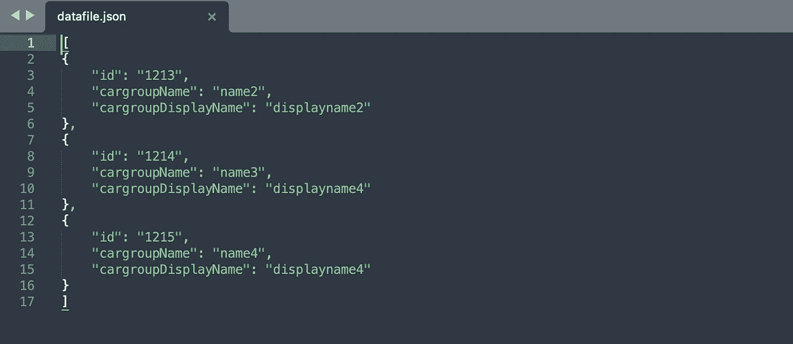
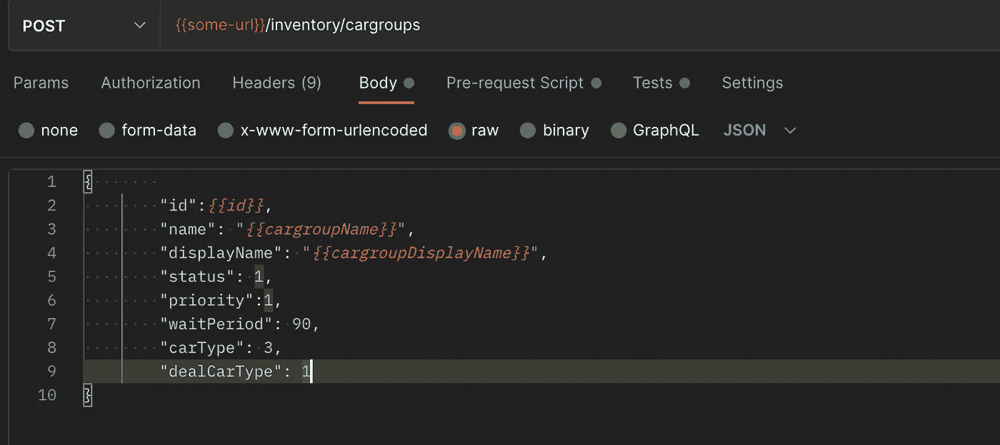
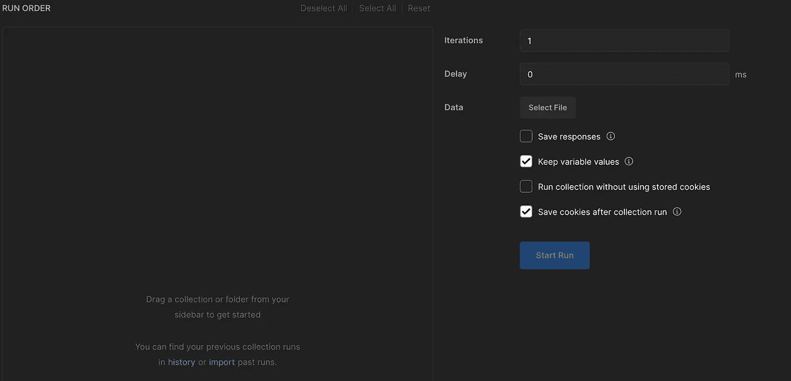
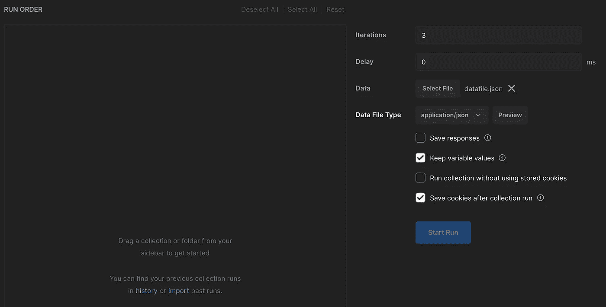
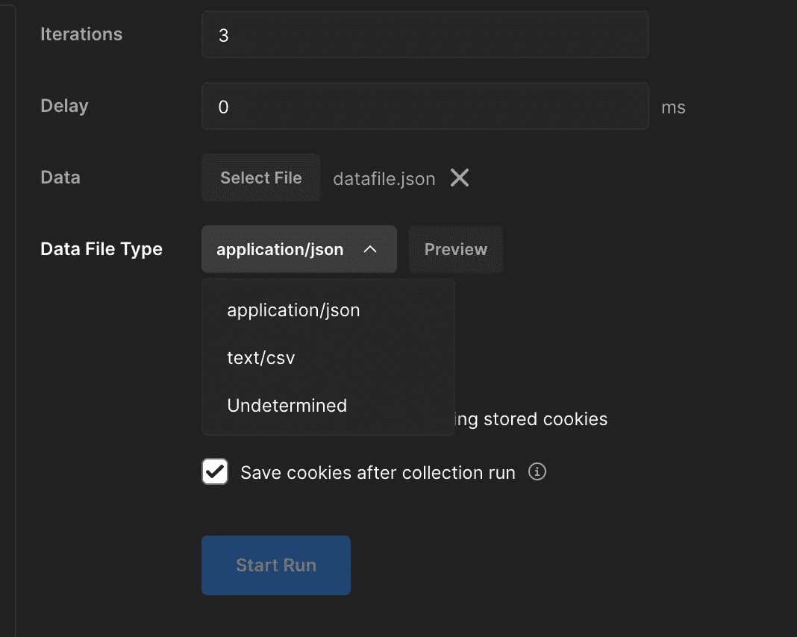
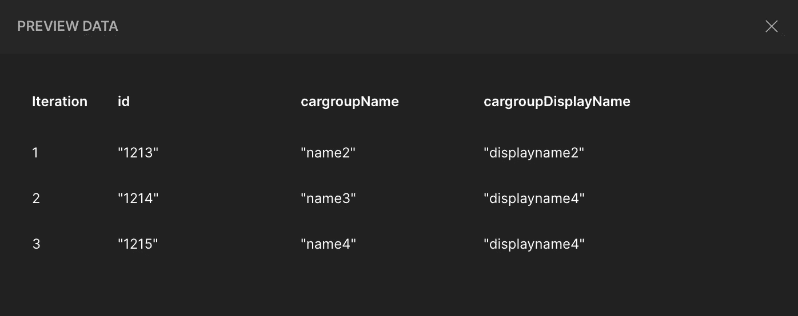
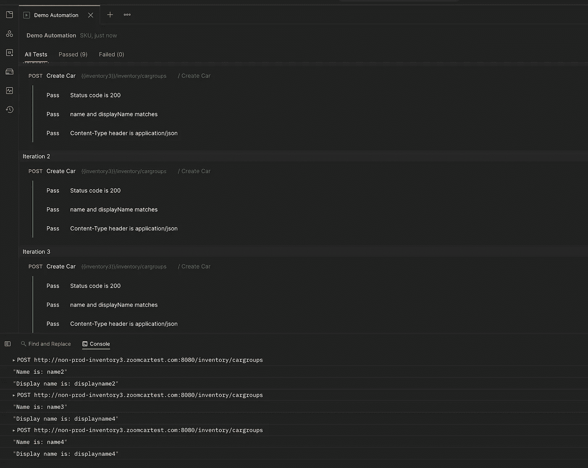
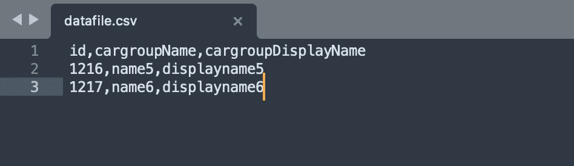
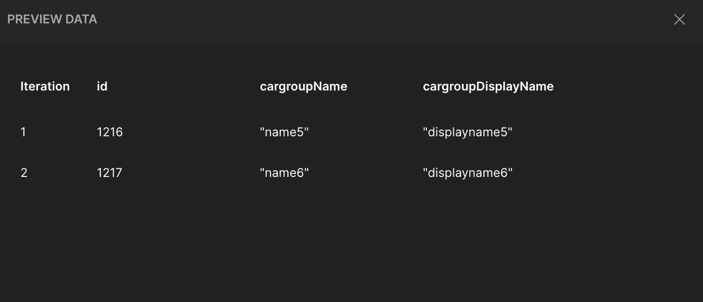

# 邮递员:数据驱动测试

> 原文：<https://medium.com/geekculture/postman-importing-test-data-from-data-files-2b43f6db0bb9?source=collection_archive---------7----------------------->

在我之前关于 postman 的文章中，我们已经讨论了如何[自动化 rest API](/geekculture/automating-rest-apis-with-postman-c740049b56dd)以及如何[验证 JSON 模式](/geekculture/postman-json-schema-validation-ed09b3532a39)。在本文中，我们将看到如何使用数据文件在自动化脚本中提供测试数据。

Postman 提供了两种方法来传递值集，以便在收集运行中使用。

1.  JSON 文件
2.  CSV 文件

通过在收集运行器中选择一个 JSON 或 CSV 数据文件，您可以在一次运行中使用多个不同的值来测试您的请求。

## 1.使用 JSON 文件传递数据

考虑一个样本 JSON，它有 3 组数据。我们将把这些数据传递给 POST 请求。

Sample JSON

这里的 id、cargroupName 和 cargroupDisplayName 是我们将传递给 POST 请求的变量。

POST Request

为了读取 JSON 数据，我们需要从收集运行器上传一个 JSON 文件。

Collection Runner Window

点击选择文件并上传数据文件。迭代字段显示数据文件中存在的数据集的数量。在我们的例子中，它是三个，但是我们可以通过定义迭代在前两个数据集上运行测试。延迟字段定义两次迭代之间的时间，单位为毫秒。

File Uploaded in Collection Runner

您可以选择数据类型文件。它有两种选择

*   应用程序/json
*   战斗支援车

单击预览以查看上传的数据。

在收集过程中，当 Postman 试图读取您的数据文件时，您可能会遇到错误。如果发生这种情况，您可以采取以下步骤。

1.  确保数据文件格式正确，为 CSV 或 JSON 格式。
2.  通过在文本编辑器中打开数据文件并以不同的格式保存文件，确认数据文件编码正确。

上传成功后，从边栏中拖动收藏或文件夹即可开始。

Test

> 要从 test 选项卡内的 JSON 文件中获取值，请使用方法 **iterationData**

让我们进行测试。

Test Run

如果你看到我们的 API 已经运行了三次。每次拾取不同的数据集。

## 2.使用 CSV 文件传递数据

使用 csv 文件时，一切都保持不变，只是文件的格式发生了变化。

sample csv

Preview Window

这就是本文的全部内容。

*完整的项目和更多的库可以在我的*[*github*](https://github.com/attrideepak)*上找到。*