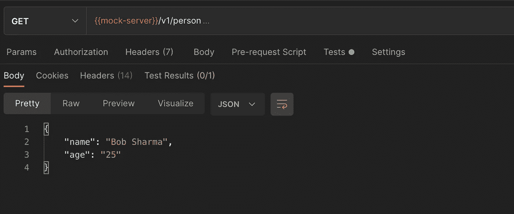
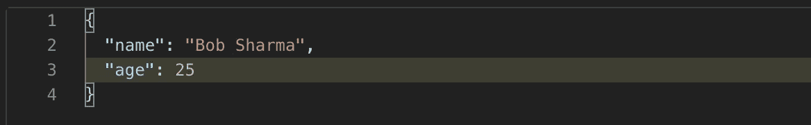
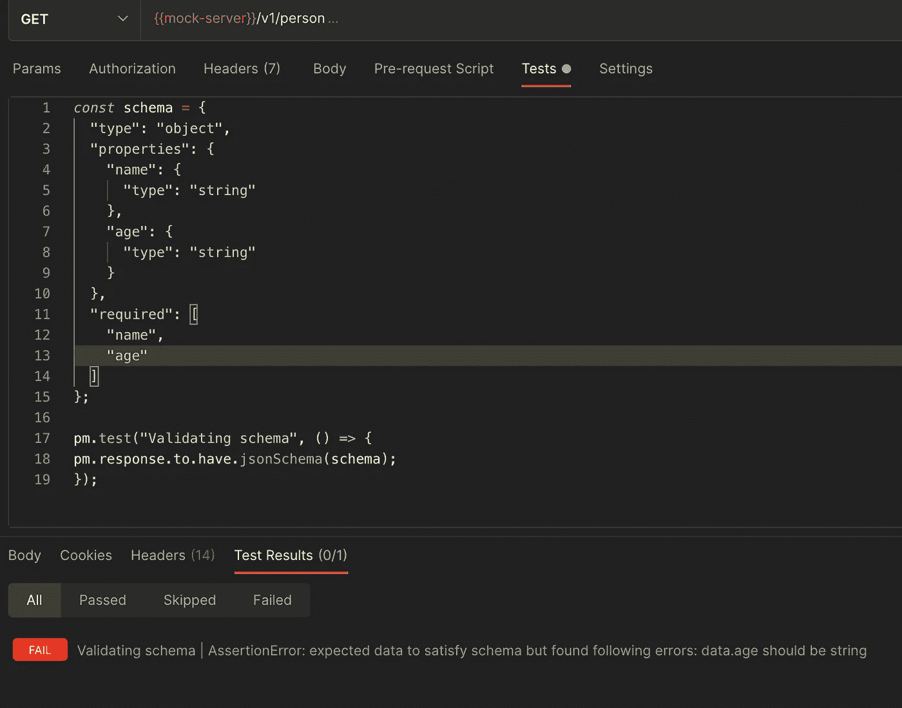
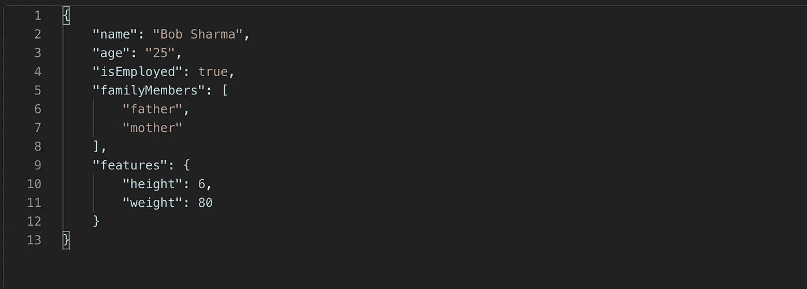
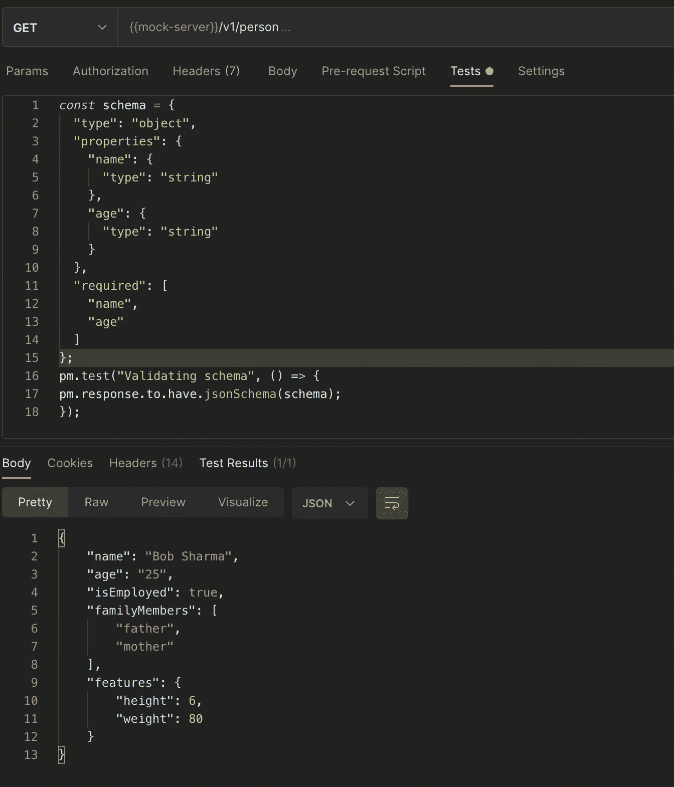
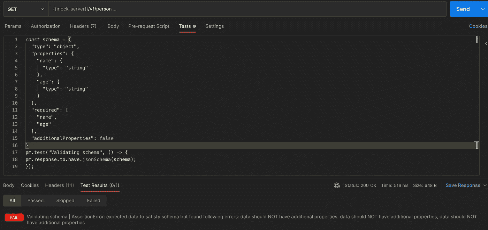
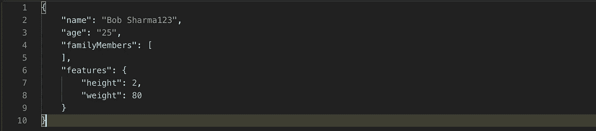
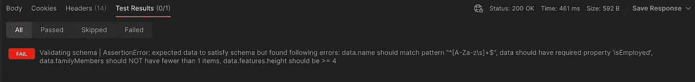

# Postman: JSON 模式验证

> 原文：<https://medium.com/geekculture/postman-json-schema-validation-ed09b3532a39?source=collection_archive---------0----------------------->

在我之前的[文章](/geekculture/automating-rest-apis-with-postman-c740049b56dd)中，我们讨论了如何使用 postman 自动化和验证 API。在本文中，我们将看到如何使用 postman 验证 JSON 模式。

## 什么是 JSON 模式？

[JSON Schema](https://json-schema.org/) 是定义 JSON 数据结构的规范，即 JSON 请求体和 API 情况下的响应。基本上，JSON 模式定义了各种键和它们的值，以及对这些值的某些约束。

JSON 模式中使用的各种重要关键字如下:

1.  **type:**type 关键字定义了 JSON 数据的第一个约束。类型可以是空值、布尔值、对象、数组、数字、整数或字符串。
2.  **properties:**properties 的值是一个对象，其中每个键是一个属性的名称，每个值是一个用于验证该属性的 JSON 模式。
3.  **必需的:**这保存了一个必需属性的列表，即强制属性。
4.  **最小值:**表示数字类型属性的最小可接受值。
5.  **最大值:**表示数字类型属性的最大可接受值。
6.  **maxItems:** 数组类型属性中的最大项数。
7.  **minItems:** 数组类型属性中的最小项数。
8.  **maxLength:** 表示字符串类型属性的最大长度。
9.  **minLength:** 表示字符串类型属性的最小长度。
10.  **模式:**如果正则表达式成功匹配实例，则认为字符串实例有效。
11.  **additionalProperties:** 用于处理那些名字没有列在 Properties 关键字中的属性。它可以是布尔值，也可以是对象。如果它是布尔值并设置为 false，则不允许任何附加属性。

整个名单可以在这里找到[。可以自己写 JSON schema，也可以在线生成。转到](https://json-schema.org/understanding-json-schema/index.html) [URL](https://jsonschema.net/) ，粘贴您的 JSON 并提交，JSON 模式将会生成。

## 为什么需要 JSON 模式验证？

JSON 模式验证确保我们得到的 JSON 响应格式与预期的格式相同。使用模式来验证 RESTful 服务的结构很简单，否则，几乎不可能在每次发生变化时都手工测试每个字段

## 如何使用 Postman 验证 JSON 模式？

## [另一个 JSON 模式验证器(Ajv)](https://ajv.js.org/) :

它是一个 JavaScript 库，提供了验证 JSON 模式的函数。它内置在 postman 中。

让我们验证以下 API 响应的 JSON 模式。

API Response

Test Script And Test result

我们已经成功地根据 JSON 模式验证了 JSON 响应。现在，如果属性的类型`age`被更改为`Integer`会怎样。

Changed Response

我们的测试会失败，因为在 JSON 模式中，我们已经将属性类型`age`定义为`String`

Failed Test

让我们验证一个更复杂的 JSON 响应。

这里您可以看到测试已经通过，尽管我们的 JSON 模式没有包括所有其他属性。这是因为`additionalProperties`默认为真。如果`additionalProperties`设置为假呢？

additionalProperties :false

测试失败，字符串`data should NOT have additional properties`重复三次，每个`isEmployed`、`familyMembers`和`features`一次。

现在让我们验证以下条件:

1.  `name`应仅包含字母和空格，即匹配正则表达式`^[A-Za-z\\s]+$`
2.  响应中缺少属性`isEmployed`之一。
3.  `familyMembers`数组的最小长度应为 2，最大长度应为 4。
4.  属性`height`的最小值和最大值。

包含上述条件的 JSON 模式:

现在假设反应已经改变

Modified Response

对于上面的响应，我们的测试应该会失败，因为在 JSON 模式中，我们已经定义了属性`name`应该只有字母和空格，`familyMembers`必须至少有一项，`isEmployed`是强制属性，最小值`height`是 4。

我们可以看到测试失败了，断言清楚地显示了失败的原因。

使用 JSON 模式解决了 RESTful API 服务的提供者和消费者之间的大多数通信问题。提供者可以是后端开发人员，消费者可以是移动开发团队。JSON 模式有一个惊人的学习曲线。一些开发人员觉得这很难操作，认为它“太罗嗦”。

这就是本文的全部内容。

*完整项目和更多库可以在我的*[*github*](https://github.com/attrideepak)*上找到。*