# 邮递员 vs 失眠 vs 求知

> 原文：<https://medium.com/geekculture/postman-vs-insomnia-vs-knowi-4ed2e9c6d1b5?source=collection_archive---------3----------------------->

三方面比较，知道哪个是最好的 API 工具。

**目录:**

*   [简介](#912e)
*   [邮递员](#9f66)
*   [失眠](#b466)
*   [Knowi](#1b2c)
*   [邮递员 vs 失眠 vs 知乎](#e9f7)
*   [集成](#ada3)
*   [可视化](#316c)
*   [通知](http://debe)
*   [多源连接](#f04f)
*   [支持数据](#428f)
*   [嵌入](#4097)
*   [客户支持](#eada)
*   [定价](#73d1)
*   [邮递员 vs 失眠 vs 求知-最后的想法](#28cc)

# 介绍

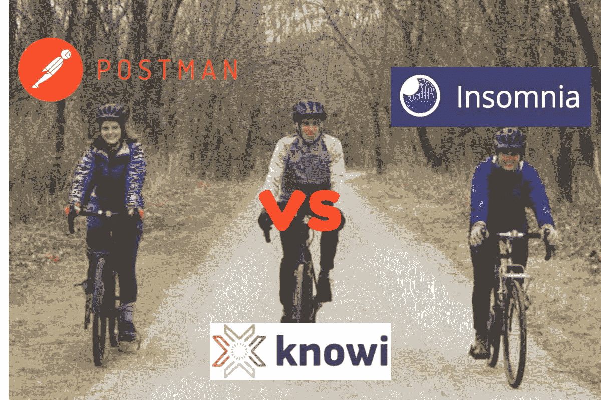

Image by Author

客户端 API 可以加快开发过程。它们提供了一种在 web 应用程序开发期间绕过一些操作的方法，而不是每次都重新发明轮子。它们还有助于发送 HTTP 请求和读取响应。邮差 vs 失眠 vs Knowi 我是今天用来连接 API 的一些工具。在本文中，我们做了三方面的比较，以了解这些工具彼此的情况。但是首先，让我们对每个工具做一个简单的概述。

# 邮递员

Postman logo (source-www.postman.com)

[Postman](https://www.postman.com/) 是开发者用来创建、测试、共享和文档化 API 的 API 客户端。它附带了一个 API 开发工具链，可以与您的工作流集成。Postman 团队与行业合作伙伴一起开发一个开放的生态系统，用于构建可以促进您的 API 项目的集成。Postman 用户可以创建和保存简单和复杂的 HTTP 请求，甚至可以阅读它们的响应。使用 Postman，应用程序开发人员可以将一组特定的数据传递给他们的应用程序，并查看它是否返回预期的结果。Postman 控制台还可以让团队查看检索到的数据。

这个开源解决方案具有导入和导出功能，有助于团队成员之间的共享和协作。它是 2012 年发明的。

# 失眠

Insomnia logo (source-insomnia.rest)

[失眠症](https://insomnia.rest/)是一个开源的、强大的 REST API 客户端，用于存储和运行 REST API 请求。它是 Postman 的一个很好的替代 REST API 客户端。失眠有利于发送 REST 和 GraphQL 请求。它的一些特性包括 cookie 管理、代码生成、身份验证和对环境变量的支持。就像 Postman 一样，失眠用户可以将一组特定的数据传递给他们的应用程序，并查看它是否返回预期的结果。该工具可以以您选择的格式返回响应，包括 JSON、图像、HTML 页面和 PDF 文档。失眠还允许用户创建新的插件来扩展其功能。它的代码生成功能允许用户用 12 种不同的语言生成代码。

# Knowi

Knowi logo (source-www.knowi.com)

[Knowi](https://www.knowi.com/) 是邮差和失眠的另一种解决方案。虽然其他两个解决方案是针对开发人员的，但 Knowi 是一个成熟的分析解决方案，REST API 是可以集成的一等公民。它可以连接到多个 API，跨其他 SQL 和 NoSQL 数据库加入，并有一个业务用户友好的界面来可视化和交互数据。

# 邮递员 vs 失眠 vs 求知

在这一节，我们将比较邮差 vs 失眠 vs Knowi 如何相互比较。将考虑以下核心领域:

*   集成
*   形象化
*   通知
*   多源连接
*   支持的数据
*   把...嵌入
*   客户支持
*   定价

# 集成

Postman 有一个 API 开发工具链，可以方便地与您的工作流集成。Postman 团队与行业合作伙伴一起构建了一个开放的生态系统，以创建可以促进您的 API 项目的集成。通过这些集成，您可以在 Postman 和 API 开发期间可能需要的其他工具之间自动化共享数据和功能的过程。到目前为止，Postman 支持与 26 个工具的集成，包括 AWS API Gateway、Bitbucket 等。

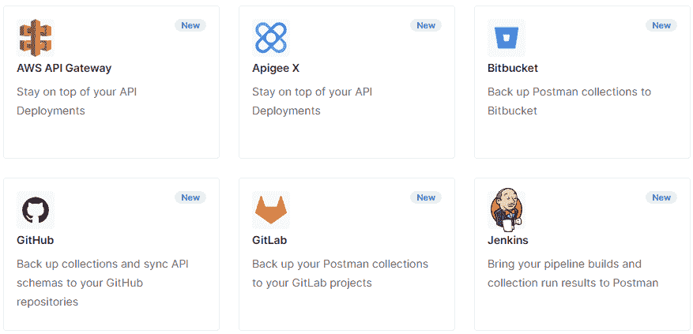

Postman integrations (Source-web.postman.co)

他们有一个“请求集成”链接，您可以单击该链接请求 Postman 团队与特定产品进行集成。

失眠通过插件支持集成。失眠症有一个几乎 350 个插件的库，安装起来既快又容易。

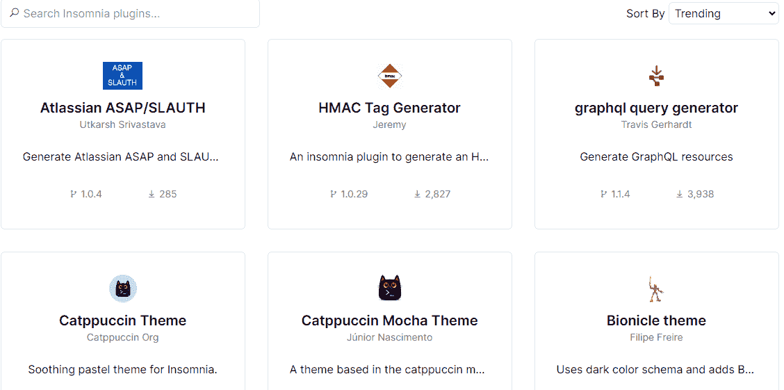

Insomnia plugins (Source-insomnia.rest)

这些插件允许您扩展失眠，并与其他应用程序交换请求和数据。如果没有适合你具体用例的插件，失眠可以让你自己搭建插件。

Knowi 提供了一个通用但功能强大的 API 连接器，可以将其视为数据集即服务范式的数据源，以及许多带有 API 的云服务的现成包装器(如 Hubspot、Amplitude、Zendesk 等)。它还提供了与 NoSQL 数据库和 SQL 数据库 MongoDB、Apache Cassandra、Elasticsearch 等的本机集成，您可以将 API 数据与数据库数据组合成可重用的数据集。

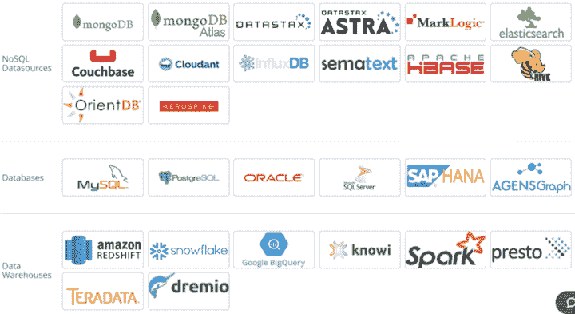

Knowi data sources (source-knowi.com)

# 形象化

Postman 有 Postman Visualizer，可以让您将 API 数据转换成图表和图形。可视化工具提供了一种可视化表示请求响应的可编程方式。您只需将可视化代码添加到请求的测试中，可视化就会呈现在响应主体的“Visualize”选项卡中。

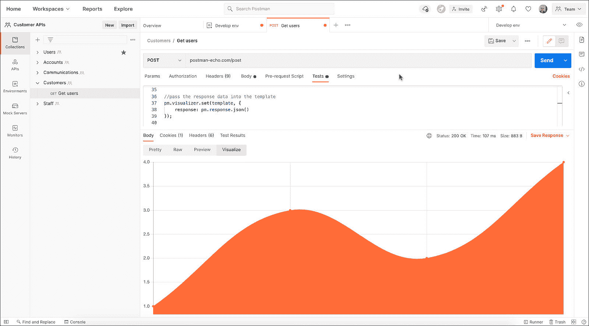

A Postman Visualization (Source-postman.com)

您可以使用 HTML5、CSS 和 JavaScript 代码定制可视化效果，或者使用图表库创建丰富的可视化效果。

失眠症主要用于显示 JSON 和 XML 等文本内容，但它也可以表示 HTML、可伸缩矢量图形(SVG)、图像、音频文件、CSV 和 PDF 等格式的丰富内容。您可以使用“预览”下拉菜单将预览模式更改为可视。

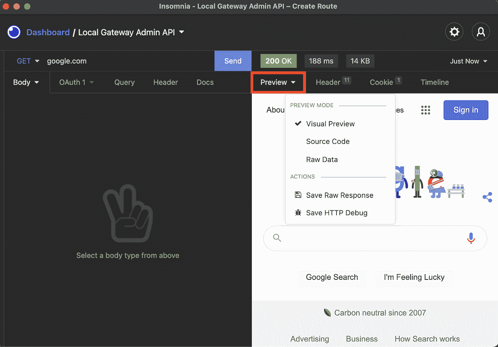

Insomnia Preview Mode (Source-insomnia.rest)

我可以用来创建可定制的仪表板和可视化。它支持超过 35 种可视化，可用于可视化地呈现数据，非技术用户也可以使用。

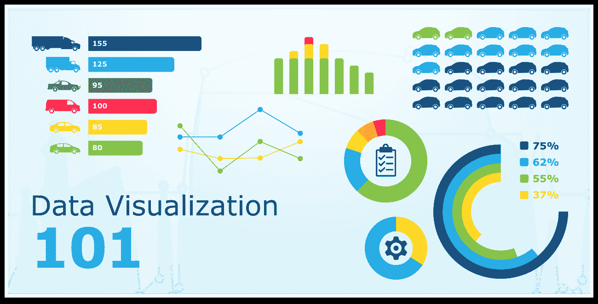

A Knowi dashboard (Source-knowi.com)

此外，Knowi 用户可以使用 Javascript 创建定制的可视化，以满足他们的特定需求。

# 通知

Postman 有一个通知功能，可以让您随时了解您的 Postman 帐户中正在发生的事情。Postman 允许您选择是否通过电子邮件、Slack 或 Microsoft 团队接收通知。您可以控制想要接收的通知类型。您还可以通过 Opsgenie、PagerDuty、Splunk 电话技术支持或 Statuspage 接收事件管理警报。

失眠通过电子邮件向用户发送普通警报。但是，用户可以通过安装必要的插件来获得该功能。

Knowi 有一个提醒功能，让用户随时了解他们的数据或业务发生的变化。当在您的数据中检测到特定条件、阈值和异常时，警报会发送实时通知。用户还可以根据数据中的异常、阈值或自定义条件直接在小部件上设置警报。警报通知可以通过 webhook、电子邮件或 Slack 发送。

# 多源连接

多源联接有助于将不同来源的数据合并为一个。邮差和失眠都不支持 join 操作。

Postman 只有 Postman runner 特性，它允许您以特定的顺序在集合中运行 API 请求。请求的测试结果被记录下来，它可以使用脚本在请求之间传递数据并更改工作流。

另一方面，失眠允许链接请求，这是从一个请求中获取信息并将其用作另一个请求的输入的做法。这些值是使用环境变量和模板标签传递的。

Knowi 支持跨多个数据源的连接，以混合和存储组合数据。连接操作也是基于数据源之间的公共字段来执行的。

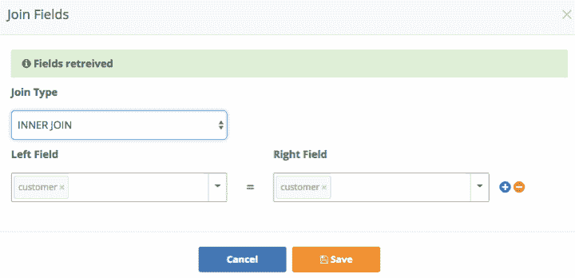

Creating a join in Knowi (Source-knowi.com)

使用 Knowi，您可以执行内连接、左外连接、全外连接、右外连接和循环连接。内部联接被用作联接操作的默认类型。Knowi 旨在支持跨多个数据源的数百万条记录的大规模连接操作。它还具有优化连接操作以加快处理速度的机制。

# 支持的数据

在比较 Postman vs 失眠症 vs Knowi 时，支持的数据是一个需要考虑的重要特征。Postman 可以用来针对不同的数据集测试 API。它支持 JSON 和 CSV 文件来获取测试脚本的数据。当想要用多组数据运行测试时，可以使用这种数据驱动的方法。

失眠允许您导入和导出邮差 V2，失眠，开放 API，HAR，WSDL，招摇，卷曲格式的数据。

Knowi 具有数据虚拟化功能，允许它处理任何类型的数据，无论是结构化数据、非结构化数据、小数据还是大数据，而无需考虑底层数据结构。Knowi 用户还可以执行结构化和非结构化数据源之间的连接。

# 把...嵌入

Postman 允许您通过创建一个独立的“在 Postman 中运行”按钮来共享您的收藏(一组保存的请求)。该按钮允许用户分叉集合。该按钮可以嵌入到博客和网页中，使消费者能够快速导入集合并与 API 进行交互。

就像邮递员一样，失眠允许你创建一个“失眠时运行”按钮，帮助你点击几下就可以运行请求。该按钮可以嵌入到 HTML 页面和 markdown 文档中，让用户直接运行请求。

Knowi 有许多支持嵌入式分析的选项。用户可以生成仪表板的 URL，并将其嵌入到外部应用程序中。Knowi 用户可以创建仪表板的安全 URL，使用参数来控制向客户公开的数据类型。它还提供了单点登录 API 特性，该特性有助于系统中用户之间的令牌交换，以映射到具有用户权限的 Knowi。

# 客户支持

Postman 有一个学习中心，里面有关于如何使用 API 客户端的文档、视频和教程。它还有一个 FAQ 部分，回答了关于 Postman 的各种问题。你也可以在它的用户社区里提问，得到其他邮差用户的回复。Postman 也有 Postman 回答部分，其中包含常见问题的代码示例。您也可以通过官方网站上的聊天功能提交支持票。

失眠用户可以从失眠的官方 GitHub 知识库获得帮助，所有编码都在这里进行。

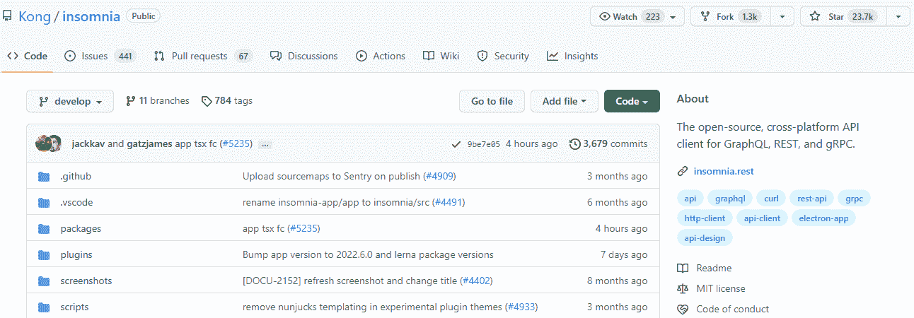

Insomnia official GitHub repository (Source-github.com)

用户可以提问、提交 PRs 和公开问题。它也有一个官方的 Slack 聊天，用户可以提出问题，并与其他用户实时讨论。用户也可以通过电子邮件联系失眠支持团队。

Knowi 带有一个知识库，允许用户键入他们的问题，并以文章的形式获得答案。当用户键入一个问题时，他们会得到可能回答他们问题的热门文章建议。

Knowi help center (Source-knowi.com)

它还附带了关于如何使用 BI 平台的发行说明。最近，Knowi 推出了一个社区论坛，提供了可能对用户有帮助的问题和答案。他们还有一个由 zendesk 支持的聊天系统，允许用户提交门票，通过门票他们可以得到他们问题的答案。

# 定价

Postman 有一个免费计划，包含最多 3 个用户的所有核心工具和协作，外加 3 个其他付费计划，即基本、专业和企业。基本计划的费用为每个用户每月 12 美元，按年计费，或者每个用户每月 15 美元，按月计费。专业计划的费用为每个用户每月 29 美元，按年计费，或每个用户每月 36 美元，按月计费。企业计划的费用为每个用户每月 99 美元，按年计费。

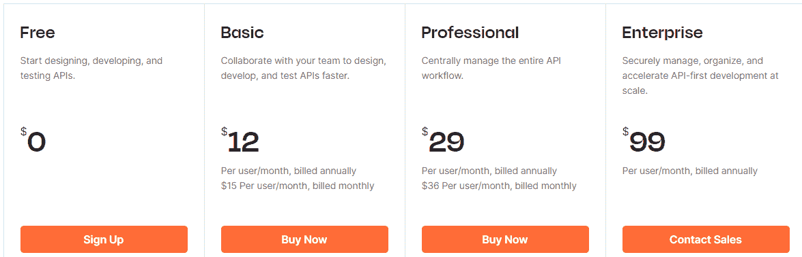

Postman pricing plans (Source-www.postman.com)

失眠有一个免费计划和另外两个付费计划，即个人和团队。个人计划的费用为每个用户每年 50 美元，而团队计划的费用为每个用户每年 120 美元。

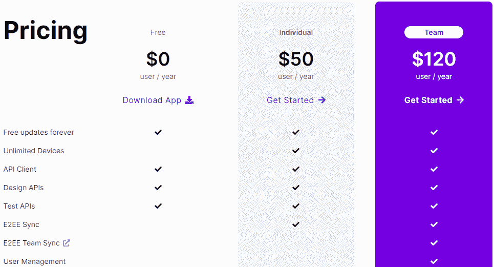

Insomnia pricing plans (Source-insomnia.rest)

与邮递员和失眠不同，Knowi 没有公开他们的定价信息。相反，他们在其网站上提供了一个表格，您可以填写该表格来获取定价信息。他们有三种定价方案，即基本版、团队版和企业版。每个计划都配有全面的入职培训和技术支持。Knowi 还为初创公司和非营利组织提供折扣。需要用户等的电子邮件报告不收费。在其他系统中。

# 邮递员 vs 失眠 vs 求知——最后的想法

从上面的讨论中，你可以看出 Postman 和失眠症都是适合技术用户(如开发人员)的 API 工具，而 Knowi 是一个成熟的分析工具，适合技术和业务用户。

如果你是一个寻找具有许多特性的 API 工具的开发者，选择 [Postman](https://www.postman.com/) 。Postman 支持与许多应用程序集成，但您可以请求他们为特定的应用程序构建集成。该工具要求您编写代码来完成大多数任务。

[失眠](https://insomnia.rest/)另一方面是一个 API 工具，功能很少。它使用插件创建集成，您可以为特定的用例创建自己的插件。它还要求您编写代码来完成一些任务。

如果您正在基于 API 的数据和其他来源之上寻找一个成熟的 BI 解决方案，请选择 [Knowi](https://www.knowi.com/) 。