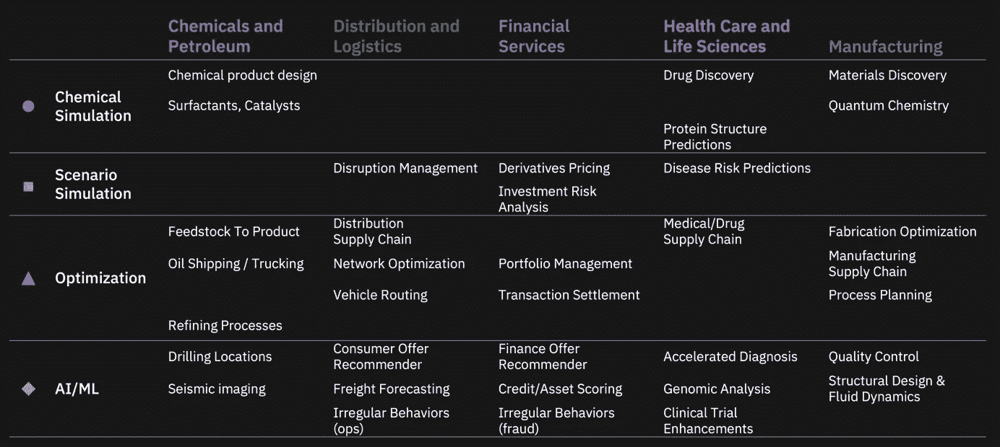

# 潜在的量子计算用例:教程和算法

> 原文：<https://medium.com/geekculture/potential-quantum-computing-use-cases-tutorials-and-algorithms-a2dc96e4d78a?source=collection_archive---------7----------------------->

目前，量子计算适用于某些算法，如优化、机器学习或模拟。使用这种类型的算法，可以在不同的领域应用多种用例:金融服务，如投资组合风险优化、欺诈检测、医疗保健(药物研究、蛋白质研究等)。)、供应链和物流、化学品和石油或新材料研究都是将受到主要影响的领域。让我们在这篇文章中探索其中的几个。

# 金融服务

金融机构有潜力在许多领域利用量子计算，如交易策略改进、改善客户投资组合管理和更好地分析金融风险。例如，正在开发的量子算法在使用衍生品定价时可能会提供二次加速——一个复杂的金融工具需要 10，000 次模拟才能在传统计算机上估值，而在量子设备上只需要 100 次量子操作。其中一个用例是交易的优化。银行也有可能加快投资组合优化，如蒙特卡洛模拟。由于量子计算，衍生品等产品的买卖(交易)模拟可以得到改善。金融市场中交易活动的复杂性正在急剧上升。投资经理很难将真正的约束(如市场波动和客户生活事件的变化)整合到投资组合优化中。目前，跟随市场运动的投资组合的再平衡受到计算限制和交易成本的强烈影响。量子技术有助于降低当今商业环境的复杂性。量子计算的组合优化功能可以使投资经理提高投资组合的多样化，重新平衡投资组合以更准确地响应市场条件和投资者目标，并简化更具成本效益的交易结算流程。机器学习也用于投资组合优化和情景模拟。银行和对冲基金等金融机构越来越感兴趣，因为他们认为这是一种通过根据新的模拟数据进行调整的动态产品来最小化风险、同时最大化收益的方法。个性化金融也是一个探索的领域。客户需要能够快速预测不断变化的需求和行为的个性化产品和服务。有些中小型金融机构可能会因为不利于客户体验的优惠而失去客户。很难使用行为数据足够快速和精确地创建分析模型，以接近实时地定位和预测一些客户需要的产品。在检测欺诈以发现异常行为模式时也存在类似的问题。据估计，由于欺诈和糟糕的数据管理实践，金融机构每年会损失 100 亿到 400 亿美元的收入。对于客户定位和预测建模，量子计算可能会改变游戏规则。由于复杂数据结构的挑战，量子计算机的数据建模能力有望在寻找模型、执行分类和做出预测方面表现优异，而这在今天用传统计算机是不可能的。金融领域的另一个用例是风险分析。风险分析计算很困难，因为很难分析许多情景。未来几年，合规成本预计将增加一倍以上。金融服务机构在平衡风险、更有效地对冲头寸以及执行更广泛的压力测试以符合监管要求方面面临越来越大的压力。如今，蒙特卡罗模拟——分析金融模型中风险和不确定性影响的首选技术——受到估计误差比例的限制。量子计算机有可能通过更准确地测试更多结果来以不同方式采样数据，为这些类型的模拟提供二次加速。

您可以在[https://qiskit.org/documentation/finance/](https://qiskit.org/documentation/finance/)中找到用例及教程，并测试量子算法:

[量子振幅估计](https://qiskit.org/documentation/finance/tutorials/00_amplitude_estimation.html)

[投资组合优化](https://qiskit.org/documentation/finance/tutorials/01_portfolio_optimization.html)

[投资组合多样化](https://qiskit.org/documentation/finance/tutorials/02_portfolio_diversification.html)

[定价欧式看涨期权](https://qiskit.org/documentation/finance/tutorials/03_european_call_option_pricing.html)

[定价欧式看跌期权](https://qiskit.org/documentation/finance/tutorials/04_european_put_option_pricing.html)

[定价牛市价差](https://qiskit.org/documentation/finance/tutorials/05_bull_spread_pricing.html)

[定价篮子期权](https://qiskit.org/documentation/finance/tutorials/06_basket_option_pricing.html)

[亚洲壁垒价差定价](https://qiskit.org/documentation/finance/tutorials/07_asian_barrier_spread_pricing.html)

[固定收益资产定价](https://qiskit.org/documentation/finance/tutorials/08_fixed_income_pricing.html)

[信用风险分析](https://qiskit.org/documentation/finance/tutorials/09_credit_risk_analysis.html)

[带 qGANs 的期权定价](https://qiskit.org/documentation/finance/tutorials/10_qgan_option_pricing.html)

[加载和处理股市时间序列数据](https://qiskit.org/documentation/finance/tutorials/11_time_series.html)

# 自然

分子建模允许诸如更高效的锂电池的发现。量子计算将使原子相互作用的模型更加精确，规模也更大。新材料将可以在任何地方使用，无论是消费品、汽车、电池等等。量子计算将允许在没有近似的情况下进行分子轨道计算。更好地理解原子和分子之间的相互作用将使发现新药成为可能。DNA 序列的详细分析将有助于通过开发确定疾病如何发展的模型来早期检测癌症。量子的优势将是在从未达到的尺度上详细分析分子的行为。化学模拟将允许发现新药或更好地预测蛋白质结构，情景模拟将更好地预测疾病或其传播的风险，优化问题的解决将优化药物的分销链，最后，人工智能的使用将加快诊断，更精确地分析遗传数据。

您可以在[https://qiskit.org/documentation/nature/](https://qiskit.org/documentation/nature/)中找到用例及教程，并测试量子算法:

[电子结构](https://qiskit.org/documentation/nature/tutorials/01_electronic_structure.html)

[振动结构](https://qiskit.org/documentation/nature/tutorials/02_vibrational_structure.html)

[基态解算器](https://qiskit.org/documentation/nature/tutorials/03_ground_state_solvers.html)

[激发态解算器](https://qiskit.org/documentation/nature/tutorials/04_excited_states_solvers.html)

[势能面采样](https://qiskit.org/documentation/nature/tutorials/05_Sampling_potential_energy_surfaces.html)

[用量子计算机计算热力学可观测量](https://qiskit.org/documentation/nature/tutorials/06_calculating_thermodynamic_observables.html)

[利用 Qiskit 运行时](https://qiskit.org/documentation/nature/tutorials/07_leveraging_qiskit_runtime.html)

[财产框架](https://qiskit.org/documentation/nature/tutorials/08_property_framework.html)

[蛋白质折叠](https://qiskit.org/documentation/nature/tutorials/09_Protein_Folding.html)

[点阵模型](https://qiskit.org/documentation/nature/tutorials/10_lattice_models.html)

# 最佳化

商务旅行者的问题可以延伸到许多领域，如能源、电信、物流、生产链或资源分配。例如，在海运中，从开始到结束的集装箱管理非常复杂:在世界上的几个港口装载、输送、交付然后卸载是一个多参数问题，可以通过量子计算来解决。另一个应用是优化一个国家的电力网络，更具预测性的环境建模，以及寻找排放更低的能源。航空学也将是用例的来源。对于飞机的每次着陆，都要进行数百项操作:更换机组人员、加油、清洁机舱、运送行李或检查。每个事务都有子操作。(加油需要一个可用的加油机，一个卡车司机和两个人来加油，事先必须确保加油机是满的)。所以，总共有数百次操作，而且只有一架飞机在有限的时间内着陆。现在，数百架飞机降落，有时航班延误，问题变得越来越复杂。然后有必要实时重新计算所有平面的一切。

你可以在 https://qiskit.org/documentation/optimization/的[找到用例及教程，并测试量子算法:](https://qiskit.org/documentation/optimization/)

[二次程序](https://qiskit.org/documentation/optimization/tutorials/01_quadratic_program.html)

[用于二次程序的转换器](https://qiskit.org/documentation/optimization/tutorials/02_converters_for_quadratic_programs.html)

[最小特征优化器](https://qiskit.org/documentation/optimization/tutorials/03_minimum_eigen_optimizer.html)

[格罗弗优化器](https://qiskit.org/documentation/optimization/tutorials/04_grover_optimizer.html)

[ADMM 优化器](https://qiskit.org/documentation/optimization/tutorials/05_admm_optimizer.html)

[最大割和旅行商问题](https://qiskit.org/documentation/optimization/tutorials/06_examples_max_cut_and_tsp.html)

[车辆路线](https://qiskit.org/documentation/optimization/tutorials/07_examples_vehicle_routing.html)

[使用 CVaR 改进变分量子优化](https://qiskit.org/documentation/optimization/tutorials/08_cvar_optimization.html)

[优化问题的应用类](https://qiskit.org/documentation/optimization/tutorials/09_application_classes.html)

[热启动量子优化](https://qiskit.org/documentation/optimization/tutorials/10_warm_start_qaoa.html)

[使用经典优化解算器和 Qiskit 优化模型](https://qiskit.org/documentation/optimization/tutorials/11_using_classical_optimization_solvers_and_models.html)

[QAOA 运行时](https://qiskit.org/documentation/optimization/tutorials/12_qaoa_runtime.html)

# 机器学习

正在从根本上改变企业运营方式的人工智能(AI)是一个既带来新的发展机遇又带来挑战的领域。人工智能的能力在解释和分析数据方面有了很大的提高。由于要处理的数据越来越多，工作流越来越复杂，人工智能对计算能力的要求也越来越高。机器学习和量子计算是两种有可能让我们解决复杂问题的技术，这些问题以前是无法解决的，并有助于加速模型训练或模式识别等领域的发展。计算的未来肯定会由经典计算、生物启发计算和量子计算组成。

近年来，量子计算和机器学习之间的交叉引起了相当大的关注，并允许量子机器学习算法的发展，如量子增强支持向量机(QSVM)、QSVM 多类分类、变分量子分类器或 qGANs。

现在很清楚，量子计算机有可能提高机器学习算法的性能，并可能有助于不同领域的突破，如药物发现或欺诈检测。数据可能表现出难以识别的结构，这会降低分类的准确性。这个想法是通过利用量子系统将数据映射到更高维度以供训练和使用，在 AI/ML 过程中找到更好的模式。

对于 AI/ML，量子计算的潜在用例如下:

*   化学品和石油:钻井位置、地震成像
*   配送与物流:消费者报价推荐，运费预测，非正常行为
*   金融服务:金融产品推荐、信用和资产评分、异常行为(欺诈)
*   医疗保健和生命科学:加速诊断、基因组分析、临床试验改进
*   制造:质量控制、结构设计和流体动力学

您可以在[https://qiskit.org/documentation/machine-learning/](https://qiskit.org/documentation/machine-learning/)中找到用例及教程，并测试量子算法:

[量子神经网络](https://qiskit.org/documentation/machine-learning/tutorials/01_neural_networks.html)

[神经网络分类器&回归器](https://qiskit.org/documentation/machine-learning/tutorials/02_neural_network_classifier_and_regressor.html)

[量子内核机器学习](https://qiskit.org/documentation/machine-learning/tutorials/03_quantum_kernel.html)

[用于加载随机分布的 qGANs】](https://qiskit.org/documentation/machine-learning/tutorials/04_qgans_for_loading_random_distributions.html)

[焊炬连接器和混合 qnn](https://qiskit.org/documentation/machine-learning/tutorials/05_torch_connector.html)

[火炬运行时](https://qiskit.org/documentation/machine-learning/tutorials/06_torch_runtime.html)

[Pegasos 量子支持向量分类器](https://qiskit.org/documentation/machine-learning/tutorials/07_pegasos_qsvc.html)

[机器学习应用的量子核训练](https://qiskit.org/documentation/machine-learning/tutorials/08_quantum_kernel_trainer.html)

# 结论

未来的系统将需要集成量子计算能力来执行特定的计算。正如我们所看到的，许多例子已经可用，我们可以直接在量子硬件上测试它们。

**来源:**

1.  [https://qiskit.org](https://qiskit.org/)
2.  [https://www.ibm.com/quantum-computing/](https://www.ibm.com/quantum-computing/)
3.  未来的数据中心由异构加速器组成，Xavier Vasques:[https://arxiv.org/abs/2003.10950](https://arxiv.org/abs/2003.10950)