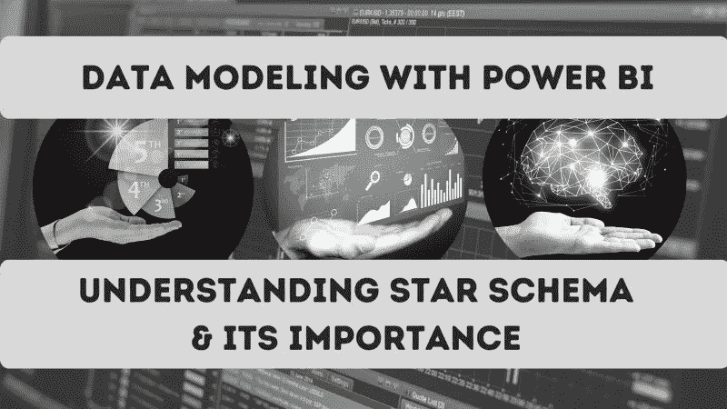
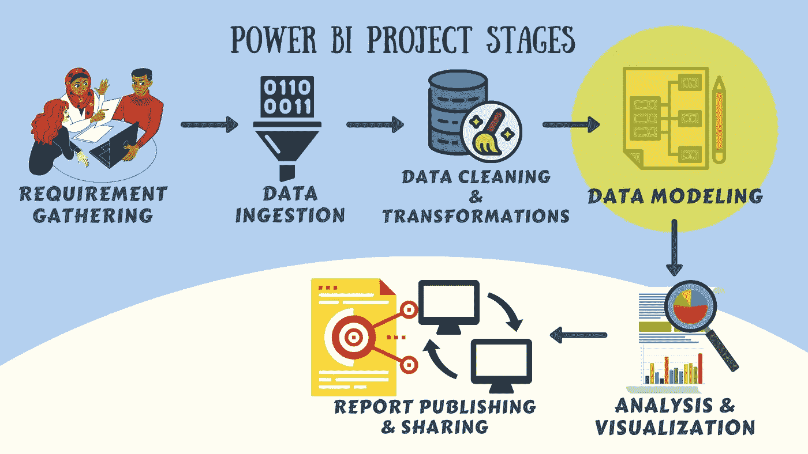
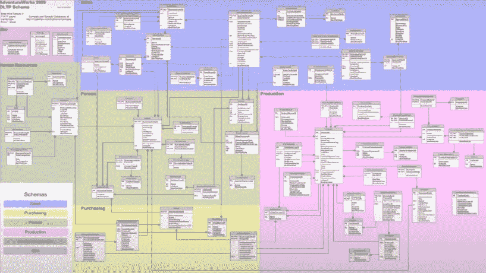
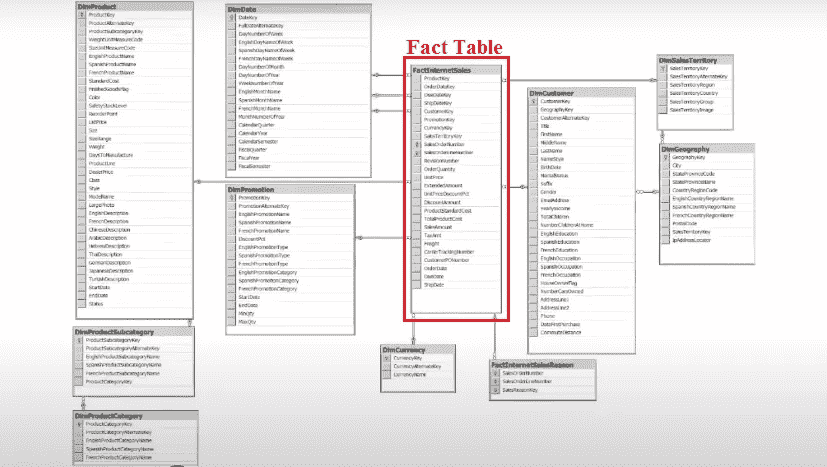
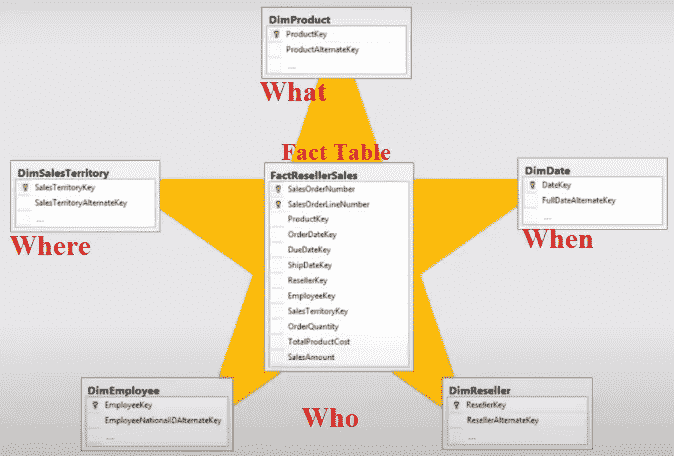
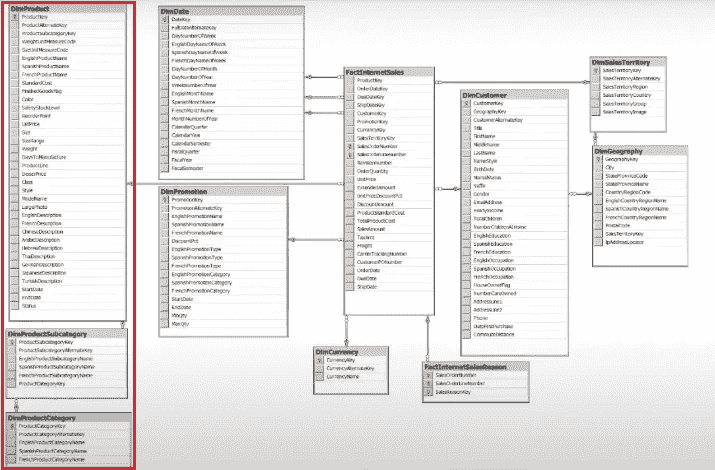
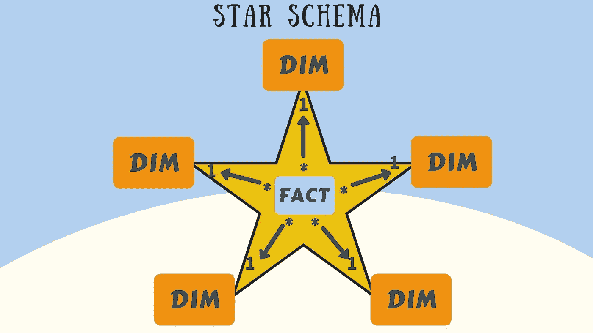
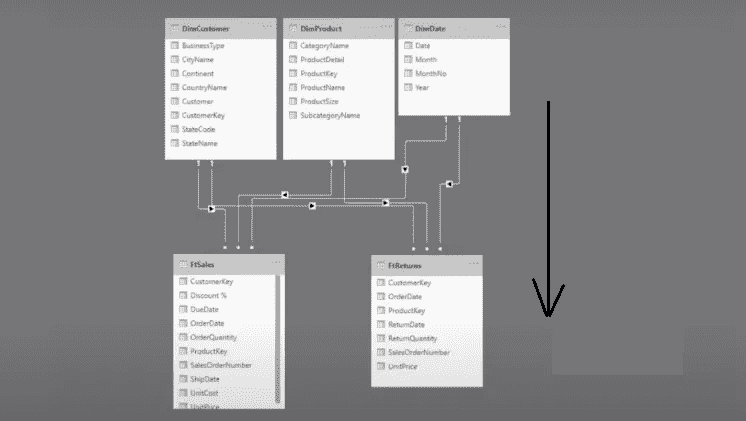

# Power BI —数据建模指南

> 原文：<https://medium.com/geekculture/power-bi-data-modeling-and-understanding-star-schema-its-importance-bf8245fdc9c5?source=collection_archive---------8----------------------->

## Power BI 数据建模指南及其在数据分析中的重要性

## *数据建模是 Power BI 的关键优势之一，用于对数据进行建模和整形*

**Power BI — Guide to Data Modeling**

W *当我们拥有来自多个来源的海量数据时，关于* ***数据建模的知识*** *在****Power BI****中对这些数据进行建模和整形变得非常重要，以使自助式 BI 更容易。当我们需要从不同的表的不同字段创建报表时，学习* ***数据建模*** *就变得很重要。我们可以说，* ***数据建模*** *是****Power BI****的关键优势之一，因为它不一定要求所有数据都在一个表中，而是我们可以将数据放在不同的表中，我们可以用一个公共列定义这些表之间的关系。再来讨论一下 Power BI 中的* ***数据建模及其重要性*** *。*

Photo by [Marvin Meyer](https://unsplash.com/@marvelous?utm_source=medium&utm_medium=referral) on [Unsplash](https://unsplash.com?utm_source=medium&utm_medium=referral)

Power BI 是一个基于数据模型的 BI 报告工具，并非所有工具都是基于数据模型的。SQL Server Reporting Service (SSRS)和传统的 excel 就是基于非数据模型的 BI 工具的一些例子。

# Power BI 中的数据建模是什么？

**数据建模**是 **Power BI** 中的一个特性，它是**使用一个关系**来连接多个数据源。关系实际上定义了数据源如何相互连接，或者定义了不同数据源之间的逻辑连接。

**The stages involded in a Power BI Project**

下面显示了一个示例，其中数据来自多个表中的多个数据源

**Example of data from different sources into multiple tables**

> **易语言中的数据建模—**
> 当我们从多个表中获取数据时，我们将这些表连接在一起，并在这些表之间创建一种关系称为数据建模。

用途—数据建模功能允许企业定义新的指标，并对这些指标执行自定义计算。

# 数据建模——掌握 Power BI**7 大支柱中的重要支柱**

**数据建模**是 Power BI 开发人员和分析师需要掌握的重要技能。

> Power BI 数据建模技巧经常被忽视。

在我的另一篇文章(下面提供了链接)中，我们讨论了掌握 Power BI 的 7 个支柱，我们将数据建模定义为掌握 Power BI 的一个要点。同样，如果我们不知道**数据建模**，我们就不能进入**计算**阶段。下面提供了文章链接—

 [## Power BI —掌握 Power BI 的 7 大支柱

### 什么是 Power BI，Power BI 为什么重要，是否应该学习 Power BI？电源 BI 是一个受欢迎的…

medium.com](/swlh/power-bi-7-pillars-for-mastering-power-bi-23671d86040d) 

# 电力商业智能数据建模—

那么数据从哪里来呢？
通常来自数据库，在那里我们有很多表，我们不应该直接导入所有的表，而是应该通过使用公共列连接它们来减少表，其中表的集合被减少到更少的表，如下所示

**Example where tables are reduced by joining them**

对于连接表，我们有一些应该遵守的规则—
永远不要将所有的表连接成一个大表。在连接表格时，我们应该始终考虑**维度模型**。

## **维度表—**

维度是一个描述商业实体、我们模型中的事物或我们公司中的事物的表格。它们是查找表。

实体可以包括产品、人、地点和包括时间本身在内的概念。

例如，谁，何时，何地，什么。

**Example of Dimension and Fact tables in Data Modeling**

通常我们在切片器和视轴上使用它们。这些表的主要目的是对事实表中存储的值进行分组和筛选。

## **事实数据表—**

事实表就是事件，每当我们有事情发生的时候。事实表存储观察或事件，可以是销售订单、库存余额、汇率、温度等。

例如，销售、购买或交易，任何类型的历史交易都存储在事实上。

它包含维度的关键字、日期和一些数字。

> 事实表通常很大，有很多行，而维度则有更多的列，更少的行。例如，通常我们没有数百万的产品或数百万的客户，但我们有数百万的销售额。

这就是主要的区别，**查找表是维度**而**数据表是事实**。

## **雪花模式—**

每当我们有维度相互连接时，它就是一个雪花模式。这不是最优的形式，最优的结构是当我们谈论次元模型时用的幂 BI。

所以我们应该做的是，我们应该将这三个表连接在一起，只构建一个表，这个表是维度产品，在同一个表中包含类别和子类别，如下所示

**Example where Dimensions are connected with each other — Dimension Product**

所以当我们有相互关联的维度时，我们应该把它们连接在一起，但这是有限度的。

> 我们不应该做什么？
> 我们不应该把这三个表都放在事实表中。
> **别这样**。我们应该将维度合并到一个表中，但是不应该将维度中的列放在事实表中。

所以有一个更好的方法来解决这个问题——将这些表连接在一起，构建我们称之为**星型模式**。

# **星型模式—**

星型模式要求建模者将他们的模型表分类为维度或事实。星型模式具有连接到事实表的维度。注意-没有维度连接到另一个维度。

> **星型模式**是简化数据模型的方法之一

**Star Schema**

这些维度包含了所有的东西，比如谁，什么时候，什么，在哪里。所以维度表有销售的描述。

**Star Schema — Dimentions connected to the Fact Tables**

这里是 Power BI 中的另一个例子**和两个事实表。事实表也可以放在维度表的下面，这样我们就知道关系是从顶部**到底部**，**从维度到事实**。所以我们总是试图在这样的星形模式中建立一个维度模型。永远永远。没有例外。**

**Relationship from Top to Botton**

> **提示**——如果你陷入了一个小节，如果你不能正确地写它。别忘了先检查你的模型。
> 问题可能出在你的模型上，而不是 DAX 指数上。你必须总是**维度**和**事实**。
> **以及通过关系与事实相连的维度**。
> 这里有一个重要的要求，即**所有维度必须有一个唯一的列，该列是表**的主键。

# 需要记住的事情—

1.  Power BI 数据建模是在多个表的公共列之间创建关系的过程。
2.  我们应该将维度连接到一个表中，但是不应该将维度中的列放在事实表中。
3.  尽可能避免多对多的关系。
4.  在您的数据模型中始终有一个日期表。
5.  始终以每个维度表与事实表的 1:多关系为目标。