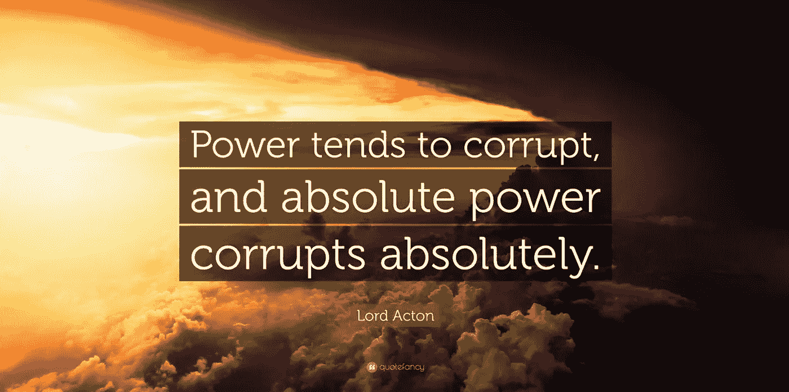

# 权力有一种理性，而理性并不知道

> 原文：<https://medium.com/geekculture/power-has-a-rationality-that-rationality-does-not-know-88758cdf50ed?source=collection_archive---------3----------------------->

## 面对威权主义，权力和理性之间的关系需要重新思考，否则现代性和民主将受到比现在更大的威胁。这篇文章是这种重新思考的一次尝试。

Source: Quotefancy