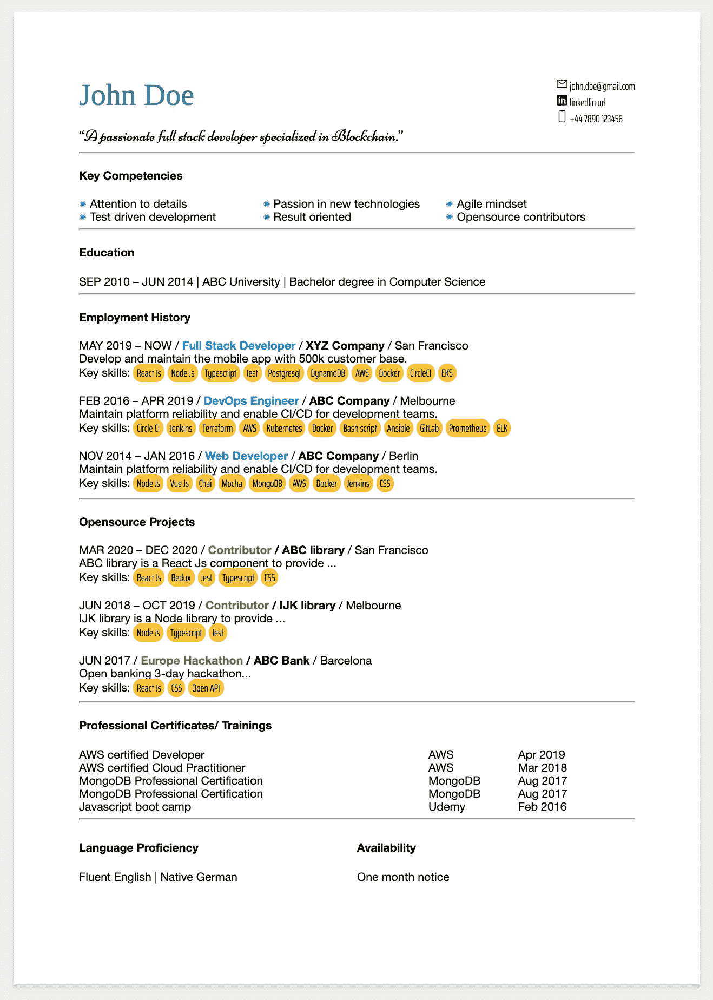
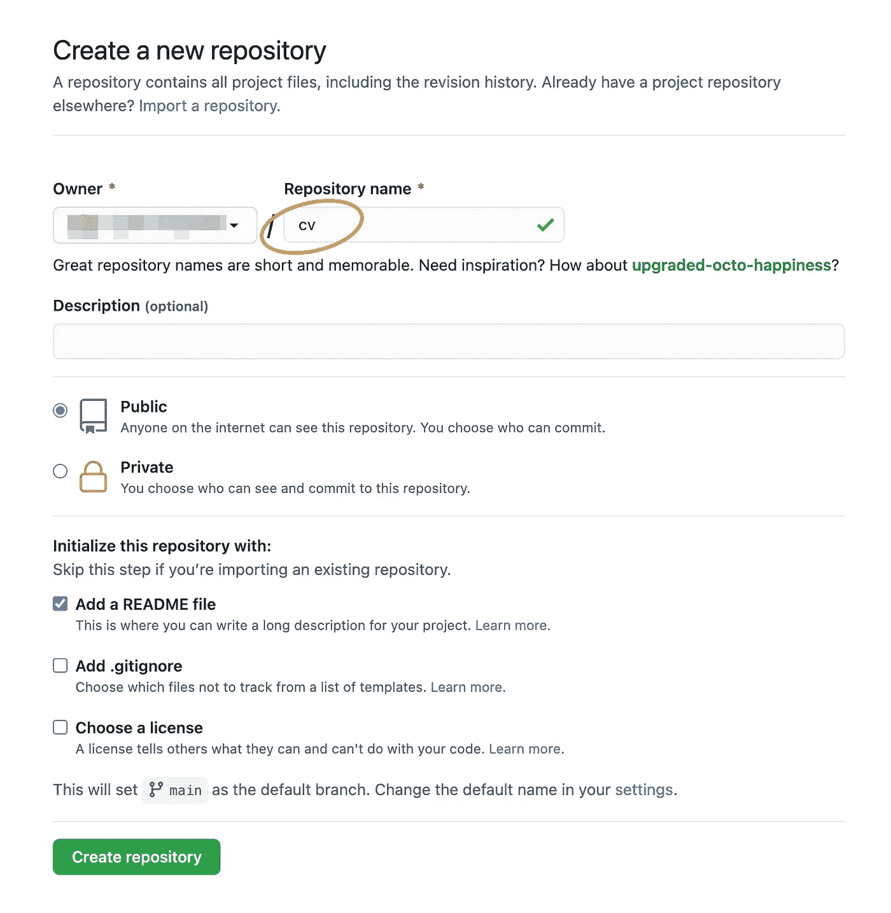
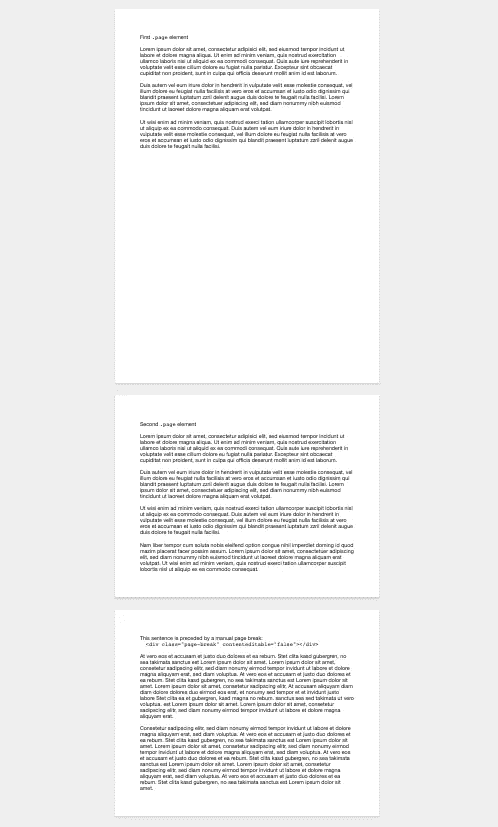
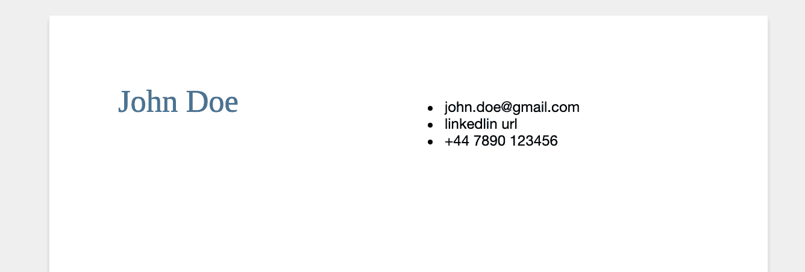
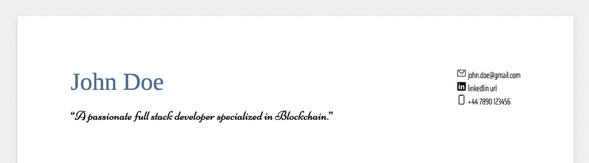
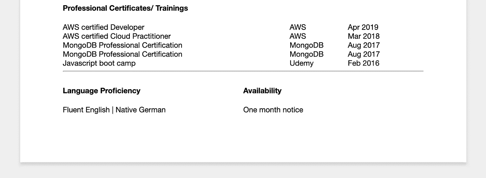
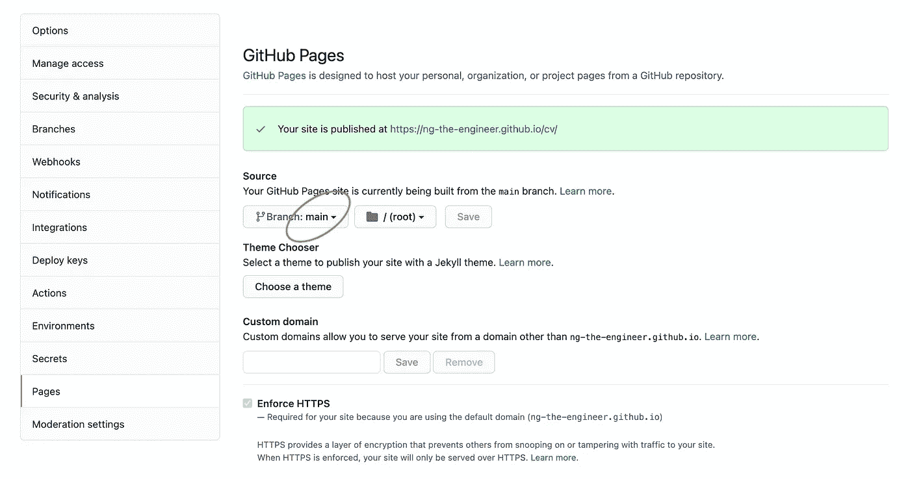

# 用 CSS 增强你的简历(第 1 部分)

> 原文：<https://medium.com/geekculture/power-up-your-cv-with-css-part-1-7fa0510130de?source=collection_archive---------30----------------------->

## 用习惯的互动体验给雇主留下深刻印象


Photo by [Clem Onojeghuo](https://unsplash.com/@clemono?utm_source=unsplash&utm_medium=referral&utm_content=creditCopyText) on [Unsplash](https://unsplash.com/s/photos/recruitment?utm_source=unsplash&utm_medium=referral&utm_content=creditCopyText)

近年来，通过使用机器学习算法进行更准确的雇主和雇员匹配，招聘领域一直在进步。可笑的是，当我们进入候选人的细节时，以旧的 A4 MS Word 格式呈现的信息仍然非常受欢迎。

Google Doc 是创建空白新简历的一个可行选项。不幸的是，如果你已经工作了一段时间，更新目前用 MS Word 写的简历是更直接的方法。然而，当您管理复杂的分页符、分节符、页眉和页脚、文本和图像对齐、多栏布局、字体兼容性等时，将格式从一种工具转换到另一种工具可能会让您陷入困境。如果你已经换了一台没有 Office 或者运行 Mac 和 Linux 的新笔记本电脑，就不要再提购买 Office 许可的费用了。

许多软件开发人员运行个人网站，展示他们卓越的项目和经验，这些项目和经验从竞争对手中脱颖而出。但是当一个人和招聘人员谈话时，一份标准格式的简历是被期待的。很棒的网站成为一种补充信息。太可惜了！

对于应聘者、招聘人员和雇主来说，时间是宝贵的。各方在一个地方以一种现代的、像样的、方便的和一致的方式分享更多的信息会更有成效吗？

今天，我想向你展示一个给你的观众留下深刻印象的绝妙方法，用普通的 HTML 和 CSS，以及少量的 Javascript，以一种习惯但更具知识性的方式。这涉及到一些编程练习。不要惊慌。如果你对编程有基本的了解，按照步骤去做，分分钟肯定能打败它。

让我们看一下[的最终产品](https://ng-the-engineer.github.io/cv/)👈在第 1 部分中。



我希望你喜欢它。该示例以开发人员为中心。但是，没有任何领域和职位的限制。整个想法是在特别沉闷和无聊的标准 A4 格式上呈现更多信息！现在是 2021 年，不是吗？现在我们来回顾一下我们发现了哪些特性。

A4 大小的简历以网页的形式呈现。它可以通过链接共享，而不是来回发送 Word/ PDF 文档。如果你想以 A4 格式打印，只需点击侧边栏上的打印按钮。内容将打印所见即所得，并关闭所有花哨的效果。

为了消除老式简历的障碍，让我们现在卷起袖子。

在第 1 部分中，我们的目标是构建一个 A4 格式的 web 页面，发布到 Github 页面，并生成普通的 A4 打印输出。

在第 2 部分中，我们将在 web CV 中添加交互元素，并将其放在个性化的域中。

# 第一部分

虽然这不是一个复杂的技术项目，但让我们花几秒钟来看看我们将要使用的东西。

1.  开源代码库
2.  Github 页面
3.  超文本标记语言
4.  半铸钢ˌ钢性铸铁(Cast Semi-Steel)
5.  java 描述语言

当然，您可以用其他复杂的 web 框架来实现这个想法。但是为了演示特性，CSS 将是我们在教程中的主要内容。

其次，我们需要清楚的是，CV 布局在不同的屏幕尺寸上是一致的。因为我们希望保留习惯的 A4 格式的简历，不管你是在笔记本电脑上还是手机上。

我假设你已经安装了一个 [Github 账户](https://github.com/join?source=login)和 Git。没有也不要慌。查看教程获取[开始](https://www.atlassian.com/git/tutorials)。

Github Page 允许我们免费托管来自 Github 库的网站。它最适合没有敏感信息的静态网站，如我们将要创建的 CV 网页。

# 目录

第 1 部分:在 Github 中创建新项目

第 2 部分:标题

第 3 部分:抛光割台

第 4 部分:职业简介

第 5 节:认证和状态

第 6 部分:发布到 Github 页面

## 第 1 部分:在 Github 中创建新项目

登录您的 Github 帐户，导航到`Repositories`并按下`New`按钮。选择一个独特的，简短的和明智的项目名称。它将成为 Github 页面上您的简历网站 URL 的一部分。选择`Add a README file`。其余部分使用默认设置。



Create new project

Git 将项目克隆到您的本地机器上。

```
git clone [git@github.com](mailto:git@github.com):YOUR_GITHUB_ACCOUNT_NAME/cv.git
```

用您最喜欢的 IDE 打开项目。如果你没有，我强烈推荐使用 VS 代码。

由于开源项目 [HTML-Sheets-of-Paper](https://github.com/delight-im/HTML-Sheets-of-Paper) ，我们将在第一步基于[index.html](https://github.com/delight-im/HTML-Sheets-of-Paper/blob/gh-pages/index.html)、[CSS/sheets-of-paper . CSS](https://github.com/delight-im/HTML-Sheets-of-Paper/blob/gh-pages/css/sheets-of-paper.css)和[CSS/sheets-of-paper-a4 . CSS](https://github.com/delight-im/HTML-Sheets-of-Paper/blob/gh-pages/css/sheets-of-paper-a4.css)。在您的项目中创建这三个文件。现在您用浏览器打开 index.html，一个可编辑的 A4 格式的网页就呈现出来了。在[步骤 1](https://github.com/ng-the-engineer/cv/tree/step_01) 中检查源代码👈。



凉爽，一个很好的热身与基本布局。我们将深入内容。系好你的安全带。

## 第 2 部分:标题

本节将创建一个简单的标题。



首先，关闭`index.html`中`false`的可编辑标志，让`contenteditable="false"`将它设为只读。

为了水平放置姓名和联系信息，我们将使用 CSS 属性`display: grid`和`grid-template-columns: 50% 50%`。50–50 百分比的值指定了两个等宽的列。要实现多列布局，我们必须制作我们的第一个 CSS 样式。用下面的 css 代码在 CSS 文件夹下创建一个`grid.css`。

为了有一个清晰而吸引人的名字，我们将用一个新的 CSS 类`cv-name`来装饰它。用下面的样式在 CSS 文件夹下创建`header.css`，在这里我们创建一个专业的色调。

告诉 index.html 使用新的 CSS 类，把它添加到`<head>`部分。

正如你可能注意到的，这里指定了字体系列`Tinos`。这是一个浏览器本身不支持的谷歌字体。所以我们需要告诉`index.html`在运行时加载这个字体文件。

是时候将候选人姓名`John Doe`放在左栏了。在右栏中，列出了三种不同的联系方式。

报头的框架(👉[步骤 2](https://github.com/ng-the-engineer/cv/tree/step_02) 源代码)完成。接下来我们会打磨它。

## 第 3 部分:抛光割台

让我们通过`list-style: none;`移除难看的项目符号，并通过`float: right;`将其向右对齐。样式`contact-item`应用于三个项目。

header.css

将上述样式添加到`header.css`中，并用`<span>`和样式`contact-item`将三个项目包裹起来。

我们将使用开源图标库 [Ion Icons](https://ionicons.com/) ，帮助读者快速定位关键信息。在这三个项目的前面，放置了相应的图标。这里有一个电子邮件的例子。

记得在`index.html`中导入参考。

一句话的总结可以有力地向观众描述你自己。将摘要包装在一个`<p>`标签中，并用一个显著的`font-family`进行修饰。在这种情况下，谷歌字体`Niconne`被使用。我们导入 Google 字体，并按照我们刚刚学习的候选人姓名的方式对摘要进行样式化。很简单，对吧？

查看第 3 部分的[源代码](https://github.com/ng-the-engineer/cv/tree/step_03)。👈



我们刚刚体验了 CSS 提供的粒度和精确定位，而文字处理程序从来没有提供相同级别的控制。在下一部分，我们将添加能力、教育和工作经历。

## 第 4 部分:职业简介

接下来是本节的主课，我们将介绍能力、教育、工作经历和副业。你兴奋吗？跟我来，我们会在几分钟内完成。


Competencies, education, employment history and open source Projects

能力部分在三列两行中列出了优势。我们将再次使用`grid-container`样式，并且为三个等宽的列引入了一个新的类`container-column-3`。

```
grid-template-columns: 33% 33% 33%;
```

接下来，默认字体大小被减小到 10pt，这是可见性和信息量之间的一个舒适的平衡。

同样，我们将使用图标来定制要点。添加了一个`strength-icon`类来调整图标的大小和颜色。在文件夹`CSS`下创建`competencies.css`，并在下面创建新样式。

不要忘记导入新的 css。

在教育部分，学校和主题没有额外的 CSS。我们直接去职业区。为了提高可读性，我们将使用合适的字体颜色对职位名称进行分类`color: #0097e6`，使用`font-weight: bold;`对公司名称进行分类。我们的观众对技巧最感兴趣。我们将用一个吸引人的标签式风格来突出每个技能，如下所示。

career.css

兼职项目部分与职业历史相同，除了项目名称为浅绿色`color: #44bd32`。

检查第 4 节的[源代码](https://github.com/ng-the-engineer/cv/tree/step_04)。👈

## 第 5 节:认证和状态

我们将完成我们的认证，语言能力和可用性单页简历在任何时候！



证书将排列在三个不同宽度的栏中。

cert.css

我们将在语言和可用性方面重用类`container-column-2`。超级简单，不是吗？

此时，我们已经将主要的、简洁的简历中的所有内容组织成了一个网页。在浏览器菜单中导航至`File > Print`。我们会马上把简历打印出来或者保存在 PDF 文件中，最重要的是，按照我的承诺，用 A4 纸格式。

## 第 6 部分:发布到 Github 页面

登录你的 Github 账户，进入`Settings`，点击`Pages`。在`Source`部分下，选择要发布的分支。几分钟后它将在`[https://YOUR_ACCOUNT_NAME.github.io/YOUR_PROJECT](https://YOUR_ACCOUNT_NAME.github.io/YOUR_PROJECT)_NAME`出版。删除你的浏览器缓存，如果它不适合你刷新。



现在没有什么能阻止你了！

在我们进入[第二部分](/geekculture/power-up-your-cv-with-css-part-2-ba27bae7c90b)的精彩部分之前，让我们回顾一下在过去的几分钟里我们取得了什么成果。

1.  用纸张奠定了 A4 格式的基础。
2.  使用可重复使用的多栏 CSS 样式优化空间。
3.  使用更易访问和兼容的谷歌字体。
4.  使用矢量图标的离子图标。
5.  使用字体属性对标题、公司名称进行分类。
6.  用得体的圆角标签标记和突出显示技能。

恭喜你！🙌你已经将你的简历移植到了一个更易于管理的版本，并开启了一个激动人心、信息丰富、互动的旅程。

[第 1 部分完整源代码](https://github.com/ng-the-engineer/cv/tree/step_05)👈

❤️ **感谢您的阅读！如果你喜欢这个想法，但太忙而无法创作，我们非常乐意在 hi@valubees.co.uk 提供帮助。**

声明:本文不隶属于 VS 代码、Github 或 Github 页面。