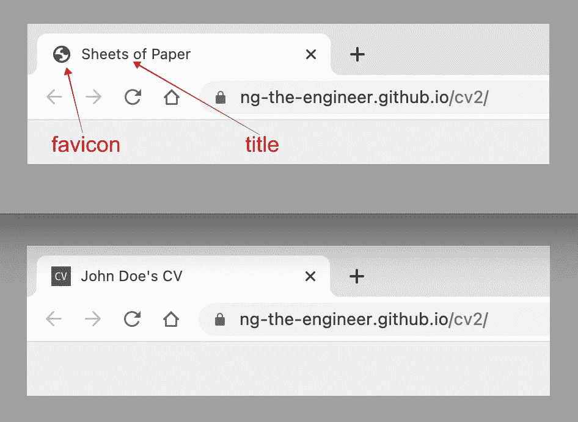
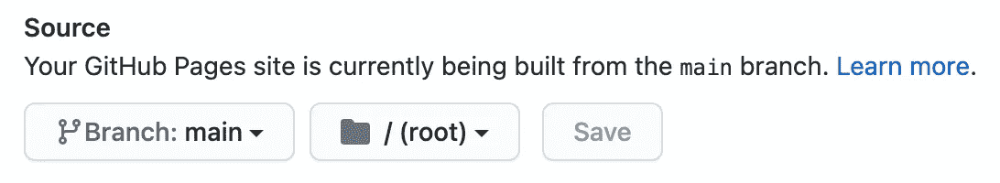
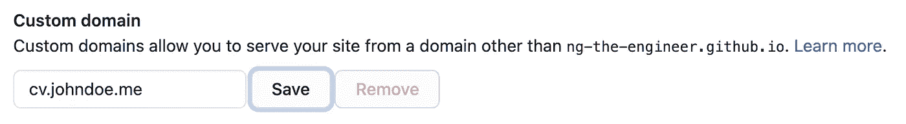
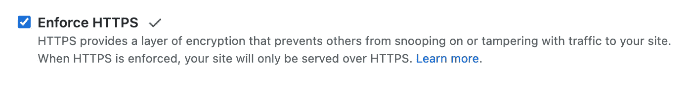

# 用 CSS 增强你的简历(第二部分)

> 原文：<https://medium.com/geekculture/power-up-your-cv-with-css-part-2-ba27bae7c90b?source=collection_archive---------30----------------------->

## 用习惯的互动体验给雇主留下深刻印象


Photo by [Dawid Zawiła](https://unsplash.com/@davealmine?utm_source=unsplash&utm_medium=referral&utm_content=creditCopyText) on [Unsplash](https://unsplash.com/s/photos/window-frame?utm_source=unsplash&utm_medium=referral&utm_content=creditCopyText)

***如果你还没有读过*** [***第一部分***](/geekculture/power-up-your-cv-with-css-part-1-7fa0510130de) ***，我强烈建议你用它来做铺垫。***

在[第一部分](/geekculture/power-up-your-cv-with-css-part-1-7fa0510130de)中，我们使用 HTML 和 CSS 创建了一份 A4 格式的简历，并将其发布为[网站](https://ng-the-engineer.github.io/cv/)👈。它将我们从文字处理器中解放出来，并为十年来的旧简历体验打开了创造力之门。

在第二部分中，我们将用一个实用而迷人的功能来增强它，通过可视化地展示你的非凡成就来打动你的观众。

# 目录

第 1 部分:菜单栏

第 2 部分:弹出窗口

第三部分:一个小的整理

第 4 部分:自定义域

第 5 部分:保护域

## 第 1 部分:菜单栏

让我们继续第 2 部分存储库的`git clone`分支 [step_0](https://github.com/ng-the-engineer/cv2/tree/step_0) 在第 1 部分中创建的 web CV。要查看完整菜单栏的源代码，请点击。👈

文件结构概述。

```
.
├── css
│   ├── copy.css
│   ├── sidebar.css
│   └── snackbar.css
├── js
│   ├── copy.js
│   ├── print.js
│   └── snackbar.js
└── index.html
```

**第一步:粘性菜单**

*   sidebar.css
*   纸张. css

粘性菜单的键是类`icon-bar`中的属性`position: fixed`。因为我们不期望菜单包含在打印输出中， ***我们不得不用`sheets-of-paper.css`的`@media print`块中`no-print`类中定义的***`***display: none;***`*来隐藏。其余样式都是定位和外观控制。记得为菜单图标`<i class="fa fa-linkedin">`、`<i class="fa fa-print">`和`<i class="fa fa-clone">`导入[字体牛逼](https://fontawesome.com/) CSS 库。*

***第二步:访问我的 Linkedin***

*   *仅仅是 index.html 的一个`<a>`环节*

***第三步:一键打印***

*   *打印. js*

*为了连接打印机，我们将编写第一个 Javascript 函数。不要惊慌。您需要将一个`onclick`事件绑定到我们的自定义函数`print()`。*

*在`print`功能中，`window`对象会触发内置打印机功能。*

*万岁！我们已经创建了第一个 Javascript 函数。*

**

***步骤 4:将 url 复制到剪贴板***

*   *copy.js*
*   *copy.css*
*   *snackbar.js*
*   *snackbar.css*

*这是一个方便读者分享网络简历超链接的功能。首先，我们模拟一个`copy-text`命令。然后，我们将复制的值发送到眨眼之间就会弹出的小吃店。*

*我们添加了一个`<input>`来携带`copy-text`命令的源文本。为了隐藏辅助字段而不影响`copy-text`命令， ***我们将其样式为*** `***opacity: 0;***` ***而不是`hidden-cv-url`类中的****。**

**通知消息有两个组成部分。CSS 类控制淡入和淡出效果，以及定位。同时，Javascript 函数`showSnackbar`管理三秒的时间控制。**

****第五步:连接钻头****

**在看到结果之前，我们连接了`index.html`中的所有位。**

1.  **导入`<head>`部分的`sidebar.css`、`copy.css`和`snackbar.css`。**
2.  **将`Font Awesome`作为外部链接导入`<head>`部分。**
3.  **将菜单图标包裹在标有`no-print`样式的`<div>`中。**
4.  **为网络简历超链接添加一个 id 为`cvUrl`的隐藏`<input>`。**
5.  **在 id 为`snackbar`的`<div>`中定义通知消息。**
6.  **最后导入 JS 文件`print.js`、`copy.js`、`snackbar.js`。**

**恭喜你！🙌你已经完成了交互式网络简历的第一个也是最重要的里程碑。在练习中，我们不仅使用优雅而实用的 CSS 效果来创建 sticky 元素、淡入淡出控件和通知栏，还编写了第一个 Javascript 函数来实现更具体的任务。**

## **第 2 部分:弹出窗口**

**本教程的整体思路是突破传统的简历格式，将最好的你轻松呈现在观众面前。主菜终于来了。本节将通过四种方式来展示当我们点击预定义的公司名称时，在弹出窗口中的成就。**

**弹出窗口只不过是在父窗口之上打开的子窗口。我们利用这个特性作为一个容器来展示除超链接之外的附加信息。在我们的例子中，它可能是一个网站的预览图像，Android 和 iOS 的下载预览和链接，PDF 格式的推介材料，产品视频，或者您的热门 Youtube 视频。同样，我们将从根本上实施。使用什么技术框架完全取决于你。而语境只受你想象力的限制。**

**[第二节的源代码](https://github.com/ng-the-engineer/cv2/tree/step_02)👈**

****第一步:网站预览****

**让我们在第一次使用时实现弹出窗口——显示您贡献的网站/产品网页。**

**我们会通过预览一个网站的登陆页面来增强枯燥的超链接。在面试中，面试官可能无法自由浏览你写的所有超链接。面试官越容易发现你的工作，你吸引他们目光的机会就越大。**

```
**.
├── css
│   ├── popup.css
├── js
│   ├── popup.js
└── index.html**
```

**首先，在`index.html`中，我们用一个给定唯一 id `jobABC`的`<button>`包装`ABC Company`(下面代码片段中的第 39 行)。**

**然后，我们创建一个具有唯一 id `popupABC`的`div`块。是的，弹出窗口只是一个样式奇特的`div`模块。**

**在网站预览中，弹出窗口最初显示一幅图像。当用户鼠标悬停在弹出窗口上时，我们使预览图像变暗，并在中间显示一个`Go to website`按钮。**

**现在我们制作三个组件来构建这个特性。请参考下面的代码片段。**

*   **在第 19 行添加一个``来携带预览图像。**
*   **在第 25 行添加`Go to website` `<a>`标签。**
*   **在第 18 行添加一个关闭按钮。**

**接下来，不要忘记在`index.html`中导入第 2 行的`popup.css`和第 45 行的`popup.js`。**

**我们用一个通过`opacity: 0.7;`使整个弹出窗口变暗的`container` CSS 类来修饰这三种成分。**

**为了将酷酷的效果绑定到内容上，我们需要一小段 Javascript 代码。在`popup.js`中，我们通过设置`popupABC.style.display = "block"`来指示`ABC Company`按钮响应点击，字面意思是在父窗口的顶部显示弹出窗口(第 3 行)。右上角的小关闭按钮被`popupABC.style.display = "none"`告知消失(第 4 行)。**

**我们始终保持舒适的用户体验。特别是，受众可以通过单击父窗口中的任何位置来关闭弹出窗口(第 6 行到第 10 行)。**

****第二步:手机应用预览****

**下面的例子与移动行业特别相关。我们将在一个选项卡式弹出窗口中显示 Android 和 iOS 应用程序下载预览。**

**类似地，在`index.html`中，我们用一个给定唯一 id `jobXYZ`的`<button>`包装`XYZ Company`(第 32 行)。**

**然后，我们创建一个具有唯一 id `popupXYZ`的`div`块。(第二行)**

**接下来，一个 Android 映像被放入一个具有唯一 id `xyzAndroid`的`<div>`中(第 7 行)，一个 iOS 映像被放入一个具有唯一 id `xyzIos`的`<div>`中(第 11 行)。**

**用两个按钮模拟制表符效果(第 16 & 20 行)。**

**`tabs.js`控制标签页的切换效果。当一个标签被点击时，该功能隐藏所有的标签(第 4 行)并将所有的标签颜色变成灰色(第 13 行)。然后显示选定的选项卡内容(第 12 行)，按钮颜色变为绿色(第 13 行)。**

****步骤 3:球场面板查看器****

**对副业的贡献是候选人的荣誉。让我们看看在弹出窗口中嵌入 PDF 格式的演示文稿有多简单。**

**在`index.html`中找到名为`Europe Hackathon`的项目，将公司名称用`<button id="prjDEF" class="btn">DEF Bank</button>`包裹。**

**在弹出窗口中添加了一个`<embed>`元素，我们在其中指定 pdf 文件，旁边有一个关闭按钮。PDF 查看器的行为由参数`toolbar=0`、`navpanes=0`和`scrollbar=0`控制。也就是说我们把它关掉了。**

****第四步:Youtube 浏览器****

**如果我们能通过产品演示或视频中的教程来吸引观众的眼球，那该有多好。基于我们之前的工作，我们将从视频提供商处获得的`iframe`块放在一个新的弹出`div`块中的关闭按钮旁边，该块被赋予了一个唯一的 id `popupDEF`。然后我们用`video.css`中定义的`youtube-video-container`来设计`iframe`容器的样式。**

**接下来，我们分别为公司名称按钮，即`<button id="prjIJK" class="btn">IJK library</button>`和关闭按钮附加处理程序。以及当用户点击除弹出窗口之外的地方时弹出窗口关闭处理程序。**

```
**.
├── css
│   ├── video.css   (youtube-video-container CSS)
├── js
│   ├── popup.js    (name button, close & cancel popup handlers)
└── index.html      (popup block, name button, and imports)**
```

**太棒了。我希望这四种展示方式能有效地吸引眼球。**

****

## **第三部分:一个小的整理**

**从第 1 部分了解到，我们可以直接在 Github 页面上发布 web CV。从这个意义上来说，我们的简历对任何人都是免费的。唯一的缺陷是超链接，例如`https://john-dow.github.io/cv`，比你喜欢的名字下的域名可读性差。在这一部分，我们将把我们的网络简历转移到个性化的❤️网络域名`https://cv.johndoe.me`。**

**在我们继续之前，我们将更新浏览器选项卡中出现的 favicon 和 title。**

****

**要制作您的收藏夹图标，请搜索`favicon generator`。**

**将 glorious `favicon.ico`放在项目根目录下，并告诉`index.html`它的文件位置。`.ico`后面的**问号**是 Github 页面正确显示图标的小技巧。上次更新`<title>`到你最喜欢的选择。**

**这时，我们已经完成了所有的编码工作。**

**[步骤 3 源代码](https://github.com/ng-the-engineer/cv2/tree/step_03)👈**

## **第 4 部分:自定义域**

****域名注册****

**你可能知道互联网域名从来都不是免费的。如果你在本教程中为你的网络简历准备了一个容易记忆的网址，这是你唯一需要的成本。一个不受欢迎的域名每年只需几美元，而一个热门的域名每年可能要花 30 美元甚至更多。这要看名字的受欢迎程度和顶级域名的喜欢程度。com，。网，。我，。io 等。注册与否完全由你决定。**

****自定义域****

**让我们假设一个域`johndoe.me`已经成功注册。接下来我们将把`cv.johndoe.me`链接到`<user-name>.github.io/cv2`。在这种情况下，我们将创建一个子域`cv`。你可以选择任何子域名，比如最受欢迎的`www`。**

****第一步:**在`Settings > Pages`中，选择主枝和根。**

****

**填写我们想要的子域，例如`cv`。**

****

**单击 Save 后，Github 项目的根文件夹中会创建一个文件`CNAME`。这个文件是用于 Github 页面路由的，所以我们保持不变。**

****步骤 2:** 登录您的域名提供商，前往`DNS Management`(位置可能因提供商而异，请咨询支持团队)。创建一个`CNAME`类型的记录，指定子域名`cv`，并将其指向您的 Github URL，例如`<user-name>.github.io`。⚡ **注意了！你不能在 URL** 中包含项目名称。**

****步骤 3:** 要验证设置，请在您的终端中键入以下命令来检索 DNS 记录。**

```
**dig cv*.johndoe.me* +nostats +nocomments +nocmd**
```

**成功回复如下。**

```
**; <<>> DiG 9.10.6 <<>> cv.johndoe.me +nostats +nocomments +nocmd
;; global options: +cmd
;cv.johndoe.me.   IN A
cv.johndoe.me.  60 IN CNAME <YOUR_USER_NAME>.github.io.**
```

****请注意，DNS 记录更新可能需要几分钟到 24 小时。****

## ****第 5 部分:保护域名****

**我们的网络简历在`https://cv.johndoe.me`可用，但浏览器抱怨这不是一个安全的连接。现代浏览器要求安全连接。当它与网站对话时，它会发出警告`Not safe`，提示所有者无法通过第三方认证机构(CA)的认证。**

**有几个付费的 CA 服务以及一个免费的[让我们加密](https://letsencrypt.org/)解决方案。我想向您展示一种完全免费的方法来解决这个安全问题。Cloudflare 为个人使用提供了一个完全符合我们目标的免费计划。**

****第一步:**如果您还没有帐户，请在 [Cloudflare](https://dash.cloudflare.com/sign-up) 上创建一个帐户。登录并导航至`Add site`。填写域，在我们的例子中是`johndoe.me`。它将在几分钟的扫描后检索 DNS 记录。**

****步骤 2:** 它将指示我们将域名服务器从我们的域提供商更改为 Cloudflare。为了实现这一点，我们将登录域名提供商并导航到`DNS management`页面(同样，位置因提供商而异，请咨询您的提供商)。删除`NS`类型的记录。**

****步骤 3:** 根据 Cloudflare 的指示创建新的`NS`记录。保存您的更改。请注意，可能需要 24 小时才能生效。**

****第四步:**前往 Github 页面，`Settings > Pages`，勾选`Enforce HTTPS`选项。**

****

**清理浏览器缓存，重新访问网络简历。**

**哒哒，👉`[https://cv.johndoe.me](https://cv.johndoe.me.)`👈受 SSL 保护。**

**万岁！最后一件事是将`Copy-URL-to-clipboard` source 字段更新为新的 URL。**

****

**为自己鼓掌！👏我们在一个理想的、容易记住的网址上创建了一份专业的、卓越的网络简历。这是不可思议的，不仅仅是因为你摆脱了老式的简历，而是打开了大门，为你的个人资料带来了创造力。**

**让我们回顾一下我们在本教程中所做的内容。**

1.  **粘性菜单栏(访问 Linkedin，一键打印，复制 url 到剪贴板)。**
2.  **弹出窗口(网站预览、应用预览、PDF 和 YouTube 查看器)。**
3.  **位于`cv.johndoe.me`的自定义域。**
4.  **用 SSL 保护网站。**

**[第二部分的完整源代码](https://github.com/ng-the-engineer/cv2)👈**

**感谢你阅读❤️，我希望你享受这个旅程！**

**如果你喜欢这个想法，但太忙而无法创作，我们非常乐意在 hi@valubees.co.uk 提供帮助。**

**声明:本文不隶属于 Github、Github 页面或 Cloudflare。**