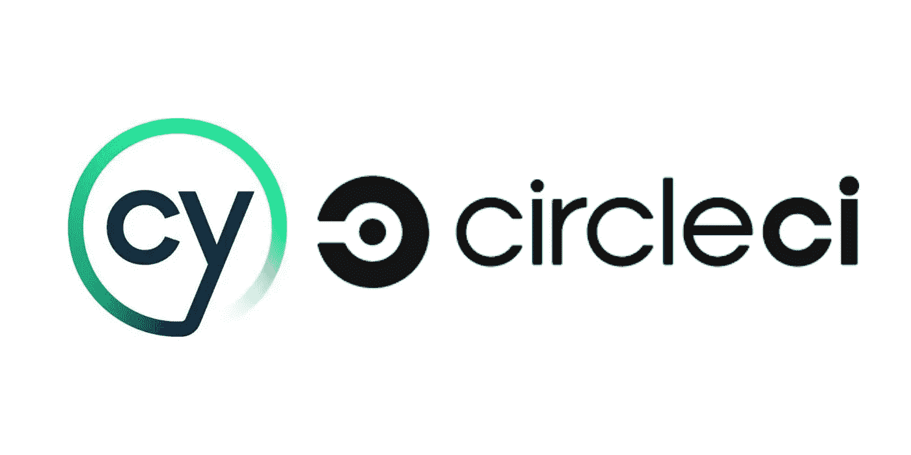
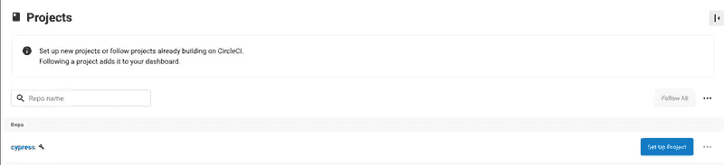
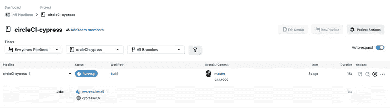
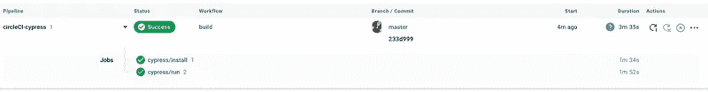
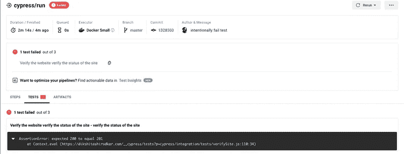
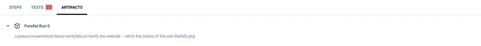

# 用 CircleCI 为您的 Cypress 测试提供动力

> 原文：<https://medium.com/geekculture/power-your-cypress-tests-with-circleci-88e94507d25a?source=collection_archive---------17----------------------->

这篇博客将让你了解如何使用 Cypress 实现你的 e2e 测试，并为你的测试与 CircleCI 进行持续集成和交付。



cypress+circleci

# 关于赛普拉斯

Cypress 是下一代前端测试工具，专为现代 web 应用程序而设计。Cypress 完全具备以下特性:

—时间旅行

—可调试性

—自动等待

—截图和视频

—跨浏览器测试

还有更多…

柏树在建筑上是不同的。与大多数工具不同，它在应用程序的同一个运行循环中运行。它与节点进程同步，并管理通信、同步和代表彼此执行任务。

# 项目设置

让我们开始设置一个基本的 Cypress 项目

——创建一个名为`cypress-circleci`的文件夹并初始化您的节点项目

```
$ mkdir cypress-circleci
$ npm init
```

-使用命令安装 cypress

```
npm install cypress --save
```

-打开项目中的柏树

```
npx cypress open
```

-文件夹结构如下所示

> `circleci-cypress
> │
> └───fixtures
> │ │ sampleData.json
> │ │
> └───integration
> │ │ siteVerify.js
> │
> └───plugins
> │ │ index.js
> │
> └───screenshots
> │ │ img1.pmg
> │
> └───results
> │ │ test
> │
> └───supports
> │ │ commands.js
> │ │ index.js
> |
> └───cypress.json
> └───package.json`

-创建一个基本测试来验证站点"[https://dikshitashirodkar . com "](https://dikshitashirodkar.com%22)。你可以在`cypress.json`里面配置你的站点的基本 url

```
{
  "baseUrl": "https://dikshitashirodkar.com/",
  "video": false,
  "reporterOptions": {
    "mochaFile": "cypress/results/tests-[hash].xml",
    "toConsole": true
  }
}
```

**注意**:默认情况下，cypress 提供了一个执行测试的视频记录，这里我们已经使用 video 标志明确地关闭了它。并为 xml 报告添加了配置。

下面的测试文件使用了`fixtures`(用于存储和管理测试数据，不过是一个`json`文件)。
一个名为`sample.json`的简单夹具文件

```
{
  "imageName": "dikshita",
  "heading": "QA Talking point"
}
```

下面是基本测试`integration/test.js`。测试包含:
1。访问站点
2。验证站点的响应状态为 200
3。验证博客标题为“QA 谈话要点”

4。验证博客的图像图标为“dikshita”

```
describe("Verify the website", function() {
  before(function() {
    cy.visit("/")
  }) beforeEach(function() {
    cy.fixture("sample").then(function(sample) {
      this.sample = sample
    })
  }) it("verify the status of the site", function() {
    cy.request("/about").should(function(response) {
      expect(response.status).to.eq(200)
    })
  }) it("verify the heading of the blog", function() {
    cy.get(".head-logo")
      .children("a")
      .should("have.text", this.sample.heading)
  }) it("verfiy the image icon on the site", function() {
    console.log(this.sample, "printing data")
    cy.get(".profile-img")
      .should("have.attr", "src")
      .and("include", this.sample.imageName)
  })
})
```

让我们使用命令来执行测试:

```
npm run cypress run --browser chrome
```

结果的输出类似于:

```
Spec                                              Tests  Passing  Failing  Pending  Skipped
  ┌────────────────────────────────────────────────────────────────────────────────────────────────┐
  │ ✔  tests/verifySite.js                      00:08        3        3        -        -        - │
  └────────────────────────────────────────────────────────────────────────────────────────────────┘
    ✔  All specs passed!                        00:08        3        3        -        -        -
```

好了，您已经成功配置并执行了…🏅

# 用 CircleCI 运行柏树

CircleCI 是一个持续的集成和部署工具，它帮助团队在存储库中集成他们的代码，并在一天中“n”次构建测试。CircleCI 使用的`Orbs`是开源的、可共享的可参数化可恢复配置元素包，包括作业、命令和执行器。
CircleCI 还提供了`Orb`供 cypress 进行测试，无需花费时间配置 CircleCI。它还记录结果&提供了一个 GUI。

# 让我们跳到配置 CircleCI

-在你的项目
的根目录下创建一个文件夹`.circleci`-在`.circleci`文件夹中添加一个文件作为`config.yml`

```
version: 2.1
orbs:
  cypress: cypress-io/cypress@1
executors:
  with-chrome:
    resource_class: small
    docker:
      - image: "cypress/browsers:node14.16.0-chrome90-ff88"
workflows:
  build:
    jobs:
      - cypress/install
      - cypress/run:
          requires:
            - cypress/install
          executor: with-chrome
          browser: chrome
          post-steps:
            - run: ls
            - store_test_results:
                path: cypress/results
            - store_artifacts:
                path: cypress/screenshots
```

**注意**:把你的 cypress 项目放到一个版本控制系统中(github 或者 bitbucket)。在我们的例子中，我们会把它放在 github 上。

# 设置您的 CircleCI 帐户

1.你可以通过 github 登录 CircleCI portal，你可以在项目列表界面中访问你所有的 gitHub 库。



2.为了给 git hub 项目设置 circleci，选择`Setup project`。这将要求您选择您想要执行测试的分支，并且它应该包含`.circleci`文件夹中的`config.yml`。或者另一种选择是创建一个新的配置文件。

**注意** :
对于这篇博文，我们是手动触发管道的。但是你绝对可以，自动化管道触发过程。

3.当您设置项目时，管道将被自动触发，并且可以看到构建进度



Build progess

4.管道的成功看起来像是:



Sucess status

5.失败的管道看起来像这样


Failure status

6.我们已经添加了配置来存储测试结果和我们的`config.yml`文件中的工件。因此，我们也能够在测试部分和工件部分的测试截图链接中看到测试失败的细节



Tests failed



Artifacts

这个博客到此为止。希望你喜欢它。感谢阅读…！