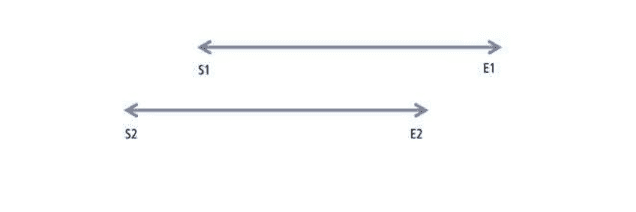
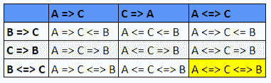

# 算法的实际应用

> 原文：<https://medium.com/geekculture/practical-applications-of-algorithms-c683b132ddda?source=collection_archive---------13----------------------->

## 让我们通过开发适当的算法来解决技术公司和产品面临的一些实际问题。

理想情况下，当选择一个算法时，我们将实现所有的算法，运行 A */* B 测试，并查看哪个具有最好的度量。 *A/* B 测试表明我们是客观的、无偏见的，并且愿意进行实验。

# **问题 1 —检测会议冲突的算法**

让我们完成一个简单的例子，然后我们将编写一个代码片段来处理任何情况。

假设第一次会议在上午 9 点开始，在上午 11 点结束。简写如下:

S1(第一次会议开始):上午 9 时

E1(第一次会议结束):上午 11 时

如果第二次会议在上午 11 点之前开始，或者在上午 9 点之后结束，就会有冲突。用速记来表达:

S2 < E1

• E2 > S1

为了帮助形象化这一点:

我们可以在下面的代码中表示(S2 < E1 or E2 > S1)逻辑。

> bool IsConflict(日期时间 s1，日期时间 e1，日期时间 s2，日期时间 e2) {
> 
> 返回(S1<e2>S2)；</e2>
> 
> }

# **问题 Twitter 关注者推荐算法**

**行为/动作:**

1.  **查看:**一个 Twitter 用户查看另一个用户的个人资料。
2.  一个 Twitter 用户关注另一个用户。

**基于视图的关系:**

1.  **Stalker:** A 查看 B. B 不查看 A .如果一个用户查看了另一个，但尽管有建议，另一个用户也不查看回来。
2.  **熟人:A 观点 B 观点 A .如果两个人在被建议时互相看对方，他们很可能认识对方。**

**以下状态:**

1.  跟随:观看者跟随被观看者，而不是相反。
2.  被跟随:被观看者跟随观看者，而不是相反。
3.  **相互跟随:**两者相互跟随。

我们可以改进算法，根据 A 和 B 与 C 的关系，向用户 A 或 B 建议第三个用户 C。

下表直观地展示了这些排列:

我们已经指出了以下 9 种不同的状态。提供最佳推荐的是**A<=>C<=>B**。如果 A 是 C 的熟人，B 是 C 的熟人，那么很有可能 A 和 B 也很有可能是熟人。这是一种模仿现实生活的现象。也就是说，假设 C 很了解 A 和 B，在某个时候，C 会把 A 和 B 介绍给对方。

# **问题 3——电梯系统的控制算法**

让我们集思广益的算法，以响应外来乘客的要求和相应的电梯行动。

1.先到先服务(FCFS): 我们会在乘客到达时为他们办理手续。

该算法将最小化延迟，但是吞吐量将受到影响。

2.**最短寻道时间优先(SSTF):** 我们将从最近的楼层处理乘客。

该算法将减少电梯运行时间。这种算法也将比 FCFS 具有更好的吞吐量，但是如果许多密切相关的乘客到达，请求可能会被延迟。

3.**扫描:**在改变方向返回一楼之前，我们将参观顶楼。

该算法比 SSTF 算法更公平，并且移动时间最小化。

4.**环形扫描(C 型扫描):**我们会去顶楼，回来的路上不搭载任何乘客，从一楼开始再次搭载乘客。

这种算法比 SCAN 更公平，因为中间层不会得到两次服务。

5.**看:**这类似于 SCAN，但是我们也将使用关于所请求位置的信息。当电梯移动到顶层时，如果没有对超出现有楼层的位置的等待请求，电梯将反向。

使用该算法，移动时间被最小化。

6.**圆形 LOOK (C-LOOK):** 类似于 LOOK，但也是圆形，如 C-SCAN。

该算法利用 C 扫描的公平性优势最小化移动时间。