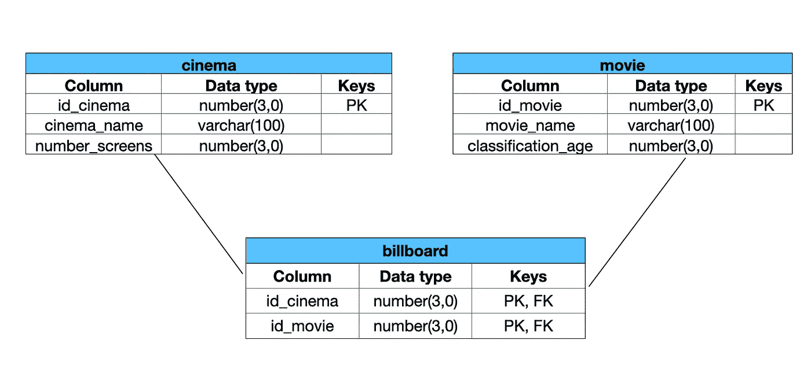
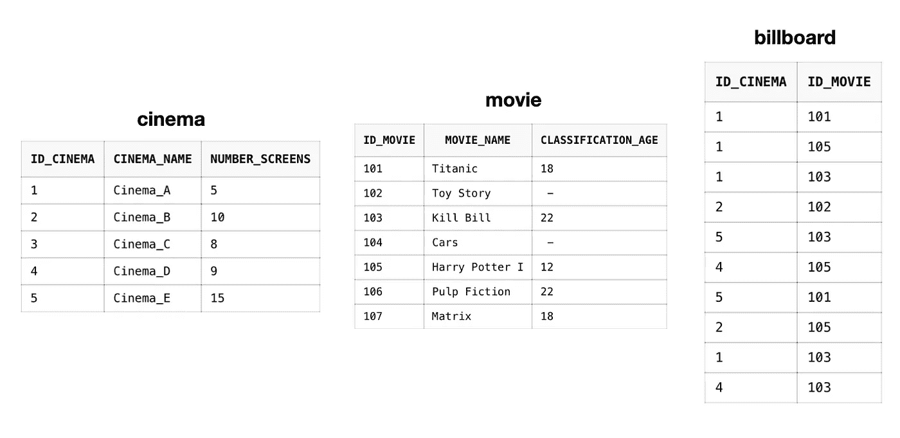

# 准备 SQL 作业测试的实践练习

> 原文：<https://medium.com/geekculture/practical-exercises-to-prepare-your-sql-job-test-fe3c1a03ea05?source=collection_archive---------23----------------------->

当你申请数据科学职位时，潜在雇主希望更好地了解你，因此他们将测试你的编程技能！许多人专注于 Python 和 R，然而一些基本技能是 SQL！

在这篇短文中，我想与您分享一组真实的练习，这些练习(幸运地)将帮助您准备 SQL 测试，或者只是作为您继续准备 SQL 的指南。所以，我们开始吧！

# 准备

希望你已经安装了运行 SQL 查询的软件并进行自己的实验，如果没有，我建议你创建一个免费帐户来使用 Oracle [这里](https://livesql.oracle.com/apex/f?p=590:1000)，你不需要安装任何东西！

以下练习是一家中型 IT 咨询公司为测试候选人而进行的一系列真实测试！即使是基础水平，我相信这是一个练习和继续准备的完美开端。

记住:雇主想测试应聘者的逻辑，这意味着他们不想要*完美的*解决方案，他们想知道*你解决问题的方式*。

**你将练习什么:**

*   基本 SELECT + WHERE 语句
*   JOIN 语句
*   标量和聚合函数
*   DML(数据操作语言):更新+删除
*   集合操作
*   查找空值
*   WITH + SELECT 语句
*   子查询

# 我们开始吧！

您有以下模式结构。如果您不理解每个单元，请不要担心，只要记住这一点:

1.  有三张桌子:电影院，电影和广告牌。
2.  电影院和电影桌都和 billboard 有关。
3.  电影院和电影桌彼此没有直接关系。



Schema structure

但是用人单位没有给任何剧本！别担心，我创建了一个，这样你就可以练习并做自己的实验:[https://github . com/Nino guzman/SQL practice/blob/main/database . SQL](https://github.com/NinoGuzman/SQLPractice/blob/main/database.sql)

该脚本创建以下数据库:



**练习 1:显示所有不同的年龄分类**

解决方案:

```
SELECT DISTINCT classification_age 
FROM movie
```

逻辑:

可能第一个问题真的很基本，在这种情况下，只要记住关键字 *DISTINCT* 将避免显示 doubles。

**练习 2:寻找不放映任何电影的电影院**

解决方案:

```
SELECT cinema_name
FROM cinema
MINUS
SELECT DISTINCT cinema_name
FROM cinema 
NATURAL JOIN billboard 
NATURAL JOIN movie
```

逻辑:

*   使用自然连接将把那些重合的键的信息放在一起。分析 *billboard* 表，您可以观察到缺少的值是 **id_cinema = 104。**
*   然后使用*减去*运算，我们从集合 1(所有电影院)和集合 2(放映电影的电影院)中减去公共元素，即不放映电影的电影院。

**练习 3:查找分级年龄大于 16 岁且未在任何电影院上映的电影**

解决方案:

```
SELECT movie_name
FROM movie
WHERE id_movie in (
    SELECT id_movie 
    FROM movie
    MINUS
    SELECT DISTINCT id_movie
    FROM billboard
    )
AND classification_age > 16
```

逻辑:

*   WHERE 中的子查询为我们提供了未在任何电影院放映的电影的 id_movie(类似于上一个练习)。
*   添加 AND 关键字过滤分类年龄。

**练习 4:
a)播放没有年龄分类信息的电影
b)更新符合上述标准的电影的信息，将这些值设置为 0(针对所有公众)**

解决方案:

```
a)
SELECT movie_name 
FROM  movie
WHERE classification_age IS NULLb)
UPDATE movie
SET classification_age = 0
WHERE classification_age IS NULL
```

**练习 5:删除未在任何影院上映的分级年龄在 18 岁以上的电影**

解决方案:

```
DELETE FROM movie 
WHERE movie_name = (
   SELECT movie_name
   FROM movie
   WHERE id_movie in (
       SELECT id_movie 
       FROM movie
       MINUS
       SELECT distinct id_movie
       FROM billboard
       )
   AND classification_age > 18     
)
```

逻辑:

*   我们使用与之前相同逻辑来访问没有在任何电影院放映的电影，并根据年龄进行过滤(参见练习 3)。
*   我们使用关键字 DELETE 从表 *movie 中删除结果。*

**练习 6:统计每家电影院的电影数量**

解决方案:

```
SELECT cinema_name, COUNT(DISTINCT id_movie) Total_movies
FROM cinema c
NATURAL JOIN billboard b
NATURAL JOIN movie m
GROUP BY cinema_name
```

逻辑:

*   请记住，我们必须将所有三个表连接在一起才能获得信息，这将为我们提供实际上在某些电影院上映的电影。
*   在 SQL 中使用标量和聚合函数也是必不可少的，在这种情况下，我们对代表每部电影和按电影分组的所有不同的 **id_movie** 进行计数。

**练习 7:显示放映电影数量超过可用屏幕数量的电影院**

```
WITH tab_aux as(
    SELECT COUNT(DISTINCT id_movie) Total_movies
    FROM cinema c
    NATURAL JOIN billboard b
    GROUP BY cinema_name)SELECT c.cinema_name, c.number_screens, t.Total_movies
FROM tab_aux t, cinema c
WHERE  c.number_screens < t.Total_movies
```

逻辑:

*   WITH 语句用于创建一个辅助表，该表实际上包含与上面相同的结果(电影院的电影总数)
*   使用表 *tab_aux* 和 *cinema，*我们过滤那些显示的电影多于可用屏幕数量的电影院。
    **警告:在这种情况下** **所有电影院放映的电影都少于可用屏幕的数量。因此输出将是:*没有找到数据。***

**练习 8:显示只向所有公众放映电影的电影院(classification_age = 0)**

解决方案:

```
SELECT id_cinema, cinema_name
FROM movie m
NATURAL JOIN billboard b
NATURAL JOIN cinema c
WHERE m.classification_age = 0
```

**练习 9:为 12 岁以上的公众放映电影，这些电影在可用屏幕数量超过 5 个的电影院中放映。**

解决方案:

```
SELECT movie_name, classification_age, number_screens 
FROM movie m
NATURAL JOIN billboard b
NATURAL JOIN cinema c
WHERE m.classification_age > 12
AND c.number_screens > 5
```

逻辑:

*   一旦信息被放在一起(自然连接)，我们就按照年龄和屏幕数量进行过滤。
*   记住符号 *a.col* 的意思是:“从表 *a* 中获取列 *col* ”

**练习 10:选择电影院，以及那些电影院中分类年龄与 18 岁不同的电影。**

解决方案:

```
SELECT cinema_name, movie_name, classification_age
FROM movie m
NATURAL JOIN billboard b
NATURAL JOIN cinema c
WHERE m.classification_age in (
    SELECT DISTINCT classification_age
    FROM movie
    WHERE classification_age != 18
)
```

逻辑:

*   子查询用于获取所有不同于 18 岁的分类年龄。
*   当信息放在一起时，我们选择电影院、电影和分类年龄，除了分类年龄= 18。

# 最终意见

希望以上练习对你练习 SQL 技能有用。我鼓励你下载代码，运行查询，做你自己的实验，这才是我们真正学习的方式！

如果你觉得这很有趣，请跟我来。如果您有任何意见、问题或建议，请随时联系我。

如果您对展示如何从示例中创建数据库的类似帖子或更复杂的 SQL 练习感兴趣，请告诉我。

祝你好运！

Github 库:[https://github.com/NinoGuzman/SQLPractice.git](https://github.com/NinoGuzman/SQLPractice.git)