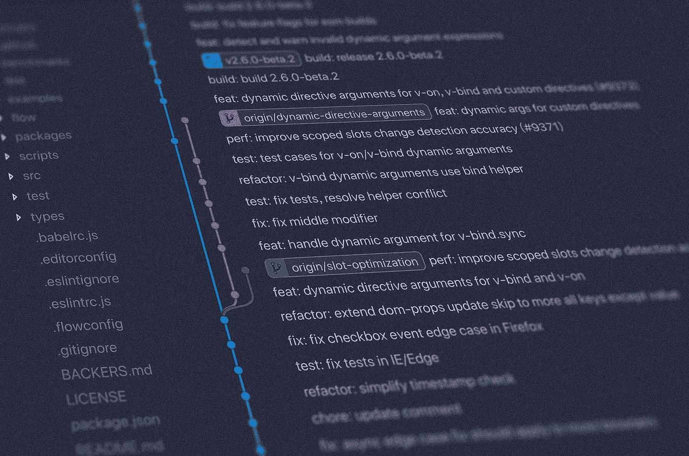

# 实用 Git 课程—第二部分

> 原文：<https://medium.com/geekculture/practical-git-lesson-part-ii-b0194d22596f?source=collection_archive---------30----------------------->

**Unsplash**

# 分支

*   一个分支代表一个独立的开发路线。分支充当编辑/暂存/提交过程的抽象。
*   我们可以把它们看作是请求一个全新的工作目录、临时区域和项目历史的一种方式。
*   所有新的提交都记录在当前分支的历史中，这导致了项目历史中的分叉。
*   git branch 命令允许您创建、列出、重命名和删除分支。
*   它不允许您在分支之间切换，也不允许您将分叉的历史重新组合在一起。
*   因此，git 分支与 git checkout 和 git merge 命令紧密集成。

我们可以使用 git status 命令找到当前的分支，默认的 main 是默认的分支。

现在，假设我们正在构建一个移动应用程序，并且我们正在为我们的应用程序添加一个新功能。创建一个单独的分支来构建新特性是合适的，在这里我们可以单独跟踪与这个新特性相关的所有更新，并在完成后与主分支合并。

**如何创建分支机构？**

***cmd:*** git 分支功能 _ 菜单 _ 栏

***命令:*** git 状态

我们将使用 status 命令检查当前分支，然后移动到新创建的分支。

**如何跳槽到新的分公司？**

***cmd:*** git 结账功能 _ 菜单 _ 栏

签出切换到新分支的命令，签出将分支保持在该分支的最新提交上，就像分支的头提交一样。

**cmd:git 状态**

**怎么又转到主枝了？**

***cmd:*** git 结帐主

让我们探索新的分支，并承诺几件事。

***cmd:*** git 结账功能 _ 菜单 _ 栏

***cmd:*** 纳米文件 1

***动作:*** 编辑文件 1

***动作:*** 保存文件 1

***cmd:***git commit-a-m“菜单栏入门”

***命令:*** git 日志

最新的提交详细信息出现在新的分支日志中

我们可以使用 git log 切换到 main 来查看它的历史记录。

**cmd:git check out main**

***命令:*** git 日志

最后一次提交不会是“菜单栏入门”。因为它是在 feature_menu_bar 分支中制作的。

如何使用一个命令创建并切换到一个分支？

***cmd:***git check out-b " feature _ Sidebar "

***cmd:*** git 日志

注意:这个分支中的最新提交将与主分支相同，因为我们是在主分支中创建的。它是从主分支开始的版本。

如果我们移动到 feature_menu_bar，然后创建 feature_Sidebar 分支，那么我的最新提交将来自“feature_menu_bar ”,因为我已经从它开始了一个版本。

**如何找到回购的所有分支机构？**

**cmd:git 分支**

它显示所有的分支和带有符号的当前分支。

**如何删除分支？**

**cmd:git branch-D feature _ Sidebar**

# 合并

从这个术语中我们可以推断，合并有助于合并多个分支。程序员在合并过程中面临的一个主要挑战是，当 branch1 中的一个文件和 branch2 中的同一个文件发生变化时，会导致冲突。

***cmd:*** git 结帐主

**cmd:git 状态**

将功能菜单条合并到主菜单。在功能菜单栏中，我们在文件 1 中提交了文件更改。

***cmd:*** git 合并功能 _ 菜单 _ 栏

***命令:*** git 日志

现在，分支历史将被合并，即 main 中的最新提交将是“菜单栏入门”。

**合并时如何解决冲突？**

*   首先，我们在主分支中创建一个自述文件并保存它。
*   提交自述文件中的更新
*   接下来，我们切换到 feature_menu_bar 分支。
*   更新自述文件的内容并保存。
*   提交自述文件中的更新
*   切换到主分支
*   将 feature_menu_bar 分支与 main 合并。

**命令**

***cmd:*** 纳米自述

***动作:*** 编辑自述文件

***操作:*** 保存自述文件

***cmd:***git commit-a-m“ReadME 中所做的更改”

***cmd:*** git 结账功能 _ 菜单 _ 栏

***cmd:*** 纳米自述

***动作:*** 编辑自述

***操作:*** 保存自述文件

***cmd:***git commit-a-m“ReadME 中所做的更改”

***cmd:*** git 结帐主

***cmd:*** git 合并特征 _ 菜单 _ 栏

如果 git 能够发现冲突，它会尝试使用**自动合并**自行解决冲突。如果同一个文件中的同一行在两个分支中都被修改了，git 就不能纠正这个冲突。

**改变同一文件&两个分支中的同一行**

***cmd:*** git 分支

***cmd:*** 纳米文件 1

***动作:*** 编辑文件 1

***动作:*** 保存文件 1

***cmd:***git commit-a-m“变更行 1”

***cmd:*** git 结账功能 _ 菜单 _ 栏

***cmd:*** 纳米文件 1

***动作:*** 编辑第 1 行

***动作:*** 保存文件

***cmd:***git commit-a-m "变更行 1 "

***cmd:*** git 结帐主

***cmd:*** git 合并特征 _ 菜单 _ 栏

现在，自动合并失败了。冲突文件向我们展示了我们所做的更改，并询问我们如何处理它们。我们可以手动编辑它，然后添加并再次提交。我们可以返回文件，保留所需的更改并更新文件。

***cmd:*** 纳米文件 1

***动作:*** 编辑第 1 行

***操作:*保存文件**

***cmd:*** git 添加文件 1

***cmd:***git commit-a-m "冲突已移除"

因此，我们已经学习了如何创建一个分支，如何合并两个分支，以及如何消除冲突。接下来，我们将了解如何使用远程存储库。

**处理远程存储库**

让我们将远程存储库克隆到本地系统。以下命令创建一个名为 repo 的文件夹，其中包含远程存储库中的所有文件。

***cmd:*** git 克隆 URL _ of _ repo _ new _ clone

***cmd:*** git 远程

它显示了到该存储库原点的所有远程。它创建了一个拷贝/源自远程存储库。

注意:如果您从本地 repo (git clone /git_basics)克隆一个 repo，那么它不是一个远程存储库。我们需要先将克隆的存储库添加到远程。

git_basics 是本地存储库。

***cmd:***git clone/git _ basics git _ basic _ cloned//origin(远程的名称)

***cmd:*** git 远程

**cmd:CD git _ basics**

***cmd:*** git 远程

***cmd:*** git 远程添加 our_clone /git_basic_cloned

***cmd:*** git 远程

这将有助于回购双方相互沟通。

**远程推拉**

***cmd:***CD git _ basic _ cloned

**cmd:git check out-b notification _ bar**

***cmd:*** 纳米文件 1

***动作:*** 编辑文件

***操作:*** 保存文件

***cmd:***git commit-a-m“在文件 1 中进行的更改”

***cmd:***git push//不会做任何具体的事情

***cmd:***git push notification _ bar//edit 明确提到哪个远程

***cmd:*** git 推送原产地通知 _bar

切换到 git_basics，看看上面的分支提交的内容是否是反射的

**cmd:CD git _ basics**

***cmd:*** git 分支

notification_bar 分支也应该在 git_basics repo 中可用。在远程分支机构中所做的更改应该在本地回购中可用。

我希望你喜欢 git 上的实用指南。感谢阅读。享受你做出的承诺。