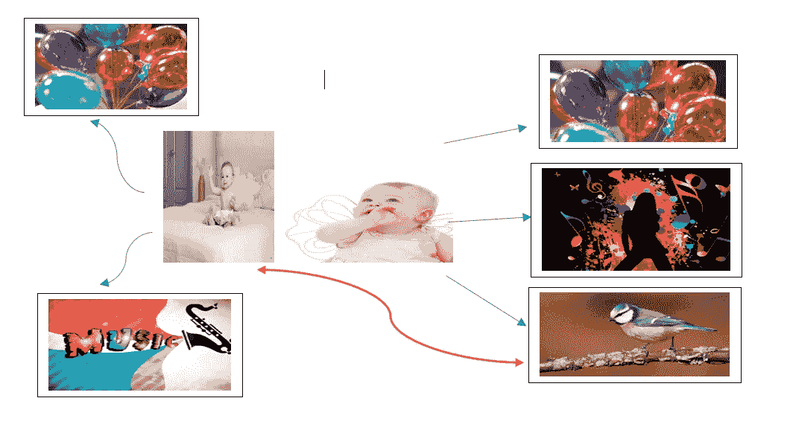
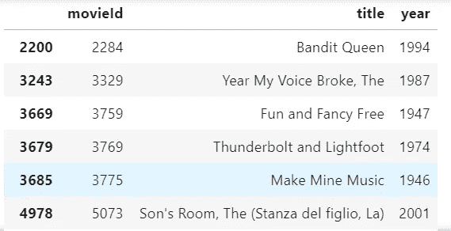
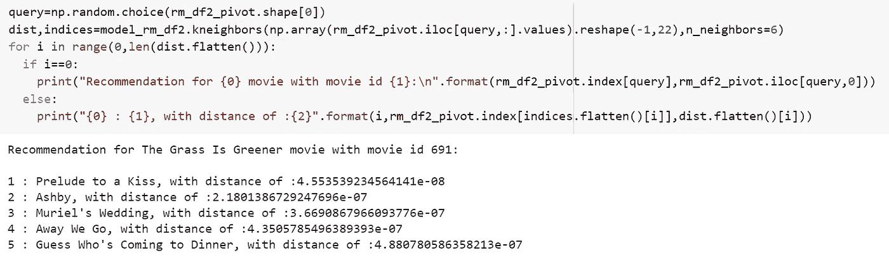

# 协同过滤推荐系统的实际实现

> 原文：<https://medium.com/geekculture/practical-implementation-of-collaborative-filtering-recommender-system-937e380a7d51?source=collection_archive---------20----------------------->

这种类型的推荐系统正在许多地方使用，如网飞、Youtube、亚马逊、谷歌、Spotify、谷歌新闻、Twitter、脸书、Linked In 等等。

什么是随处可见的推荐系统？

推荐系统有几种类型？

它们之间有什么区别？

这些答案可以在我之前关于推荐系统的[文章中找到(点击这里即可)。](https://yamini-blog.medium.com/recommender-system-a83668653d95)

在协同过滤中有两种方法，并且可以使用基于记忆或基于模型的两种方法中的任何一种来实现。这两种方法是:

1.  基于用户的协同过滤:在这种方法中，推荐是基于相似的用户兴趣和品味。
2.  基于项目的协同过滤:在这种方法中，推荐是基于项目之间的相似性进行的。



Representation of collaborative filtering

协同过滤背后的要点是，它找到相似的用户，并向输入用户或主要用户或一个用户推荐相同类型的东西，以供查看或使用该项目或产品或服务。在上面的例子中，当一个婴儿喜欢三种产品气球、音乐(钢琴、鼓、任何其他乐器)、鸟(娱乐玩具或真实的)时，那么当其他婴儿喜欢其中两种产品时，第一个婴儿喜欢，显然第一个婴儿喜欢的第三种产品是值得推荐的。

> **“协同过滤基于相似的用户兴趣、偏好或选择来推荐产品，这些产品将根据用户的个人喜好和购物模式来定制。”**

这种类型的过滤有许多优点。许多行业和公司正在使用它来推荐他们的产品和服务，这将有助于提高业务的用户体验和安全性。

**例一。基于内存实现用户-用户协同过滤。**

在这里，我将使用相同的电影和评级数据集进行预测

1.  在收集输入电影及其由输入用户给出的评级之后，将来自电影数据集中的正确电影 id 添加到输入电影中。
2.  现在找出已经观看和评价了与输入电影中相同的电影的用户。
3.  创建子组数据框，其中与输入用户相似的用户用用户 id 进行索引。
4.  接下来，让我们找到这样的用户群，他们与输入用户有更多共同的电影，并且以向输入用户给出好的推荐的排序格式。
5.  在这里，我使用皮尔逊相关来寻找用户的相似性矩阵
6.  找到不同用户相对于输入用户的皮尔逊相关系数。
7.  不同用户与输入用户的所有关联都存储在与用户标识相关的数据帧中
8.  从所获得的与输入用户的最高相似性用户中获取所选或最高用户的所有电影的评级。
9.  通过将相似性指数乘以所选用户或顶级用户对电影的评级，可以知道加权评级。
10.  然后用所有用户 I 的索引电影 id 对两列相似性指数和加权评级特征求和，..e，两个特征的加权和。它们的电影 id 是从所选择的用户获得的。
11.  最后，通过将顶级用户评级(总和)除以顶级用户相似性指数(总和)来获得加权平均分数。对这些值进行排序，以找出向输入用户推荐的最佳电影。
12.  可以从所有电影数据集中提取所选电影的所有其他细节，以向输入用户提供丰富的体验，其中包含做出观看选择的良好细节。这个最后的数据帧可以在代码下面找到。

```
#2.Finding the users
ratings_df[ratings_df[‘movieId’].isin(inputMovies[‘movieId’].tolist())]# 3.Using gropuby for indexing the data with similar user id's
userSubsetGroup = userSubset.groupby(['userId'])#example to find one such user
userSubsetGroup.get_group(37)#4.Sorting it so users with movie more in common with the input user will have priority
userSubsetGroup = sorted(userSubsetGroup,  key=lambda x: len(x[1]), reverse=True)#6.finding pearson correlation between users and input user
#Store the Pearson Correlation in a dictionary, where the key is the user Id and the value is the coefficient
pearsonCorrelationDict = {}
#For every user group in our subset
for name, group in userSubsetGroup:
    #Let's start by sorting the input and current user group so the values aren't mixed up later on
    group = group.sort_values(by='movieId')
    inputMovies = inputMovies.sort_values(by='movieId')
    #Get the N for the formula
    nRatings = len(group)
    #Get the review scores for the movies that they both have in common
    temp_df = inputMovies[inputMovies['movieId'].isin(group['movieId'].tolist())]
    #And then store them in a temporary buffer variable in a list format to facilitate future calculations
    tempRatingList = temp_df['rating'].tolist()
    #Let's also put the current user group reviews in a list format
    tempGroupList = group['rating'].tolist()
    #Now let's calculate the pearson correlation between two users, so called, x and y
    Sxx = sum([i**2 for i in tempRatingList]) - pow(sum(tempRatingList),2)/float(nRatings)
    Syy = sum([i**2 for i in tempGroupList]) - pow(sum(tempGroupList),2)/float(nRatings)
    Sxy = sum( i*j for i, j in zip(tempRatingList, tempGroupList)) - sum(tempRatingList)*sum(tempGroupList)/float(nRatings)

    #If the denominator is different than zero, then divide, else, 0 correlation.
    if Sxx != 0 and Syy != 0:
        pearsonCorrelationDict[name] = Sxy/sqrt(Sxx*Syy)
    else:
        pearsonCorrelationDict[name] = 0# To check the output of correlation
pearsonCorrelationDict.items()# 8.selected users ratings of all movies
topUsersRating=topUsers.merge(ratings_df, left_on='userId', right_on='userId', how='inner')
topUsersRating.head()#10.Applies a sum to the topUsers after grouping it up by userId
tempTopUsersRating = topUsersRating.groupby('movieId').sum()[['similarityIndex','weightedRating']]
tempTopUsersRating.columns = ['sum_similarityIndex','sum_weightedRating']
tempTopUsersRating.head()#11.Now we have the weighted average
recommendation_df['weighted average recommendation score'] = tempTopUsersRating['sum_weightedRating']/tempTopUsersRating['sum_similarityIndex']
recommendation_df['movieId'] = tempTopUsersRating.index
recommendation_df.head()#12.Final dataframe with recommended movie deatils from the selected users 
movies_df.loc[movies_df['movieId'].isin(recommendation_df.head(10)['movieId'].tolist())]
```



Final recommended movies from user-based filtering by memory-based approach

**例二。基于模型的实现基于项目的协同过滤。**

这种类型的过滤或方法使用项目和机器学习模型作为基础来获得并向用户提供推荐。

在这里，我使用了 KNN 模型，当一个用户观看了某种类型的电影和某些流派时，我会给出推荐。

对上述内容的建议如下所示:



The final recommendations made for users who watched movies with certain genres

欲了解更多基于电影的详细代码和预测，请访问 Github repo 中的 Jupyter 笔记本。[点击这里查看。](https://github.com/Yamini-DS/Data-science-projects-ally/tree/master/IMDB%20movie%20recommendation%20system)


Photo by [nicontents .](https://unsplash.com/@nick__?utm_source=medium&utm_medium=referral) on [Unsplash](https://unsplash.com?utm_source=medium&utm_medium=referral)

> 你生命中的每一次奋斗都把你塑造成了今天的你。感谢今天，为明天做好准备。唯一不可能的旅程是你没有开始的旅程。所以只管去做，去创造。

如果你学到了一些东西，请给我一些支持，让我知道，并与有用的人分享。如果您有任何疑问或任何事情，请在评论框中告诉我。给世界带来一些光明。祝你有愉快的一天。🥰🕊🤍