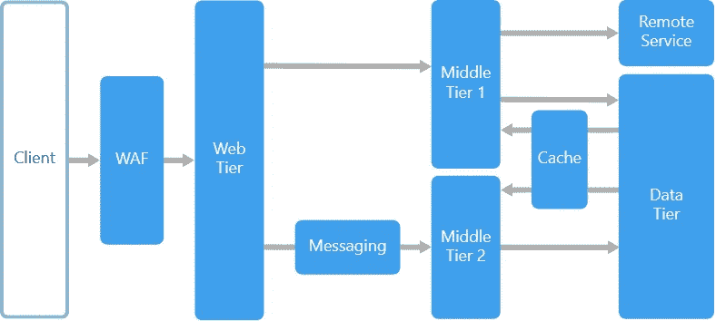

# 实用中间层设计

> 原文：<https://medium.com/geekculture/practical-middle-tier-design-519e290644bf?source=collection_archive---------12----------------------->

## 以下是方法

## 分享一个真实的集成项目

source: microsoft.com

设置场景:

对于最近一个将后端服务器迁移到另一个供应商的客户项目，它启发我写了一篇文章来重温中间层设计。

来自微软的 N 层架构风格给出了背景，这里我将集中讨论中间层。它还解释了层和层之间的区别，N 层的优缺点和挑战等。

这里我将借用文章[中的](https://www.freecodecamp.org/news/what-is-middleware-with-example-use-cases/)，获取一些定义和用例。

首先为**翻译器**:在我的例子中，我们为下面的实现**翻译**

1.  从传入的 xml 请求和传出的 json 请求(到后端远程服务)，
2.  从产品错误代码中翻译项目/企业特定的错误代码/描述。例如，后端服务器响应 HTTP 错误代码(404、500 等)，而客户端期望特定于企业的错误代码(例如，1000 表示找不到文件，3000 表示内部服务器错误等)

第二个用于**累积**:当接收到 1 个传入请求时，我们需要对下游后端服务进行多个传出请求，例如，当对包含 4 个后端请求的新文档/照片进行上传时:必须首先发送元数据创建请求，然后是请求上传 url 的上传 URL 请求，接着是对有效载荷的一个或多个多方上传请求，最后是完成请求。

第三个用于**复制**:有时我们可以将数据存储在中间层以便快速检索，而无需查询后端服务器。在我的例子中，由于范围和复杂性，我们还没有实现它。

第四个关于 **API 安全性**:有许多选项可以实现 API 的安全性，特别是为我们的 API 提供认证和授权。应该使用短期的基于令牌的方法来验证客户端请求。此外，由于使用了中间件，这提供了灵活性，因为它可以使用中间件支持的任何身份验证方法。在我的例子中，我的中间件可以适应并保持客户端的令牌认证不变，同时中间件使用后端支持的一些 API 密钥与后端进行通信。

**解决方案面临的挑战和问题:**

1.  耦合到后端正常运行时间

由于后端经历了一些停机时间，我们需要考虑一些在中间层复制数据的解决方案，以尽量减少对客户端的服务中断。

2.中间层重试和缓存

由于间歇性的停机时间，也由于我们无法更改遗留前端逻辑的一些限制，结果是在中间层实现了额外的应用程序**重试**逻辑和**缓存**机制，以满足功能和性能需求。

**结论:**

我希望我的文章能帮助你更多地思考中间件设计。如果你喜欢这篇文章，请订阅并关注我的媒体，因为它将有助于扩大受众范围。谢了。