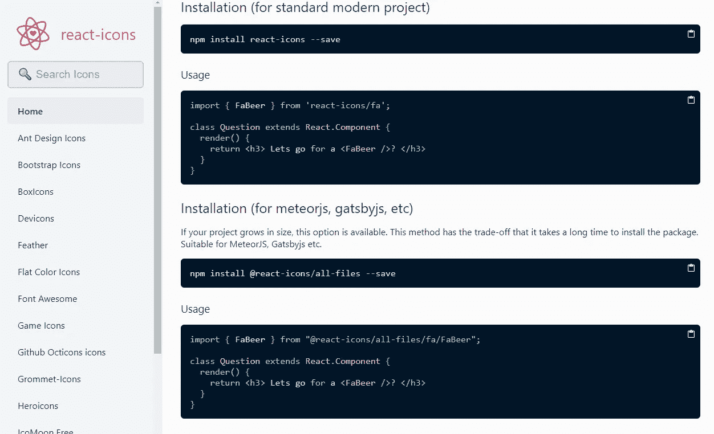

# 自由职业者实用 React 教程|图标—第 1 集

> 原文：<https://medium.com/geekculture/practical-react-tutorials-for-freelancers-icons-episode-01-f98f02560230?source=collection_archive---------26----------------------->

## 让我们将图标导入到 React 项目中

这类内容的唯一目的是给像我这样的新开发人员一些启发，让他们快速掌握使用 react 实现东西的实用方法。我强烈建议大家阅读关于这个包的原始文档，并摆脱阅读文档的恐惧…