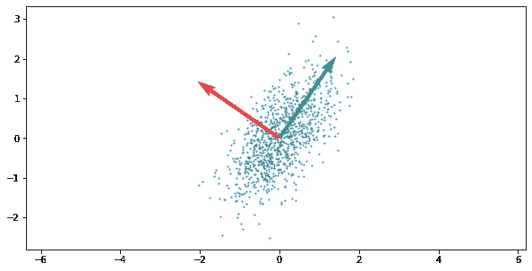
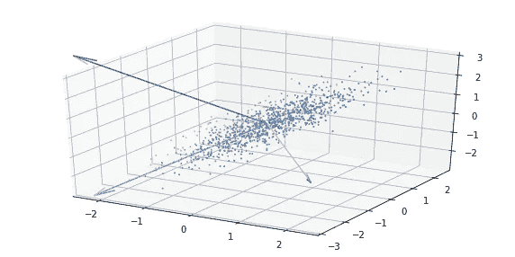
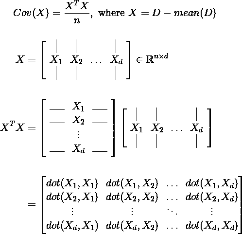
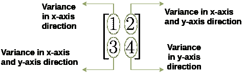
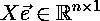
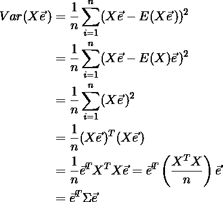
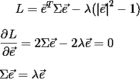
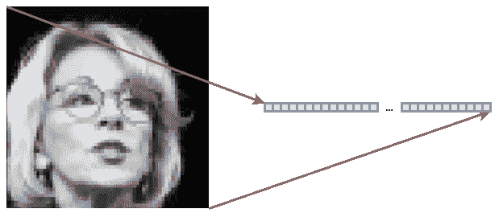
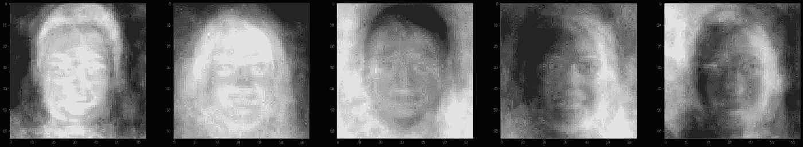
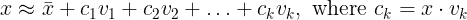

# 对主成分分析的实际理解

> 原文：<https://medium.com/geekculture/practical-understanding-of-principal-component-analysis-pca-61015666354?source=collection_archive---------21----------------------->

很多时候，我过去学习的基础数学在应用于深度学习时变得不清楚，PCA 就是其中之一。在这篇文章中，我想强调 PCA 在研究中的实用性，并涵盖一些数学背景。此外，我已经在 [Google Colab](https://colab.research.google.com/drive/1jp_VnLPZBVZyzT8RrECTh9HtU1QnYgds?usp=sharing) 中实现了整个过程，供任何想在实践中跟进的人使用。

 [## 主成分分析和特征脸

### 林炳成

colab.research.google.com](https://colab.research.google.com/drive/1jp_VnLPZBVZyzT8RrECTh9HtU1QnYgds?usp=sharing) 

# PCA 的定义

> [**主成分分析** ( **PCA** )](https://en.wikipedia.org/wiki/Principal_component_analysis) 是计算主成分，并用它们对数据进行[基](https://en.wikipedia.org/wiki/Change_of_basis)变换的过程，有时只使用前几个主成分，忽略其余的。

根据上面维基百科的定义，主成分是方差最大的向量。

Principal components of 2D data

Principal components of 3D data

然后，我们可以用给定数量的彼此正交的主分量来有效地描述这种 2D 或 3D 数据分布。这样，我们可以在许多领域利用主成分分析，包括特征提取或降维。

# 如何找到主成分

主分量通过协方差矩阵的特征分解获得。后面将解释执行特征分解的原因。首先，我们将详细说明协方差矩阵的含义。

## 协方差矩阵

根据定义，协方差矩阵是每个平均特征对的内积的期望值。

协方差矩阵背后的含义可以被认为是特征对变化的相似性度量。

换句话说，对于给定的 2D 数据，协方差矩阵显示了数据在该方向上的分散程度。

## 特征分解

我们现在可以通过查看协方差矩阵来了解数据是如何分布的。那么，我们如何找到投影数据方差最大的主成分呢？

假设我们有一个投影单位向量 *e* ，

假设每个数据的平均值为 0，投影数据的方差变成如下:

我们可以应用拉格朗日乘数法来寻找使方差最大化的投影单位向量。

> 因此，当投影到协方差矩阵的特征向量上时，投影数据的方差变得最大，并且其方差是特征值。

# 特征脸

就人脸识别的发展而言，特征脸在很久以前就出现了。不考虑特征脸的应用，我只想指出它的 PCA 方面。我们可以将相同的概念应用于人脸图像，而不是寻找随机 n 维数据的主成分。所以，给定人脸图像的宽 x 高尺寸，我们可以认为是(宽 x 高)-维向量。

> 下面所有的人脸图像都来自[https://github.com/NVlabs/ffhq-dataset](https://github.com/NVlabs/ffhq-dataset)、
> 一种基于风格的生成式对抗网络生成器架构
> 泰罗·卡拉斯(英伟达)、萨穆利·莱恩(英伟达)、提莫·艾拉(英伟达)[https://arxiv.org/abs/1812.04948](https://arxiv.org/abs/1812.04948)

然后，将有(宽×高)个主成分，每个主成分描述在数据中发现的重要面部特征。

Eigenvectors in descending order by eigenvalues

由于每个主成分都包含了数据中独特的人脸特征，因此我们只需要很少的特征向量就可以重建出特定的人脸。

从平均人脸开始，将每个特征向量的数量加上它与目标图像的相似程度，将再现近似的人脸图像。

Reconstructed face images by Eigenface