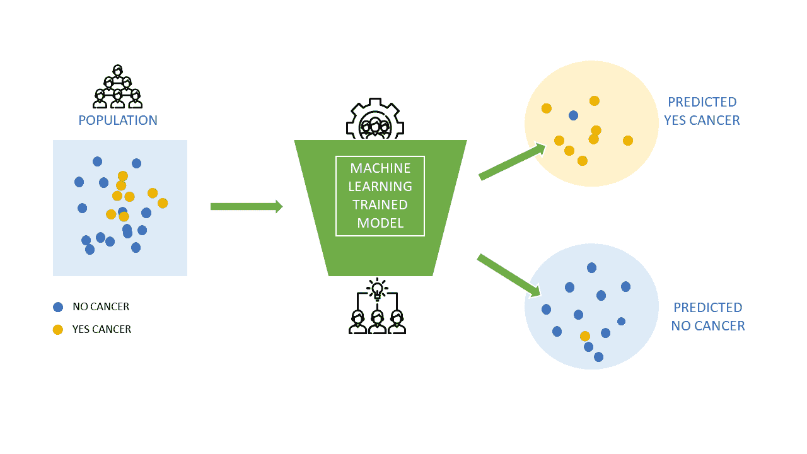
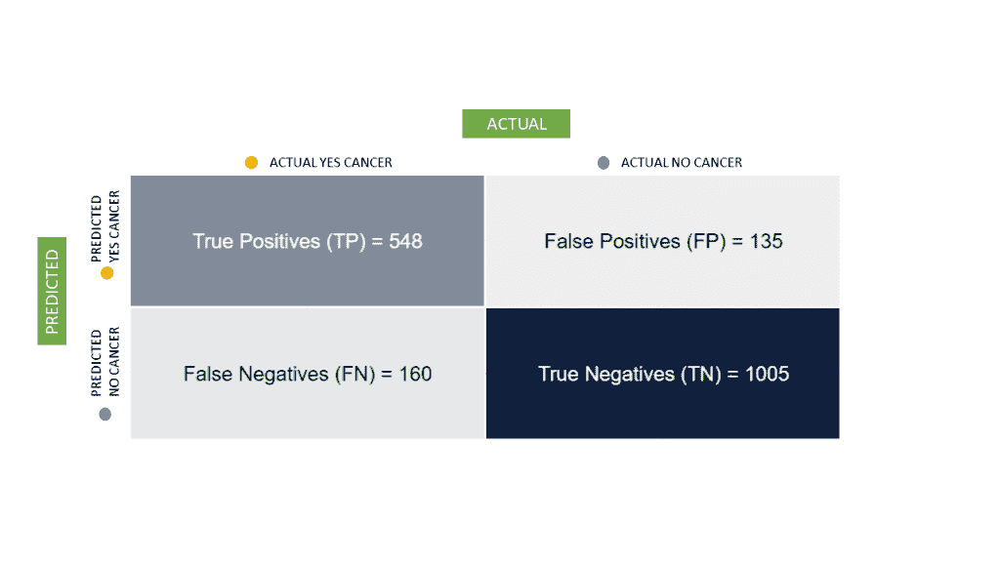
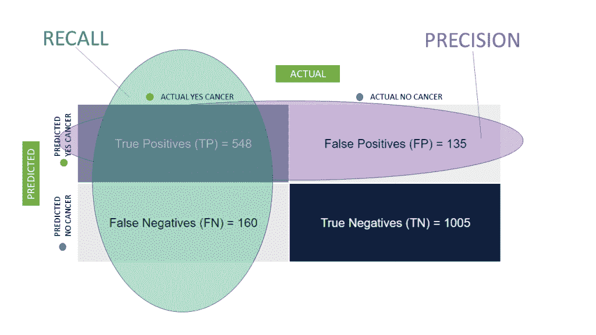
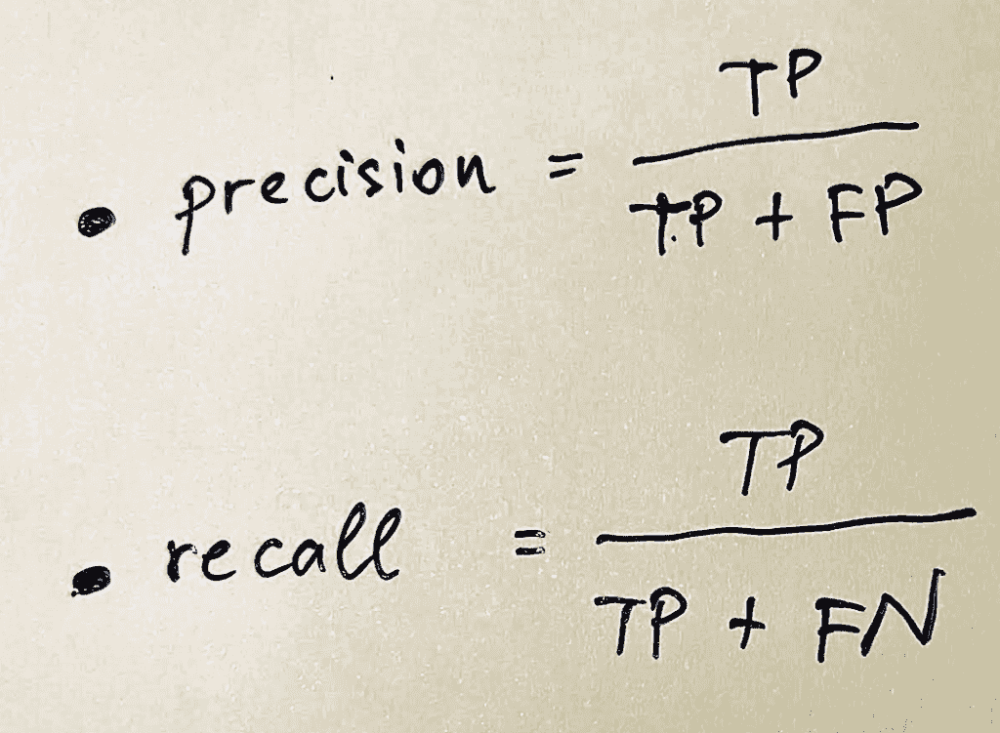
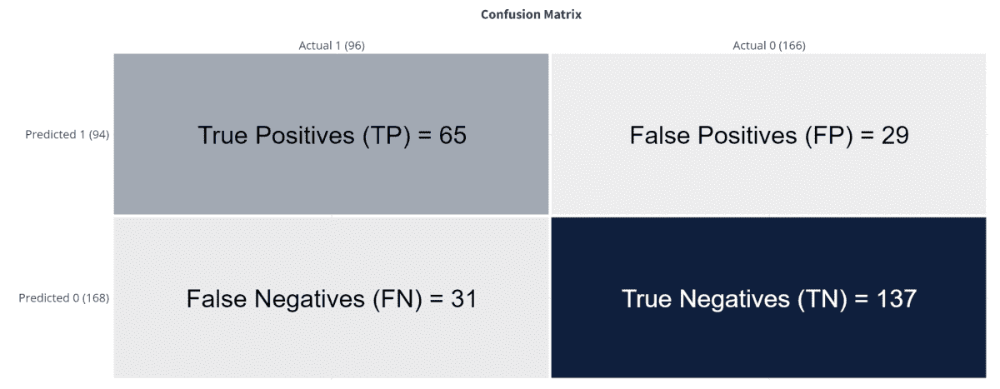
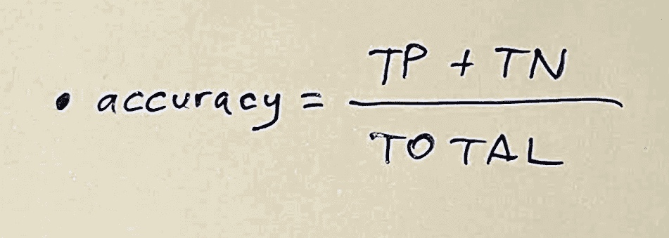
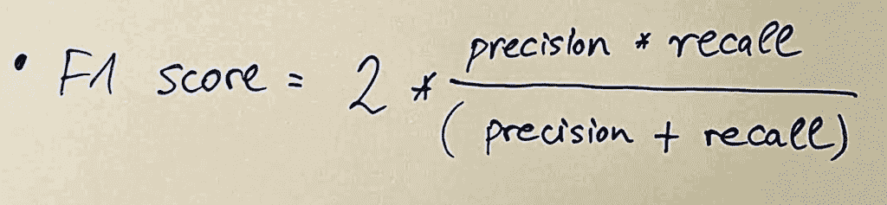

# 精确度与召回率——机器学习的基本指标

> 原文：<https://medium.com/geekculture/precision-versus-recall-essential-metrics-in-machine-learning-8b0d66dd5cff?source=collection_archive---------12----------------------->

## 在机器学习中，精确度和召回率是用于评估模型表现如何的指标。本文详细解释了它们是什么。

Image by the Author

在机器学习中，精确度和召回率是用于评估模型表现如何的指标。本文解释了它们是什么，并回答了流行的“[精确度与召回率](https://towardsdatascience.com/should-i-look-at-precision-recall-or-specificity-sensitivity-3946158aace1)”问题。

我们将讨论如何计算精度和召回率。我们还讨论了每种方法的具体例子，以及为什么应该同时使用精度和召回率来评估模型的性能。

在预测一些结果时，最好使用最准确的机器学习模型。当然，这是为了减少你的 ML 模型的错误。

不管怎样，你的人工智能模型的一些错误会比其他的有更大的影响。尽可能少犯错误并不总是符合你的最佳利益；有时候，知道你的模型错在哪里是至关重要的。

或者换一种说法，理解哪些错误你可以忍受，哪些错误你想最小化。

让我们潜入更深的地方。

每个机器学习模型有时都是错误的，这是事实。想象一下，我们的目标是开发一个机器学习模型，它可以尽可能好地[预测宫颈癌](https://towardsdatascience.com/precision-recall-and-predicting-cervical-cancer-with-machine-learning-367221e70538#:~:text=Precision%20represents%20the%20proportion%20of,that%20the%20model%20accurately%20predicted.)的出现。

明显的目标是

*   识别尽可能高比例的癌症病例
*   尽可能少的“假阳性”(癌症的预测，但事实上，没有癌症)

最好不要忽视任何癌症患者，即使这意味着将一些没有患病的患者标记为患有癌症。

这就是作为机器学习模型衡量标准，专注于精确度和召回率之间的差异。

# 如何阅读混淆矩阵

[混淆矩阵](https://towardsdatascience.com/understanding-confusion-matrix-a9ad42dcfd62)是对机器学习分类问题的性能衡量。如果输出可以是两类中的一类(癌症是/否、追加销售是/否、客户转换真/假等)。)，混淆矩阵是一个有预测值和实际值的四种不同组合的表格。

想象一下，我们有数千行标记为“是/否癌症”的患者医疗数据

我们还有 1848 行测试数据，因此我们可以测试模型的性能。结果组织在混淆矩阵中:

Image by the Author

为了选择合适的机器学习模型并基于其预测做出明智的决策，理解不同的相关性度量是至关重要的。

精度是正确预测的实例相对于事例总数的百分比。

相比之下，回忆是正确预测的实例占相关案例总数的百分比。

高精度和高召回率意味着你的模型表现良好。

# 精确召回公式

Image by the Author

> 精度-在所有被预测为阳性的例子中，有多少是阳性的？
> 
> *回忆一下——在所有正面的例子中，有多少被预测为正面的？*

Image by the Author

# 机器学习中的精度是什么？

在评估机器学习模型的性能时，精确度是一个需要考虑的基本因素。它被定义为真阳性占所有阳性预测的比例，包括假阳性和真标记。

> **在所有被预测患有癌症的患者中，有多少人确实患有癌症？**

低精度意味着我们的机器学习模型将预测一些 FP——误报。它会给一些病人贴上癌症的标签，而实际上他们并没有。这并不理想，但这种错误不会危及生命。

> ***精度是对有多少检测到的项目真正相关的度量。***

例如，假设您正试图预测一位患者是否患有糖尿病。如果你只测试一次糖尿病，就有可能出现误诊——如果患者只是碰巧在那天测试了低血糖水平，那么他实际上可能没有患糖尿病。然而，他们的结果可能与糖尿病患者非常相似，因此您的测试将提供诊断结果。

但是如果你测试两次——一次在病人血糖水平高的时候，一次在病人血糖水平低的时候——你将得到一个平均结果，这将导致一个正确的诊断。

同样的原理也适用于其他类型的预测。例如，如果你试图预测一个人的身高，只测试一次可能会导致不正确的预测，因为这个人在测量时可能穿着厚底鞋。

但是如果你穿着不同的鞋子，通过测量他们的身高进行多次测试，就会很容易找到一个比任何一次测量都更准确的平均值。

# 机器学习回忆定义

召回是机器学习成功的另一个关键衡量标准。这是一种方法来衡量有多少正确的项目被发现相比，有多少实际存在。

> 在所有患有癌症的患者中，有多少被正确预测？

低召回率意味着我们的机器学习模型将预测一些错误否定。它会将一些真正患有癌症的患者标记为没有患病。这种错误是致命的。

另一个例子，你想评估 500 张图片，以确定其中有多少有一只猫。你可能会错过一些，因为猫隐藏在背景中，或者太小而无法评估。在这种情况下，你的召回率低于你的精确率。

> 回忆是对你能多好地找到你正在寻找的物品的一种衡量。

不可能总是找到每一个项目或数据点，所以 100%的高召回率是罕见的。但是你希望你的百分比尽可能高。

# 精确和准确的区别是什么

准确度与精确度是机器学习领域的一个常见话题。这可能会让新的数据科学家感到困惑，因此我们将为您解析一下。

当训练你的模型时，你需要决定你的损失函数，以及你想对每种类型的错误赋予多少权重。

*   如果您的模型太不准确，它将不会为任何测试集数据提供准确的预测。
*   如果你的模型过于精确，它会做出精确但不准确的预测——所以。它会给出一个总是对或总是错的答案，但不够准确，在实践中没有用。

如果你也考虑你是否有兴趣进行推理(对新数据进行预测)或者只根据过去的数据预测结果，这将会有所帮助。假设你想用新数据做推论。在这种情况下，您还应该考虑这些预测的精确度是多少，以及在实践中什么样的误差率是可以接受的。

如果你只对根据过去的数据做出预测感兴趣，那就想想什么样的错误率是可以接受的。如果你的模型在预测未来时有出错的可能，那么知道这些可能是什么样的错误会有所帮助。

例如，如果您的模型 100%确定地预测一个人患有癌症(基于他们的症状和病史)，但一些患者实际上并没有患癌症——这将是一个不可接受的错误率。

# 机器学习准确度

Image by the Author

对于以下示例，考虑混淆矩阵:

C **正确的预测**

262 行测试中共有 202 行。这就是定义模型准确度= 77.1%

真阳性(TP) = 65:一行是 1，模型预测它是 1 类。

真负数(TN) = 137:一行为 0，模型预测该行为 0 类。

**错误**

262 行测试中共有 60 行，占 22.9%

误报(FP) = 29:某行为 0，而模型预测该行为 1 类。

假阴性(FN) = 31:一行是 1，模型预测它是 0 类。

精度的简单公式如下:

Image by the Author

*准确率，(TP + TN) /合计。*

从所有类别(正面和负面)来看，其中 77.10%我们预测正确。

精度要尽可能高。

> 在所有的患者中(不管有没有癌症)，我们正确预测了多少？

# 机器学习中如何计算精度？

精度，也称为正预测值，衡量分类器预测正类的程度。

它的计算方法是真阳性的数量除以所有阳性和阴性观察的总数。该值的范围从 0 到 1；分数越高，说明平衡性越好。

*精度，TP / (TP + FP)。*

从所有我们预测为正的类中，实际上有 69.15%是正的。

精度要尽可能高。

# 机器学习中如何计算召回率

召回率，也称为敏感度，通过将正确分类为阳性的阳性样本数除以阳性样本总数来计算。

它衡量一个模型检测阳性的能力——回忆越高，检测到的阳性越多。

要计算召回率，首先必须确定“阳性”样本的构成。例如，如果您正在处理医疗数据，您可以将“阳性”定义为被诊断患有特定疾病或状况的患者。然后，根据算法提供的信息，使用您的模型将这些患者分为“阳性”或“阴性”。

之后，计算有多少患者被正确诊断为患有该疾病或病症。最后，将该数字除以所有状态已知的患者(即明确诊断的患者)。

这将为您提供算法在所有可能的阳性结果(即所有患者)中检测出阳性结果的准确估计。

*回忆一下，TP / (TP + FN)。*

在所有的积极类中，67.71%我们预测正确。

召回率要尽可能高。

# 什么是不平衡数据集？

不平衡数据集是一种数据集，其中一个类的观测值比例明显高于其他类。目标变量在一个类别中具有较大的观察比率。例如，如果您有 100 万个项目，并且您的目标变量是“男性”，那么可能有超过 500，000 个项目被标记为男性，但只有大约 1000 个项目被标记为女性。

这可能会有问题，因为许多机器学习算法假设每个项目都有平等的机会被分类为男性或女性。因此，当需要对你的数据集进行预测时，它们就不能很好地工作了。

您可以做以下几件事来修复不平衡的数据集:

# 重新采样(过采样或欠采样)

使用重采样，您可以通过从原始数据集中随机选择项目来创建新的数据集。您可以通过对特定的类进行过采样或欠采样来实现这一点。

例如，假设您的训练数据集不平衡，因为数据库中男性客户多于女性客户。在这种情况下，您可以对雌性进行过采样，以使雄性和雌性之间的观察值分布均匀。

这将有助于提高模型的性能。您也可以选择对雄性进行欠采样，这将产生相反的效果——它将减少训练集中的观察数量。

您可以使用带替换或不带替换的采样。请注意，替换取样会在数据集中引入偏差。如果想避免这个问题，最好采用不更换采样。

过采样涉及生成更均衡地代表总体的合成数据。您可以通过从世界不同地区取样来做到这一点，从而显著减少数据中的偏差。

另一种提高数据集多样性的方法是使用低分辨率图像，然后对其进行上采样。这将确保您有各种不同分辨率的样本，以便您的模型可以学习如何评估任何类型的图像，而不仅仅是高分辨率的图像。

# 组装方法

集成方法利用多种学习算法和技术来获得比任何单一方法更好的结果。

这是通过将不同算法的预测组合成单个预测来实现的。例如，您可以用不同的方式训练五个不同的分类器，并使用它们来预测图像属于哪个类别。

最终预测将是每个模型预测的加权平均值，最准确的模型将被赋予更大的权重。

集成方法可能非常强大，但它们也比其他技术更复杂，需要大量数据。投票和平均是实现集成方法的两种最简单的方式，而堆叠是一种复杂的技术，涉及使用另一种算法来组合模型。

# 学习中的 F1 评分机

F1 分数是衡量模特表现的一种强有力的方式。它结合了两个指标:[精度和](https://graphite-note.com/precision-versus-recall-machine-learning)。

其计算方法如下:

Image by the Author

F *1 分，2 *(精度*召回)/(精度+召回)。*

f1-得分为 68.42%。它有助于同时测量召回率和精确度。没有一个强大的模型，你不可能有高的 F1 分数。

让我们重复一下到目前为止所学的内容。

精度是模型返回的相关结果的百分比。它衡量您的模型在识别正确答案方面的准确性，而不是返回任何可能被视为与您正在寻找的答案相匹配的结果。

另一方面，回忆衡量的是你的搜索结果有多少是相关的。它会告诉您您的搜索是否应该返回任何结果。

> *F1 分数是准确率和召回率的加权平均值。如果结果是相关的，精度加一分，如果至少有一个结果是相关的，召回加一分。结果值让您了解您的模型与搜索结果的匹配程度。*

F1 分数是评估搜索结果的一个很好的指标，因为它为您提供了一个比较不同模型的简单方法。如果你有两个精确度和召回分数非常相似的模型，很难说哪一个更好。

有了 F1 分数，您可以通过对它们各自的分数进行同等加权，将它们与单个指标进行比较。它给予假阳性和假阴性更多的权重，假阳性和假阴性是将显著影响准确度和精确度的假预测。

使用 F1 分数的最佳方式是将您的结果与基线模型进行比较。如果您试图提高模型的性能，将它与 F1 值为 0.5 或更高的基准模型进行比较，将有助于您了解它的性能有多好(或多差)。

您还可以使用 F1 分数作为统计假设测试的一部分，以确定您的改进是否可以在真实世界的用例中产生影响。

# 精确度与召回率:底线

精度是机器学习中最重要的概念之一，因为它决定了分类器或预测器识别与其任务相关的事物的准确程度。

召回同样重要；当试图理解数据时，您想知道分类器或预测器是否识别所有相关信息。

当使用这些概念时，了解它们的局限性是很重要的。精确度和召回率不是绝对的数字——它们是与一组数据相关的测量值，这些数据可以根据其他可用的信息而变化。他们也不考虑任何用户特定的因素，如人口统计或位置。

总之，精确度和召回率是理解机器学习如何工作的两个关键概念。它们将帮助您了解您的分类器如何识别数据中的模式，从而通过确保它们识别所有相关信息，同时忽略不相关的细节来改进这些模型。

既然您对基本的机器学习模型指标有了更多的了解，您就可以对您的预测模型有更多的了解。

# 喜欢内容？我们来连线。

如果你认为这篇文章值得分享，传播出去，帮助别人发现它的价值。

有趣的提示:试着点击拍手按钮，奇迹就会发生！❤️

你可以在 [LinkedIn](https://www.linkedin.com/in/hrvoje-smolic-harvey/) 上和我联系。