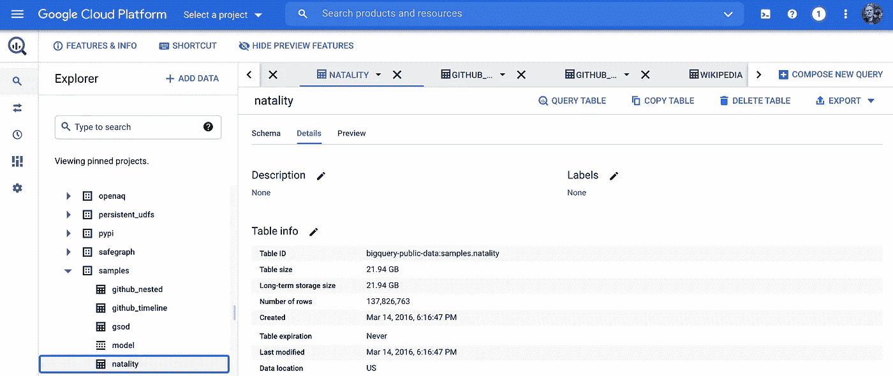

# 使用 Google BigQuery 对 Apache Spark 进行谓词下推

> 原文：<https://medium.com/geekculture/predicate-pushdown-for-apache-spark-with-google-bigquery-2ad4f9e81e6?source=collection_archive---------9----------------------->



## 在 Google Cloud 上用 BigQuery 对数据块进行谓词下推可以吗？确实如此。这里是如何验证它。

当我在谷歌云平台上测试最近发布的 Databricks 的功能时，我检查了 BigQuery 集成。Databricks 正在为 BigQuery 使用开源 [Google Spark 连接器的一个分支。所以我想知道如何检查查询的某个谓词是否确实被下推到 BigQuery(或者不是)。原来很简单！](https://cloud.google.com/dataproc/docs/tutorials/bigquery-connector-spark-example)

让我们以 Google BigQuery 中的出生率公共数据集为例。下面 notebook 单元格中的代码使用 Spark storage API 将表从 BigQuery 加载到 dataframe，将 filter()谓词下推到 BigQuery。

您可以获得查询的执行计划，包括使用 explain()方法进行的优化。要获得更详细的输出，请使用 explain("extended ")

```
df.explain()
```

上面的小例子是我笔记本的一部分，我用它进一步研究了 GCP BigQuery 测试的[数据。explain()的完整输出包含执行计划并列出所有应用的优化。查找描述推送到 BigQuery 的谓词的部分，其中包含关键字 **PushedFilters** :](https://github.com/fmunz/bigdata-intro/blob/main/DatabricksSparkBigQuery.ipynb)

```
**PushedFilters: [*IsNotNull(state), *IsNotNull(weight_pounds), *EqualTo(state,CA), *GreaterThan(weight_pounds,11.0)]**
```

上面的输出显示，下推到 BigQuery 的谓词正是 Spark 查询的条件。

GCP 的 Databricks Spark 优化了

*   嵌套过滤器下推和嵌套列修剪
*   数组下推
*   表达式下推

包含上述所有 [Spark 查询优化示例](https://docs.databricks.com/_static/notebooks/big-query-python.html)的笔记本可以在 Databricks 文档中找到。

# 从这里去哪里？

[1] [Databricks 与 BigQuery 的集成](https://databricks.com/blog/2020/07/31/announcing-support-for-google-bigquery-in-databricks-runtime-7-1.html)博文
【2】[Google Cloud 上的 Databricks 免费试用](https://databricks.com/p/google-cloud-free-trial)
【3】[big query 示例笔记本](https://docs.databricks.com/_static/notebooks/big-query-python.html)

如果你像我喜欢写这篇文章一样喜欢阅读它，请为这篇文章鼓掌。我在 Twitter 上花了太多时间——请随意连接:[**@ frankmunz**](https://twitter.com/search?q=frankmunz)**。**