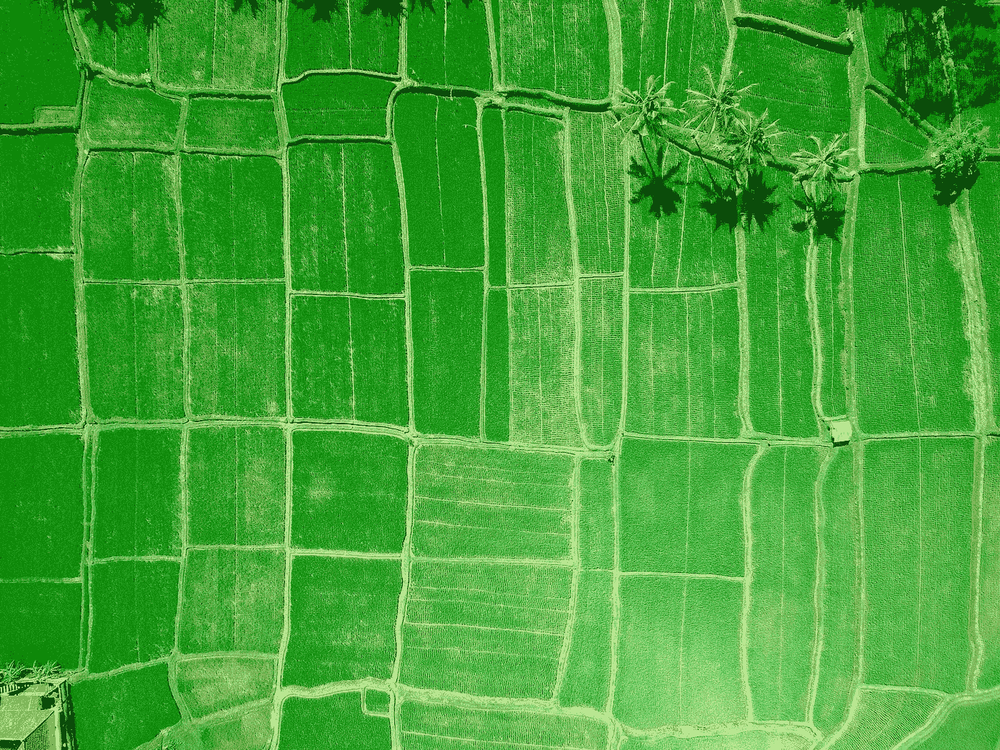

# 用谷歌地球引擎预测盛宴或饥荒

> 原文：<https://medium.com/geekculture/predict-feast-or-famine-with-google-earth-engine-9cfd14813e99?source=collection_archive---------3----------------------->

## 从作物面积到作物产量

Photo by [Joel Vodell](https://unsplash.com/@joelvodell?utm_source=unsplash&utm_medium=referral&utm_content=creditCopyText) on [Unsplash](https://unsplash.com/s/photos/crop?utm_source=unsplash&utm_medium=referral&utm_content=creditCopyText)

在世界上，农业占据了一半的宜居土地。[然而，10%的世界人口经常饿着肚子睡觉。由于气候变化、乌克兰战争和新冠肺炎，当前的粮食问题变得更加严重。自 2019 年以来，全球食品的可负担性、可用性、质量和安全性都有所下降…](https://www.actionagainsthunger.org/world-hunger-facts-statistics)