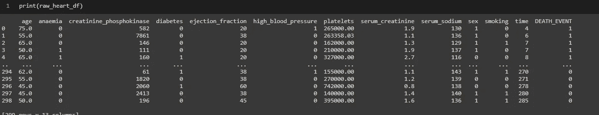
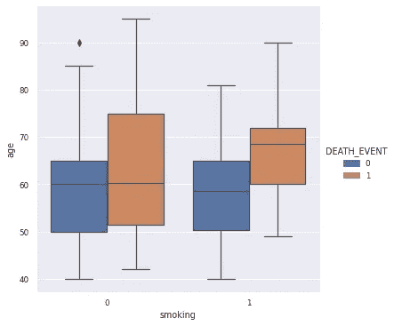
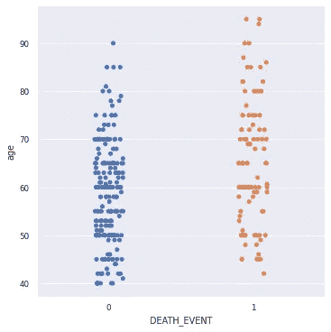
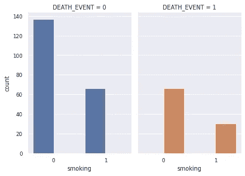
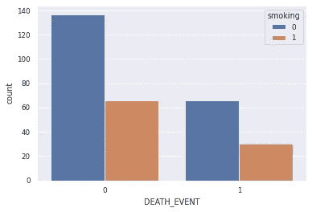
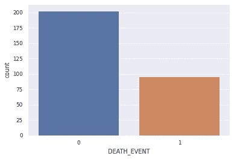
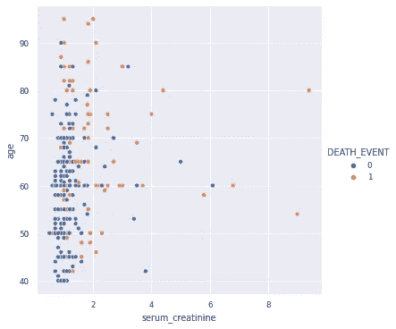
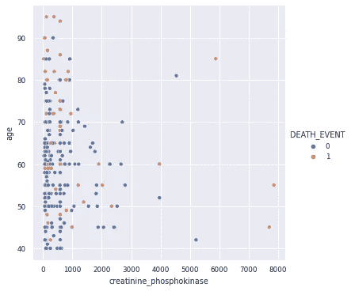
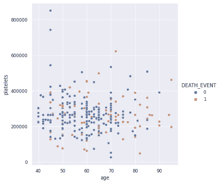
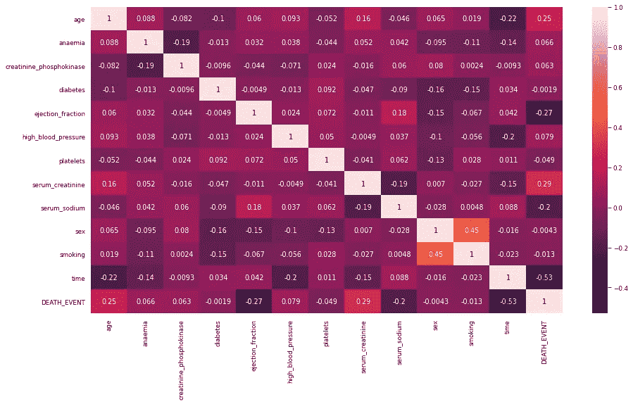

# 用决策树分类器预测心力衰竭死亡

> 原文：<https://medium.com/geekculture/predicting-a-death-because-of-heart-failure-using-decision-tree-classifier-2e56caf6fc1a?source=collection_archive---------11----------------------->


# 目标

以预测在人心力衰竭的情况下可能的死亡事件。这是使用决策树分类器进行学习的尝试，可以帮助初学者提高他/她对处理这种机器学习算法的理解。

# 数据来源

我们将使用在 [Kaggle](https://www.kaggle.com/andrewmvd/heart-failure-clinical-data) 上可用的公共数据集。我们将使用 jovian 开发的 [opendatasets 库](https://github.com/JovianML/opendatasets)来下载数据集

# 要执行的主要步骤

*   下载数据
*   设置库
*   执行基本分析
*   分离训练和测试装置
*   火车模型
*   预测
*   作为 API 发布和公开

# 下载数据集并设置所有库

```
import opendatasets as od
import osdataset_url = '[https://www.kaggle.com/andrewmvd/heart-failure-clinical-data'](https://www.kaggle.com/andrewmvd/heart-failure-clinical-data')
od.download(dataset_url)data_dir = os.listdir()[1]
filename = os.listdir("./heart-failure-clinical-data")[0]
file_path = "./" + data_dir + "/" + filename
```

设置库并将数据加载到 pandas 数据框架中

```
import pandas as pd
import numpy as np
import matplotlib.pyplot as plt
import seaborn as sns%matplotlib inline 
sns.set_theme(style = "darkgrid")
sns.set_context("paper")
plt.figure(figsize=(8,6))#pd.set_option('display.max_rows', 500)
pd.set_option('display.max_columns', 500)
pd.set_option('display.width', 1000)raw_heart_df = pd.read_csv(file_path)
```

下面是从我的 google colab 笔记本上截取的样本结果



Outcome of raw dataframe created out of the dataset

# 为理解数据而执行的基本可视化



Various visualizations performed to understand relationship and patterns in the data

# 让我们确定所有特征之间的相关性

让我们确定每个特征之间的关联，然后绘制一个热图

```
plt.figure(figsize = (15,8))
sns.heatmap(raw_heart_df.corr(), annot=True)
```



heatmap of correlation

# 为培训准备数据

*   在训练、验证和测试数据集中拆分数据
*   分离特征和目标标签

我们的目标标签是 DEATH_EVENT，特征是数据集中可用的所有其他参数。请注意，基于适当的分析和专家建议，我们可以删除领域专家认为对心力衰竭没有影响的某些列，但由于我们没有任何列，我们将继续用所有可用的特征训练我们的模型。

# 用哪个型号？

这是一个分类问题，我们需要检测患者是否会死亡(1)或不会死亡(0)。分类问题有多种算法-

*   逻辑回归
*   KNN 算法
*   决策树
*   随机森林

我们将首先使用决策树来训练模型，看看它在准确性方面如何工作。

# 准备数据

准备数据可以有多种活动，如-

*   通过替换均值、众数等清除缺失值。或者通过移除行
*   分离特征和标签
*   如果不同列中的数值相差很大，可能会影响误差计算，请执行缩放
*   分离训练、测试和验证数据

我们有一个非常小的数据集，没有缺失数据，因此我们不需要对缺失值执行任何操作。我们将执行上述所有其他活动

```
# X -> Dataset with features, y = target column or labelX = raw_heart_df.drop('DEATH_EVENT', axis = 1)
y = raw_heart_df['DEATH_EVENT']
print("Shape of X - ", X.shape)
print("Shape of y - ", y.shape)
print("Type of X - ", type(X))
print("Type of y - ", type(y))
```

# 拆分训练集和测试集中的数据

```
from sklearn.model_selection import train_test_splitX_train, X_test, y_train, y_test = train_test_split(X, y, random_state = 42, test_size = 0.2)print("Type of X_train - ", type(X_train))
print("Type of X_test - ", type(X_test))
print("Type of y_train - ", type(y_train))
print("Type of y_test - ", type(y_test))
print("Shape of X_train - ", X_train.shape)
print("Shape of X_test - ", X_test.shape)
print("Shape of y_train - ", y_train.shape)
print("Shape of y_test - ", y_test.shape)
```

# 训练模型

让我们训练模型并进行预测—

```
from sklearn.tree import DecisionTreeClassifier
housing_model = DecisionTreeClassifier(max_depth = 2)
housing_model.fit(X_train, y_train)
predicted_values = housing_model.predict(X_train)
print("Shape of Predicted values - ", predicted_values.shape)
print("Shape of true values - ", y_train.shape)
```

对训练数据本身进行预测

```
predicted_values = housing_model.predict(X_test)
print("Shape of Predicted values - ", predicted_values.shape)
print("Shape of true values - ", y_test.shape)
```

# 获取准确度分数

```
from sklearn.metrics import accuracy_score
accuracy_score(y_test, predicted_values)
```

# 改进模型

有多种方法可以改进这个模型，其中一些是—

*   通过移除它们来分离一些特征。对目标没有实际影响的某些特征必须被移除，因为它们对模型来说只是垃圾，会降低模型的准确性
*   模型中有吸烟者和不吸烟者，男性和女性。分离这些列并为它们建立两个模型可以提高我们的准确性。
*   尝试另一种算法，如 KNN 或随机森林，以检查是否达到更好的精度

# 带有说明的端到端工作笔记本

请注意，以上说明只是高级说明。如果你想要一本包含代码和结果的完整笔记本，请从这个 [GitHub URL](https://github.com/AMMLRepos/heart-failure-detection/blob/main/heart_failure_prediction.ipynb) 下载