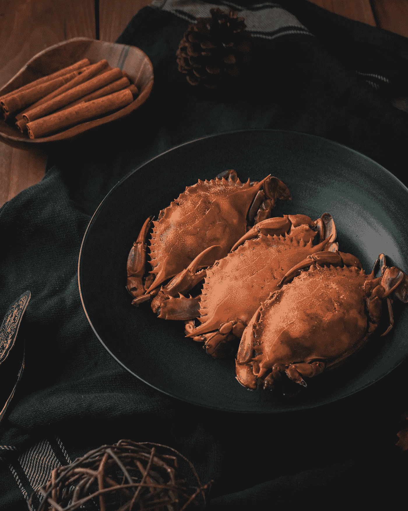
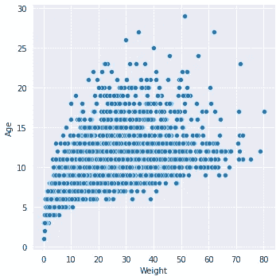
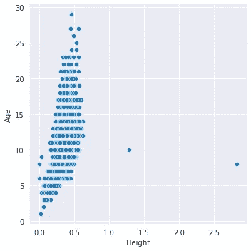
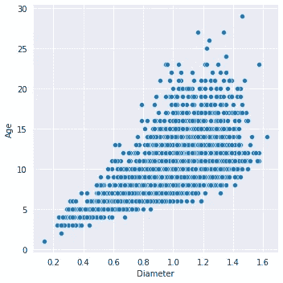
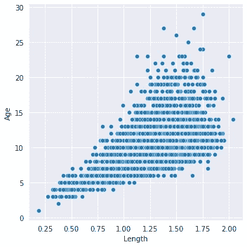
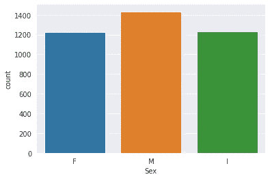
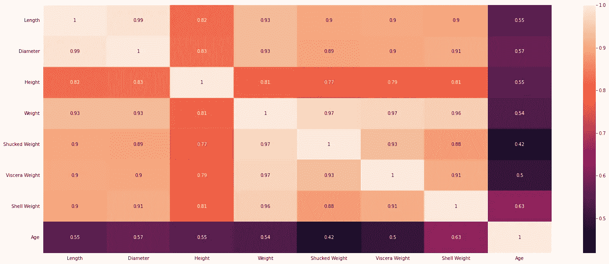
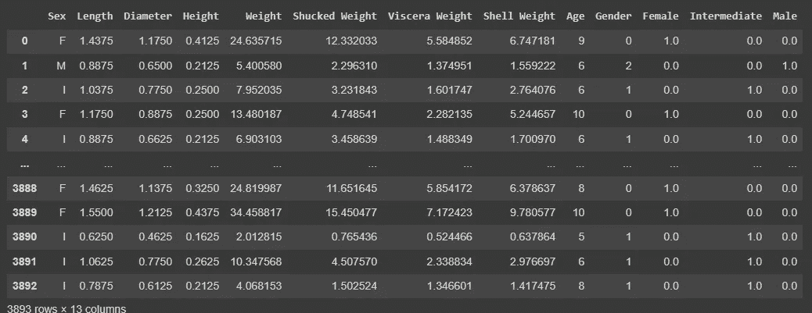

# 基于机器学习的青蟹养殖蟹龄预测

> 原文：<https://medium.com/geekculture/predicting-age-of-a-crab-in-mud-crab-farming-using-machine-learning-1ae3bf030426?source=collection_archive---------11----------------------->

Source — Photo by [Mae Mu](https://unsplash.com/@picoftasty?utm_source=unsplash&utm_medium=referral&utm_content=creditCopyText) on [Unsplash](https://unsplash.com/s/photos/crab?utm_source=unsplash&utm_medium=referral&utm_content=creditCopyText)

# 概观

螃蟹养殖是一项主要的水产养殖活动，因为印度对螃蟹有巨大的消费需求。商业螃蟹养殖在印度沿海地区是一项日益增长的业务，并且看起来有利可图。由于出口市场需求很大，泥蟹很受欢迎。商业规模的泥蟹养殖正沿着安得拉邦、泰米尔纳德邦、喀拉拉邦和卡纳塔克邦的沿海地区快速发展。

# 关于泥蟹

**体型较大的品种:**体型较大的品种在当地被称为‘青蟹’。它能长到最大 22 厘米宽，2 公斤重。

**较小的物种:**较小的物种被称为‘红爪’。这生长到 12.7 厘米甲壳宽度和 1.2 公斤重量的最大尺寸。

更多关于泥蟹养殖的信息，请访问[此链接](https://vikaspedia.in/agriculture/fisheries/brackish-water-fisheries/culture-fisheries/mud-crab-culture#:~:text=Mud%20crab%20farming%20is%20done,based%2C%20with%20or%20without%20mangroves.)。要了解更多关于泥蟹的信息，请访问[此链接](https://www.fish.wa.gov.au/Documents/recreational_fishing/fact_sheets/fact_sheet_mud_crab.pdf)。

# 商业问题

> 对于商业蟹农来说，知道蟹的正确年龄有助于他们决定是否以及何时收获蟹。超过一定年龄后，螃蟹的身体特征的增长可以忽略不计，因此，为了降低成本和增加利润，重要的是选择合适的捕捞时间。

# **数据描述**

我们在 Kaggle 上公开了我们的数据集。数据集包含以下列。请注意，数据创建者没有提到数据指针的单位，但上面提供了一般的身高和体重单位。

*   **性别**:蟹的性别(雌雄)
*   **长度**:螃蟹的长度
*   **直径**:螃蟹的直径
*   **身高**:螃蟹的身高
*   **重量**:螃蟹的重量
*   **去壳重量**:不带壳螃蟹的重量
*   **内脏重量**:包裹在你腹部器官深处的重量
*   **壳体重量**:壳体重量
*   **年龄**:螃蟹的年龄

# **接近**

我们的企业希望预测螃蟹的年龄，以便他们可以在合适的时间收获螃蟹，从而获得利润。问题是一个回归问题，我们可以按照下面给出的步骤开发一个模型—

*   **进行探索性数据分析** —观察影响泥蟹年龄的各种特征。我们有抓具的高度，重量，宽度，这些都会影响螃蟹的年龄
*   **准备数据** —清理数据—缺失值、未知值、编码以确保数据可供算法使用
*   **拆分数据** —把你的数据吐槽成训练和测试数据。我选择了八二分成
*   **选择算法**——为问题确定一个正确的算法是一项重大任务，而且通常不会一蹴而就。我选择了线性回归算法作为所有特征，即身高、体重、宽度等。与年龄成线性关系
*   **通过使用用于线性回归的各种指标，如 RMSE、MSE、MEA，预测和评估模型**。

# 探索性数据分析的结果

Various visualizations for Exploratory data analysis (EDA)

上面显示的图表表明—

*   **体重、身高、直径、长度等之间存在线性关系。随着年龄的增长。这是很明显的生物的本性，它们的属性像身高、体重、长度等等。随着年龄增长**

Count of Female, Male and Intermediate sex crabs

*   **在数据集中，雌蟹、雄蟹和中间性蟹的分布几乎相等，因此我们可以得出结论，我们的数据集确实平等地代表了所有类别**

heatmap for correlation

*   **上图清楚地表明，几乎所有的特征都是正相关的，并且影响预测标签，即年龄**

# 为培训准备数据

*   为性专栏执行 OneHotEncoding
*   分离因变量和自变量(特征和标签)
*   执行训练，测试分割
*   创建模型对象和训练模型
*   执行预测

Dataframe snapshot after OneHotEncoding of Sex Column

# 结果

我们现在可以使用 **sklearn 线性回归**来预测螃蟹的年龄并评估模型。源代码和所有细节都在我的 [Kaggle 笔记本上。](https://www.kaggle.com/aashaymaheshwari/crab-age-prediction)

# 改进模型

可以尝试以下方法来改进模型预测-

*   尝试其他算法——决策树、随机森林等。
*   执行特征选择。移除不影响结果的特征