# 使用用户事件日志预测流失—顶点项目

> 原文：<https://medium.com/geekculture/predicting-churn-using-user-event-logs-capstone-project-df27fd825009?source=collection_archive---------11----------------------->

使用 PySpark 为一个名为“Sparkify”的虚构音乐流媒体服务解决了一个现实世界的业务问题

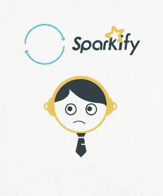

# **简介**

这篇文章是关于我作为 Udacity 数据科学家 Nanodegree 的一部分进行的 capstone 项目的讨论。这个项目是一个了解大数据和使用 PySpark 处理大数据的机会。

该项目的数据集由 Udacity 与 Insight Data Science 合作提供。它包含由服务 Sparkify 的用户生成的事件日志数据。

像大多数基于订阅的商业模式一样，Sparkify 的主要收入来源是用户订阅费和向免费用户提供的广告。因此，完全停止使用该服务的用户会影响公司的底线。

这个项目的目的是进行分析，并建立一个模型，可以利用手头的数据将用户分类为有搅动风险的用户。

# **预测客户流失有什么帮助？**

Sparkify 用户分为两类。那些每月付费的网站和那些免费使用该服务但作为回报的网站会收到广告。通过这种方式，Sparkify 可以从每个用户那里获得收入，即以费用或广告商的形式。因此，Sparkify 增长的唯一途径要么是获得新用户，要么是留住现有用户。

这篇[文章](https://devblogs.microsoft.com/cse/2019/01/10/develop-and-deploy-a-hybrid-multi-input-churn-prediction-model-with-azure-machine-learning-services/)很好地定义了客户流失，

> 对于订阅服务业务来说，有两种方法可以推动增长:增加新客户的数量，或者通过留住更多的客户来增加现有客户的终身价值。提高客户保留率需要能够预测哪些用户可能会取消预订(称为*流失*)，并在适当的时间提供适当的保留优惠。

客户流失是衡量企业生死存亡的标准。这在[这里](https://www.profitwell.com/customer-churn/analysis#:~:text=Churn%20leads%20to%20higher%20CAC,required%20to%20acquire%20a%20customer.&text=The%20more%20customers%20you%20churn,business%20by%20finding%20new%20ones.)有很好的阐述，

> 流失导致更高的 CAC 和减少的收入
> 
> 客户获取成本(CAC)是获取客户所需的销售和营销总成本。
> 
> 不管你的营销策略有多强，你培养潜在客户的方法有多有效，每个客户都需要花钱去获得。事实上，获得新客户比维护和升级现有客户关系要昂贵得多。你流失的客户越多，你就必须花更多的钱通过寻找新客户来弥补业务损失。
> 
> CAC 吞噬了基本收入，从根本上阻碍了财务增长——你可以保持它越低越好，你可以通过积极对抗流失来保持 CAC 较低。

因此，在它发生之前预测它对任何企业的长期成功都是不可或缺的。通过分析客户流失，企业可以采取措施尽可能地防止客户流失。这些措施可以是提供免费订阅扩展、提供折扣等等。

# 游戏计划

预测用户流失需要了解与非流失者相比流失者的用户行为模式和用户状态。

用户事件日志是理解这些模式的表格数据的重要来源。因此，我们预测客户流失的策略如下:

*   使用事件日志了解一般数据
*   识别任何损坏或丢失的数据，并决定如何处理它们
*   基于所述数据将用户识别为搅动者或非搅动者
*   比较两组的几个特征
*   使用这些特征将数据转换成一组 ML 模型友好的数字矩阵
*   基于商定的指标训练和评估模型

# 数据集和所用工具概述

数据集是虚构的 Sparkify 用户生成的事件集合。用于此项目的数据集是完整数据集(12GB)的子集(256MB)。

虽然这里使用的小子集可以放在本地机器的内存中，但是完整的数据集却不能。完整的数据集才是大数据。大数据需要使用分布式计算来解决这个问题。

是支持分布式计算的专用工具，Apache Spark 是业界广泛使用的工具之一。官方网站对 Spark 的定义如下:

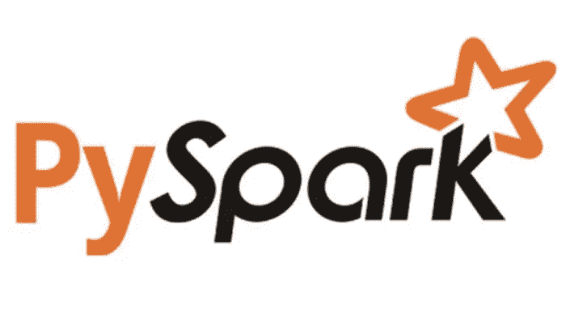

> ***Apache Spark****是用于大规模数据处理的统一分析引擎。*

我们使用了 Spark 的 PySpark python API。它提供了一整套功能来处理和分析数据，同时抽象出分布式计算的底层细节。它提供了两种方式— Spark SQL 和 Spark Dataframe。虽然每一种都迎合特定的人群，但我们可以互换使用。

通过使用 PySpark，子集上使用的代码可以很容易地用于处理完整的 Spark 集群上的完整数据集，而无需任何更改。

我强烈推荐 Udacity 的[免费课程](https://www.udacity.com/course/learn-spark-at-udacity--ud2002)，它详细介绍了 Spark 及其特性。

# 顶点项目概述

手中的数据是使用 Sparkify 服务时每个用户交互的日志。因此，每一行都是单个事件，包含几个细节，如用户执行的操作、时间戳、会话 id、操作时的订阅级别、位置等。

该项目涉及几个步骤，将这些数据处理成可用于训练机器学习模型的格式。我在下面的小节中详细介绍了这个过程。

## 环境设置

Udacity 提供了三个数据集，并根据每个数据集的大小建议了三种不同的环境。第一个也是推荐的选项是使用完整数据集(12GB)并在 AWS EMR 上执行分析，这是一个基于云的 Spark 集群。这种方法很花钱，因此不是我的选择。第二个选项是在基于 IBM cloud 的 Spark 集群的免费层上使用中等大小的子集(256MB)。最后一个选项是在 Udacity 提供的工作空间中使用较小的子集(128MB)。提供了每个选项的设置说明。

我最初从第二个选项开始，并在 IBM cloud 上开始我的分析。设置和使用都很友好，但是，我很快就用完了每月的使用报价。这意味着，我将无法继续到下个月。

最终，我求助于在我的笔记本电脑上完成这个项目。从头开始在本地安装 Spark 可能会很有挑战性。但是感谢 Docker 和 Jupyter 背后的开发人员，我只是使用了一个[Docker 文件，它包含了所有 PySpark 依赖项和 Jupyter](https://hub.docker.com/r/jupyter/pyspark-notebook) 。也就是说，几乎不需要任何设置。关于使用 Docker 和设置环境的细节可以在这个[帖子](https://realpython.com/pyspark-intro/#running-pyspark-programs)中找到。

## 导入和清理数据

首先看模式。

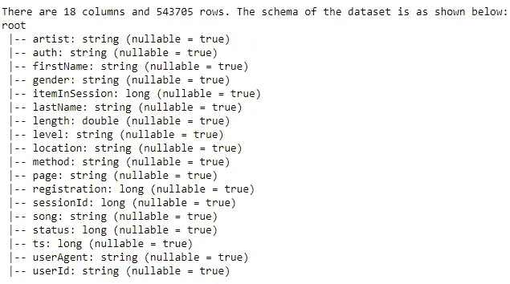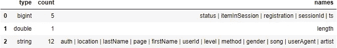

寻找空值和空字符串

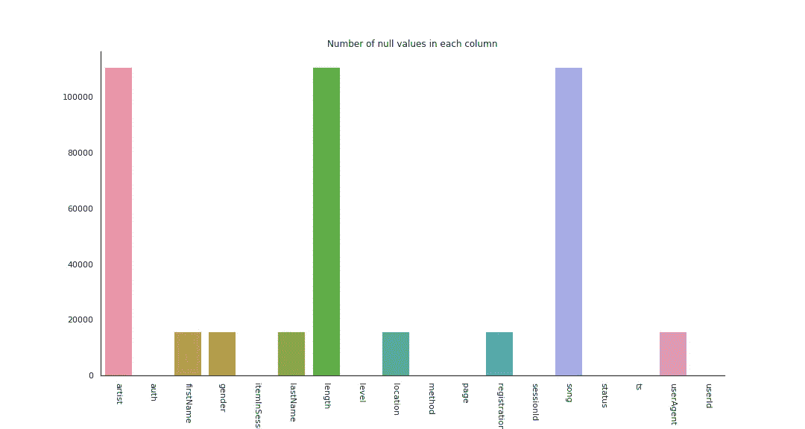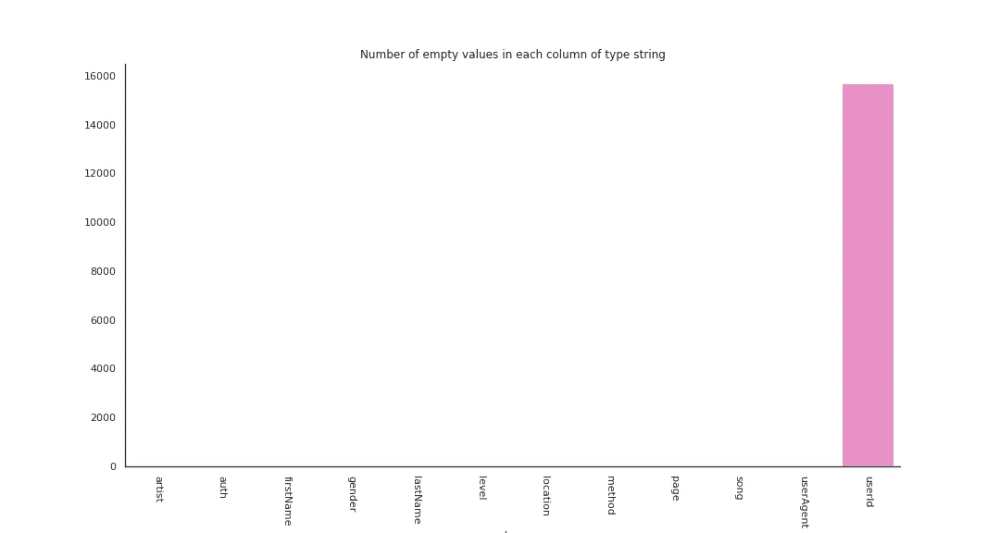

数字列的描述

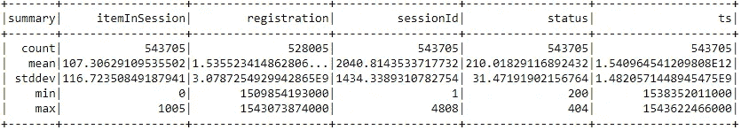

该数据集有两种缺失值:

*   值保持为空，因为该事件与用户听歌无关。因此，艺术家、长度和歌曲等字段仍然为空。
*   值保持为空，因为用户在事件期间没有登录。因此，当用户未登录时，名字、性别、姓氏、位置、注册、用户代理等字段保持为空，而用户 Id 是空字符串。

假设目标是识别处于混乱边缘的用户，没有用户标识、用户代理、位置等用户信息的事件是没有用的。因此，删除了 userId 为空的行。

## 关于数据的一些统计

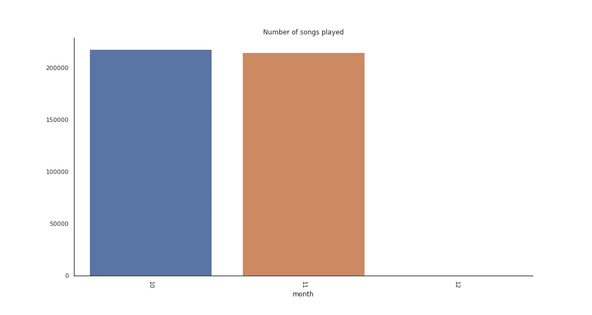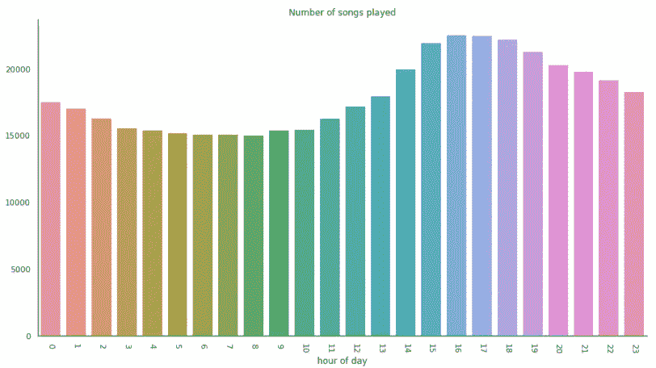

从上述图中观察到:

*   最常出现的动作是“NextSong”，这在用户使用该服务听音乐时是有意义的
*   纽约、纽瓦克、泽西城是这项服务的主要流量来源
*   出于某种奇怪的原因，用户代理通常都是 Mozilla
*   大多数事件在用户登录时发生
*   大多数活动来自男性
*   付费用户的活跃度是免费用户的四倍
*   在该数据集中，男性(250 人)多于女性(198 人)，共有 448 名用户
*   免费账户(370 个)多于付费账户(321 个)，总计 691 个。这个数字高于用户数，因为用户可以升级或降级。因此，如果用户更改了级别，同一用户将在该条形图中被计数两次
*   我们手头的数据是 2018 年最后 3 个月的

## 定义流失和识别流失用户

鉴于基于订阅的商业模式的性质，有两种类型的搅动者——从付费用户降级为免费用户的用户和通过删除其注册账户来完全停止用户服务的用户。

当用户将其级别从“付费”更改为“免费”时，会记录“提交降级”事件；当用户删除其帐户时，会记录“取消确认”事件。

虽然这两种类型的搅动器都会影响该服务的业务量，但删除账户的用户受到的损害更大。这是因为即使用户是通过广告的免费用户，该服务也能继续获得收入，而一旦用户删除了他们的账户，该服务就停止从该用户获得收入。

因此，我们将把这些删除账户的用户视为投机者。我们创建新的字段，首先标记取消事件，然后将所有活动标记为属于不愉快用户或不愉快用户。

在这种操作之后，我们已经确定了 99 个用户。

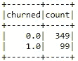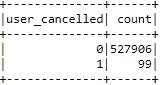

## 创建和比较易激动和非易激动用户的各种特征

在识别搅动器之后，在进行任何 EDA 之前，我将数据集分成训练和测试两个层次。

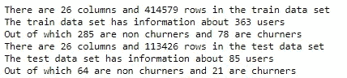

为了以一种可以输入到机器学习模型的格式来减少数据，我们聚合了几个特征，以便每个用户都有一个单独的行，标记为正在搅动或未搅动，以及几个工程特征。

设计了以下功能:

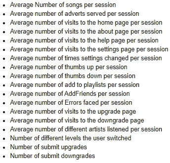

一旦这些特征被汇总，每一个特征都会在两组用户中进行比较——搅拌者和非搅拌者。

以下是一些重点内容:

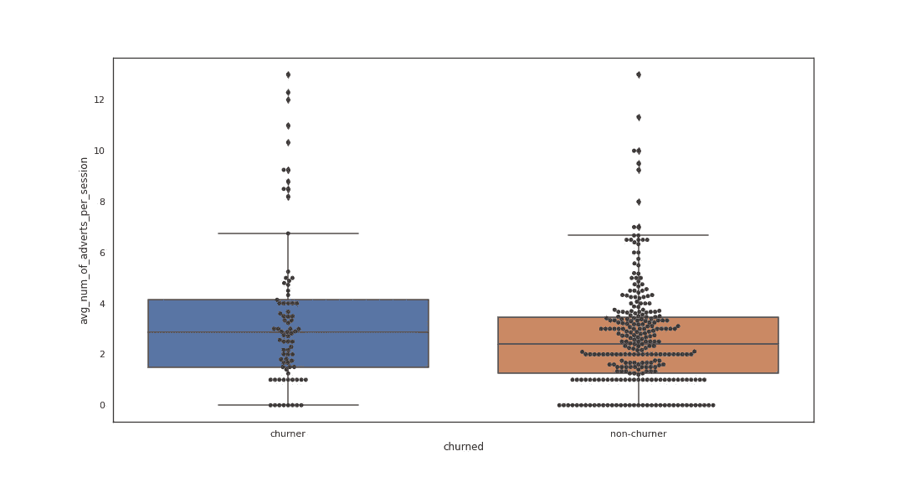

**churners get shown more number of adverts per session**

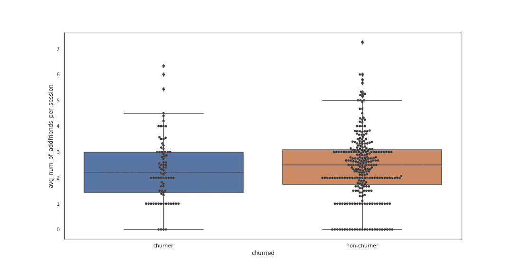

**non-churners add friends more frequently per session**

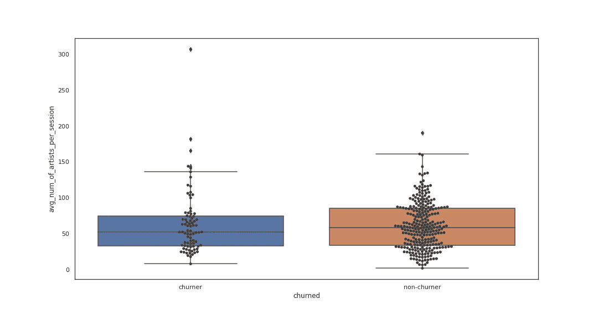

**non-churners listen to more number of artist per session**

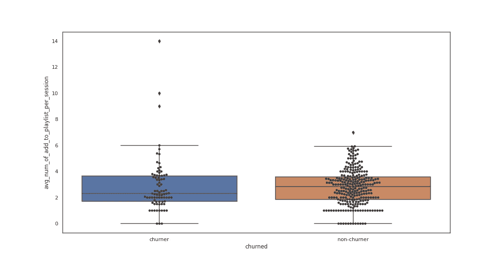

**non-churners add songs to their playlist more frequently per session**

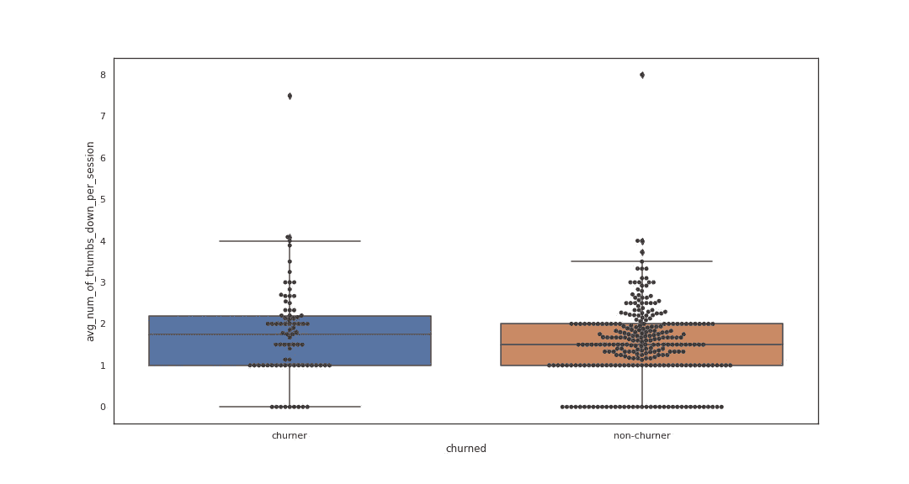

**churners hit the thumbs down button more frequently per session**

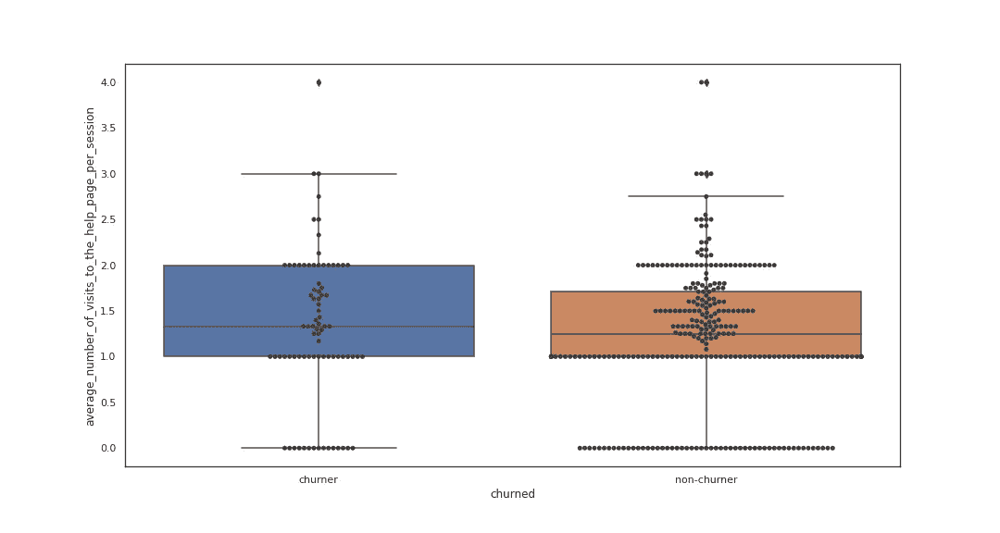

**churners visit the help page slightly more frequently per session**

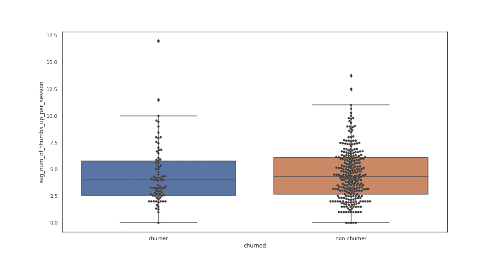

**non-churners use the thumbs up more frequently per session**

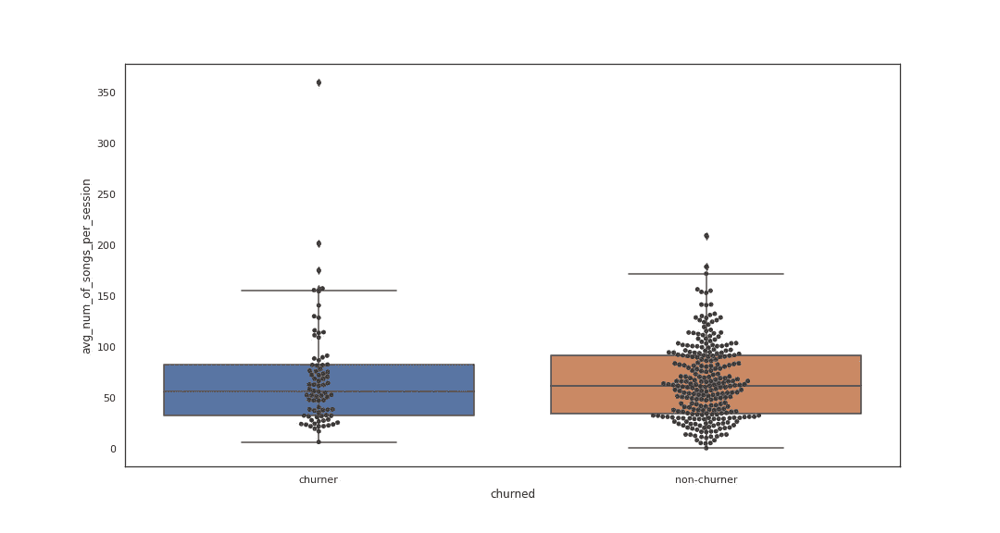

**non-churners listen to slightly more number of songs per session**

## **将这些特征聚集成机器学习的特征矩阵**

创建这些特征后，所有特征被组合成具有以下模式的特征矩阵:

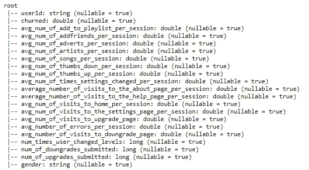

由于这些特征中有些是数字的，有些是类别的，进一步的预处理步骤执行如下:

*   使用最小-最大缩放技术缩放数字要素
*   唯一的分类栏“性别”是标签编码
*   所有的特征被组合成一个向量。这是 Spark 的 ML API 所期望的格式。

所有这些步骤被组合成流水线。

## 评估绩效的标准

在训练任何模型之前，我们必须决定用于衡量性能的指标。

这是一个二元分类问题，如下图所示，搅拌者的数量远远少于非搅拌者，

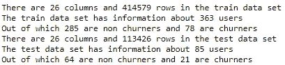

对于这种不平衡的数据集，选择合适的指标变得至关重要，因为一些指标可能会导致误导性的结论。

例如，通过简单地对多数类的所有观察值进行分类，很容易获得高**准确度分数**。

有不同的诊断工具帮助解释二元分类模型，AUC-ROC 是其中之一。这对于现有的不平衡数据集是一个很好的选择，也是比较不同分类器性能的一个很好的度量。

ROC 曲线:不同阈值的假阳性率(x)对真阳性率(y)的曲线图

true positive rate = true positives/(true positives+False Negatives)

假阳性率=假阳性/(假阳性+真阴性)

AUC-ROC:计算 ROC 曲线下的面积，以给出分类器模型的单一分数

分数是介于 0.0 和 1.0 之间的值。值为 0.5 表示模型无法区分这两个类别。

你可以在这里阅读更多关于这个[的内容。](https://machinelearningmastery.com/roc-curves-and-precision-recall-curves-for-imbalanced-classification/)

## 机器学习模型选择

Pyspark 提供了所有常用的 ML 算法。我们对以下内容进行了培训和比较:

*   逻辑回归
*   随机森林分类器
*   梯度增强树分类器
*   支持向量机分类器
*   决策树分类器
*   朴素贝叶斯分类器

交叉验证得分以及训练数据的 AUC-ROC 得分如下:

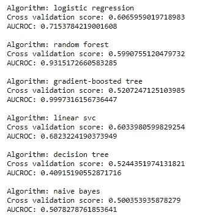

逻辑回归有最好的平均交叉验证分数。其次是线性 SVC。我们使用网格搜索对逻辑回归模型进行了超参数调整。

在以下参数中搜索了多个值，最佳模型的值为:

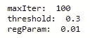

最佳模型的交叉验证分数仅略高，为 0.6184。最后在搁置测试数据集上对该模型进行了评估。0.5144 的 AUC-ROC 分数根本不乐观。

各种特征的系数如下所示:

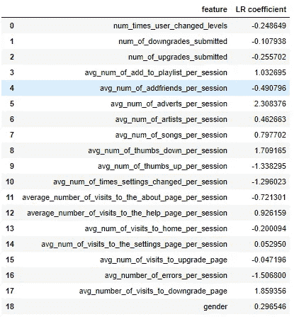

## 对训练模型性能的思考

模型的性能很差。它不能使用这些特征来学习两个分类标签之间的分离。出现这种情况的主要原因可能是:

*   不平衡的数据意味着模型没有足够的信息来学习搅动器和非搅动器的特征。有几种方法可以改善这种情况，如上采样、下采样和 SMOTE。
*   我们设计的功能对算法没有太大帮助。我们将不得不回到绘图板，并考虑其他功能。例如，还可以使用时间戳设计其他功能，这是我们在这个项目中没有做到的。
*   整个数据集的这个子集太小，模型无法了解任何有用的信息。使用完整数据集进行训练时，性能可能会有所不同。

# 结论

在这个项目中，我们着手解决一个名为“Sparkify”的虚拟音乐流媒体服务所面临的实际业务问题。可用的数据是“Sparkify”用户的事件日志。利用这些数据，我们试图识别出那些处于混乱边缘的用户。有了这些信息，企业就可以对客户流失采取预防措施。

整个数据集的大小为 12GB，符合大数据的条件，即整个数据集不再完全适合我们本地计算机的内存。因此，处理和分析该数据集需要支持分布式计算的工具。我们使用 Apache Spark 作为工具。然而，分析是使用较小的数据子集进行的，但是当在完全成熟的 Spark 集群上执行时，相同的代码可以用于完整的数据集。

虽然我们设计了几个有前途的功能，并格式化了数据，使其适合训练机器学习模型，但在这个项目中创建的最终模型表现不佳。这表明数据科学是一个迭代过程，最终结果并不总是令人眼前一亮。

尽管结果不尽如人意，但这个项目有很多很好的收获。最主要的是学习 Spark 并将其应用于实际问题的机会。

所有与这个项目相关的代码都可以在这里找到[。](https://github.com/vishnu-raju/sparkify-churn-prediction)