# 通过贝塔几何/负二项式分布(BG/NBD)和伽玛伽玛模型预测客户生命周期价值(CLTV)

> 原文：<https://medium.com/geekculture/predicting-customer-life-time-value-cltv-via-beta-geometric-negative-binominal-distribution-59be07ac30bd?source=collection_archive---------4----------------------->

在本文中，在解释了顾客终身价值和购买到死模型的历史之后，我将考察 BG/NBD 和 Gamma Gamma 模型，并做一个案例研究。在写这篇文章的时候，我受益于许多来源以及我自己的知识。你可以在参考文献部分查看。

# **1-简介**

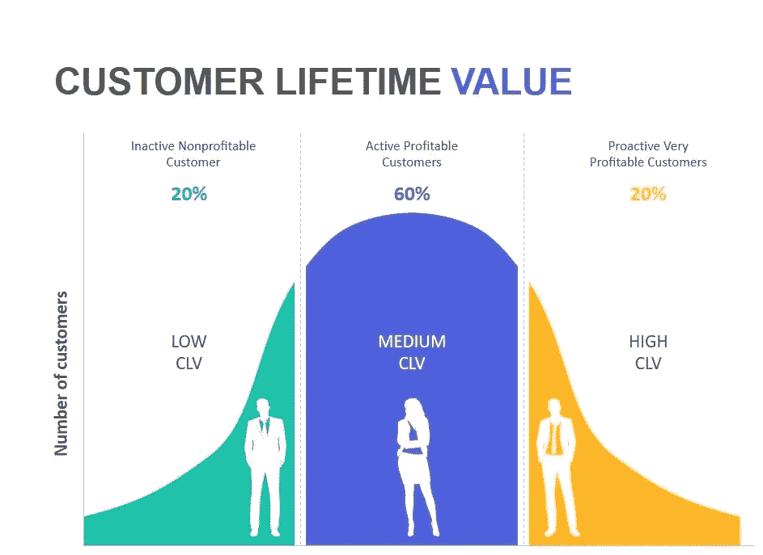

**客户终身价值**

CLTV 是对客户对你公司价值的一种衡量，不仅仅是基于单次购买，而是在整个关系中。概率寿命值估计是通过对某个 t 时间的时间预测来进行的。CLTV 是一个动态的概念，而不是一个静态的模型。

我们使用的最基本公式如下:

**CLTV =预期交易数*预期平均利润**

在本文中，我们将使用 BG/NBD 模型估计“预期交易数量”部分，使用 gamma gamma 模型估计“预期平均利润”部分。

在继续解释模型之前，我想先解释一下“买到死”的概念。我们实际上是用“买到死”的概念创建了 BG/NBD 模型。

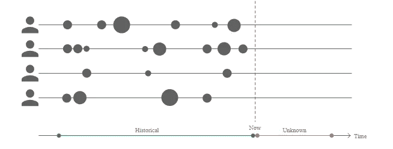

https://cloud.google.com/architecture/building-audiences-clv

**买到死型号**

购买到死模型将概率模型与历史交易数据进行拟合，以计算客户终身价值。BYTD 模型回答了这类问题:

有多少客户是活跃的？

从现在起一年后会有多少客户活跃？

哪些客户翻炒过？

未来任何客户对公司有多大价值？

**交易流程(买入)**

只要它处于活动状态，客户端在给定时间段内要执行的事务数量就服从泊松分布，并带有事务率参数。

换句话说，只要客户活着，他或她就会围绕自己的交易率继续随机购买。

每个客户的交易率各不相同，总体交易率呈伽玛分布。(r，α)

**辍学过程(直到你死)**

每个客户都有一个概率为 p 的退出率(退出概率)

客户在购买后有一定概率会流失。

每个客户的辍学率各不相同，总体呈贝塔分布。(甲、乙)

**历史**

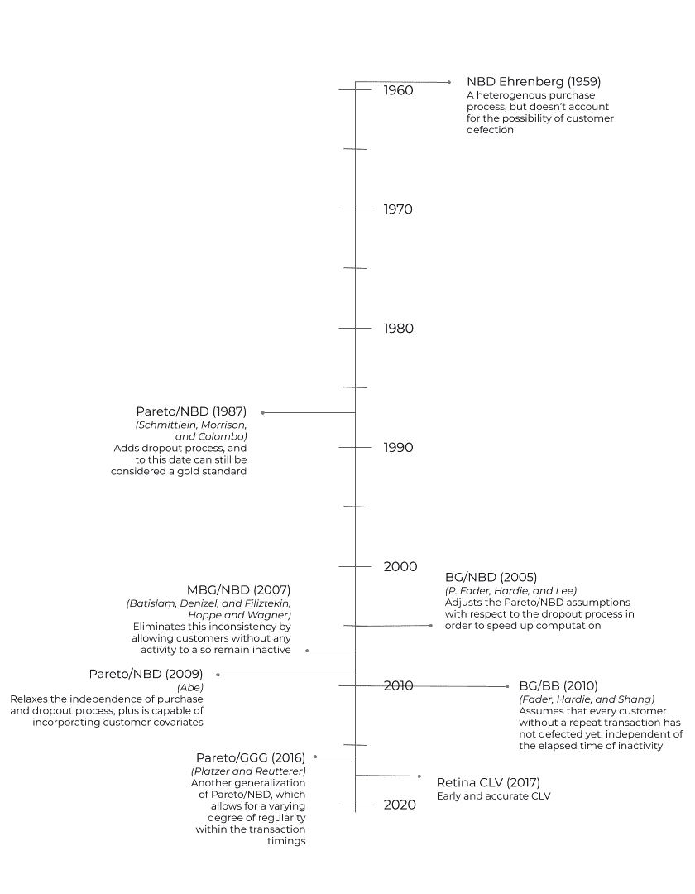

https://retina.ai/academy/lesson/history-of-buy-til-you-die-btyd-models/

NBD(埃伦贝尔，1959 年)

帕累托/NBD·施米特莱因，莫里森和科伦坡 1987)

BG/NBD (P. Fader、Hardie 和 Lee，2005 年)

马和刘(2007)

MBG/NBD·巴蒂斯拉姆、丹尼泽尔和菲利兹特金(2007 年)、霍普和瓦格纳(2007 年)

帕累托/NBD(阿部)

BG/BB(推子、哈迪和尚 2010)

帕累托/GGG·普拉茨和罗伊特勒(2016 年)

1959 年最初的 NBD 模型作为后来模型的基准，因为它是基于一个异质的购买过程。但是，NBD 没有考虑到客户流失。

下一个模型是 1987 年的帕累托/NBD 模型，它增加了一个异质的辍学过程，被认为是最好的“买到死”模型之一。

接下来，BG/NBD 模型调整假设以减少计算时间，并提供更强大的参数搜索。然而，这个模型假设没有重复交易的客户没有流失。

MBG/NBD 法案通过允许没有任何活动的客户保持不活动，消除了与前一个模型的不一致。

较新的 BG/CNBD-k 和 MBG/CNBD-k 模型通过考虑交易时间的规律性提高了预测的准确性。如果这种规律性存在，这些新模型可以产生更准确的客户预测。

马和刘(2007)以及阿部(2009)的帕累托/NBD 模型的变体利用 MCMC 模拟来允许更灵活的假设。第一个模型，帕累托/NBD (HB)是一个层次贝叶斯变体，它在坚持原始模型假设的同时测试了这种方法。第二种变化，帕累托/NBD (Abe)，可以纳入协变量。

帕累托/GGG 是帕累托/NBD 的第三种变体，它解释了交易时间的某种规律性。

# **2-Beta 几何/负二项式分布(BG/NBD)模型**

Fader、Hardie 和 Lee 提出了 BG/NBD 模型，作为帕累托/NBD 模型的替代方案。

工作的定位是，该模型产生与帕累托/NBD 非常相似的结果，同时更容易实现。

1.当处于活动状态时，客户在时间段 t 内进行的交易是均值为λt 的泊松分布

2.客户之间的交易率差异遵循γ分布，形状为 r，比例为α

3.在概率为 p 的每次交易之后，每个客户都变得不活跃

4.p 的差异遵循具有形状参数 a 和 b 的贝塔分布

应该是这样，我们捕捉整个人口的购买模式，然后找到一个模式，将个性化的购买这整个人口..

总之，它将从这些个体行为中学习群体行为，然后针对个体进行概率估计。

不要忘记以下几点:购买后，客户会部分流失。

BG/NBD 模型从概率上模拟了预期交易数量的两个过程。

***第一流程:*** 交易流程(买入)

***第二个过程:*** 辍学过程(直到你死)→成为流失者的过程

公式

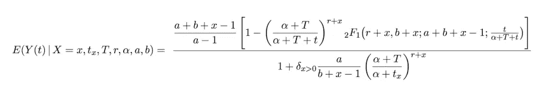

x →至少购买过两次的顾客的频率

tx →客户的最近值(必须为每个客户单独计算)

t→客户首次购买后的时间。公司客户的年龄。终身职位。

r，alfa →伽玛分布的客户参数之间的交易率差异

表示下降率的 a，b → Beta 分布参数

换句话说，x，tx，T 是个体的特征。

其结果是，它将在给出特定于个人的值和携带人口特征的值的同时，给出某个 t 周期内购买值的期望值。

根据我们将从总体中了解到的伽玛和贝塔分布，将估计出个体的特征以及在某个 t 时期的预期 y 值。

2F1 是高斯超几何函数

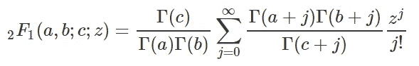

使用最大似然法估计 r、α、a、b。

**注释**

**伽玛分布**

伽玛分布是一个双参数连续概率分布族。指数分布、Erlang 分布和卡方分布是伽玛分布的特例。通常使用两种不同的参数化:

具有形状参数 k 和比例参数θ。

形状参数α = k，反比例参数β = 1/θ，称为速率参数。

在每种形式中，两个参数都是正实数。

伽马分布是最大熵概率分布

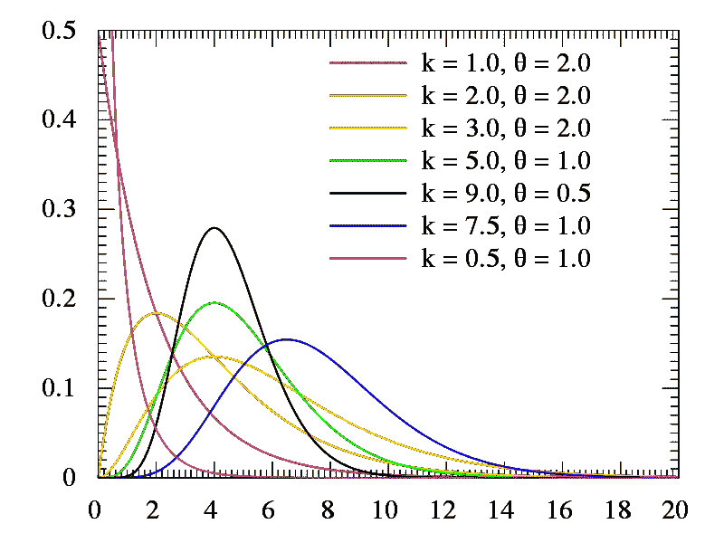

**贝塔分布**

贝塔分布是在区间[0，1]上定义的一族连续概率分布，区间[0，1]由两个正的形状参数参数化，用α和β表示，它们作为随机变量的指数出现并控制分布的形状。

贝塔分布已被广泛应用于各种学科中，用来模拟限于有限长度区间的随机变量的行为。

# **3-Gamma 伽马模型**

客户特定交易的货币价值围绕其平均交易价值随机变化。

平均交易价值因客户而异，但不会随任何特定个人的时间而变化。

平均交易值在客户中的分布与交易过程无关。

平均交易值在所有客户中呈伽玛分布。

公式:

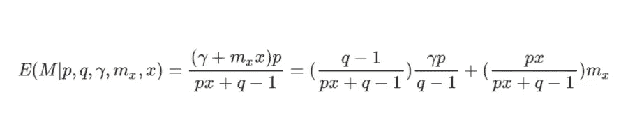

mx 和 x 参数来自用户

x →频率。经常性销售的次数(至少交易 2 次)

mx →货币。观察到的交易值。

p、q 和 y 是分布的参数

有了这些参数，就可以估算出预期的货币价值。

**4-CLTV BG/NBD &伽马伽马实施**

数据集:[https://archive.ics.uci.edu/ml/datasets/Online+Retail+II](https://archive.ics.uci.edu/ml/datasets/Online+Retail+II)

**属性信息:**

**发票号:**发票号。名义上。分配给每笔交易的 6 位整数。如果此代码以字母“c”开头，则表示取消。

**库存代码:**产品(项目)代码。名义上。一个 5 位数的整数，唯一分配给每个不同的产品。

**描述:**产品(物品)名称。名义上。

**数量:**每笔交易中每种产品(物品)的数量。数字。

**发票日期:**生效日期和时间。数字。生成交易的日期和时间。

**单价:**单价。数字。以英镑为单位的产品价格。

**客户号:**客户号。名义上。唯一分配给每个客户的 5 位整数。

**国家:**国家名称。名义上。客户居住的国家的名称。

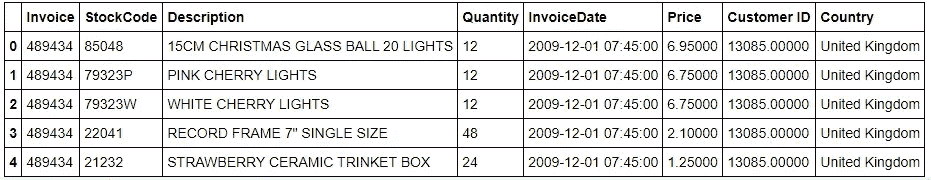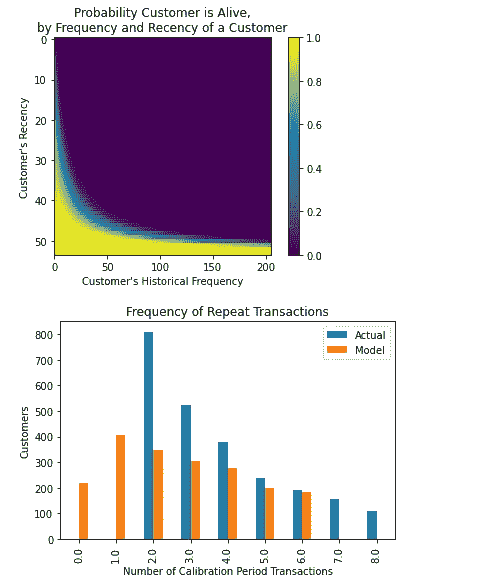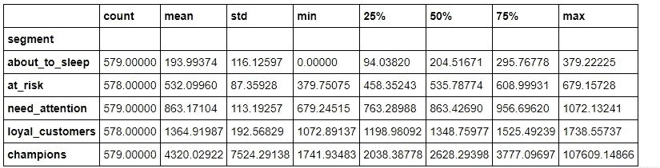

**5-模型验证**

我们需要将我们的模型与两套不同的交叉验证方法结合起来。

然后，我们将使用维持数据集作为生产数据，根据校准数据拟合新的血糖/NBD 模型，并比较维持期内重复购买的预测和实际数量。

在我的下一篇文章中，我将给出更多关于验证过程的详细信息。

# **6-增加客户终身价值**

**提供全天候支持**

客户总是希望立即到达公司。因此，应该建立一个基础架构来为客户提供每周 7 天、每天 24 小时的服务。应该尽快解决客户的问题，让客户满意。

**监控社交媒体**

在互联网普及的今天，通过社交媒体接触客户非常重要。应推广新产品和活动，如有必要，应单独处理有问题的客户。谨记风险，你的团队必须至少有一名员工专注于跟踪和回复社交媒体评论。

**推出忠诚度计划**

留住客户比获得新客户更容易，成本也更低。如果没有，应该创建一个顾客忠诚卡。这张卡可以是实体的，也可以是线上的。有了这张卡，顾客应该被鼓励收集星星或类似的物品，并鼓励更多的购物。折扣可以在客户生日或特殊日子定义。

**利用追加销售和交叉销售**

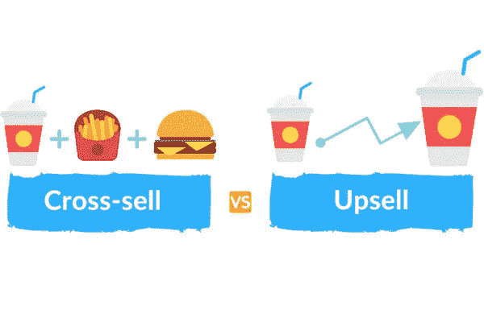

这似乎是一个传统的方法，但它仍然有效。通过鼓励客户向上销售或交叉销售，应提供比客户更多的资金。在这样做的时候，客户不应该感到受骗。

**监控反馈**

不应忽视客户的反馈。小问题会导致更大的问题。在互联网上，不良信息比良好信息传播得更快。没有人希望公司的名字被人恶意提及。因此，这个问题应该尽快解决。

# **7-结论**

随着互联网和零工经济的广泛使用，竞争现在达到了最高水平。在这个方向上，了解客户是非常重要的。众所周知，对于公司来说，获得新客户比留住现有客户的成本更高。由于这个原因，了解哪个客户将获得多少利润以及他们购物的频率是非常重要的。有必要正确计算这些价值，并接触到将被正确流失的客户。众所周知，有许多计算方法。在本文中，我想展示如何使用 BG/NBD 和 gamma gamma 模型进行计算。在正确的时间接触客户和正确计算一样重要。这些方法因公司而异。公司应该使用和实现他们自己的方法。感谢您阅读并花时间阅读我的文章。

**参考文献**

https://www.veribilimiokulu.com/

[https://retina . ai/academy/lesson/history-of-buy-til-you-die-btyd-models/](https://retina.ai/academy/lesson/history-of-buy-til-you-die-btyd-models/)

彼得·费德，布鲁斯·哈迪，李嘉乐。2008 年 12 月

[https://en.wikipedia.org/wiki/Gamma_distribution](https://en.wikipedia.org/wiki/Gamma_distribution)

[https://en.wikipedia.org/wiki/Beta_distribution](https://en.wikipedia.org/wiki/Beta_distribution)

彼得·法德尔，布鲁斯·哈迪。2013 年 2 月

[https://archive.ics.uci.edu/ml/datasets/Online+Retail+II](https://archive.ics.uci.edu/ml/datasets/Online+Retail+II)