# 基于递归神经网络的脑电数据情感预测

> 原文：<https://medium.com/geekculture/predicting-emotions-using-eeg-data-with-recurrent-neural-networks-8acf384896f5?source=collection_archive---------12----------------------->

## 关于 RNNs 如何工作的解释，以及我如何编写一个程序，可以使用脑电图数据预测情绪状态

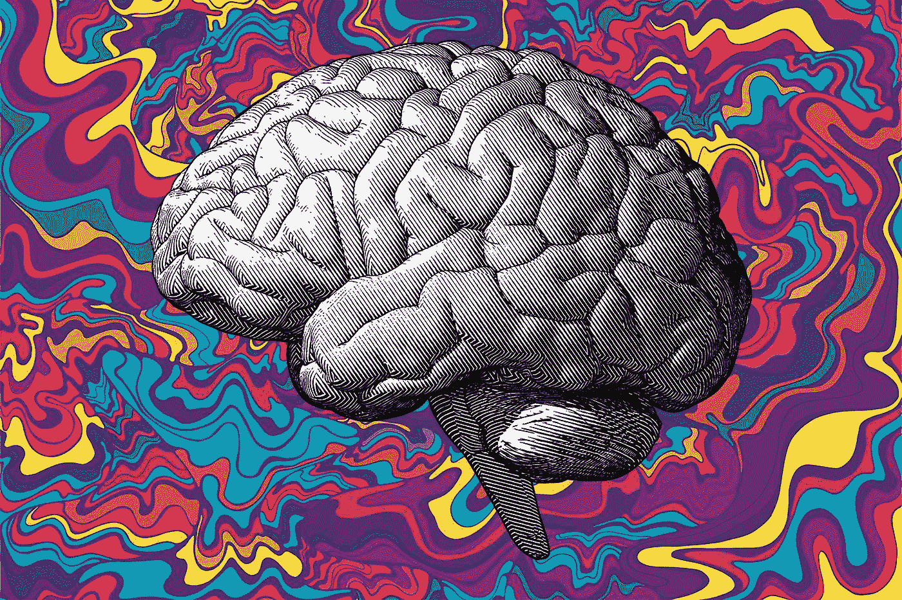

Source: JHU Hub

# 什么是脑电图？

脑电图(EEG)是一种非侵入性的方法，允许我们收集和记录我们大脑的电活动。

> 收集脑电图是通过在头皮表面放置电极来测量由神经元引起的电位，更具体地说是突触后电位，但只有当神经元簇一起放电时，它们才能提供足够的信号，从而使用 EEG 从头皮检测到。
> 
> 但是实际上记录的是最少两个电极位置之间的电压差(在大脑中)。应该同时记录这些电压差异，以便我们可以更好地理解和解释事件相关电位——这是一种特定感官、认知或运动事件的直接结果，是测得的大脑反应。
> 
> 收集的 EEG 数据由大脑的节律活动组成，反映了内部发生的神经振荡。这些神经振荡由神经元之间的相互作用驱动，并以特定的频率发生——这些频率包括δ、θ、α、β和γ。研究发现，这些节律与不同的大脑状态之间存在关联，如下图所示。

这个项目的目标是找出我们是否可以使用机器学习来根据一个人的脑电波辨别积极、中立或消极的情绪状态。

使用 Muse EEG 头带收集数据，该头带通过干电极从两个受试者(1 男 1 女)的 TP9、AF7、AF8 和 TP10 位置读取数据，每个状态持续 3 分钟:阳性、中性(静息状态)、阴性。以下电影场景被用作激发积极和消极情绪的刺激:

1.  马利和我——负面(二十世纪福克斯)
    *死亡场景*
2.  Up — Negative(华特迪士尼影业)
    *开场死亡场景*
3.  小丫头—负(想象娱乐)
    *葬礼现场*
4.  啦啦地—正面(巅峰娱乐)
    *开场音乐编号*
5.  慢生活——正面(BioQuest Studios)
    *自然延时*
6.  搞笑狗—正面(MashupZone)
    *搞笑狗片段*

# 什么是 RNN？

尽管您可能不确切知道什么是递归神经网络(RNN ),但您很可能正在使用不断利用 RNNs 的应用程序。例子包括 Siri，它使用 RNNs 进行语音识别，或者手机键盘上的预测文本功能，甚至股票价格预测。

但是什么是递归神经网络呢？递归神经网络或 RNN 是一种人工神经网络，旨在识别给定数据集的顺序特征和模式，然后可用于预测下一个可能的场景。

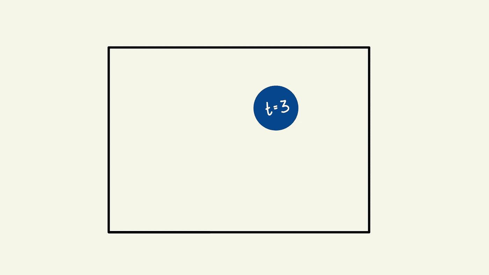

为了理解 RNNs 背后的概念，我们来看一个简单的例子。上图是一个球在空中飞行的快照，参考时间(t=3)。仅用提供的图表，你能预测球将继续飞行的方向吗？你可以猜一猜，但这是一个完全随机的猜测，只能和另一个随机的猜测一样好。

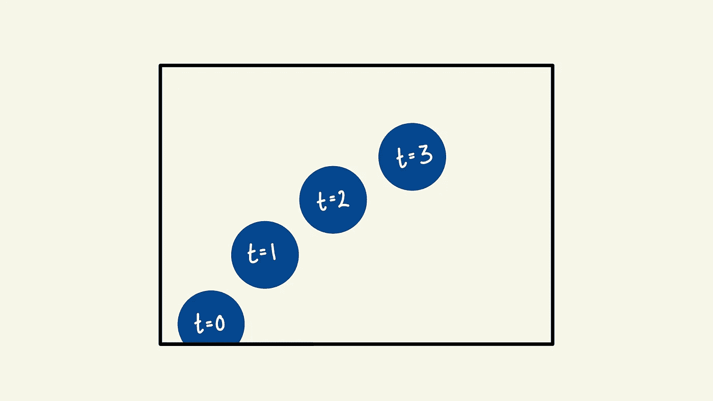

然而，假设我连续给你几张快照，参考时间，你认为你能做出更好的猜测吗？希望你的答案是肯定的，那是因为现在你已经知道球在哪里，它去了哪里，因此，你现在也有足够的数据来预测它会去哪里。这就是我们所说的顺序数据，其中数据的顺序很重要，即球的当前位置取决于球的先前位置。这只是序列数据的一个例子，其他的包括音频，文本串，甚至脑电图数据。

那么，让我们来看看更技术性的方面，rrn 是如何构建和设计的，以便能够做到这一点？让我们将其与常规神经网络进行比较，或者称为前馈神经网络。前馈神经网络由输入层、隐藏层和输出层组成，它将信息从每一层传递到下一层。但是我们如何重新设计它，使它能够解释以前的信息和现在的信息呢？这是通过向这个神经网络添加一个循环来传递以前的信息来实现的，这基本上就是 RNN 所做的。RNN 有一种循环机制，允许信息重新进入隐藏层，这种信息称为隐藏状态，它是所有先前输入的表示。

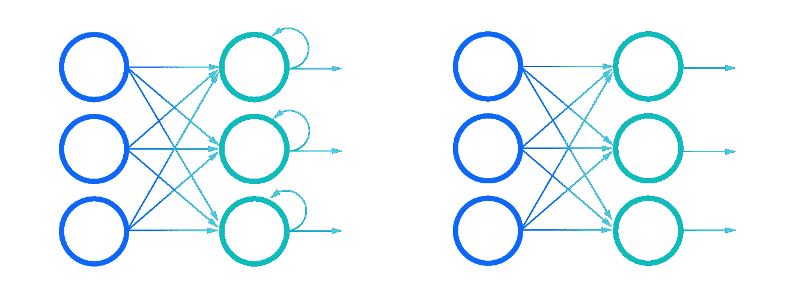

RNN (left) vs Feed foorward NN (right) Source: IBM

然而，rnn 遭受由臭名昭著的消失梯度问题引起的短期记忆，该问题在使用基于梯度的学习方法和反向传播的神经网络中占主导地位。让我们来看看这是如何发生的:

训练前馈神经网络的第一步是向前传递并进行预测，然后使用损失函数将该预测与地面真实情况进行比较，然后返回误差值。该误差值是神经网络表现有多差的指示，然后用于执行反向传播以计算神经网络的每个节点的梯度，从最接近输出层的层的节点开始，并返回到第一个隐藏层。

梯度是测量相对于误差变化的权重变化的值；这是用来调整网络的内部权重，让网络学习，梯度越大，模型学习的速度越快，这里就出现了消失梯度问题。

在反向传播期间，每个节点相对于前一层中的梯度效果的梯度来计算其梯度。因此，如果前一层的梯度很小，当前梯度的变化会更小，这对网络的其余部分产生多米诺骨牌效应，导致梯度消失，因此称为消失梯度问题。随着梯度越来越小，权重的变化也越来越小，这意味着模型也将学习得越来越慢——对减少损失函数产生的误差值没有太大作用。

现在，让我们回到 RNNs，RNNs 使用一种称为“时间反向传播”的反向传播形式，它本质上是为 RNNs 量身定制的，将每个环路视为一个隐藏层，在这里，梯度值将随着它在每个环路中的传播而呈指数级收缩。由于梯度消失，RNN 无法从更远的层/回路中学习依赖性，这意味着如果数据集足够大，在进行预测时，有可能不考虑脑电图数据的早期片段，从而使我们的模型具有短期记忆。

## 解答:GRU——什么是 GRU？

那么我们能对 RNN 的短期记忆做些什么呢？为了解决这个问题，产生了两种专门的 rnn:LSTM(长短期记忆)和 GRU(门控循环单元)。

这些神经网络的工作方式与 RNN 完全一样，但是，它们使用这些被称为“门”的机制，这允许它们学习长期依赖性，而不像常规的 RNN。这些“门”本质上是不同的张量运算，可以学习向隐藏状态添加或删除哪些信息——因为这种能力，短期记忆对他们来说不是问题。

# 利用脑电图建立 RNN 预测情绪

## 导入库

好了，现在你知道什么是 EEG 和 RNNs，让我们看一下代码，了解如何将这两者结合起来，以便我们能够预测受试者的情绪状态，给定他们的 EEG 读数。

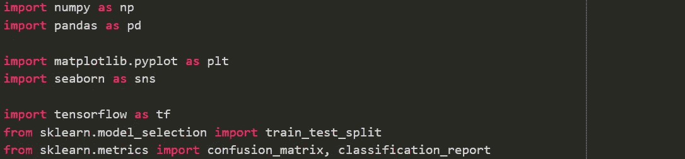

Importing libraries

首先，我们将导入这个程序需要的库。

*   Numpy 和 Pandas:用于数据操作和处理
*   Matplotlib 和 Seaborn:用于数据可视化，以便我们可以更好地理解数据，熟悉我们正在处理的东西
*   Tensorflow 和 train_test_split:用于机器学习本身和准备数据
*   混淆矩阵和分类报告:检查模型的性能

## 理解数据

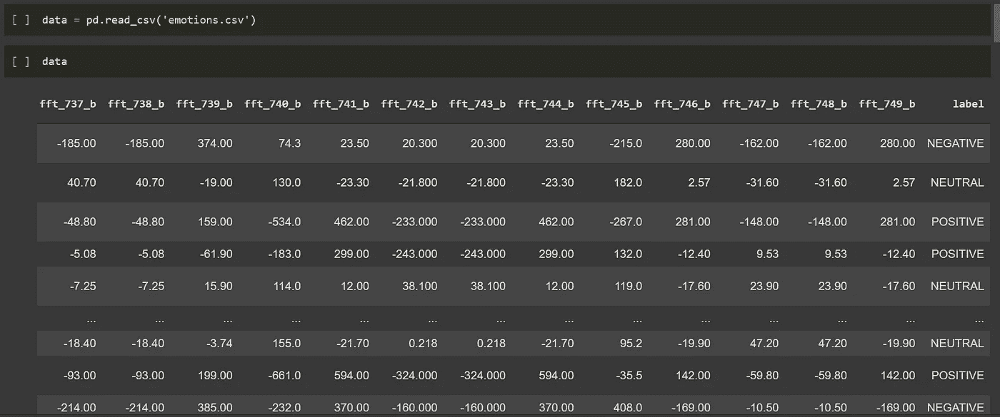

Loading and displaying the data

因此，如果我们看看这里的数据，我们可以在最末端看到一个标签栏，它代表受试者的情绪状态，可以分为中性、消极或积极，这是我们将尝试用递归神经网络预测的。

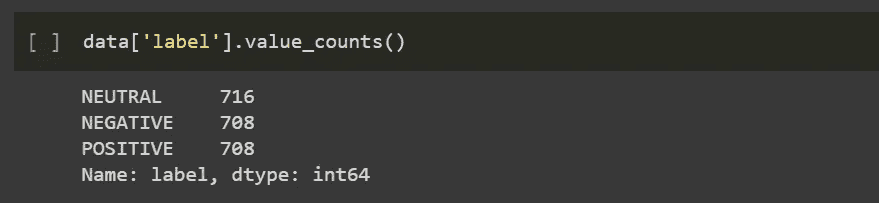

Finding value counts of the label column

然后我们调用标签列上的值计数函数。这用于查看我们标签的类别分布，以确保数据中表示的类别数量不存在不平衡，这会对我们神经网络的训练产生影响，正如您所见，它们都相当平衡，范围在 708 和 716 之间。

## 预处理数据

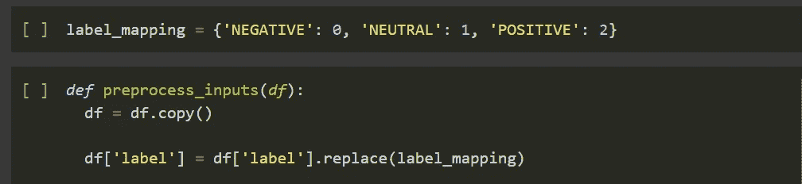

Enumerating classes

接下来我们有预处理功能，这是我们准备数据通过我们的神经网络。

标签列中的中性类、负类和正类是我们对数据进行分类的一个例子，它被定义为“可以分组的数据类型”

所以我们要做的是枚举每一个类，以便计算机能够理解它。这是通过使用字典“label_mapping”来完成的——它从标签列中取出每个值，并用字典中定义的相应数字来替换它。基本上每个负数都将被替换为 0，每个中性词都将被替换为 1，每个正数都将被替换为 2。

Preprocessing

现在，我们将把标签列从其余数据中分离出来，因为标签列本身的值就是我们试图用 RNN 预测的值。标签列将存储在 y 中，剩余的数据存储在 X 中。将标签列(y)视为测验(X)的答题卡，您不会在学生参加测验时给他们答题卡，否则他们只会记住答案，而不是学习如何自己获得答案-答题卡在测验后给出，以将学生的答案与实际答案进行比较并做出改进。

我们的下一步是将数据分成训练组和测试组，将 train_size 设置为 0.7，我们的训练组将包含所有数据的 70%。这个函数还会自动为您打乱数据，这就是为什么我们将 random_state 设置为 123，以确保每次运行这个函数时，数据都以完全相同的方式被打乱。坚持测验类比，X_train 和 y_train 是练习测验及其答案，而 X_test 和 y_test 是实际测验及其答案。

## 模拟 RNN

接下来是我们模拟神经网络的部分。如前所述，我们将使用递归神经网络，因为我们有时间序列数据，使用 RNN 很重要，因为数据中的值不一定是独立的，而是与之前和之后的值相关联。

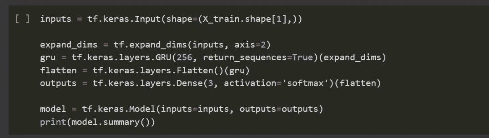

Structure of RNN

因此，我们将使用 GRU，而不是像在前馈神经网络中那样使用密集层。我们将使用 256 个单元，并将 return sequences_turned 设置为 True，因为 return_sequences 处于打开状态，所以它基本上会以二维数组的形式为我们提供更多数据，这通常会提高性能，因为显然有更多数据，但是，因为它现在在一个数组中输出数据，所以我们必须将其从二维数组展平为一个长的一维向量。

还有一点我需要提一下，GRU 层要求输入是三维的，这是因为通常输入的每一位数据本身都被编码为矢量，因此它需要第三维，为了补偿这一点，我们将获得一个 expand_dims 层，它接收输入并沿轴 2 扩展维度，从而获得第三维。因此，此 expand_dims 图层将被传递到 GRU，然后我们将把来自 GRU 的输出传递到 flatten，然后将 flatten 的输出传递到 outputs，这是我们的 RNN 的输出图层。

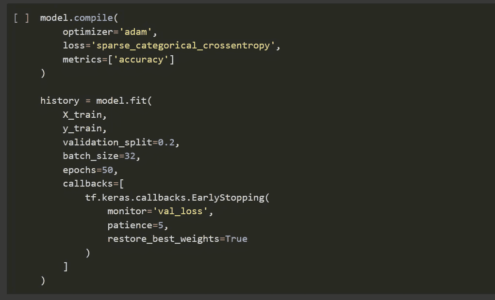

Compiling the model

这是我们编译模型的地方——我们使用 adam 优化器，以及 sparse _ categorical _ crossentropy，它最适合于像我们这样的多分类问题。一旦我们训练了这个模型，我们就把它的结果存储在历史中。因此，我们将通过 X_train 和 y_train，验证拆分为 20%，批大小为 32，这是在更新内部模型参数之前要处理的样本数，以及 50 个时期，这是整个训练数据集将通过模型的次数。我们实际上不需要这么多的纪元，因为我们将采用提前停止回调。这将允许模型在每个时期之后查看验证损失，并且它将评估损失是否在改善，并且如果在指定数量的时期内没有改善，我们在这里指定为 5，那么它将停止训练并且从最佳时期恢复权重。

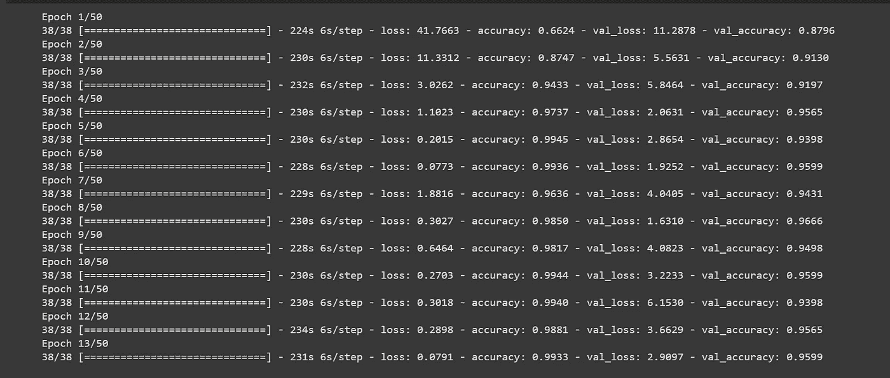

## 结果

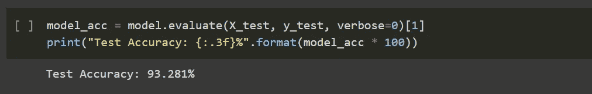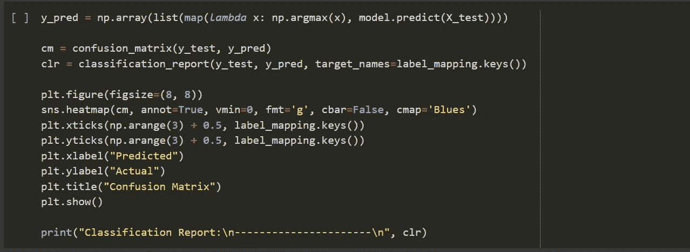

Code for the confusion matrix and classification report

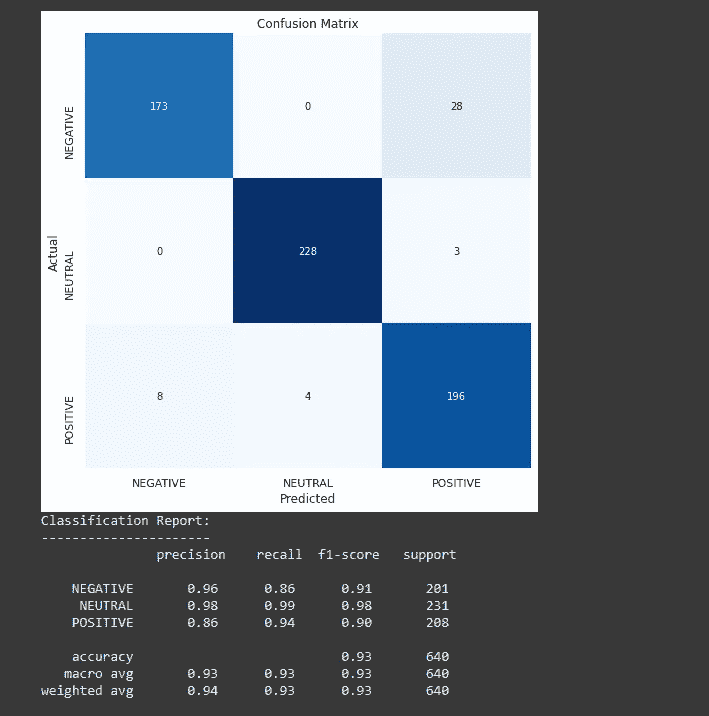

Confusion matrix and classification report

那都是乡亲们！希望你们都喜欢，如果你们留下了一些掌声，请跟我来！如果你有任何问题，请随时提出。代码和数据集可以在我的 [GitHub](https://github.com/maz-13/emotions) 上找到！

大家好，我是 Mir Ali，今年 17 岁，是知识社会(TKS)的一名人工智能和神经技术开发人员和创新者，致力于利用新兴技术解决世界上最大的问题。作为一名作家，请加入我的旅程，因为我通过从事迷人的项目来发展我的知识和技能，以影响未来的数十亿人。