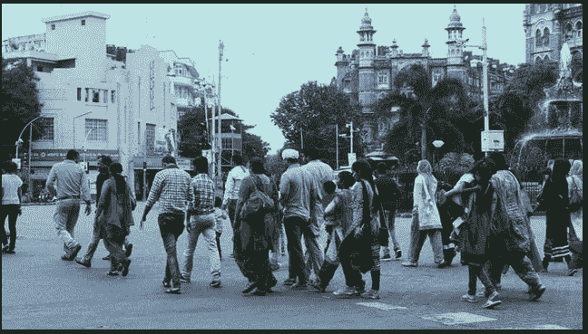

# 使用机器学习预测人类迁移

> 原文：<https://medium.com/geekculture/predicting-human-migration-using-machine-learning-548aa902d0ca?source=collection_archive---------8----------------------->

*"* 移民表达了人类对尊严、安全和更美好未来的渴望。它是社会结构的一部分，是我们人类大家庭构成的一部分

*—潘基文*

**

*Photo by [Sumit](https://unsplash.com/@5pacey?utm_source=unsplash&utm_medium=referral&utm_content=creditCopyText) on [Unsplash](https://unsplash.com/s/photos/human-migration?utm_source=unsplash&utm_medium=referral&utm_content=creditCopyText)*

***人类迁徙***

*人口迁移可以定义为人们从一个地方到另一个地方定居的运动，或者…*