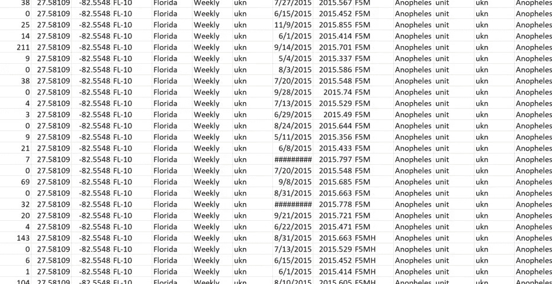
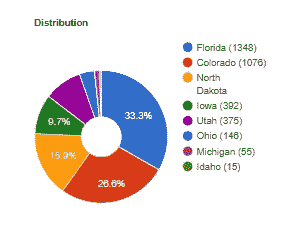
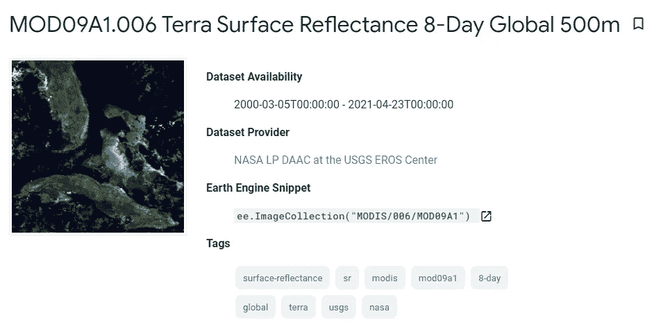
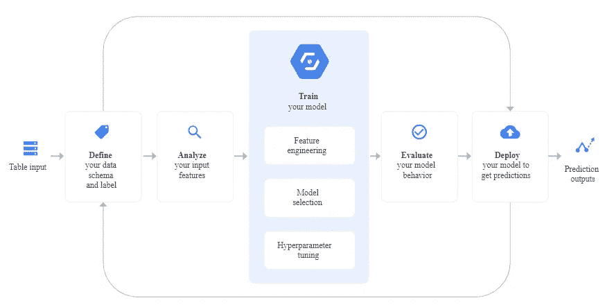
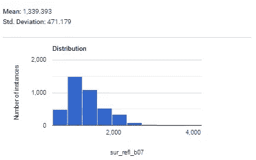
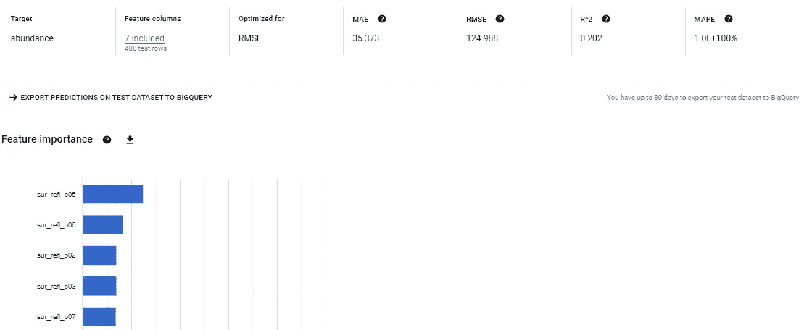
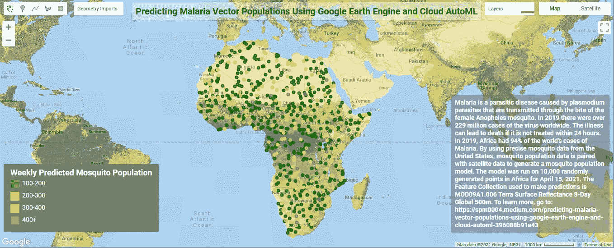

# 使用谷歌地球引擎和云自动模型预测疟疾媒介种群

> 原文：<https://medium.com/geekculture/predicting-malaria-vector-populations-using-google-earth-engine-and-cloud-automl-396088b91e43?source=collection_archive---------14----------------------->

## 使用来自卫星影像的结构化数据生成机器学习模型的工作流


Photo by [Annie Spratt](https://unsplash.com/@anniespratt?utm_source=medium&utm_medium=referral) on [Unsplash](https://unsplash.com?utm_source=medium&utm_medium=referral)

疟疾是一种寄生虫病，由疟原虫寄生虫引起，通过雌性按蚊的叮咬传播。2019 年，全球有超过 2.29 亿例病毒病例。如果不在 24 小时内治疗，这种疾病会导致死亡。通过使用美国的精确蚊子数据，蚊子数量数据可以与遥感数据配对，以生成一个可在世界任何地方使用的蚊子数量模型。2019 年，非洲占全球疟疾病例的 94%。

首先，你需要一个谷歌地球引擎账户、一个谷歌云平台账户和一个标准的谷歌电子邮件账户来访问谷歌驱动。幸运的是，你不需要为这个工作流程下载任何软件。


Photo by [Mitchell Luo](https://unsplash.com/@mitchel3uo?utm_source=medium&utm_medium=referral) on [Unsplash](https://unsplash.com?utm_source=medium&utm_medium=referral)

# 蚊子

首先，我们将下载由一组研究人员编辑的蚊子数据，他们试图创建一个国家病媒数据库。[这里的](https://www.biorxiv.org/content/10.1101/096875v4)是链接。这些数据来自全国各地的地方、州和联邦政府的捕蚊器。有超过 200，000 行的陷阱数据。在这个例子中，我们将过滤 2015 年按蚊的数据；还会剩下大约 4000 行。每一行都有显示陷阱位置的纬度和经度坐标。



The mosquito data used in this workflow. Image by author.

数据分布在八个州。



Data distribution by state. Image by author.

# 卫星数据



From the Earth Engine data catalog. Image by author.

对于这个工作流程，我们将使用谷歌地球引擎提取每个蚊子诱捕点的卫星数据。因此，数据集必须在[谷歌地球引擎数据目录](https://developers.google.com/earth-engine/datasets)中可用。任何全球数据集都可以用于此，但本例选择了 MODIS [Terra 地表反射率 8 天全球 500 米](https://developers.google.com/earth-engine/datasets/catalog/MODIS_006_MOD09A1)。你可能会问“为什么是 MODIS 而不是 Sentinel 或 Landsat？它们不是更高的分辨率吗？”是的，他们是。选择 MODIS 8 天的原因是因为 LP DAAC 生成的 8 天合成图像通常非常接近无云。Landsat 的时间频率(重访时间)为 16 天，即使这样图像也可能有云。Sentinel 2 数据可用性从 2017 年开始，我们的数据来自 2015 年。最后，MODIS 8 天 500 米是该项目的最佳选择，因为我们将缓冲我们的点并提取平均值，因此空间分辨率并不重要。我们将使用所有 7 个波段，而不是使用 NDVI 等指数。更多的数据通常最适合机器学习。

## 谷歌地球引擎

谷歌地球引擎是地理空间分析和可视化的强大工具。如果在此工作流程中没有 Earth Engine，则需要下载每幅图像来提取其值。

## 将以下代码复制并粘贴到 Earth Engine 中:

第一块代码定义了缓冲点和提取波段值的函数。

```
function bufferPoints(radius, bounds) {
 return function(pt) {
 pt = ee.Feature(pt);
 return bounds ? pt.buffer(radius).bounds() : pt.buffer(radius);
 };
}function zonalStats(ic, fc, params) {
 // Initialize internal params dictionary.
 var _params = {
 reducer: ee.Reducer.mean(),
 scale: null,
 crs: null,
 bands: null,
 bandsRename: null,
 imgProps: null,
 imgPropsRename: null,
 datetimeName: ‘datetime’,
 datetimeFormat: ‘YYYY-MM-dd HH:MM:ss’
 };// Replace initialized params with provided params.
 if (params) {
 for (var param in params) {
 _params[param] = params[param] || _params[param];
 }
 }// Set default parameters based on an image representative.
 var imgRep = ic.first();
 var nonSystemImgProps = ee.Feature(null)
 .copyProperties(imgRep).propertyNames();
 if (!_params.bands) _params.bands = imgRep.bandNames();
 if (!_params.bandsRename) _params.bandsRename = _params.bands;
 if (!_params.imgProps) _params.imgProps = nonSystemImgProps;
 if (!_params.imgPropsRename) _params.imgPropsRename = _params.imgProps;// Map the reduceRegions function over the image collection.
 var results = ic.map(function(img) {
 // Select bands (optionally rename), set a datetime & timestamp property.
 img = ee.Image(img.select(_params.bands, _params.bandsRename))
 .set(_params.datetimeName, img.date().format(_params.datetimeFormat))
 .set(‘timestamp’, img.get(‘system:time_start’));// Define final image property dictionary to set in output features.
 var propsFrom = ee.List(_params.imgProps)
 .cat(ee.List([_params.datetimeName, ‘timestamp’]));
 var propsTo = ee.List(_params.imgPropsRename)
 .cat(ee.List([_params.datetimeName, ‘timestamp’]));
 var imgProps = img.toDictionary(propsFrom).rename(propsFrom, propsTo);// Subset points that intersect the given image.
 var fcSub = fc.filterBounds(img.geometry());// Reduce the image by regions.
 return img.reduceRegions({
 collection: fcSub,
 reducer: _params.reducer,
 scale: _params.scale,
 crs: _params.crs
 })
 // Add metadata to each feature.
 .map(function(f) {
 return f.set(imgProps);
 });
 }).flatten().filter(ee.Filter.notNull(_params.bandsRename));return results;
}
```

接下来，我们将对每个点进行 50 米的缓冲，对于每个点，对于 2015 年的每个影像(稍后我们将找到每个点的正确影像)，计算所有 7 个 MODIS 波段在缓冲区内的平均波段值，并将其记录在缓冲区多边形内。

```
var pts = ee.FeatureCollection(‘users/spm0004/Mosquitos_Anopheles_2015’);var ptsModis = pts.map(bufferPoints(50, true));var modisref = ee.ImageCollection(‘MODIS/006/MOD09A1’)
 .filterDate(‘2015–01–01’, ‘2016–01–01’)
 .filter(ee.Filter.calendarRange(0, 365, ‘DAY_OF_YEAR’));

// Define parameters for the zonalStats function.var paramsref = {
 reducer: ee.Reducer.median(),
 scale: 500,
 crs: ‘EPSG:5070’,
 bands: [‘sur_refl_b01’, ‘sur_refl_b02’, ‘sur_refl_b03’,’sur_refl_b04',’sur_refl_b05',’sur_refl_b06',’sur_refl_b07'],

 datetimeName: ‘date_MODIS’,
 datetimeFormat: ‘MM/dd/YYYY’
};// Extract zonal statistics per point per image.
var ptsModisStats = zonalStats(modisref, ptsModis, paramsref);print(ptsModisStats.limit(50));
```

最后，我们将把蚊子多边形点缓冲区(现在与 MODIS 波段相结合)导出到 Google drive。

```
Export.table.toDrive({
 collection: ptsModisStats,
 folder: ‘Malaria’,
 description: ‘Mosquitos_NorthAmerica’,
 fileFormat: ‘CSV’
});
```

这一工作流程的结果将是一个模型，该模型将能够根据 7 个 MODIS 波段预测世界任何地方的蚊子数量。让我们在非洲随机生成 10，000 个点来看看模型的运行。为了简单起见，在 Earth Engine 中通过追踪非洲大陆绘制了一个非洲多边形。

```
var geometry1=ee.FeatureCollection(Africa);var pts2 = ee.FeatureCollection.randomPoints(geometry1, 10000)//randomly generating 10000 points within the outlinevar ptsModis2 = pts2
var ptsModis3 = pts2.map(bufferPoints(50, true));var modisref2 = ee.ImageCollection(‘MODIS/006/MOD09A1’)
 .filterDate(‘2021–04–10’, ‘2021–04–27’) //change this to the past 8 days
 .filter(ee.Filter.calendarRange(0, 365, ‘DAY_OF_YEAR’));var paramsref2 = {
 reducer: ee.Reducer.median(),
 scale: 500,
 crs: ‘EPSG:5070’,
 bands: [‘sur_refl_b01’, ‘sur_refl_b02’, ‘sur_refl_b03’,’sur_refl_b04',’sur_refl_b05',’sur_refl_b06',’sur_refl_b07'],

 datetimeName: ‘date_MODIS’,
 datetimeFormat: ‘MM/dd/YYYY’
};// Extract zonal statistics per point per image.
var ptsModisStats2 = zonalStats(modisref2, ptsModis2, paramsref2);print(ptsModisStats2.limit(50));Export.table.toDrive({
 collection: ptsModisStats2,
 folder: ‘Malaria’,
 description: ‘Africa’,
 fileFormat: ‘CSV’
});Map.addLayer(pts2, {color: ‘white’}, ‘geodesic polygon’);
```

## 清理数据

下一步涉及对影像和点进行分类，以便每个点都使用在收集陷阱后不到 8 天内收集的影像(目前每个陷阱都有 2015 年每个影像的数据)。为此，我们将使用 Google Colab。Google Colab 是一款完全在线操作的 Jupyter 笔记本，无需下载。作为一个额外的好处，它与您的 Google drive 帐户相关联，这是我们的数据所在的位置。以下 python 代码将提取每个点的正确图像。

```
from google.colab import drivedrive.mount(“/content/drive”)from google.colab import authimport pandas as pdimport numpy as npimport randomfrom datetime import datetimedate_format = “%m/%d/%Y”modisdf=pd.read_csv(r’/content/drive/MyDrive/Mosquitos_Anopheles_2015.csv’)modisdf[‘date’] = pd.to_datetime(modisdf[‘date’], format=date_format, errors=’ignore’)modisdf[‘date_MODIS’] = pd.to_datetime(modisdf[‘date_MODIS’], format=date_format, errors=’ignore’)modisdf[‘Difference’] = (modisdf[‘date_MODIS’] — modisdf[‘date’])modisdf[‘Difference’]=modisdf[‘Difference’].dt.daysmodisdf[‘Difference’]=pd.to_numeric(modisdf[‘Difference’])df = modisdf[modisdf[‘Difference’] > -1]modisdf = df[df[‘Difference’] < 8]modisdf=modisdf.drop([‘system:index’, ‘.geo’], axis=1)modisdf=modisdf.reset_index()print(modisdf.columns)modisdf.to_csv(r’/content/drive/MyDrive/Mosquitos_Anopheles_2015_cleaned.csv’)
```

## 谷歌云汽车



Google Cloud AutoML Tables worklow. Image by author.

现在是创建模型的时候了。多亏了 Cloud AutoML，这项任务变得简单了。Cloud AutoML 是谷歌云平台上的一项服务，旨在让任何人都可以在工作中轻松使用机器学习。对于给定的数据，它实际上同时尝试多个模型来确定特定数据集的最佳匹配。首先，你需要在你的谷歌云平台账户中启用 Cloud AutoML API。接下来，创建一个新的数据集，并上传“干净的”。在 Colab 中生成的 csv。加载后，您就可以选择预测列了。您可以单击这些列，以图表的形式查看每列中唯一变量的百分比。



Data distribution for band 7\. Image by author.

我们将使用“丰度”列。选择预测列后，AutoML 将填充每个列和目标列之间的 cramér V 相关性统计信息，以帮助您决定要在模型中包含哪些列。我们将使用来自地球引擎的 7 个 MODIS 波段。默认情况下，80%的数据行用于训练，10%用于验证，10%用于测试。点击“培训模式”，选择 7 个级别作为输入特征，然后输入培训预算时数。培训至少需要 2 个小时，但完成后您会收到一封电子邮件。



Google Cloud AutoML model. Image by author.

对模型满意后，点击“测试并使用”“在线预测”，然后点击“部署模型”。一旦模型部署完毕，我们将使用非洲上空的 10，000 个随机点进行预测。

## 最终产品



The Google Earth Engine App. Image by author.

查看[地球引擎应用](https://spm0004.users.earthengine.app/view/predicting-malaria-vector-populations-in-africa):

 [## 预测非洲疟疾病媒的数量

spm0004.users .地球引擎. app](https://spm0004.users.earthengine.app/view/predicting-malaria-vector-populations-in-africa)