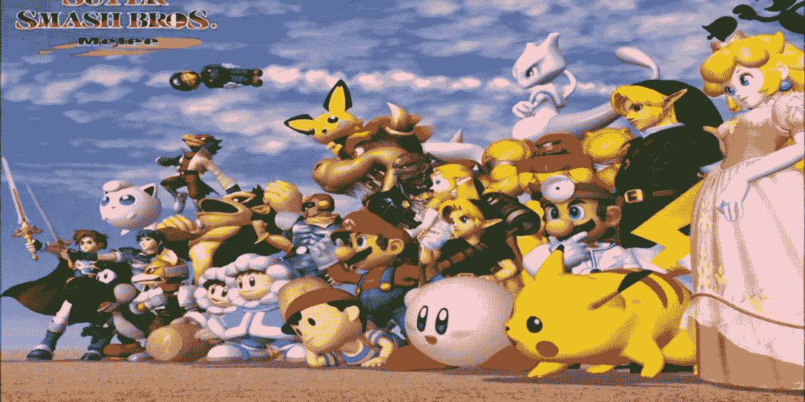
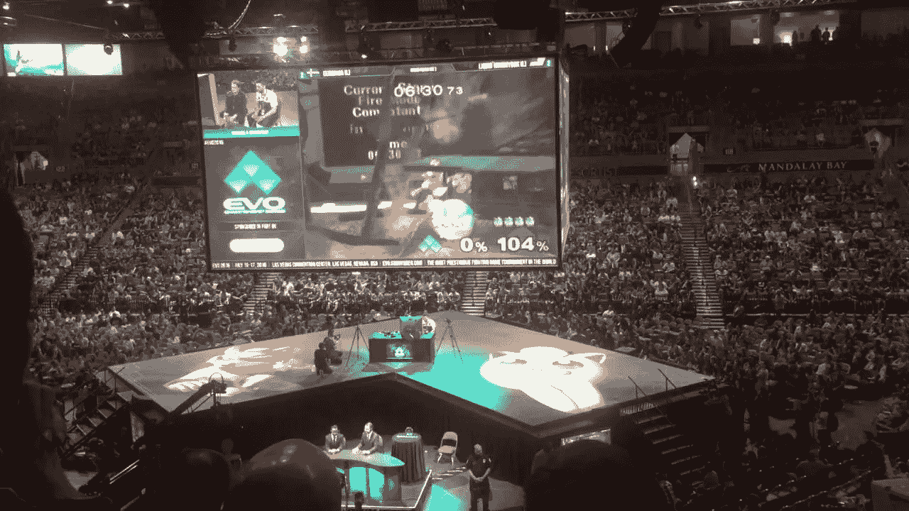
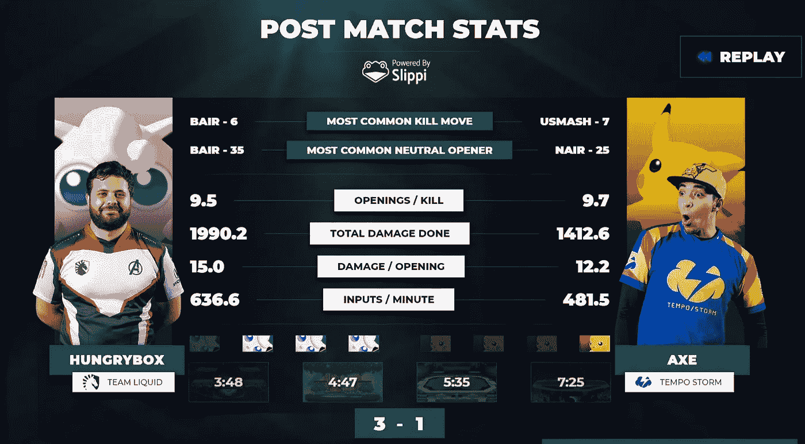
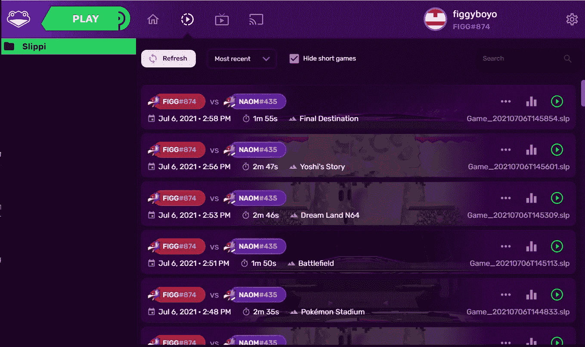
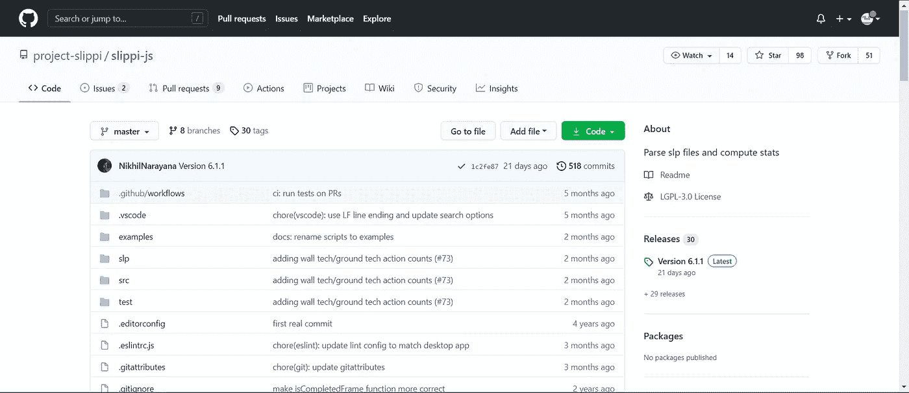
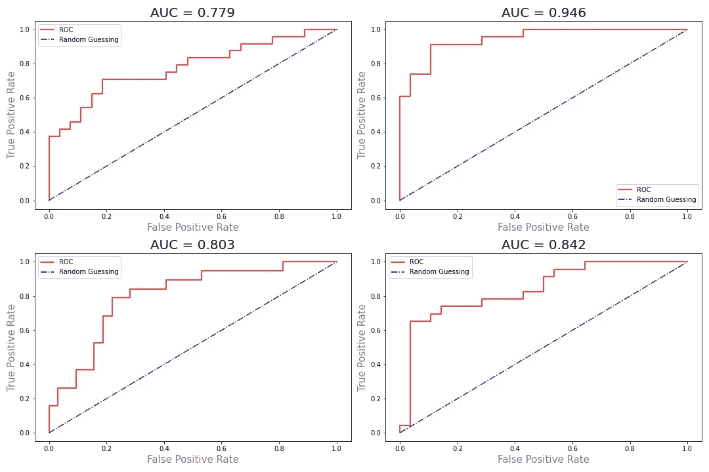

# 用 Slippi 和逻辑回归预测混战

> 原文：<https://medium.com/geekculture/predicting-melee-with-slippi-and-logistic-regression-2a4752e7c522?source=collection_archive---------17----------------------->

Credit: Nintendo

Fizzi 这个名字对你有什么意义吗？如果你曾经喜欢过 2001 年的经典[超级粉碎兄弟混战](https://en.wikipedia.org/wiki/Super_Smash_Bros._Melee)(简称为“混战”)，也许它应该。

对于大多数读到这篇文章的人来说，肉搏可能只占据了你头脑和记忆的一小部分。也许这是在某个遥远的夜晚，几个朋友之间选择的游戏。或者也许它是 21 世纪初一个有趣的时间杀手。你们中的许多人可能更熟悉最近发布的 Smash 系列，即终极版。

然而，对于游戏世界中相当大的一部分人来说，自发布以来，混战一直是最重要的战斗游戏。任天堂美丽事故背后的竞争场景有着漫长而丰富的比赛和磨难历史，其中职业玩家争夺数万(甚至[数百](https://www.gamereactor.eu/smash-summit-11-now-has-largest-prize-pool-in-competitive-super-smash-bros-history/))美元的奖金池。

Image from [video](https://www.youtube.com/watch?v=uJiPwY62IhU) of EVO 2016

在最近的时间里，围绕游戏的专门的基层场景在玩的方式方面变得狡猾。最近，由于一些非常投入和勤奋的技术娴熟的社区成员的帮助，任何人都可以通过一个名为 [Slippi](https://slippi.gg/) 的项目，用流畅、回滚的网络代码在线玩混战，这是许多现代游戏[无法复制](https://egmnow.com/street-fighter-v-has-finally-fixed-its-netcode-but-a-modder-did-it-first/)的功能。

Fizzi 是这个和其他发展的幕后策划者。全职修改游戏，他还设法将复杂的统计数据带到现场，这与以前在 Smash 中看到的不同，从本质上彻底改变了观众和竞争对手分析游戏的方式。

[Source](https://github.com/project-slippi/slippi-set-stats)

作为一个慷慨的上帝，Fizzi 允许他的在线服务(以及你玩的每场比赛的统计数据和回放——稍后会详细介绍)免费提供。

作为这款游戏的超级粉丝，我一直非常享受通过 Slippi 在线玩近战游戏带来的舒适和便利。

在我的业余时间享受了大约一周左右的游戏之后(老实说，我不知道为什么我没有早点跳上 Slippi 火车)，我开始对一个问题感到好奇:机器学习算法能在一场混战游戏结束之前预测出赢家吗？

为了找到答案，我求助于我自己的(相对较小且不具代表性的)约 220 个回放集(由 Slippi 生成)。我的玩法是创建一个逻辑回归，仅使用前 3 只股票中收集的数据来预测两个玩家之间的赢家。当然，这些数据将来自 Slippi 自己的统计计算。

Capture of Slippi launcher by me

为了完成这个任务，我首先必须学会处理保存所有回放的`.slp`文件格式。幸运的是，[项目 Slippi GitHub 页面](https://github.com/project-slippi)正好为此提供了一些工具。我发现 Slippi-js 是可用的解析库中最有用的。

[Slippi-js](https://github.com/project-slippi/slippi-js)

然而，这个计划有一个明显的问题:我不懂 JavaScript。只有 Python。有一个 [python 库](https://github.com/hohav/py-slippi)来解析`.slp`文件，但是据我所见，它还不够完整，需要我做 Slippi-js 已经能做的大量繁重工作。

因此，为了完成这个项目，我必须收集足够的 JavaScript 知识，结合 Slippi-js 的 GitHub 页面上的示例代码，从我登录的 220 个游戏中提取所有数据。数据以 JSON 格式提取，可以很容易地以文本形式保存到磁盘上的`.txt`文件中，这很好。如果你不知道，JSON 对象本质上只是 Python 字典。

我还必须安装 [Node.js](https://nodejs.org/en/) 。我不知道这是干什么的，也不知道它是如何工作的，但我做到了。

在成功创建了 220 个`.txt`文件之后，我能够将数据转换成 Python 字典，再次回到熟悉的编程语言的安全地带。

从这里开始，只需要提取前 3 只股票的数据，并训练一个模型来预测赢家。在本文的底部可以找到提取的数据的完整列表。此外，您可以访问这个 GitHub 存储库以查看关于该项目的更多细节(以及查看用于创建该模型和下图的所有代码)。

同时，这里是使用我的模型进行的四重交叉验证的测试数据的 ROC 曲线。

对于那些不知道这意味着什么的人，我来解释一下。ROC 曲线(此处显示为红色)代表不同临界值的真阳性率和假阳性率。在这里，“正”只是表示 1 号玩家赢了，负表示 0 号玩家赢了。这可能对你没有任何意义，但你要知道:红线越靠近左上角，模特的表现就越好。这也可以从 AUC(曲线下面积)看出:AUC 越接近 1，模型表现越好。

因此，总体而言，该模型表现相对较好。事实上，该模型能够在平均 78.4%的时间内预测测试数据中近战游戏的正确结果。这比基线模型(无论如何总是预测大多数的基本模型)好得多，后者只有 56%的准确性。

总的来说，我对这个项目很满意。当然，我可以通过从更多游戏(和更多玩家)收集更多数据，以及添加更多功能(工程或其他)来减少偏见，来做更多的事情。一个大型项目可能是实现一种方法来实时收集 3 只股票的数据，这样我就可以在游戏仍在进行时预测游戏的赢家。有用吗？也许不是。好玩有趣？毫无疑问。将来我可能会回到 Slippi 数据，但这次初步探索对我的数据提取和建模技能是一次很好的锻炼。

模型使用的功能列表:

*   帧中前三个股票的持续时间
*   玩家 0 的死亡人数
*   每位玩家的连击次数
*   每个玩家的连击长度(移动次数)的平均值和标准差
*   每个玩家连击伤害的平均值和标准差
*   每位玩家每次击杀的连击