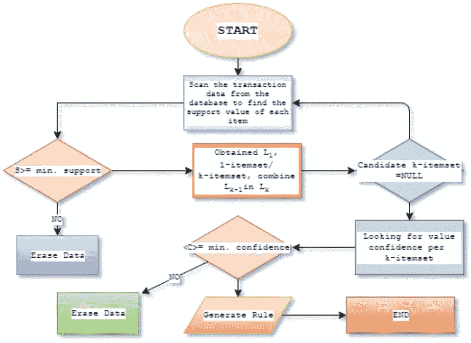
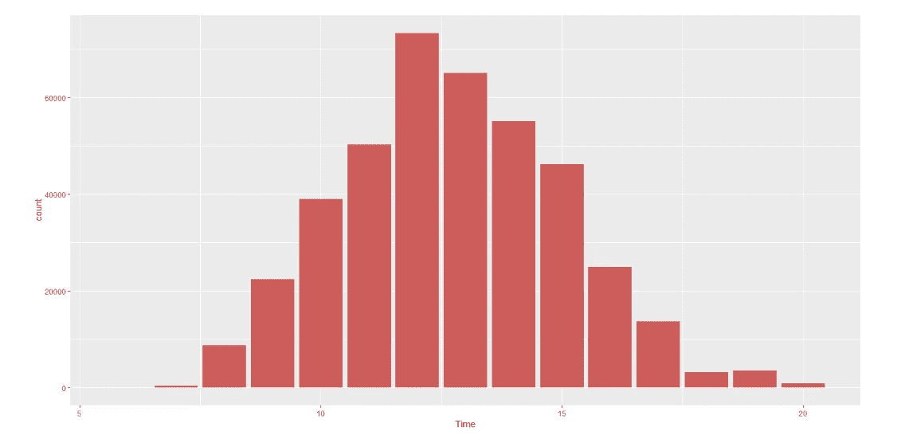
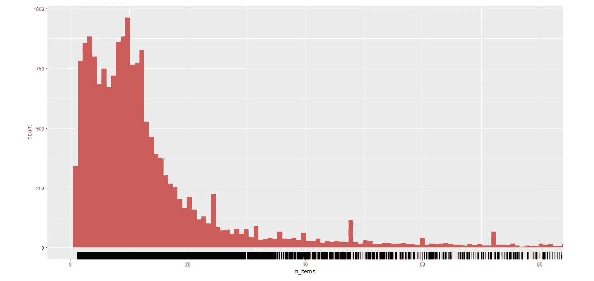
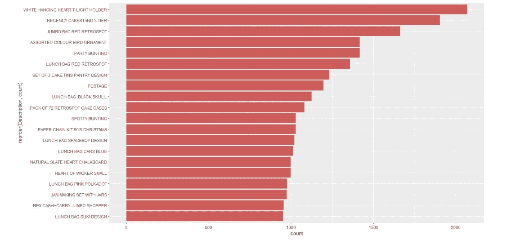
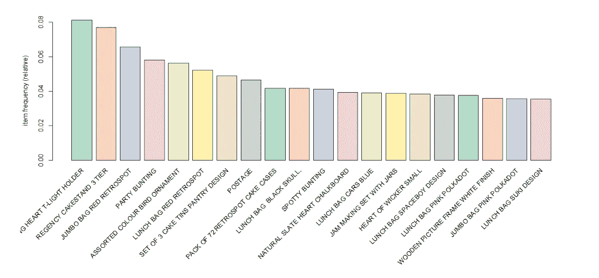
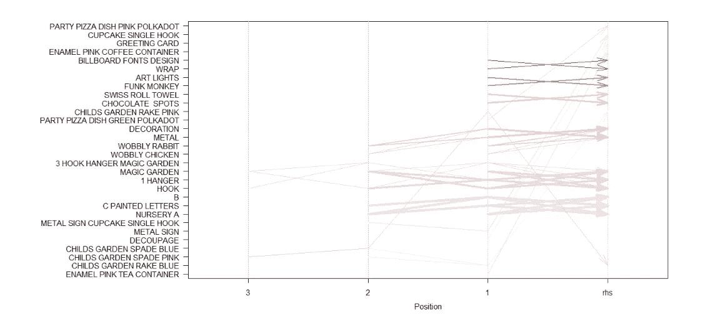
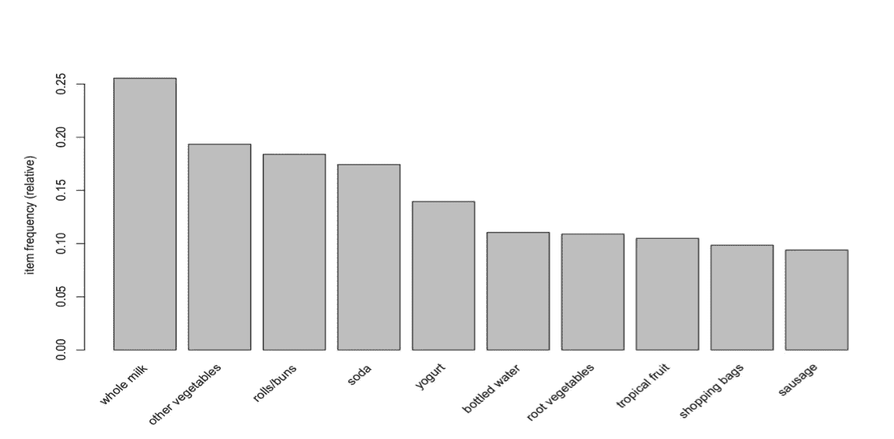
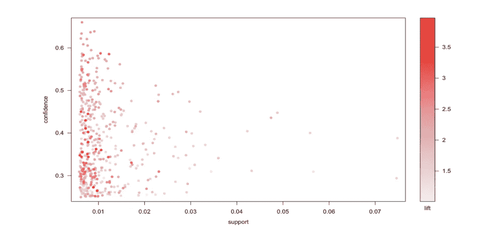
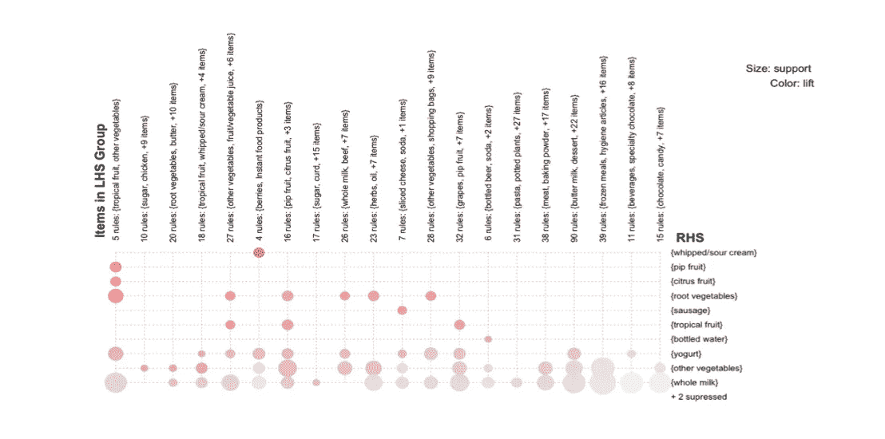

# 用购物篮分析预测购买

> 原文：<https://medium.com/geekculture/predicting-purchases-with-market-basket-analysis-d6ad2152bf6e?source=collection_archive---------11----------------------->

## 使用带有关联规则的 MBA 创建您自己的“购买了该产品的客户也购买了该产品”部分


Shopping Customers | Photo by [Gustavo Fring](https://www.pexels.com/@gustavo-fring?utm_content=attributionCopyText&utm_medium=referral&utm_source=pexels) from [Pexels](https://www.pexels.com/photo/family-doing-grocery-shopping-3985074/?utm_content=attributionCopyText&utm_medium=referral&utm_source=pexels)

> 你曾经冲动购物吗？你当然知道。但是，你有没有想过，为什么这些产品对你来说如此方便，即使你并没有在寻找它们？我们所有人都知道购买了这个产品的顾客也在亚马逊上购买了产品，前面提到的冲动购买在那里经常发生。

即使在实体杂货店，你也会在同一个货架上发现互补的商品(如面包和黄油),或者至少彼此非常接近。这些补充物品的数据也有助于商店以他们认为有利可图的方式对这些物品提供优惠和折扣。一个商品的广告可以针对另一个商品的顾客。此外，有时该公司可能会想出一个两者结合的产品，这可能会增加销售。

现在，问题出现了，如何找到这些互补的项目？答案是**市场篮子分析**。

# 什么是购物篮分析？

> 市场购物篮分析(MBA)是一种建模技术，其理论基础是，如果你购买了某一组商品，你就更有可能(或更不可能)购买另一组商品。
> 
> 例如:在麦当劳，如果你买三明治和饼干，你比没有买三明治的人更有可能买饮料。

在零售行业，MBA 指的是一种**无监督的数据挖掘技术**，可以发现客户购买活动之间的同现关系。用户点击亚马逊的*“购买了该产品的客户也购买了这些产品……”*行动号召链接的销售量证明了购物篮分析的效果和重要性。

市场购物篮分析和这篇文章的目的是利用以前的数据来预测一个人在购买某种产品后会购买什么产品，或者更简单地说，与以前购买的产品相关的是什么。

# 一些术语

现在，我们需要熟悉这里使用的术语，以便更清楚地理解这个主题。

## 项目

是我们正在识别其关联的对象。对于在线零售商来说，每件商品都是商店里的产品。对于出版商来说，每一项都可能是一篇文章、一篇博文、一段视频等等。一组项目就是一个`item set`。

```
Item set, I = {i₁,i₂,i₃, … ,iₙ}
```

## 处理

`Transactions`是多组项目同时出现的实例。对于在线零售商来说，交易通常是。对于出版商来说，一个事务可能是一次访问网站时阅读的一组文章。(由分析师决定在什么时间段内衡量一项交易。)那么，对于每笔交易，我们都有一个项目集。

```
Transaction, tₙ = {iᵢ,iⱼ, … ,iₖ}
```

## 规则

`Rules`是陈述的形式

```
{i₁,i₂, … } ⇒ {iₖ}
```

也就是说，如果你在规则的左侧(LHS)有项目集合中的项目，即`{i₁,i₂, … }`，那么访问者可能会对右侧(RHS，即`{iₖ}`)的项目感兴趣。

例如，上例中的三明治和饼干变成了 LHS，饮料变成了 RHS。

# 方法学

## 关联规则挖掘

*   用于在交易数据库中的项目集之间寻找频繁模式、关联、相关性或因果结构。
*   通过发现顾客放入“购物篮”的不同商品之间的关联和相关性，了解顾客的购买习惯。
*   规则形式:`Antecedent Item ⇒ Consequent Item`

## 先验原则

apriori 原则可以减少我们需要检查的项目集的数量。

简单地说，先验原则表明:`*if an itemset is infrequent, then all its supersets must also be infrequent.*`

这意味着如果 *{beer}* 被发现不频繁，我们可以预计 *{beer，pizza}* 同样不频繁，甚至更不频繁。因此，在合并流行项目集的列表时，我们不需要考虑*{啤酒，比萨饼}* ，也不需要考虑任何其他包含啤酒的项目集配置。



Apriori Algorithm | Image by Author

现在，我们使用三个非常重要的概念:支持、信心和提升，来实施和理解购物篮分析。

**支持**

项目或项目集的`support`是数据集中包含该项目或项目集的事务的分数。`Support`确定规则适用于给定数据集的频率。

```
Support(A ∪ B) = min(Support(A), Support(B))
```

**信心**

置信度被定义为包含 LHS(先行项 A)的交易也将包含 RHS(后续项 B)的条件概率。

```
Confidence(A => B) = P(B|A) = P(A ∩ B)/P(A)Confidence(A => B) = Support(A ∪ B)/Support(A)
```

规则的可信度是对其预测能力或准确性的度量。置信度告诉我们项目或项目集 LHS 的存在导致项目或项目集 RHS 的存在的事务的比例。

> 置信度度量的一个缺点是它可能错误地表示了关联的重要性。这是因为它只解释了苹果有多受欢迎，而不是啤酒。如果啤酒通常也很受欢迎，那么包含苹果的交易也包含啤酒的可能性会更高，从而扩大了信心指数。为了说明这两个组成项目的基本受欢迎程度，我们使用了第三个指标，称为 lift。

**抬起**

Lift 给出了规则 A 中 A 和 B 之间的相关性 B.
相关性说明了一个项集 A 如何影响项集 B.
A 和 B 是独立的当且仅当:`P(A ⋂ B)=P(A) x P(B)`，否则是从属的。升力由下式给出:

```
Lift(A => B) = P(A ⋂ B)/[P(A) x P(B)]Lift(A => B) = Support(A ∪ B)/[Support(A) x Support(B)]Lift(A => B) = Confidence(A => B)/Support(B)
```

所以，升力越高，A 和 B 同时出现的几率就越高。

## 关联规则挖掘的目标

当我们对一组给定的交易 X 应用关联规则挖掘时，目标是找到具有以下特征的所有规则:

*   支持大于或等于 min_support
*   置信度大于或等于 min_confidence

## 使用关联规则进行购物篮分析的步骤

1.  收集数据
2.  探索和准备数据
3.  根据数据训练模型
4.  评估模型性能
5.  提高模型性能

# 数据

现在，我们将对从不同来源获得的两个数据集应用`MBA`，这两个数据集是来自两家商店的公开可用数据集。

## 数据集 1

> [“在线零售”，包含 2010 年 1 月 12 日和 2011 年 9 月 12 日之间发生的一家英国注册在线零售商的所有交易，摘自 UCI 机器学习库](https://archive.ics.uci.edu/ml/datasets/online+retail)

**数据集描述**

*   行数: **541909**
*   属性数量: **08**

然后经过预处理，数据集包括**406829 条**记录和 **10 个字段**:发票号、库存代码、描述、数量、发票日期、单价、客户号、国家、日期、时间。

该矩阵包含客户在一个月内购买的 **19295 笔交易**(行)和 566 件(列)独特商品。

19295 笔交易中有 1803 笔包含*白色吊心 T-LIGHT HOLDER* ，而 9835 笔交易中有 1709 笔包含 *REGENCY CAKESTAND 3 TIER* 。

## 数据集 2

> [来自加州州立大学统计和生物统计系的食品杂货数据](http://cox.csueastbay.edu/~esuess/classes/Statistics_452/Presentations/ml13a/groceries.csv)

该矩阵包含客户在一个月内购买的 **9835 笔交易**(行)和 169 件(列)独特商品。

*   9835 笔交易中有 2513 笔交易包含全脂牛奶，而 9835 笔交易中有 1809 笔交易包含面包卷。
*   有 2159 个交易只包含 1 个购买的项目，并且只有 1 个交易包含 32 个购买的独特项目。

# 结果

最后，让我们看一下在对这些数据集应用关联规则后得到的结果和推论。这些推论在下面用图形的帮助下以一种直观的方式描述出来，同时还有一些更多的细节来描述这些图形。

## 数据集 1

来自`UCI Machine Learning Repository`的这个数据集可以用不同的方式分解，以做出许多不同的推论。

**人们购买物品的时间**



Image by Author

*   这个数字回答了人们通常在什么时间网上购物的问题。
*   一天中的小时和订单量之间有明显的差异。
*   大多数订单发生在 10:00-15:00 之间。
*   这有助于零售商在高峰时段展示更多的广告，并结合购物篮分析中的类似产品。

**每位顾客购买的商品数量**



Image by Author

*   这个数字代表每个顾客买了多少东西。大多数人购买的商品少于 10 件(每张发票少于 10 件)。

**最畅销的 20 件商品**



Image by Author

*   上图是畅销书排行榜的前二十名。

**前 20 个项目的绝对项目频率图**


Image by Author

*   `absolute item frequency plot()`显示的是某件商品的绝对购买数量。
*   它独立地绘制每个项目的数字频率。
*   `RColorBrewer`图书馆为剧情增添了色彩。

**前 20 个项目的相对项目频率图**



Image by Author

*   `relative item frequency plot()`显示某一商品被购买的相对数量，以百分比表示。
*   此图显示了前 20 种商品的`relative item frequency`，最常购买的商品是`WHITE HANGING HEART T-LIGHT HOLDER`。
*   `RColorBrewer`库为绘图添加颜色。

**给定数据的散点图(49122 规则)**


Image by Author

*   `scatter plot()`是用于可视化关联规则的图，其中黑色表示`lift`，x 轴是`support`，y 轴是`confidence`。
*   这是从数据集 1 中提取的 49122 `rules`的图。
*   这表明大多数项目的`support`小于 0.002。
*   还显示了当`support`较小时，升程最大。
*   数据集 1 中的`confidence`级别远高于数据集 2 中的级别(稍后显示)。数据集 1 中的`scatterplot`都聚集在 0.01 附近，但对于数据集 1，观察到一个清晰的趋势——随着`support`的增加，逻辑上向数据集 2 移动。
*   由于数据集 1 中的规则比数据集 2 中的规则多得多，它以更好的方式描绘了现实世界的分析，因此提供了更好的散点图。
*   这以一个惊人的结果结束了观察，随着提取的`rules`数量的增加，`confidence`水平趋向于 1，给我们一个精确的结果。

**一个给定数据的两键绘图(49122 规则)**


Image by Author

*   `Two-key plot()`类似于`scatter plot`，x 轴为`support`，y 轴为`confidence`，颜色根据`lift`变化，如右图所示。
*   此图显示了从数据库 1 中提取的整个 49122 `rules`的`two-key plot`。
*   它还表明当`support`较小时`lift`最大。

**平行坐标绘制规则**



Image by Author

*   `Parallel Coordinates Plot()`显示什么产品用什么物品产生什么样的销售额。
*   这是数据库中 50 个`rules`的`parallel coordinates plot`。
*   它显示如果有人买了`BILLBOARD FONTS DESIGN`，他们下一个就会买`WRAP`，颜色越深表示`confidence`高。

## 数据集 2

这个来自`Department of Statistics and Biostatistics, California State University`的数据集可以用不同的方式分解，以做出许多不同的推论。

**前 10 个项目的相对项目频率**



Image by Author

*   `itemFrequencyPlot()`允许我们显示绝对值或相对值。
*   上图显示了第一个数据集中前 10 项的`relative item frequency`。
*   它绘制了这些项目相对于其他项目出现的次数。
*   `Whole milk`是最畅销的产品，其次是`rolls/buns`和其他`vegetables`。

**给定数据的散点图(463 规则)**



Image by Author

*   `scatter plot()`是关联规则可视化图，其中黑色表示`lift`，x 轴是`support`，y 轴是`confidence`。
*   这是从数据集 2 中提取的 463 `rules`的图。
*   这表明大多数项目的`support`小于 0.03。
*   这也表明当`support`较小时`lift`最大。

**关联规则前 50 条规则图**


Image by Author

*   在`graph rules plot()`图中，我们可以很容易地看到关联`rules`。
*   气泡的大小随着`support`的增加而增加，而颜色随着`lift`的增加而变暗。
*   此处的箭头表示前一个项目旁边购买的项目。
*   在这个剧情中，`sausage`是在`sliced cheese`之后买的。
*   右上角也给出了`support`和`lift`的范围。

**平行坐标绘制为 100 规则**


Image by Author

*   `Parallel Coordinates Plot()`显示什么产品和什么项目产生什么样的销售额。
*   这是数据库中 100 个`rules`的`parallel coordinates plot`。
*   它表明，如果有人购买了`berries`，他们更有可能接着购买`whipped/sour cream`，颜色越深表明`confidence`越高。

**463 规则的分组矩阵**



Image by Author

*   在`grouped matrix plot()`的这个图中，`rules`被表示为基于分组矩阵的可视化。
*   这是一种通过聚类创建嵌套组`rules`(更具体地说是先行项集)的新方法。
*   嵌套组的创建形成了一个层次结构，该层次结构将被交互地探索到每个单独的规则。
*   `support`和`lift`度量分别由气球的大小和颜色表示。
*   在这种情况下，这不是一个非常有用的可视化，因为我们只在规则的右边有`whipped/sour cream`。

# 最后的话

购物篮分析是一种无监督的机器学习技术，可用于发现交易数据中的模式。它可以成为分析消费者购买模式的一个非常强大的工具。

用于购物篮分析的主要算法是`apriori algorithm`。购物篮分析中的三个统计量是`support`、`confidence`和`lift`。

> 购物篮分析借助关联规则可以很容易地判断出客户的购买行为；零售商在这些概念的帮助下，可以很容易地建立自己的零售店，以扩大未来的业务。

尽管购物篮分析会让人联想到购物车和超市购物者的画面，但重要的是它可以应用于:

*   信用卡购物分析
*   电话呼叫模式分析
*   欺诈性医疗保险索赔的识别
    (考虑违反通用规则的案例)
*   电信服务购买分析

在本文中，我们研究了杂货购买的交易模式，并发现了某些交易中明显和不太明显的模式。

*最后，* *如果您遇到任何困难，有任何疑问，请随时联系我。*