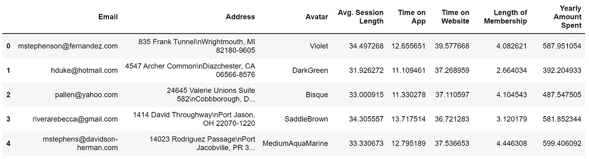
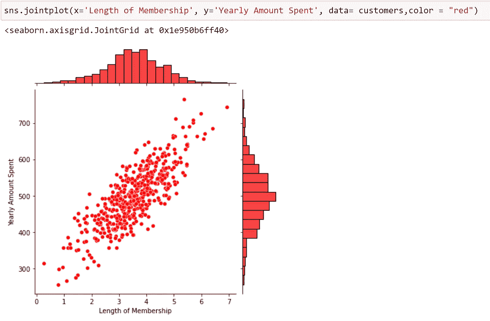
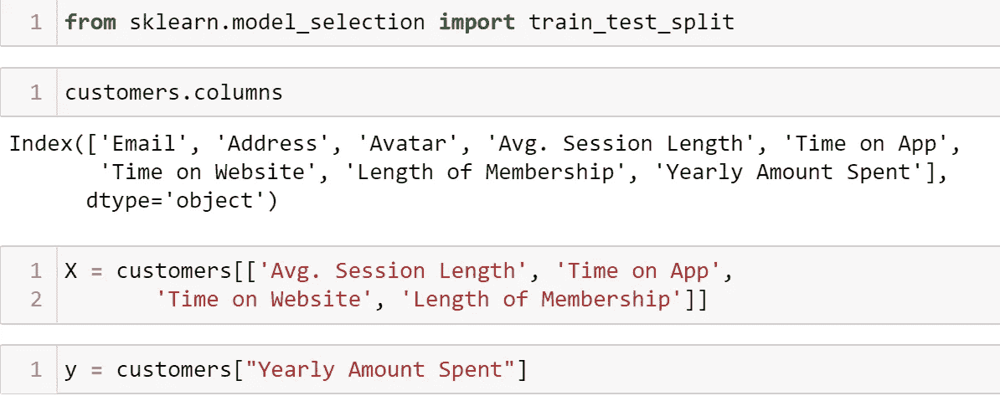
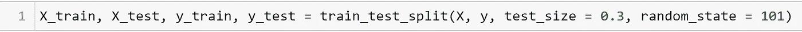
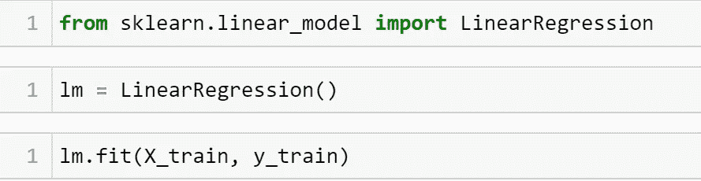
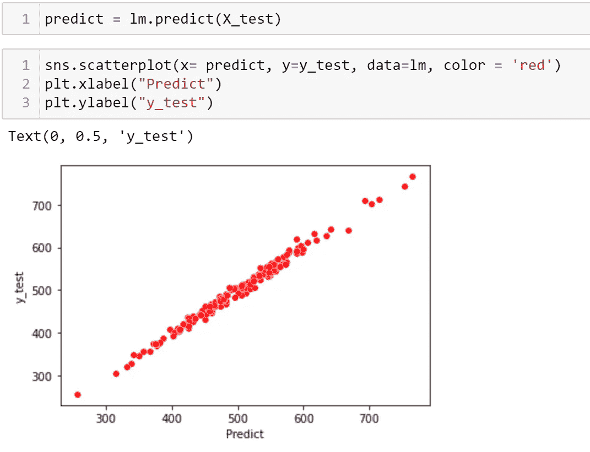
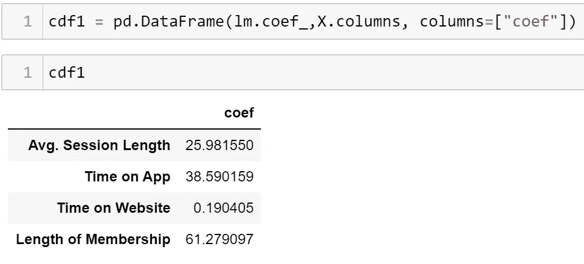

# 使用 ML 预测客户的消费金额

> 原文：<https://medium.com/geekculture/predicting-the-amount-spent-by-customers-using-ml-df4dddf5c1df?source=collection_archive---------13----------------------->

## 建立了一个机器学习模型，使用线性回归来预测客户在电子商务中的年消费额

在摆弄了泰坦尼克号的数据集后，我决定研究一个更具时代感的主题。我选择的数据集是关于一个电子商务客户的。它基本上包含了许多客户的数据，比如网站上的平均会话时长、在网站上花费的时间、会员资格时长以及每年花费的金额。我真的很喜欢处理这个数据集，因为电子商务近年来增长了很多。现在让我们来看看数据集:

Graph 1: Head()

该数据集包含 8 列和 500 行。在做了一些分析后，我发现会员资格的长短是对顾客每年消费金额影响最大的特征。在那之后，我开始绘制一些图表来更好地观察这种关系。

Graph 2 : Length of membership x Yearly Amount Spent

联合图显示了会员资格的长短和每年花费的数量之间的正相关关系。这意味着会员资格越长，消费金额越高。现在很明显，线性回归将是这个数据集的一个好选择！

## 分割数据

我开始导入一些新的库来帮助分割数据，并将特性分配到两个变量中

现在，我准备将数据分为“训练”和“测试”数据，来训练我的模型，看看它是否能很好地预测。对于这一部分，我使用了来自 *Sklearn:* 的 *train_test_split* 方法

## 创建模型

基本的线性回归公式是 **Y = A + B*X** 。这意味着模型的目的是计算出 A 和 B 的值，以便预测 Y(每年花费的金额)，只要我给出 X 值(其他特征)。现在让我们建立模型并训练它:

## **使用测试数据并评估结果**

使用测试数据后，我决定绘制一个图表来查看预测值和真实值之间的关系。来看看他们长得像不像！

Graph 3 : Lineplot Predict values x True values

真好！这些值有很好的相关性！这意味着模型预测的 Y 值足够好！

是时候引入一些度量来评估模型了。我决定导入这些指标:

*   **误差平方和(SSE)** :对所有残差求和并求平方
*   **均方误差(MSE)**:SSE 的平均值
*   **均方误差的 Sqrt(RMSE)**:均方误差的 Sqrt
*   **R2 分数:**解释了 Y 和 X 之间的差异

R2 是最容易理解的。在这个模型中，R2 的值是 0.98，这意味着我们的线性回归能够解释每年花费金额和其他特征之间 98%的差异。该值的基准是 0.7。一个非常高的 R2 值，比如 0.98，可能有很多原因，比如不真实的数据或有偏见的数据。

## 这种模式有什么帮助？

在开始时，我说过“会员资格的长度”是更能影响每年消费金额的特征，因此，电子商务可以专注于扩展会员资格的行动，或者使更多的客户成为会员。但是，其他功能呢？值得为它们努力吗？

为了更好地理解这些关系，我打印出了模型的系数:

这意味着什么？基本上，我们可以这样理解,“App 上的时间”每增长一个单位,“每年花费的金额”就增加 38 美元。同样，会员资格是增加最多的原因，但是，也许专注于应用程序也能带来好的结果，也许改进应用程序比增加会员资格更便宜！

> 你可以在 Github 查看这个完整的笔记本。