# 预测 NBA 球员的进步

> 原文：<https://medium.com/geekculture/predicting-the-improvement-of-nba-players-7cffd3864588?source=collection_archive---------15----------------------->

美国国家篮球协会是世界上最大的篮球协会，在全世界拥有数百万球迷。球员在一支球队中的表现通常是决定哪支球队夺冠的最大因素。球员的薪酬通常由他们过去的表现决定，但球员的表现在不同的赛季有所不同。

2020’s most improved player

每一年，都有一些球员在过去的赛季中取得了巨大的进步。这些球员在竞争和经济上给球队带来了很多价值。因此，了解这些信息对于尝试在签约和交易中获得球员是很有价值的。

# 数据

我用来衡量球员进步的标准是:去年的表现，他的年龄，他的选秀状态，他的位置，以及描述他是什么样的球员的标准。

## 来源

几乎所有的球员统计数据，像年龄、位置、表现和选秀位置数据都可以在两个 Kaggle 数据集中找到，这里是和这里是。这些数据集最终会缺少某些年份的数据。球员统计数据将于 2017 年结束，而选秀数据将于 2015 年结束。为了平衡这些数据，我还搜集了 basketball-reference.com 截至 2018 年的数据。

## 清理数据

所有抓取或下载的数据都混合到一个表中。在这两个数据集中，在 NBA 的早期，由于糟糕的记录保存，许多数据都丢失了。我决定只使用 1980 年及以后的数据，因为它们缺少的值更少，而且规则与现在的相似。

数据集仍然有一些问题。首先，玩家通过他们的名字被识别，但是某些玩家有相同的名字。(例如:伊塞亚·托马斯)。这意味着他们的数据是混合的。尽管可以根据年份、团队和职位来区分他们。我决定从数据集中去掉他们的名字，因为他们的名字不到数据的 1%。

第二，当球员由于交易或签约而在赛季中期离开球队时，会有多个条目。这导致了多个样本都有不完整的数据，我最终编写了一个脚本来组合这些玩家的数据并丢弃部分行来解决这个问题。

第三，在最近的历史上，有比正常的 82 场比赛更短的赛季。这导致这些赛季的统计数据比常规赛季少。为了解决这个问题，我把得分、助攻等累积特征标准化了。好像打了 82 场。

接下来，我检查了数据集中的极端异常值，有相当多的异常值，几乎都是由小样本问题引起的。例如，一些球员在整个赛季中只打了很少的几分钟，在那几分钟里表现得非常好/非常差。因此，球员上场时间少于 20 场或 100 分钟的赛季被排除在外。同样，一些球员只投了 1 或 2 个三分球，给了他们 100%的分数。所以我把投篮次数少于 10 次的球员的投篮命中率改成了缺失值。

## 特征选择

数据清洗后，数据中有 13，378 个样本和 49 个特征。很明显，这些特征有些多余。例如，有一个特征是一个球员收集的篮板数，另一个特征是他收集的篮板率。这两个特征包含了非常相似的信息(球员的篮板能力)，区别在于前者随着上场时间的增加而增加，而后者没有。这种总量与比率的关系也存在于其他特征之间。这些特征存在问题有两个原因:

(1)玩家的某些能力在两个特征中被复制。(2)一个球员的上场时间在多个特征中被复制。为了解决这个问题，我决定保留所有在自然中被评定的特性，去掉它们的累积对应项(表 1)。还有其他冗余，比如总篮板是进攻篮板和防守篮板之和。对于可以通过其他特性的总和来计算的特性，我决定放弃它们(表 1)。丢弃冗余特征后，我考察了自变量的相关性，发现了几对高度相关(皮尔逊相关系数> 0.9)。例如，投篮次数、出手次数和得分高度相关。这是有道理的，毕竟你是靠投篮得分的。最终选择了 24 个特征。

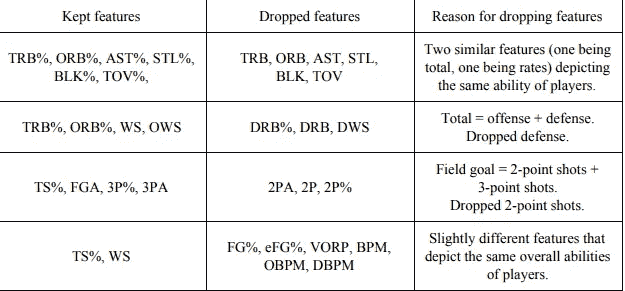

# 探索性分析

## 计算目标变量

由于球员的进步不是一个特征，它必须被计算。作为目标变量，我选择了连续两年的 win share。赢得份额是几个指标中最容易解释的变量，我们打篮球就是为了赢。计算出的球员进步具有以 0 为中心的正态分布，大多数值在-6 和 6 之间。为了验证这种计算是否与人们对球员进步的目测一致，我绘制了过去进步最大的球员在所有球员中的进步排名，并发现在大多数情况下，他们是进步最大的球员之一(图 1)。这表明所选择的指标是合理的。

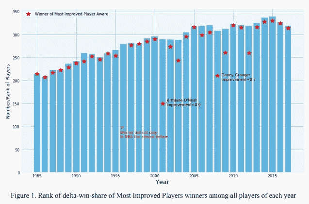

## 进步与年龄的关系

人们普遍认为年轻球员比年长球员进步更大，我们的数据也支持这一观点。随着年龄的增长，运动员的平均进步值下降，不同年龄组的平均进步值差异显著。

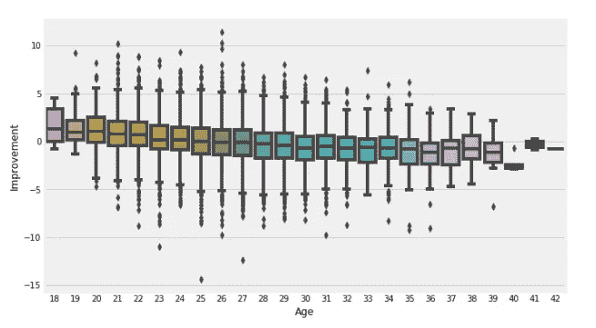

## 提高与综合能力的关系

这里的假设是，已经是球星的球员没有太大的提升空间，而一个平庸的球员还是可以提升的。我们的数据与这一假设一致。使用每 48 分钟的赢球份额(WS/48)作为衡量球员整体能力的标准，球员的整体能力与下赛季的进步之间存在负相关关系。明星球员(WS/48 > 0.2)、稳健球员(WS/48 在 0.1 和 0.2 之间)、轮换球员(WS/48 在 0 和 0.1 之间)和“磨合”(WS/48 在 0 以下)的平均进步彼此之间有显著差异。

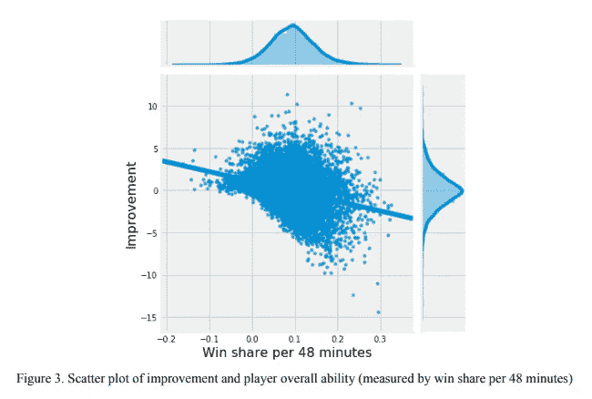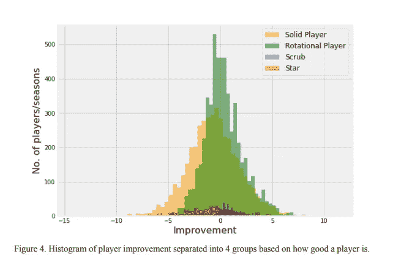

## 进步和上场时间的关系

我假设上场时间少的球员更有可能进步。如果一个球队认可一个球员在有限的时间内做出的积极贡献，他很可能会获得更多的上场时间，并因此提高他的产量和/或提高他的技能。另一方面，如果一个好球员已经是首发，他已经打了很多分钟，不会得到更多的上场时间。在检查了数据之后，确实，游戏时间少于 25 分钟的玩家比游戏时间超过 25 分钟的玩家在统计上有更高的进步(z 检验，p<0.001)。然而，两组之间的实际平均值差异很小(~0.7)。

## 进步与所玩游戏的关系

实际上，球员的进步和比赛之间没有关系。如果一个优秀的球员错过了很多比赛，那很可能是因为受伤，这可能会对他的表现产生负面影响。下赛季他可能会恢复到以前的状态，因此会有所提高。玩游戏少于 50 场的玩家比玩游戏超过 50 场的玩家更有可能进步。(z 检验，p<0.001，均值差异= 1.3)。

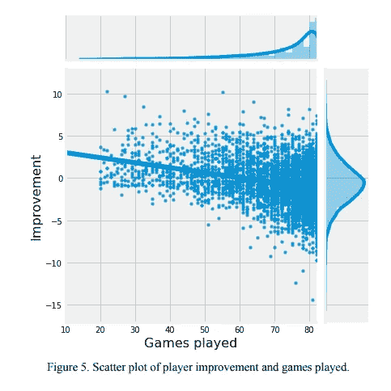

## 改进和职位之间的关系

在 NBA 有一个普遍的神话，即前场球员比后场球员需要更长的时间来发展，数据并不支持这一假设。我将球员位置的特征转化为二元特征(前场 vs .后场球员)，发现前场和后场球员的提高并无差异，即使是在他们的前 2 年(z-test，p=0.34)。

## 改进与去年改进之间的关系

我认为一名球员的进步可能与他之前的进步相关，因为年轻球员可能会连续几年进步，而年长球员可能会连续几年下降。结果发现，改进和先前改进之间的关系并不存在。换句话说，更多的时候，一个玩家会“回归均值”，而不是不断提高或下降。

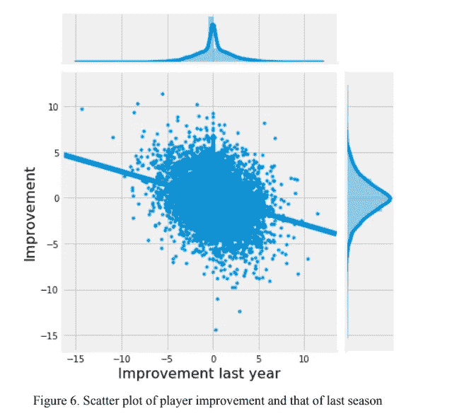

## 改进和草稿位置之间的关系

我，像许多其他篮球迷一样，认为早期被选中的球员通常更有天赋，因此比后来被选中的球员更有可能提高，至少在他们年轻的时候是这样。事实证明，这只适用于少数真正年轻且有天赋的球员。不同选秀位置的 20 岁以下球员没有统计学上的不同改善(z 检验，p=0.16)。

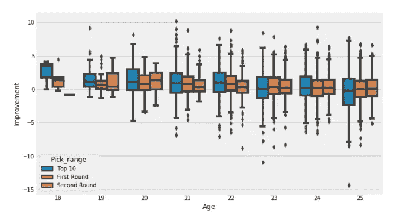

## 改进和团队之间的关系

我根据球队信息制作了两个特征:球员是在好队还是坏队，球员下赛季是否换队。球员进步和团队实力(以总胜率衡量)之间的关系非常弱。换队的球员比留在同一队的球员更有可能进步(z 检验，p>0.001，均值差异=0.2)。

# 建模

我认为两种类型的模型可能符合我们的标准，回归和分类。回归将提供更多关于球员如何提高的信息，而分类将仅仅给出球员提高的概率。球探或主管可能会使用回归模型，但对于普通球迷来说，分类更容易理解。由于时间关系，我将只展示回归。

## 回归

我对数据集应用了线性模型(线性回归、岭回归和 Lasso 回归)、支持向量机(SVM)、随机森林和梯度增强模型，使用均方根误差(RMSE)作为调整和评估指标。结果都有同样的问题。预测值的范围比实际值窄得多，因此，随着实际值偏离零越来越远，预测误差越来越大。这些结果是不可接受的，因为对于 NBA 球队来说，有很大进步/下降的球员比表现变化不大的球员更值得预测。

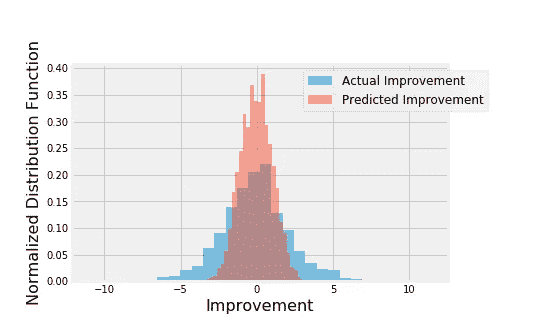

A very inaccurate model

这些问题是球员进步的不均匀分布，因为进步/下降很少的球员比进步/下降很多的球员更常见。因此，当 RMSE 被用作评估标准时，模型试图优先最小化几乎没有进步/下降的球员的错误。我对这个问题的解决方案是根据目标值丰度的倒数给样本分配权重。换句话说，进步/下降幅度大的玩家在模型训练和评估中的权重会更高，因为他们更稀少。使用这种方法，所有模型预测的目标值与实际目标值具有相似的范围和分布。

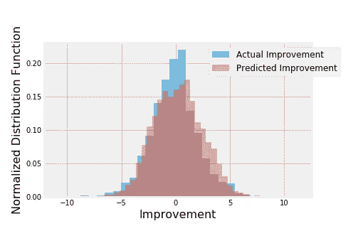

After said solution

使用不同样本权重的新方法，我使用加权均方根误差作为评估指标，建立了线性回归、SVM、随机森林和梯度增强模型。对于每个模型，超参数使用相同的度量和交叉验证进行调整。为了进行比较，我还构建了一个简单的线性回归模型，其中只有一个自变量(年龄)作为基准模型。在所有模型中，SVM 的表现最好，其误差比基准模型低 26%(表 2)。预测的改进与实际的改进成线性关系。

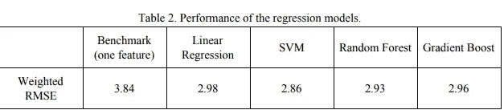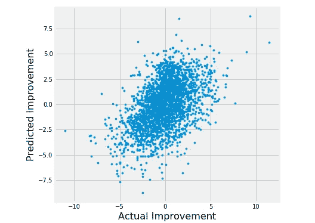

Scatter plot of predicted vs actual improvement of the SVM model

# 未来方向/结论

在回归问题中，我能够从基准模型获得大约 26%的改进，在分类问题中获得大约 68%的准确性。然而，在这项研究中仍然存在模型无法预测的显著差异。我认为模型可以在捕捉球员的个人特征方面做更多的改进。例如，两个球员可能有相似的表现指标，但一个可能更注重身体素质，而另一个可能更注重技巧。这两类球员的未来表现可能会有所不同。另一个例子是，合同即将到期的球员可能比刚刚签下大合同的球员打得更努力/更好。更多的数据，尤其是不同类型的数据，将有助于显著提高模型性能。

这个项目中的模型主要关注个人特征。然而，与队友、教练的互动也可能有助于球员的表现。例如，如果一名球员的新队友在同一个位置上是超级巨星，他的表现很可能会因为竞争而受到影响。这些相互作用显然更难以提取和量化，但可以给模型带来显著的改进。