# RedHat 商业价值预测

> 原文：<https://medium.com/geekculture/prediction-for-redhat-business-value-6a714df469ac?source=collection_archive---------9----------------------->

# **简介&问题概述:-**

对于任何一个商业组织来说，客户都是可以创造或毁灭他们财富的上帝。如果顾客的行为能够被确定，那么它将极大地帮助一个组织的商业计划。像大多数公司一样，红帽能够随着时间的推移收集大量关于与他们互动的个人行为的信息。他们正在寻找更好的方法，利用这些行为数据来预测他们应该接近哪些人，甚至何时以及如何接近他们。

红帽提出了一个 Kaggle 挑战，以创建一个分类算法，根据客户的特征和活动，准确识别哪些客户对红帽最具潜在商业价值。

# **问题陈述:**

Red hat 在其网站上提供了关于其客户及其活动的屏蔽数据。基于这些价值，我们必须预测特定客户是否有任何商业价值。

# 评估指标:

*   ROC AUC 评分:受试者操作特征曲线是在不同阈值下真阳性率和假阳性率之间的图形。该曲线下的面积将用于评估模型。

# 探索性数据分析:

## 数据概述:

数据集由三个 csv 文件组成:

*   **act _ train . CSVT7**act _ test . CSV****

这两个数据集构成了“主”数据集，分别代表训练和测试数据集。数据包括一个 ID 标签，后面是 **13 特征**，对于训练数据集，还有目标标签结果。

有 **2197291** 个列车数据实例和 **498687** 个测试数据实例。

*   ***people.csv***

people.csv 包含数据的 189118 个实例，每个实例对应一个用户。每个用户都是基于一个用户 id 来标识的，这个用户 id 对应于 test/train_users.csv 中的一个实例，后面是 **40 特性**。\

首先，我们将导入所有必要的库。接下来，加载并合并数据文件。在这里，人员文件与培训数据和测试数据合并。合并是为了使数据清理和特征化更容易。

接下来，我们将检查任何列中是否存在空值。我写了一个函数来检查空值。

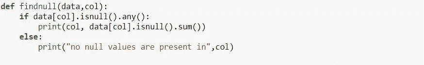

数据集包含多个列的空值。我已经用新的值替换了它们。

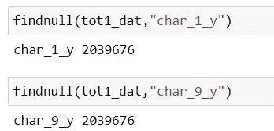

接下来对每一列进行单变量分析，以获得关于数据集的更多信息。对于每一列，使用结果变量进行比较。

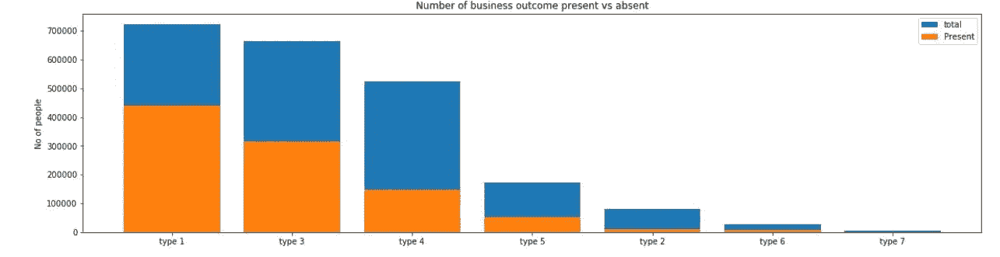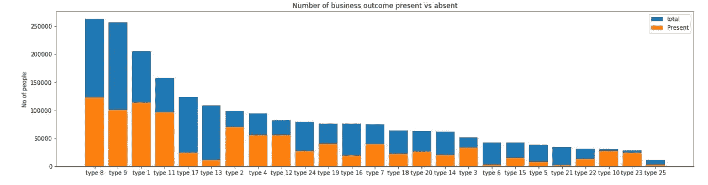

对这些列中的少数几个也进行双变量分析。

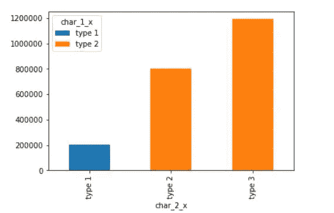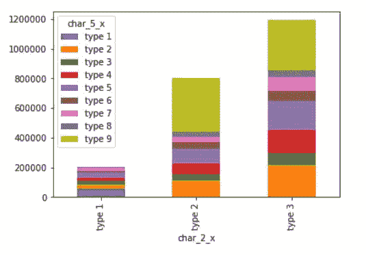

数据集包含客户活动时间戳的列。还对这些时间戳进行分析。在这里，通过将时间戳转换成它们各自的日、月、年等来分析时间戳。

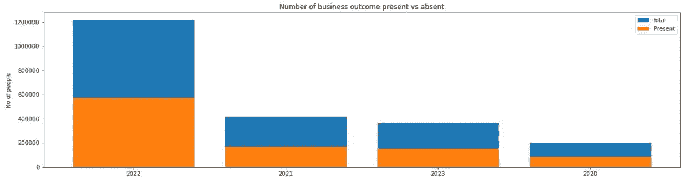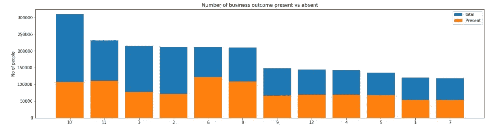

完成数据分析后，在数据中观察到以下见解。

*   Char1 到 Char9 没有任何一致的趋势。
*   组 17304 总是导致 0 业务结果。
*   Char_10 至 Char_37 显示了类似的趋势，真实价值增加了对业务成果的认可。
*   Char_38 具有数值，其中 90%的数据具有小于 90 的值。
*   活动的 Char_1 到 Char_9 没有任何一致的趋势。
*   大部分数据记录于 2022 年。
*   活动大多记录在 10 月份。
*   大多数活动在每月的最后一天进行。

# 特征工程:-

在清理和 EDA 之后，执行特征工程以从数据集中提取更多信息。为此，将训练和测试数据结合起来。对于该数据集，准备了以下特征。

1. **group_ppl_cnt** :每组人数

2. **days_from_min_dt_grp** :每组从最小人数日期起经过的天数

3. **days_from_min_dt_grp** :每组最大人数日期后经过的天数

4.Char_38 的**平均值、中值**

5. **group_activity_cnt** :每组的活动数

6. **activt_per_ppl_cnt** :人均活动次数

7. **ppl_actv_date_diff** :人员日期和活动日期的绝对差值

8.**周末**:周末与否

9. **actv_date_qurtr** :活动的季度

最后，对所有分类列进行一次性编码，并对数值进行规范化。为了模型训练，所有向量被堆叠在一起。

# 分类:

对于该数据集，多种算法用于训练。这些算法包括逻辑回归、决策树、随机森林、Adaboost 和 LightGBM。对每个算法都进行了超参数调整。

## 逻辑回归:

最初，我使用逻辑回归模型进行分类。为了获得更快的结果，我使用了带有日志丢失的 SGDclassifier。对多个 alpha 值进行了超参数调整。从相应的图中选择最佳 alpha 值。

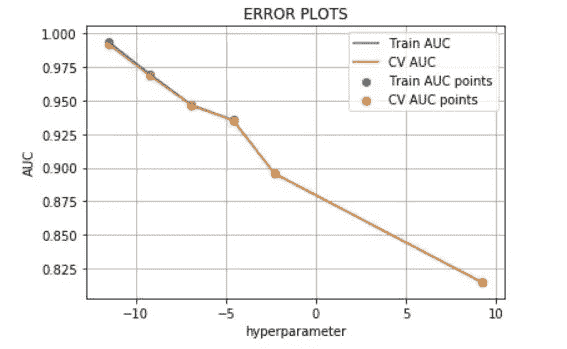

从图中选择α的最佳值，其 CV AUC 最高。在用新的 alpha 训练该模型并且在测试集上完成预测之后。用 Logistic 回归，我在 Kaggle 记分牌上得了 0.88 分。逻辑回归算法无法对此数据集进行正确预测。

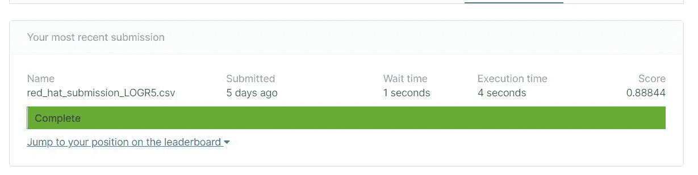

## 决策树:

接下来，我在这个数据集上尝试了决策树分类器。进行超参数调整以获得最大深度和最小样本分割的最佳值。

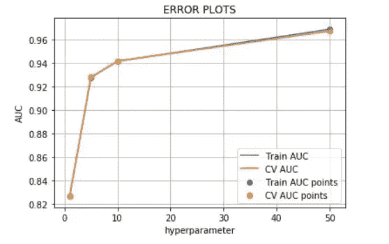

用从图中获得的最佳值训练模型。我在 Kaggle 评分板上得了 0.93 分。似乎基于树的算法在这个数据集上预测更有效。

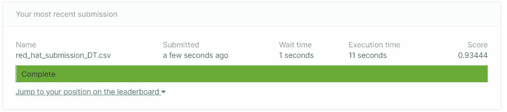

## 随机森林:

接下来，我尝试了随机森林模型。进行超参数调整是为了找到 max_depth 和 nestimators 的最佳值。

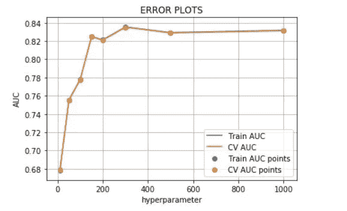

模特重新培训，我在 Kaggle 记分牌上得了 0.81 分。与其他两个模型相比，该算法的性能并不好。

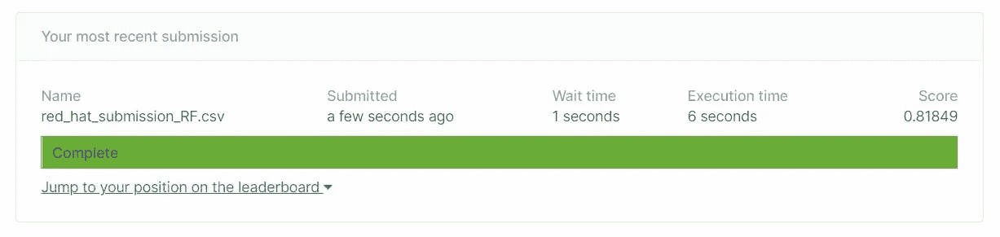

## **AdaBoost:**

接下来我考虑尝试 Adaboost 算法。对学习率和 n 个估计量进行了超参数优化。

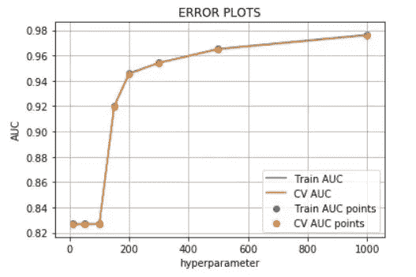

超参数调优后，模型重新训练，我在 Kaggle 记分牌上得了 0.95 分。现在很明显，boosting 算法在这个数据集上会表现得更好。

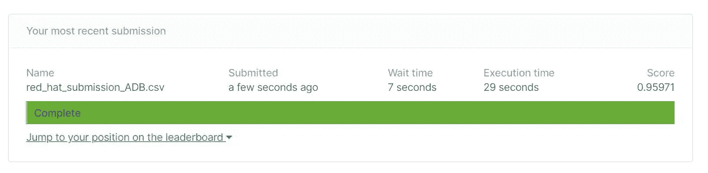

## **灯 gbm:**

最后我决定使用 Lightgbm 算法。对于超参数优化，我使用了贝叶斯优化库。

**贝叶斯优化:**

贝叶斯优化通过构建函数的后验分布(高斯过程)来工作，该分布最好地描述了您想要优化的函数。随着观察值数量的增加，后验分布得到改善，算法变得更加确定参数空间中的哪些区域值得探索，哪些区域不值得探索。

该过程被设计为最小化找到接近最佳组合的参数组合所需的步骤数量

首先，我们编写一个函数，返回我们选择的度量分数。然后，我们指定需要检查的值的范围。最后，我们执行贝叶斯优化库来探索这些值。

优化已完成，数据集已用最佳参数重新训练。我在 Kaggle 记分牌上得了 0.97 分。

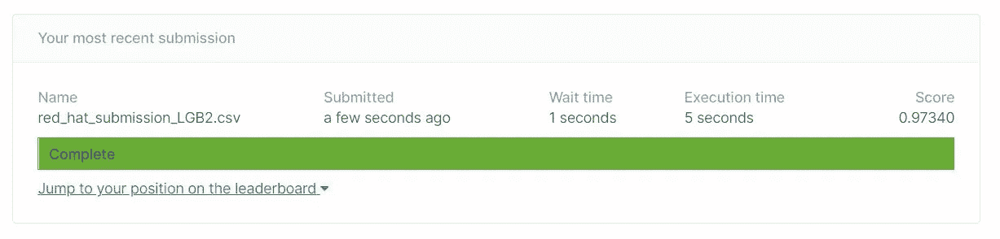

# **结果:**

与其他模型相比，随机森林和逻辑回归的 AUC 得分较低。所有算法上传到 Kaggle 后，根据 ROC 评分进行比较。LightGBM 模型在所有模型中得分最高。

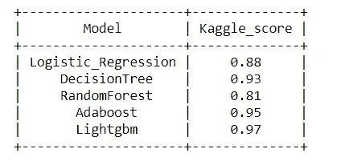

# 进一步改进:

我们也可以使用神经网络来获得更好的分数。根据 Kaggle 的讨论，数据泄漏也可以用来提高分数。

# 参考资料:

[https://www.appliedaicourse.com](https://www.appliedaicourse.com/)

[https://www . ka ggle . com/c/predicting-red-hat-business-value/overview](https://www.kaggle.com/c/predicting-red-hat-business-value/overview)

[https://www . ka ggle . com/c/predicting-red-hat-business-value/discussion/23803](https://www.kaggle.com/c/predicting-red-hat-business-value/discussion/23803)

*可以在*[***Linkedin***](https://linkedin.com/in/durga-shankar-singh)*和**[***Github***](https://github.com/Rony75617/Predict_Red_HAT/tree/master)***上和我联系。****