# 员工流失预测

> 原文：<https://medium.com/geekculture/prediction-of-employee-attrition-ccc77d900d6?source=collection_archive---------17----------------------->

## 机器学习:分类案例研究

## 人力资源分析

Photo by [Cytonn Photography](https://unsplash.com/@cytonn_photography?utm_source=medium&utm_medium=referral) on [Unsplash](https://unsplash.com?utm_source=medium&utm_medium=referral)

*本工作于 2021 年 10 月进行，为* [*数据科学术语项目*](https://www.insaid.co/)*[*INSAID*](https://medium.com/u/5e08d87edf2b?source=post_page-----ccc77d900d6--------------------------------)*的部分完成。**

*除提交人外，其他小组成员有 *Senthil Kumar、Tanu Sadana、Suren Gaur、Sumesh EP、JojoJacob、Srinath、Nihar Patra、Rajatpaliwal、Shubhangi sohoni、Sandeep Jha、Manish surve 和 Anandsubudhi* 。*

*T 业务格局的快速转变意味着人力资源(HR)部门/合作伙伴目前面临许多挑战。由于经济波动以及本地和全球的发展，许多变化正在迅速发生，在广泛的问题上影响着人力资源。当前实践主要包括以下过程:*

*   *一旦员工离职，他或她将接受名为**“离职面谈”**的面谈，并分享离职原因。*
*   *然后，人力资源部的会试着从面试中了解情况，并做出相应的改变。*

*这存在以下问题:*

*   *这种方法太随意了。从面试中获得的洞察力的质量很大程度上取决于面试官的技巧。*
*   *这些见解无法在所有离职的员工中汇总和交织。*
*   *等到提议的政策改变生效时，已经太晚了。*

*随着技术的进步，大多数人力资源部门现在使用**分析工具**来预测员工是否可能**离开**，利用他们的**历史数据**，并随后采取更积极的措施在为时已晚之前联系他们。*

*据麦肯锡**称，人工智能和其他高级分析每年将释放 9.5 万亿至 15.4 万亿**。数据驱动的人力资源决策不仅是这一趋势的一部分，也是人力资源未来的核心。*

# *问题陈述:*

*基于**部门数据**和**员工数据**关于**行政、工作量和相互评估分数** **预测员工是否会留下**以及随后**为了**留住员工**的任何主动步骤**可以被**计划**。*

# *数据集详细信息:*

*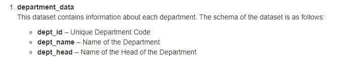*

*Source: Author*

*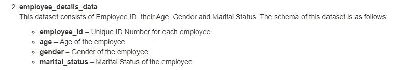*

*Source: Author*

*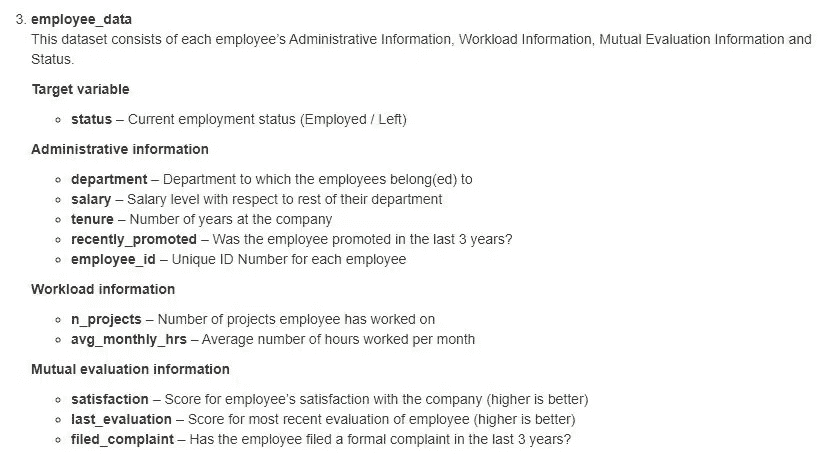*

*Source: Author*

# *数据集和解决方案中存在的挑战:*

*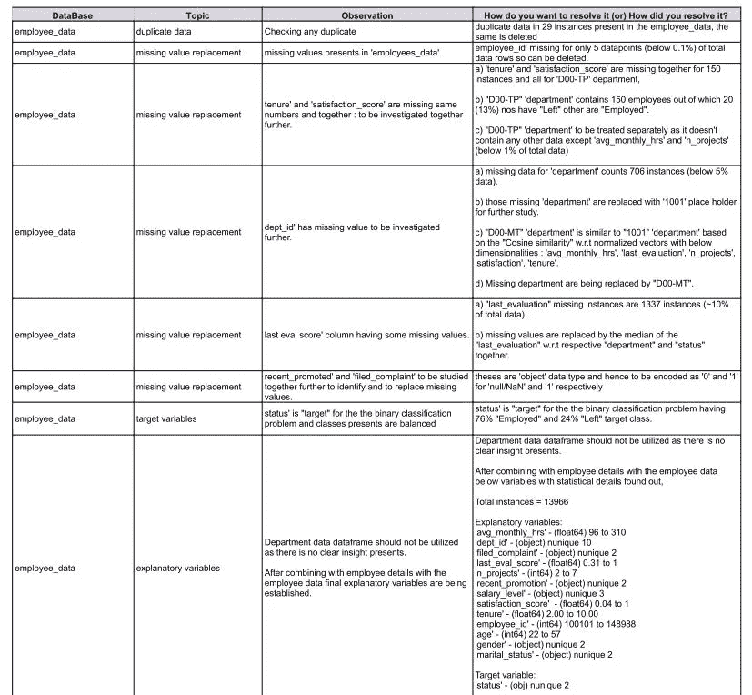*

*Source: Author*

# *缺失值处理:基于余弦相似度*

*[**余弦相似度**](https://en.wikipedia.org/wiki/Cosine_similarity) 是内积空间的两个非零向量之间相似度的度量。它被定义为等于它们之间角度的余弦，它也与归一化为长度都为 1 的相同向量的内积相同。根据后一个定义，余弦相似性仅取决于两个非零向量之间的角度，而不取决于它们的大小。对于任何角度，余弦相似度被限制在区间[-1，1]内。*

*在案例研究中，“部门 id”有缺失值，该缺失值已根据每个唯一“部门 id”中捕获的其他解释变量( **' *groupby* '** )的归一化平均值的余弦相似性，用最相似的“部门 id”进行估算。*

*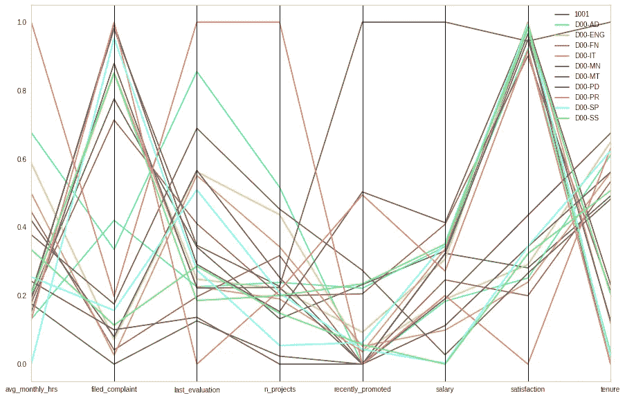*

*Source: Author*

# *缺失值处理:基于中心极限定理*

*在案例研究中，根据 [**中心极限定理**](https://en.wikipedia.org/wiki/Central_limit_theorem) ，一些缺失的连续变量(‘last _ evaluation _ score’，‘tenure’和‘satisfaction’)被各自的‘中位数’所替代。*

*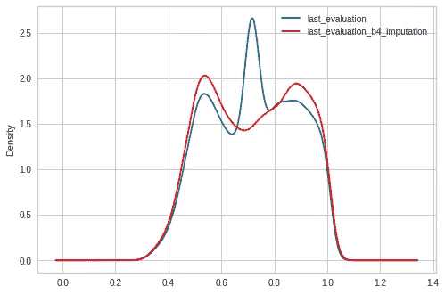****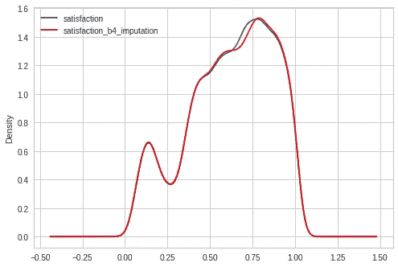*

*Source: Author*

# *解释变量分布的统计偏斜度检查:*

*在概率论与统计中， [**偏度**](https://en.wikipedia.org/wiki/Skewness) 是一个实值随机变量关于其均值的概率分布的不对称性的度量。偏斜值可以是正的、零、负的或未定义的。*

*在本研究中，对解释变量的偏斜度进行了检查，同时进行了一些基本的数学转换，以使数据更加准确。结果如下，*

*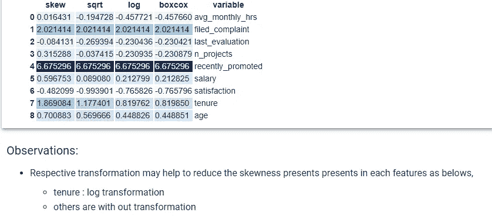*

*Source: Author*

# *分类变量的基本 EDA“状态”智能研究:*

*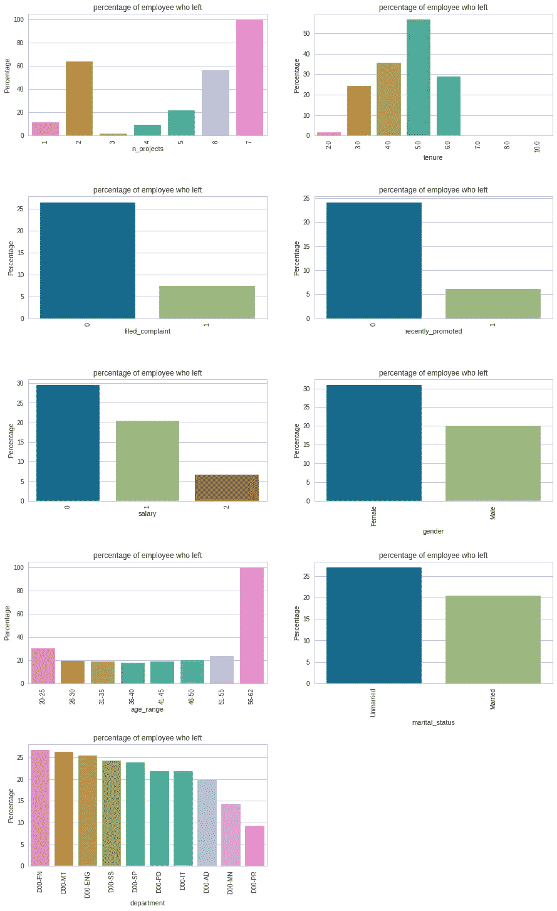*

*Source: Author*

# *基于连续变量的基本 EDA“状态”智能研究:*

*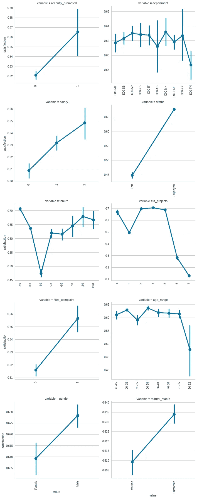*

*Source: Author*

*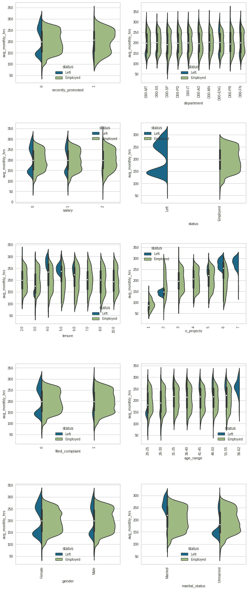*

*Source: Author*

# *观察结果:*

*完成了 7 个项目的员工离开了公司，他们大多表示不满意，而完成了 2 个项目的员工中有 60 %已经离开了公司，也许他们被解雇了。*

*“任期”为 5 年的员工中，大约 50%已经“离开”了公司。随后，4 年和 6 年“任期”的员工“离开”了公司，这意味着新员工(2 或 3 人)和老员工(超过 6 人)离开公司的人数超过了中层员工(4，5，6 人)。*

*那些没有得到‘最近 _ 晋升’的人‘离开’的更多。*

*更多的人实际上没有“投诉”和“离开”意味着人们对投诉系统没有信心。*

*就工资而言，低薪员工的离职率高于中高薪员工。那些拿高薪的人只有 5 %离开了公司*

*几乎 30%的“女性”员工已经“离开”，而只有 20%的“男性”已经“离开”。*

*年龄组' 56-62 '有最高'左'雇员。*

*超过 25%的‘未婚’人群已经‘离开’了。*

*在“D00-FN”、“D00-MT”和“D00-ENG”部门中，几乎有 25%的员工“离职”。*

*在任期图中，我们可以看到，只工作了 2 年的员工离开了公司，但 3 年来，离开的员工工作时间不到 160 小时。从图中我们可以得出结论，他们被公司解雇了，但 4、5、6 年来，离开的员工工作时间几乎超过了 250 小时，所以这表明，在这么多的努力工作之后，他们没有取得进展，所以他们为什么离开。*

# *工程特性:*

***【影响】**和**【表现】**是两个特征，其定义如下:*

*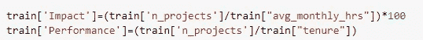*

*Source: Author*

***【影响】**这里试图捕捉每个项目每月平均花费时间的重要性；减去小时数。员工对单位项目的“影响”更大。*

***“绩效”**试图确定员工在过去几年中的绩效；预计随着“任期”的增长，业绩将会上升。*

# *重要特征识别:*

*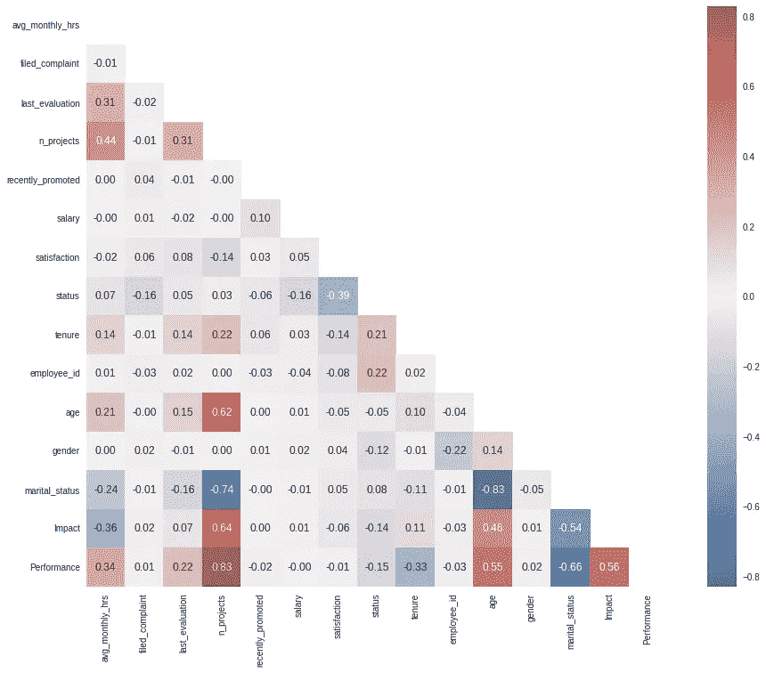*

*Source: Author*

*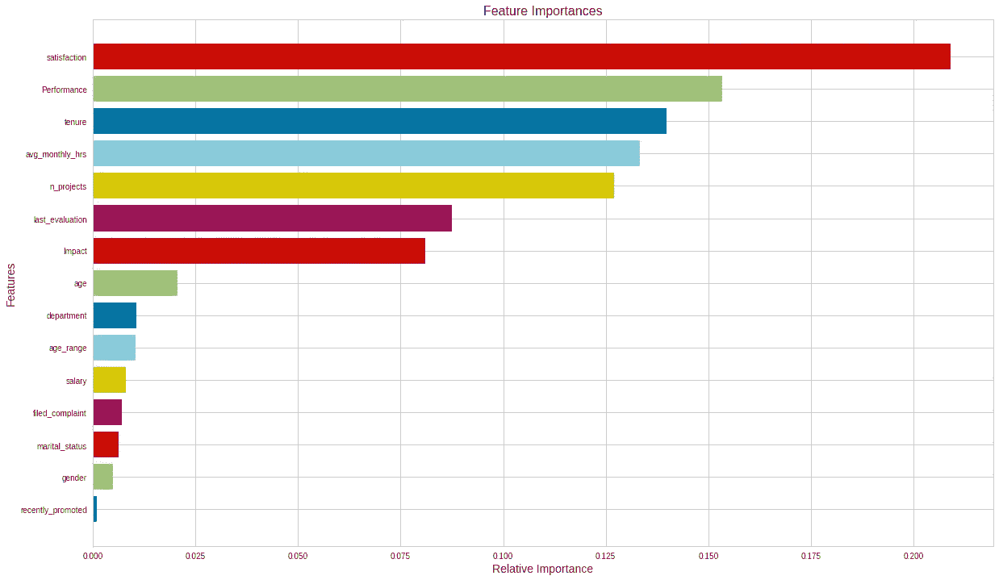*

*Source: Author*

*使用*‘select from model’*以及*‘RandomForestClassifier’*和*‘FeatureImportances’*选择一些特征。但是，将使用“所有”和“重要”功能对模型进行测试，随后将选择最佳模型。*

# *机器学习模型构建:*

*一些分类算法尝试使用“所有”特征，并且发现性能随着“重要”特征而提高。*

*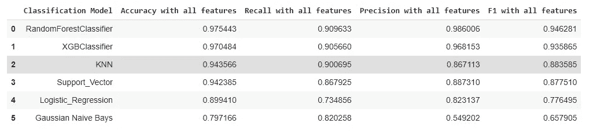*

*Source: Author*

*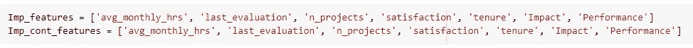*

*Source: Author*

*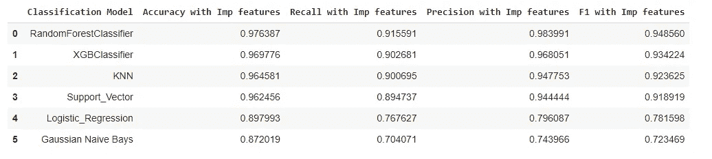*

*Source: Author*

*“GridSearchCV”和“F1-macro”进一步提高了性能，已被考虑作为评估指标。结果摘要如下，*

*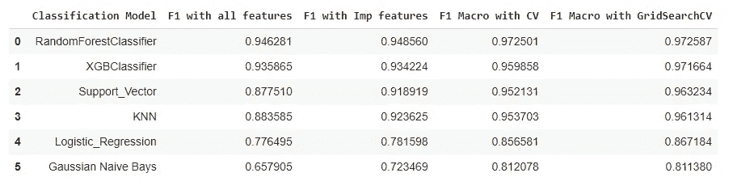*

*Source: Author*

# *前三种机器学习模型性能曲线:*

*精确召回曲线和 ROC AUC 已经对前 3 个模型进行了评估，性能是令人满意的。*

*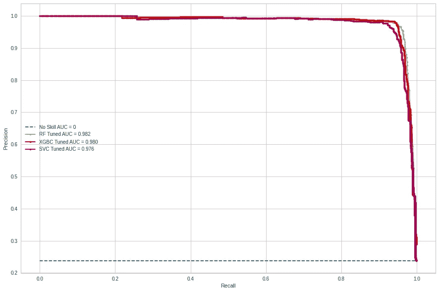**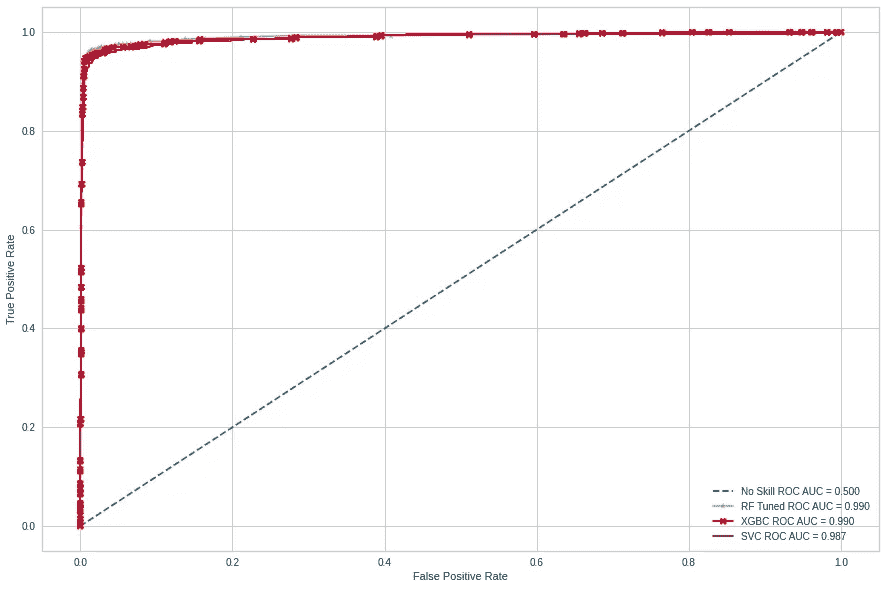*

*Source: Author*

# *由测试集上的 top-3 模型绘制的预测概率图:*

*已经绘制了类别‘1’(‘左’状态雇员)的概率，并且它表明前 3 个模型被很好地构建以对类别进行分类，*

*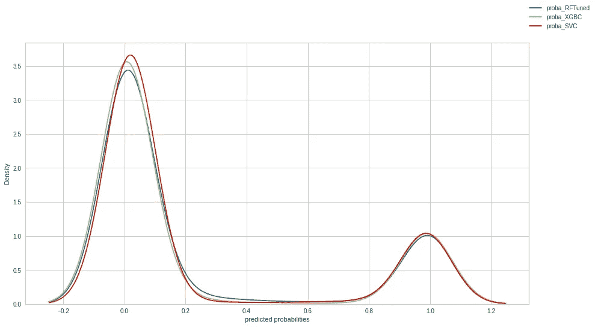*

*Source: Author*

# *由 top-3 模型在未见过的数据集上绘制的预测概率图:*

*已经使用前 3 个模型为“看不见的数据集”绘制了类别“1”(“左”状态雇员)的概率，*

*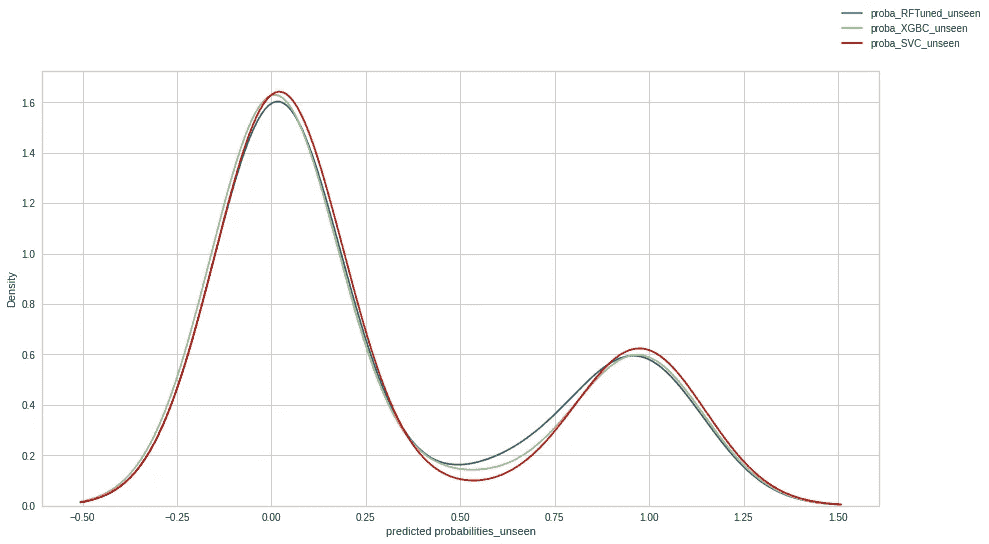*

*Source: Author*

*已经提交了“看不见的数据”的结果，结果也令人满意，如下所示:*

*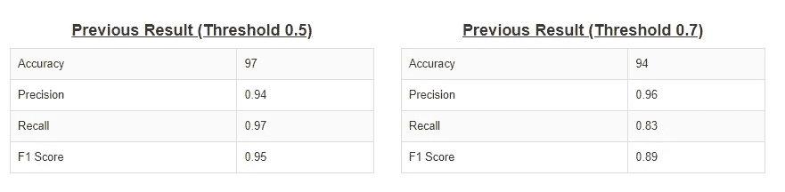*

*Source: Author*

# *主要途径:*

*   *针对**员工流失**问题的**二元分类**模型已经用 **employee_data** 建立好。*
*   *为了清理和**生成特征**，采用了详尽的**数据检查&准备**技术。*
*   ***统计变换**按照要求进行测试和应用，以减少偏斜度。*
*   *根据需要，基于**中心极限定理和余弦相似度**实现了**缺失值**的填补。*
*   ***在装配模型之前，连续特征**被**标准化**。*
*   ***用于**分类特征**的标签、序数和一元编码**技术；然而，根据**特征重要性分数**，它们都被拒绝。*
*   ***【影响】**和**【性能】**是最终模型中选择的两个工程特性。*
*   ***RandomForestClassifier** 和 **XGBoostClassifier** 表现最好，类被很好地识别。*
*   *所有型号都使用**所有特性**和选定的**重要特性(基于特性重要性)**进行测试。*
*   ***“F1-得分”**在 **0.95** 以上找到的分割“测试”数据上实现，并且在**多重交叉验证**期间也实现。*
*   *使用**‘GridSearchCV’**在**超参数调整**期间观察到的模型改进。*
*   ***支持向量、KNN 和高斯朴素贝叶斯**在“重要特征”方面获得了超过 4%的“F1 分”，而**在**超参数调整**期间，所有模型**都获得了超过 2%的“F1 分”。*

*这里是 [**GitHub 链接**](https://github.com/pathakchiranjit/GCD_Capstone_Oct21) 了解代码详情。*

**如果你觉得这篇文章有用，请点赞并分享，也欢迎发表评论。也可以在*[*LinkedIn*](http://www.linkedin.com/in/pathakchiranjit)*上找我。有兴趣了解工程领域的数据分析、数据科学和机器学习应用的更多信息吗？通过访问我的* [*中简介*](/@pathakc) *来探索我以前的文章。感谢阅读。**

**- Chiranjit**