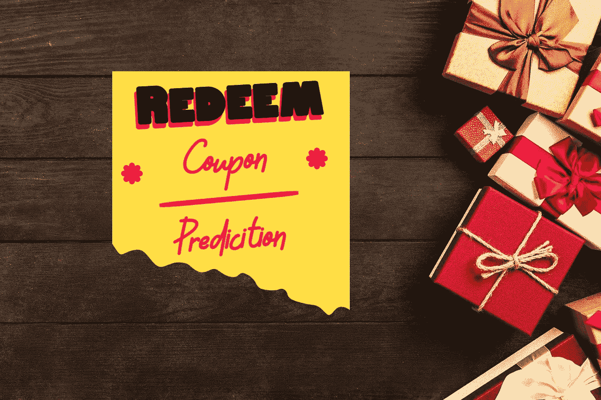

# 兑现优惠券倾向的预测分析案例研究

> 原文：<https://medium.com/geekculture/predictive-analytics-case-study-on-propensity-to-redeem-a-coupon-39e0d290d7bc?source=collection_archive---------5----------------------->

## 对预测优惠券兑换状态进行深入分析，以制定更精确、更有针对性的优惠券和营销策略

Image by [George Dolgikh](https://pixabay.com/users/giftpundits-9747156/?utm_source=link-attribution&amp;utm_medium=referral&amp;utm_campaign=image&amp;utm_content=3587237) from [Pixabay](https://pixabay.com/?utm_source=link-attribution&amp;utm_medium=referral&amp;utm_campaign=image&amp;utm_content=3587237)

电子商务公司采用各种营销策略，通过活动、广告、免费产品…