# 使用数据分析工具对可修复系统进行预测建模

> 原文：<https://medium.com/geekculture/predictive-modelling-b18bb7bf85db?source=collection_archive---------44----------------------->

## Python 和工业 4.0

## 从被动维护转变为主动维护

Photo by [Jen Theodore](https://unsplash.com/@jentheodore?utm_source=medium&utm_medium=referral) on [Unsplash](https://unsplash.com?utm_source=medium&utm_medium=referral)

对于系统或产品的**【可靠性】**研究，任何研究人员都提出了几种评估技术，但由于其高度深奥的性质和用户友好的统计工具的不可用性，在大多数实施中很少被接受。然而，最近随着*“可靠性”python 库*的开发，它变得简单且易于执行。

新产品的成本(纠正性维护成本:CMC)和维修成本(预防性维护成本:PMC)广义上是在将系统或产品分类为可维修或不可维修时考虑的两个度量标准。不可修复的系统或产品是像灯泡这样的“一次性”设备，或是像起搏器这样更复杂的设备；而电脑、汽车、飞机等。是可修复系统或产品例子。这就是为什么在执行各种可靠性任务时，不可修复的系统或产品与可修复的系统或产品受到不同的对待。对于可修复系统来说，可靠性建模通常更加复杂，从成本优化的角度来看，可靠性建模对于企业来说总是至关重要的。

Photo by [JESHOOTS.COM](https://unsplash.com/@jeshoots?utm_source=medium&utm_medium=referral) on [Unsplash](https://unsplash.com?utm_source=medium&utm_medium=referral)

可修复系统最独特的属性是其*“可用性”*(产品或系统能够执行其所需功能的时间百分比)。当由于出现故障而无法执行所需功能时，必须修复系统以恢复功能。系统修复得越快，可用性就越高。除了*【可用性】*之外，用于表征可修复系统的其他指标有*【平均无故障时间】* & *【故障发生率(ROCOF) /故障率】*

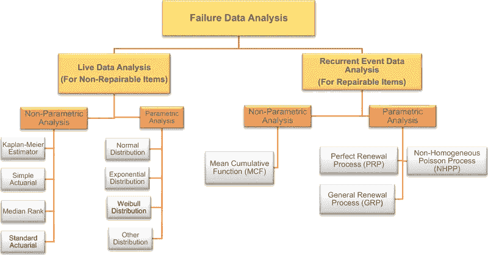

Source: [https://reliabilityweb.com](https://reliabilityweb.com/assets/uploads/articles/10409/figure1.png)

在我的 [**早期研究**](https://www.linkedin.com/pulse/predictive-maintenance-40-handling-binary-class-dataset-pathak/) 中，建立了一个 ML 模型来根据过程参数对故障进行分类，但是它没有估计系统的动态(预测故障时间)。在本研究中，系统的可靠性建模在下面逐步进行和阐述，
***1。数据处理
2。分布的拟合优度
3。动态估计
4。平均累积函数(MCF)估计
5。预期寿命图表***

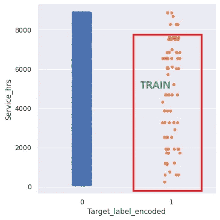

Source : Author

1.  **数据处理:**数据来源于[**【bigml】**](https://bigml.com/user/czuriaga/gallery/dataset/587d062d49c4a16936000810)网站，包含**8784 个观测值。**主要重点是研究和理解故障的内在动力*“是”*数据点。服务时间至 7604(最后一次故障发生在 8000 小时之前。)被考虑用于建模，剩余周期被用于验证(假设延长周期落在系统寿命的[浴盆曲线](https://en.wikipedia.org/wiki/Bathtub_curve)的相同平坦区域内)。

**2。拟合优度分布:**模块*“可靠性。Fitters"* 能够拟合多种概率分布。这是为了估计系统或产品故障的性质。对于本案例研究,“对数逻辑”分布在数学上显示了良好的结果，但概率图呈 S 形或弯曲，这表明数据可能是多种分布的混合*(*[*Mixture _ Model*](https://reliability.readthedocs.io/en/latest/Mixture%20models.html)*)*，或者故障模式是“竞争”结束系统的寿命([*Competing _ Risks _ Model*](https://reliability.readthedocs.io/en/latest/Competing%20risk%20models.html))。混合物模型表现出有希望的结果，并使得能够进一步进行后续研究。

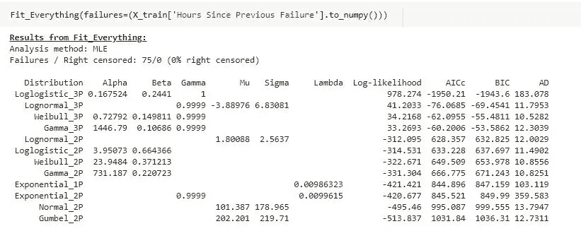

Source : Author

Source : Author

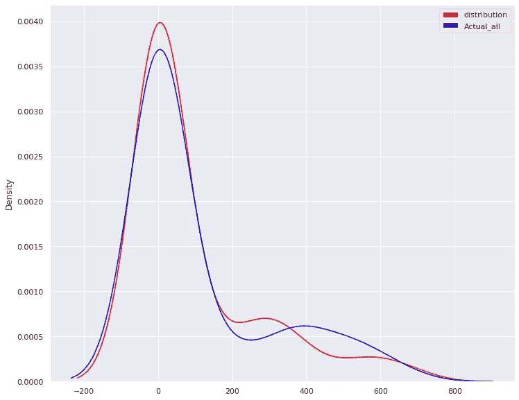

Source : Author (Mixture distribution fits best)

**3。动态估计:**如前所述，对于可修复系统的建模，即“故障率”(工程系统或部件发生故障的频率，以单位时间内的故障数表示)，要考虑的主要指标是*“生存函数”*(设备或感兴趣的对象在任何指定时间后存活的概率)、ROCOF(用于对故障间隔时间内的趋势(恒定、增加、减少)和 MTBF(正常系统期间机械或电子系统的固有故障之间经过的时间)下图显示了同样的情况，

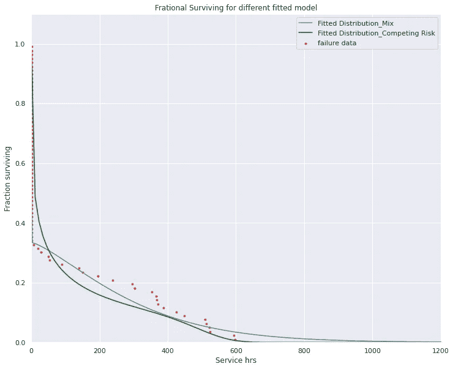

Source : Author

Source : Author

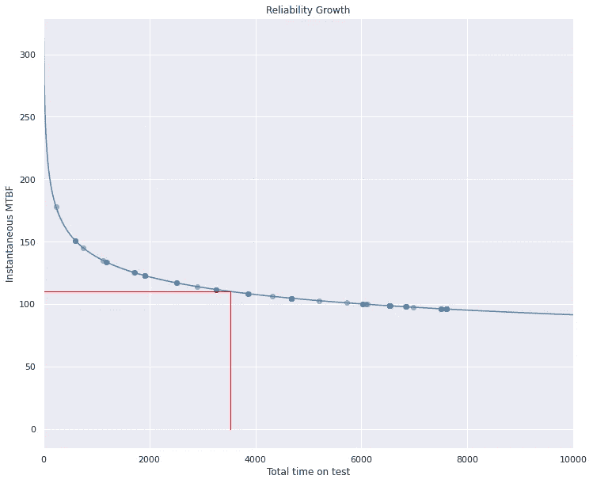

Source : Author (Worsening system)

从上面的图中可以清楚地看出，系统的故障率并没有通过维修得到补偿，这使得系统及其服务/运行时间进一步恶化。

**4。平均累积函数(MCF)估计:**为了使一个可修复系统发挥作用，必须适当设计一段时间内的累积修复率。对于这个案例研究，同样的估计在模拟它的系统动力学后会变得更糟。估计 MCF(显示事件重复发生的累积次数的累积历史函数，如随时间推移的维修)将给出系统未来预期寿命的提示，并且可以相应地计划预测性维护机制。这里参数 MCF 被认为是假设每个修复是相同的。下图显示了结果，

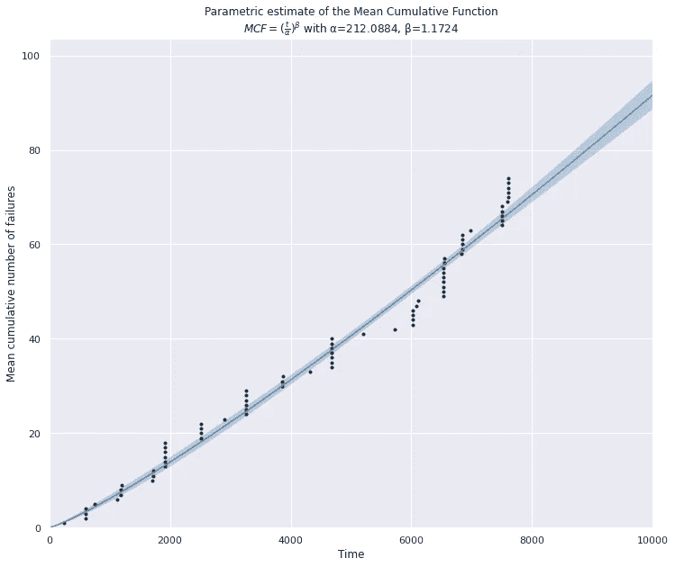

Source : Author

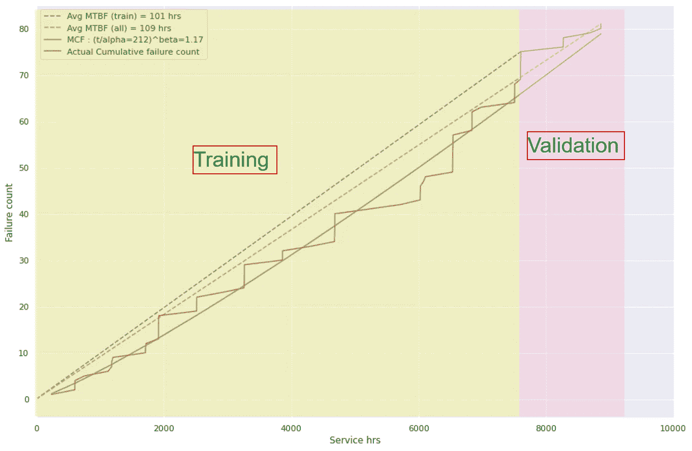

Source : Author

从上面的图中可以看出，由于预测的 MCF 或多或少地遵循该模式，所以验证集分布与训练集分布相差不大。因此，在某种程度上，系统的寿命可以用某种置信度(或相关概率)来预测。

**5。预期寿命图:**根据上述模型，对预期寿命(hrs。)是根据系统或产品的当前服务/运行寿命(小时)估算的。)及其相关的失败概率。相同的表格和图表附在下面，

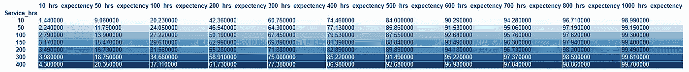

Source : Author (Life expectancy chart)

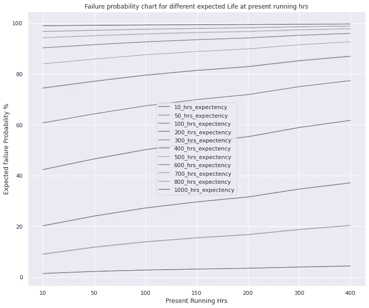

Source : Author

因此，预防性维护周期可以从上表中有偏见地选择，因为过度维护可能导致系统或产品不必要的成本和停机时间。为了将成本交互包括到维护计划中，可以使用来自同一个 python 库的*“最优 _ 替换 _ 时间”*函数。

为便于计算，假设维修行动有助于使故障系统或产品恢复“旧的/直到最后可操作的状态”(NHPP:非同质中毒过程假设)。将 PMC 视为 10 个单位，在不同的 CMC (30 个单位、50 个单位和 80 个单位)下，估计最佳更换/维护时间框架。还研究了不同组的 PMC 和 CMC，结果非常有趣，因为*“最佳替换时间”*仅取决于它们的比例。如下图所示，

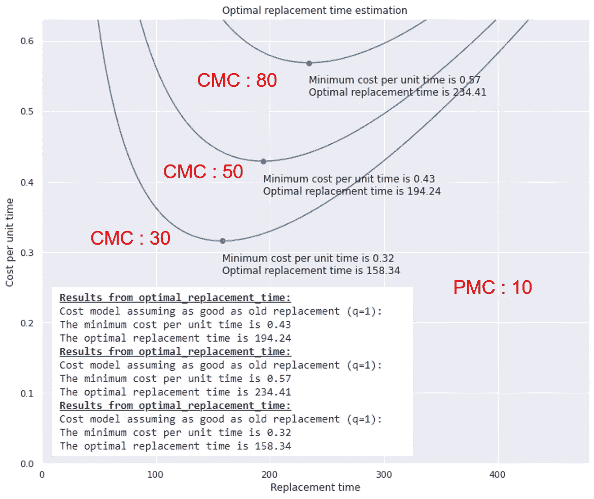

Source : Author (PMC : 10unit, CMC :30unit, 50unit & 80unit)

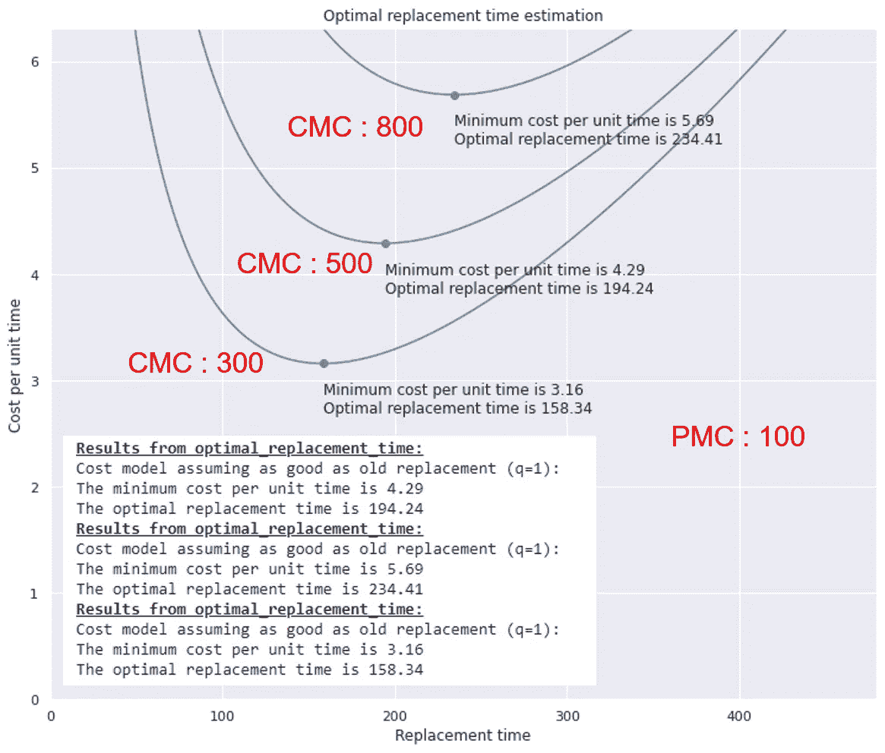

Source : Author (PMC : 100unit, CMC :300unit, 500unit & 800unit)

**结论:**文章总结了不可修复和可修复系统或产品之间的基本区别、通过数据分析工具的根本原因分析方法、故障动力学(增长率、ROCOF、MTBF 和生存函数)研究以及随后用于规划可修复系统定期预防性维护的 MCF 估计。它还包含数据集的后续实现。

**研究的局限性:**研究期间所做的基本假设在如下所述的大多数现实世界应用中成立，
**【a】**训练/验证集属于相同的分布(意味着预测模型必须特定于产品或系统)，
**b)** 非同质中毒过程(实际上，明智的做法是修复系统或产品，使其恢复到“最后可操作状态/旧”的程度，而不是采取持续的修复行动，使其恢复到“原始/新”状态这也意味着所有的修复步骤都是相同的(参数 MCF 估计的假设)
**【c)**成本相互作用研究被直观地探索，因为原始数据集不包含任何关于成本相互作用的信息。结果表明，*“最佳更换时间”*取决于系统动力学和 PMC 与 CMC 的比值；而不是它们的实际价值。

**参考文献:**
1。[《可靠性》python 库文档](https://reliability.readthedocs.io/en/latest/index.html)
2。特林达德，大卫和内森，斯瓦米。"可修复系统现场数据的统计分析."
3。[*http://www.itl.nist.gov/div898/handbook/,，NIST/SEMATECH 统计方法电子手册*，2021 年 3 月 21 日](https://doi.org/10.18434/M32189)。

**免责声明:** 数据集被屏蔽，因此数据点可能显得不寻常。然而，要求读者更多地关注方法和基本概念，而不是所使用的绝对数据和数字。

*如果你觉得这篇文章有用，可以随时在 GitHub 上查看* [*我的回购*](https://github.com/pathakchiranjit/Reliability) *。你也可以在*[*LinkedIn*](http://www.linkedin.com/in/pathakchiranjit)*上找我。探索我的* [*中型简介*](/@pathakc) *。感谢阅读。*

*- Chiranjit*