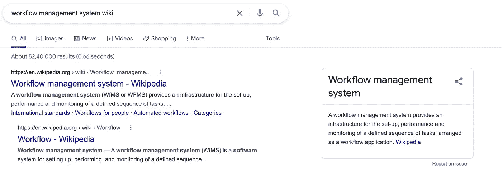
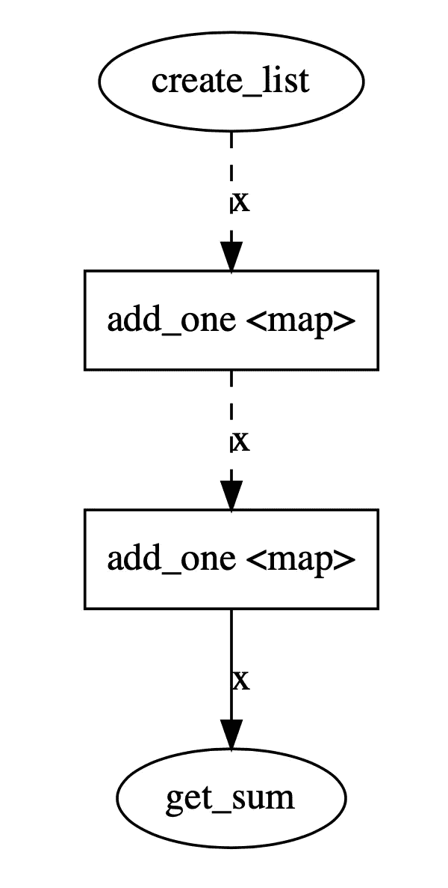
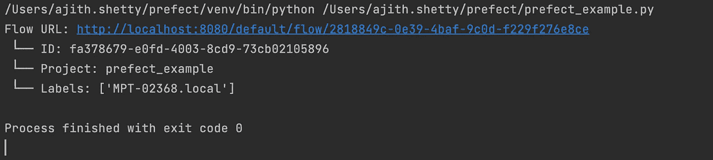
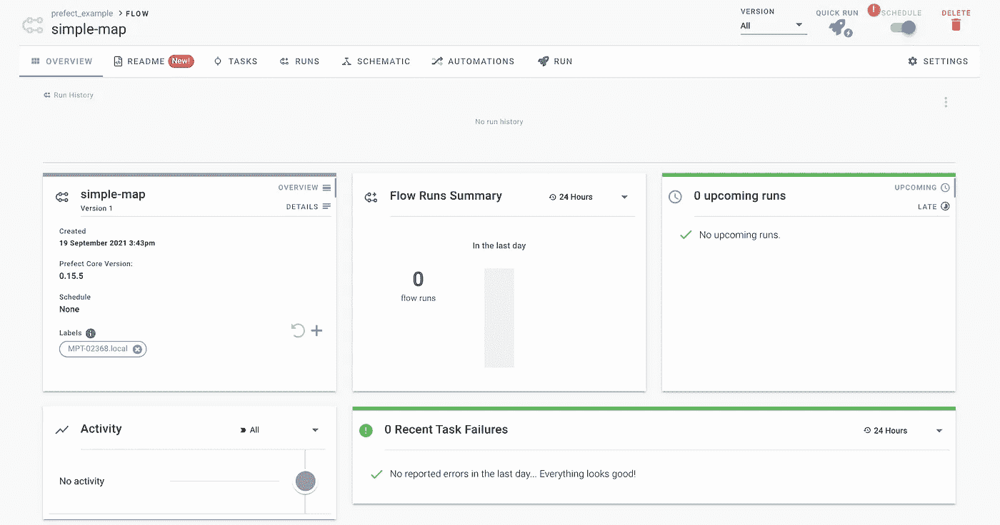
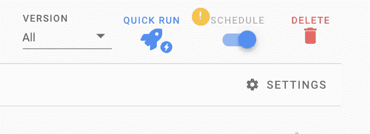
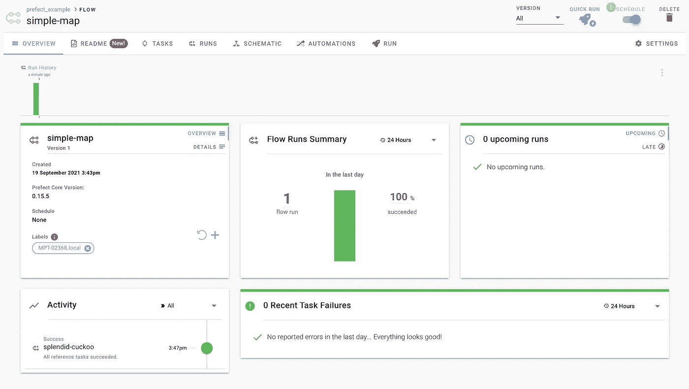
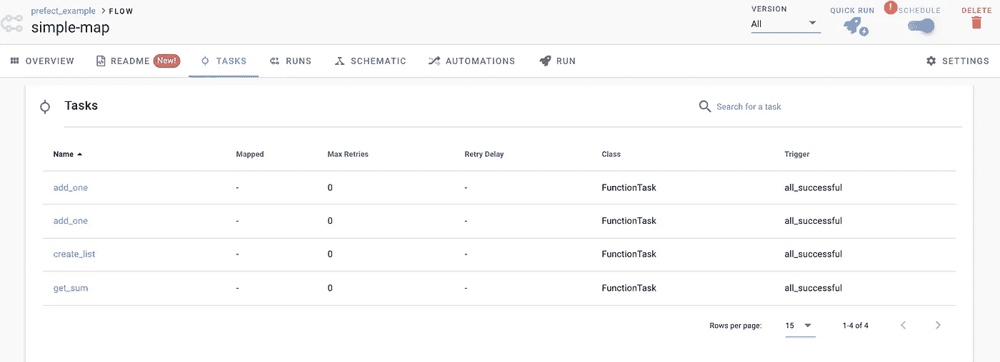

# 级长可能是完美的

> 原文：<https://medium.com/geekculture/prefect-could-be-perfect-a318b9b1ad6e?source=collection_archive---------11----------------------->


source: [https://github.com/PrefectHQ/prefect](https://github.com/PrefectHQ/prefect)

在 21 世纪，现代数据工程的概念已经赢得了它的名字和声誉。

我们不讨论如何将数据从源 A 接收到目的地 b。我们还需要担心如何获取 XYZ，如何动态应用一些业务核心逻辑，以及如何将目的地置于另一个完全独立于所有系统的系统中。

真实世界的用例可能比这更糟糕、更复杂。

Prefect 似乎通过保持“作业即代码”下的逻辑简单解决了这个问题。

# 长官

简单来说完美就是一个工作流管理系统。



Prefect 的建立是为了克服当前现代数据工程系统中的问题性区域，同时为用户提供灵活性，在建立流系统时负担更少。

核心思想是使用 python 来构建你的工作，但是使用 Decorators。

## 一个简单的事实:

与包括整个气流平台在内的任何其他工作流引擎相比，Prefect 已经拥有了更多的单元测试和更大的测试覆盖面

# 任务是功能

提督说你想运行的任务只不过是一个函数。

用 python 写你的函数，应用装饰器，就大功告成了。

用一个更专业的术语来说，你的功能是有特殊规则的任务。它可以是何时运行、依赖性/上游任务或参数解析。

但是核心思想仍然保持不变。任务是功能。

# 工作流是容器

当您定义工作流时，它基本上是一组任务。您已经定义了任务中的核心逻辑，并使用工作流将它们分组在一起。

但是请记住，工作流没有任何特定的逻辑可以运行。

# 通过状态通信

现在，您已经定义了任务和工作流。但是，您将如何在每个任务之间或者与其他工作流进行通信呢？

这可以由州政府负责。状态定义了可以传递的工作流的行为。它适用于任务和工作流。

现在既然你已经理解了完美的概念，让我们来看看它的框架。

# 完美的框架

在高层次上，完美的框架有 3 个最重要的组成部分。

*   工作流定义
*   工作流引擎
*   工作流状态

## 工作流定义

这是您编写核心业务逻辑的地方。或者你说你到底想要你的工作做什么。

用它来定义特殊的规则。假设您希望您的工作如何运行。您可以定义与其他作业的相关性。或者传递一个参数。或者你想做基于数据的 if else 条件。

## 工作流引擎

这是提督的心。我们执行工作、流程或任务的地方。

您已经在工作流定义中定义了特殊规则，在工作流引擎中您将执行相同的规则。

仅仅按顺序“开始”每项任务是不够的；任务可能会因为成功、失败、跳过、暂停甚至崩溃而停止运行！这些结果中的每一个都可能需要不同的响应，要么来自引擎本身，要么来自后续任务。引擎的作用是自省工作流定义，并保证每个任务都遵循分配给它的规则。

## 工作流状态

工作流引擎将在某种状态下结束。

如果一切顺利，这可能是成功。也可能是基于某些条件的失败

通过给每个任务和工作流注入一个强有力的“状态”概念，Prefect 提供了丰富的词汇来描述工作流在执行之前、期间或之后的任何时刻。

因此，全面完善不仅是你的工作流程管理系统的选择。

我们有

1.  被数百个组织采用的气流。
2.  Azure 逻辑应用

# 完美与气流

## 与气流紧密结合

气流有它自己的方式来表示逻辑，以及你将如何运行、执行或调度它们。在某种程度上，我们不是使用气流来解决我们的用例，而是最终转换我们的用例来适应气流架构。

当您想要构建一个复杂的业务逻辑或者完全摆脱气流时，这就成了一个问题。

但是在 Prefect 中，任务是带有装饰器的简单函数。这使得它更容易与您的用例集成。

## 处决日期的混乱

新数据工程师最常见的问题是什么是执行日期。

气流严格依赖于特定的时间:`execution_date`。没有执行日期，任何 DAG 都不能运行，并且任何 DAG 都不能在同一执行日期运行两次。您是否有一个特定的 DAG 需要运行两次，并且两个实例化同时开始？气流不支持这一点；没有例外。

## 数据交换

在数据工程中，我们最常见的需求是在任务之间交流和传递数据。我们不想持久化任何数据，而现代数据工程要求数据在没有持久化的情况下动态传递。

XComs 使用管理员访问权限将可执行 pickles 写入 Airflow 元数据数据库，这具有安全隐患。即使以 JSON 的形式，它也有巨大的数据隐私问题。该数据没有 TTL 或到期时间，这就产生了性能和成本问题。

提督将数据流提升到一流的操作。任务可以接收输入并返回输出，Prefect 以透明的方式管理这种依赖关系。此外，Prefect 几乎从不将这些数据写入其数据库；相反，结果的存储(仅在需要时)由用户可以轻松配置的安全结果逻辑来管理。

# 完美后端

码头集装箱

Prefect 运行在 docker 容器之上，这使得它更易于管理和扩展

## 发动机

它是将所有组件绑定在一起的核心

## 代理人

是负责运行流程、管理

## GraphQL

使用 GraphQL 来查询 API 的使用。

## Postgres

存储作业历史的后端服务器。

我们可以在本地和云中部署 Prefect。

它也支持 AWS Fargate。

如果你不想有任何维护上的麻烦，你可以使用完美云，这是一个完美的管理平台。

# 创造完美的流程

1.  写任务
2.  这基本上是定义核心逻辑的地方
3.  在定义规则的任务上添加一个装饰器。
4.  写一个分组和管理任务的流程图。

就这么简单。

除此之外，您还可以在工作中添加日志记录。

您可以将计划定义为何时运行。

您甚至可以将参数传递给作业。

让我们以一个小 python 为例，向您展示将其转换为 Prefect 是多么容易。

**Python 示例:**

让我们把它转换成提督。

**提督:**

您可以更现实一些，也可以添加一些依赖项。

您也可以添加记录器:

# 演示时间

[](https://docs.prefect.io/core/getting_started/install.html#basic-installation) [## 安装|完美文档

### 提督要求 Python 3.6+。如果您不熟悉 Python，我们建议您安装 Anaconda 发行版。Python 3.9…

docs.prefect.io](https://docs.prefect.io/core/getting_started/install.html#basic-installation) 

让我们先安装库

> **pip 安装“提督[viz]”**

让我们举个例子

[https://gist . github . com/ajithshetty/03 FD 2 a 3c 948518 da e97 d 71 f 5b 9 ea 76 a 5](https://github.com/ajithshetty/PrefectExample/tree/main)

当我们奔跑时

> **f.visualize()**



在开始执行之前，请启动 docker 或 docker-compose

为本地业务流程配置提督

> **提督后端服务器**

一旦代理启动

> **提督服务器启动**

一旦所有组件都在运行，您就可以通过访问 [http://localhost:8080](http://localhost:8080/) 来查看 UI。

请注意，从服务器执行流需要至少运行一个提督代理:

> **提督代理本地启动**

最后，要向服务器注册任何流，调用`flow.register()`。更多详情，请参见[编排文档](https://docs.prefect.io/orchestration/)。

让我们创建一个项目

> **级长创建项目‘级长 _ 示例’**

并在项目中注册我们的代码。


```
f.register(project_name="prefect_example")
```

运行代码后，您会得到以下输出:



让我们导航到用户界面:



点击快速运行



成功运行后:



单击原理图查看相关性


单击任务查看单个任务:



参考:

[](https://www.prefect.io/) [## 完美——数据流自动化的新标准

### 提督是一个新的数据工作流管理系统，专为现代基础设施。提督提供了灵活的…

www.prefect.io](https://www.prefect.io/) [](https://github.com/PrefectHQ/prefect) [## GitHub - PrefectHQ/prefect:自动化数据的最简单方法

### 我们已经为数据科学时代重建了数据工程。提督是一个新的工作流管理系统，专为…

github.com](https://github.com/PrefectHQ/prefect) 

以上演示代码可以在我的回购中找到:

[](https://github.com/ajithshetty/PrefectExample/tree/main) [## GitHub-ajithshetty/prefect 示例

### 在 GitHub 上创建一个帐户，为 ajithshetty/PrefectExample 开发做出贡献。

github.com](https://github.com/ajithshetty/PrefectExample/tree/main) 

阿吉特·库玛尔·谢蒂

大数据工程师—大数据、分析、云和基础设施。

[订阅](https://ajithshetty28.medium.com/subscribe) ✉️ || [更多博客](https://ajithshetty28.medium.com/)📝|| [链接于](https://www.linkedin.com/in/ajshetty28)📊|| [个人资料页面](https://ajithshetty.github.io/)📚|| [Git 回购](https://github.com/ajithshetty/)👓

**对获取全球大数据分析的每周更新感兴趣，请订阅我的:** [**每周简讯**](https://justenoughdata.substack.com/)