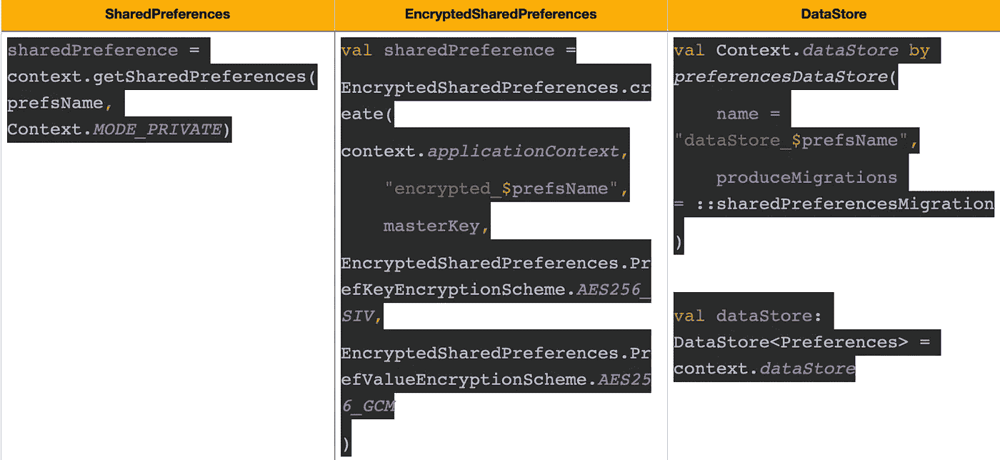
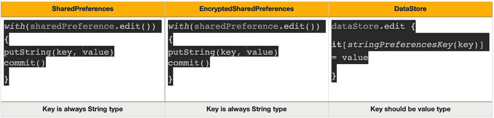
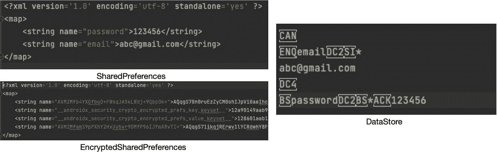
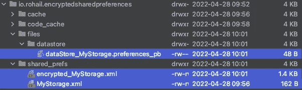
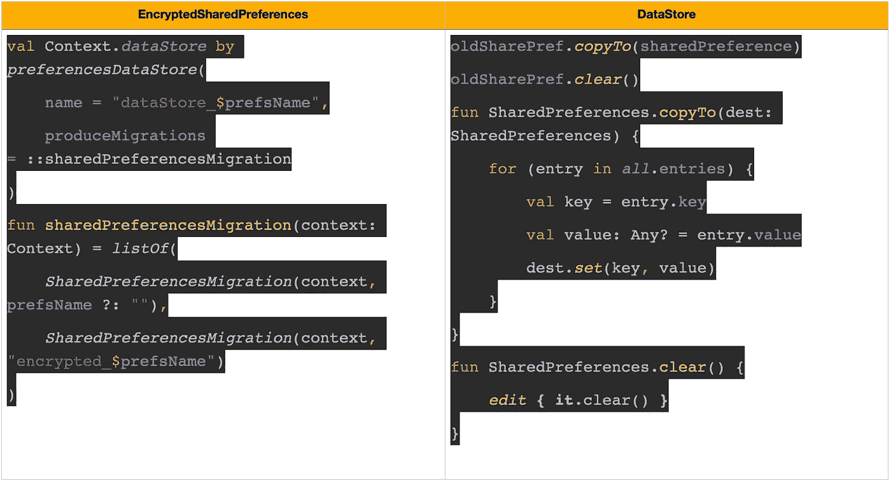

# shared preferences-> encrypted shared preferences-> JetPack 数据存储

> 原文：<https://medium.com/geekculture/preferences-4d7119ffae3e?source=collection_archive---------7----------------------->

Android 的 shared preferences**vs**encrypted shared preferences**vs**JetPack DataStore 之间的比较。

Android 提供了许多存储应用程序数据的方法。其中一种方式叫做共享**偏好**。共享首选项允许您以键、值对的形式保存和检索数据。

SharedPreferences 然后扩展到**加密的共享首选项**，它以相同的方式(键，值对)存储数据，但以加密的方式。密钥和值都是加密存储的。

在很多情况下，开发者希望保存类型化的对象。 **Jetpack DataStore** 是一个数据存储解决方案，允许您使用[协议缓冲区](https://developers.google.com/protocol-buffers)存储键值对或类型化对象。DataStore 使用 Kotlin 协同例程和流来异步、一致和事务性地存储数据。

# 如何获取实例

Initialize & get

# 如何保存键值对

save key-value pair

因为 Preferences DataStore 不使用预定义的模式，所以您必须使用相应的键类型函数为需要存储在`DataStore<Preferences>`实例中的每个值定义一个键。

关于数据存储的一个要点是，您只能使用线程/协程(主要是 IO 调度程序)来执行操作。否则，它会给出以下编译时错误:*“挂起函数‘edit’只能从协程或另一个挂起函数中调用”*

# 首选项数据存储和原型数据存储

数据存储提供了两种不同的实现:首选项数据存储和原型数据存储。

*   **首选项数据存储**使用键存储和访问数据。这种实现不需要预定义的架构，也不提供类型安全。
*   **Proto DataStore** 将数据存储为自定义数据类型的实例。这个实现要求您使用[协议缓冲区](https://developers.google.com/protocol-buffers)来定义一个模式，但是它提供了类型安全。

# 文件结构

现在，如果我们在 explorer 中查看首选项文件，我们可以清楚地看到共享首选项不是加密数据，而加密共享首选项是加密数据(密钥和值都是加密的)。

如果我们检查数据存储区的首选项文件，则它不会被加密，并且没有提供使用加密数据存储区的方法。虽然，谷歌说*[*如果你目前正在使用*](https://developer.android.com/topic/libraries/architecture/datastore?gclid=CjwKCAjw9qiTBhBbEiwAp-GE0XWPX4HMP70MIfSEy5hWYfepcIqheYhIj2DqhrKZ-WWgqGyH72AyWxoCFdEQAvD_BwE&gclsrc=aw.ds#:~:text=If%20you%27re%20currently%20using%20SharedPreferences%20to%20store%20data%2C%20consider%20migrating%20to%20DataStore%20instead.) `[*SharedPreferences*](https://developer.android.com/topic/libraries/architecture/datastore?gclid=CjwKCAjw9qiTBhBbEiwAp-GE0XWPX4HMP70MIfSEy5hWYfepcIqheYhIj2DqhrKZ-WWgqGyH72AyWxoCFdEQAvD_BwE&gclsrc=aw.ds#:~:text=If%20you%27re%20currently%20using%20SharedPreferences%20to%20store%20data%2C%20consider%20migrating%20to%20DataStore%20instead.)` [*it 来存储数据，请考虑迁移到数据存储。*](https://developer.android.com/topic/libraries/architecture/datastore?gclid=CjwKCAjw9qiTBhBbEiwAp-GE0XWPX4HMP70MIfSEy5hWYfepcIqheYhIj2DqhrKZ-WWgqGyH72AyWxoCFdEQAvD_BwE&gclsrc=aw.ds#:~:text=If%20you%27re%20currently%20using%20SharedPreferences%20to%20store%20data%2C%20consider%20migrating%20to%20DataStore%20instead.)*但是它们不提供安全的数据存储方式。**

****

**File Structure**

# **文件大小**

****

**File size**

**如果您检查文件大小，那么您可以清楚地看到 JetPack 数据存储文件在文件大小方面胜出。**

# **移民**

**在 JetPack DataStore 中迁移非常容易，只需一行代码，而在 Encrypted Shared Preferences 中，您必须遍历新文件的所有条目，并将它们从以前的文件中删除。**

****

**Migration**

**还有更多要讨论的，但对本文来说已经足够了。更多代码示例可以查看我的 Github repo: [链接](https://github.com/rrohaill/DataStorePreferences)**

**或者你可以简单地关注我: [Twitter](https://twitter.com/rrohaill) ， [Linkedin](https://www.linkedin.com/in/rrohaill/) 😊**