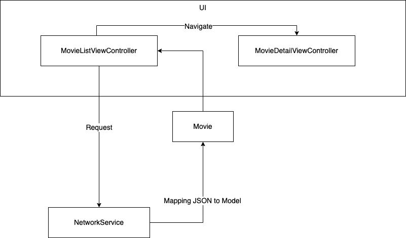
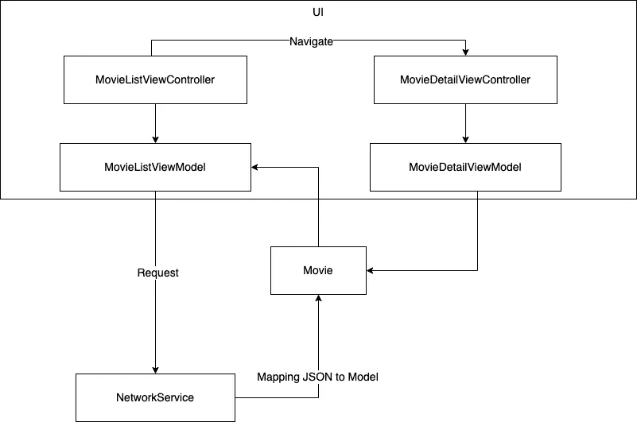
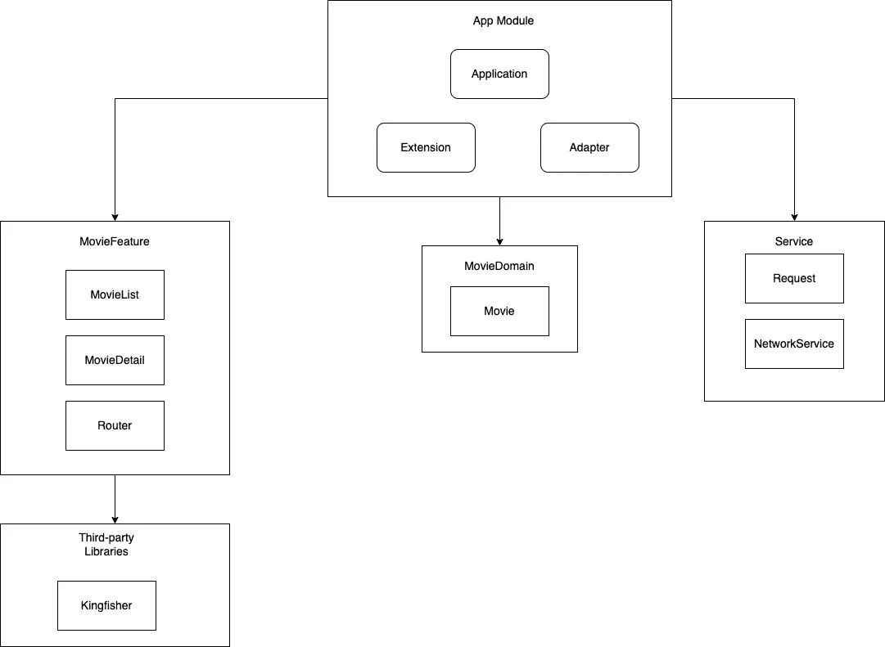
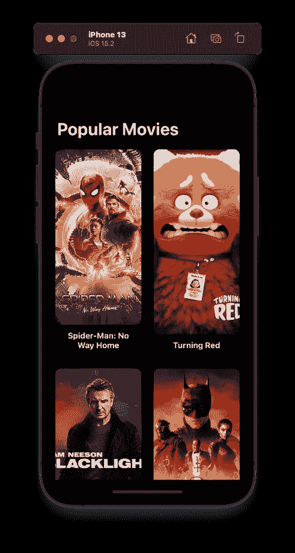
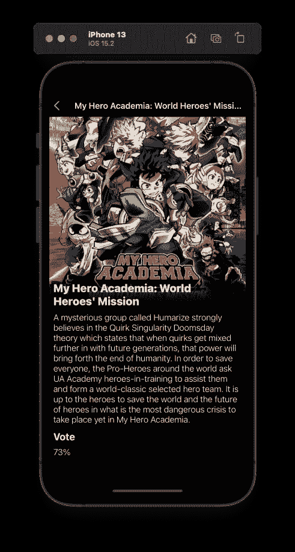

# iOS 中可扩展的模块化架构

> 原文：<https://medium.com/geekculture/prepare-architecture-for-large-ios-application-3ceb8472eb62?source=collection_archive---------2----------------------->

在本文中，我将讨论如何为大型 iOS 应用程序准备设计架构。

Photo by [Anders Jildén](https://unsplash.com/@andersjilden?utm_source=medium&utm_medium=referral) on [Unsplash](https://unsplash.com?utm_source=medium&utm_medium=referral)

为大型应用程序设计架构不是一件容易的事情。该架构的目的是使系统易于开发，易于维护，加速进一步的功能开发，并最大限度地减少任何障碍。

在这篇文章中，我不会谈论像 MVVM，MVP，VIPER，VIP 这样的 UI 架构，或者任何其他的架构。当我们谈论大型应用程序时，我们所指的体系结构是每个软件组件如何相互通信，以及如何管理软件组件之间的依赖关系。我们还必须考虑如何创建一个架构，允许工程师独立地执行特性开发和测试。

让我们试着看看下面的建筑设计:

对于小规模的应用，上面的架构设计是最合理的选择。当然，我们不想做一个过度工程化的技术决策。但是如果我们有一个大规模的应用程序，上面的架构会带来什么问题吗？

上面的体系结构没有表示层，表示层负责格式化数据，以便它可以被 UI 层使用。使用上面的体系结构，格式化数据的任务可能会在视图控制器或电影域中完成。这就是导致未来大规模视图控制器的原因，它使得我们的代码不可测试，并且阻碍了进一步的特性开发。

上面的架构比以前更好，因为我们以视图模型的形式创建了表示层。这个视图模型负责准备可供视图使用的数据。然而，上面的设计架构仍然存在一些问题。表示层可以直接访问网络服务模块和电影模块，这使得视图模型与网络模块和域模块紧密耦合。这导致表示层不能被重用，因为它具有依赖性。有几种方法可以解决这个问题，其中之一是创建一个适配器层，并在组合根中组合对象，在本例中，组合根在主应用程序模块中。

使用上述体系结构，功能模块不再依赖于领域模块或服务模块。领域模块和服务模块也是如此。我们可以重用该模块来加速进一步的功能开发。此外，要在功能模块与服务模块或域模块之间进行通信，需要在主 App 模块中创建一个适配器层。

## 示例项目

为了实施上述架构设计，我使用 Swift package manager 创建了一个具有模块化架构的示例项目。

 [## GitHub-tifoaudii/modular movie application:实现模块化设计的简单电影应用程序…

### 使用模块化设计架构，使用 Swift Package Manager 创建电影应用程序此架构的目的…

github.com](https://github.com/tifoaudii/ModularMovieApplication) 

你可以克隆到上面的库，别忘了在[https://www.themoviedb.org/](https://www.themoviedb.org/)注册以获得 API 密匙。

以下是我制作的应用程序的概述:

我制作的演示应用程序非常简单，有两个功能，包括一个显示热门电影列表的页面，然后当用户点击一部电影时，它将移动到电影详情页面。

## 适配器层实现

这里的适配器层用于在主应用程序模块中组合对象。以下是 MovieListViewController 的代码片段:

如您所见，MovieListViewController 有一个委托属性，负责获取 MovieViewModel 或 ErrorViewModel 的数据。这里它不关心域模块中的数据实体，MovieListViewController 只需要一个能够提供现成可用数据的表示类型。以下是 MovieListViewController 的适配器实现:

MovieListAdapterDelegate 负责执行网络请求以获取电影实体，然后它将创建一个电影视图模型，该模型将使用闭包返回给 MovieListViewController。

除了 MovieListAdapterDelegate，我们还需要在主 App 模块中创建一个 MovieViewModel 的扩展，这样 MovieFeature 模块中的 MovieViewModel 就不会对 Domain 模块产生依赖。

那么如何设置从 MovieListViewController 到 MovieDetailViewController 的导航，又不使彼此相互依赖呢？

我们可以将动作封装到一个 MovieViewModel 中。如上面的代码片段所示，有一个闭包形式的属性，即 selection。

我们只需在电影视图模型上调用选择，这很有用，这样 MovieListViewController 就不必负责处理使 MovieListViewController 和 MovieDetailViewController 相互独立的导航逻辑。

## 结论

要查看整体实现，请克隆我在上面列出的存储库。在构建架构时，不要像 MVVM、VIP 或任何其他架构那样直接考虑解决方案。我们需要理解，架构是基于现有的问题和需求而构建的。我上面做的架构设计不能直接在其他有不同问题和目标的项目中实现。因此，关注问题和想要达到的目标是非常重要的。

谢谢你看了这篇文章，如果这篇文章对你有用，别忘了鼓掌。不要忘记也在我的知识库中打星，如果你有任何反馈或问题，请写在评论区，或者你可以通过我的 [linkedin](https://www.linkedin.com/in/tifoaudi/) 直接问我。再次感谢，下一篇文章再见！