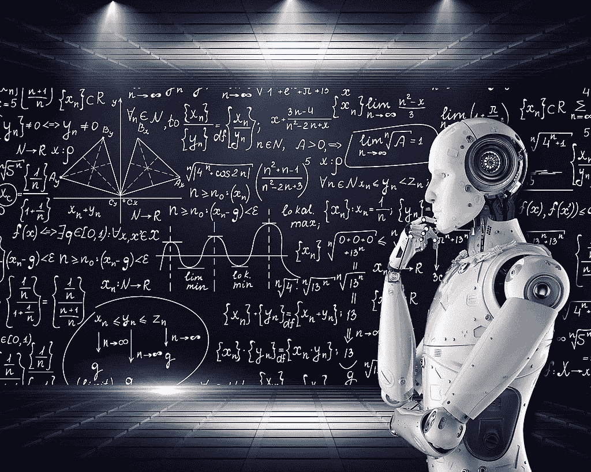

# 准备数据—机器学习

> 原文：<https://medium.com/geekculture/prepare-data-machine-learning-38cc8c09fd67?source=collection_archive---------11----------------------->

使用 Python 和 Jupyter 收集和准备数据

Image by Kroger4 on [Wikimedia](https://commons.wikimedia.org/wiki/File:Artificial_Intelligence_%26_AI_%26_Machine_Learning_-_30212411048.jpg)

# 介绍

机器学习是人工智能的一个子领域。它给程序带来了模仿人类行为的能力。

当我们理解它所需要的不同过程时，它变得更加具体:
-数据收集/探索
-数据准备
-建模
-评估
…