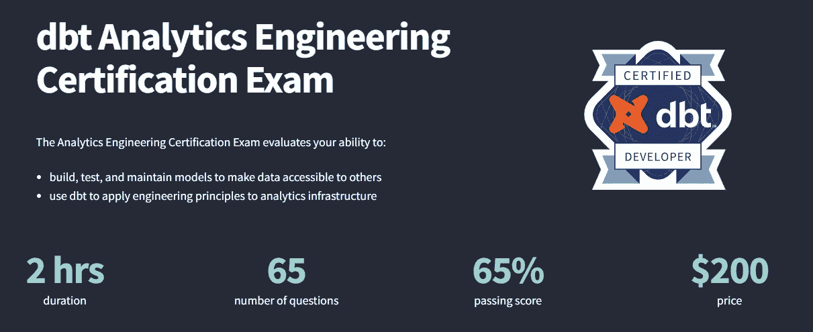
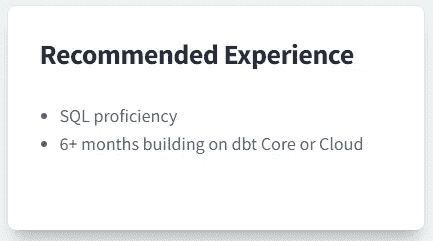
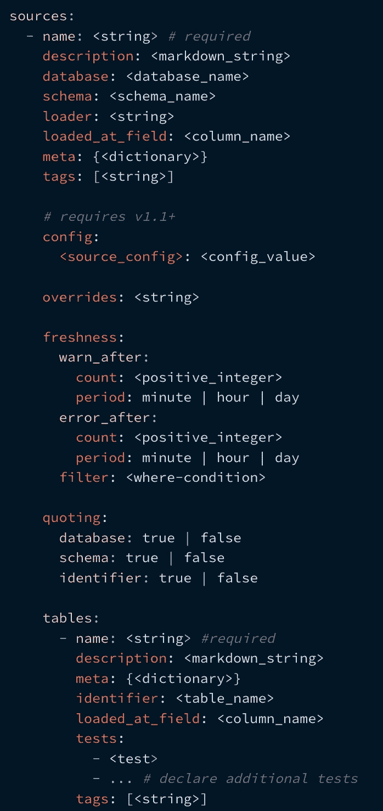
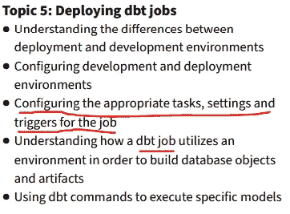

# 准备 dbt“分析工程”认证

> 原文：<https://medium.com/geekculture/preparing-for-the-dbt-analytics-engineering-certification-5496c3ec6e15?source=collection_archive---------2----------------------->

## DBT / DBT 认证

## 准备考试的提示、技巧和建议

这篇文章旨在为那些致力于 dbt 分析工程认证的人提供建议和见解，我希望我有这样的建议！

Photo by [Thought Catalog](https://unsplash.com/es/@thoughtcatalog?utm_source=medium&utm_medium=referral) on [Unsplash](https://unsplash.com?utm_source=medium&utm_medium=referral)

# **议程**

1.  考试概述
2.  应试者
3.  研究方法和使用的资源
4.  认证审查

# 考试概述

考试为【2022 年 6 月首次推出，高招考试详情如下:

*   时长:2 小时
*   问题数量:65
*   及格分数:65%
*   价格:200 美元

[dbt Analytics Engineering Certification Exam Overview | getdbt.com](https://www.getdbt.com/certifications/analytics-engineer-certification-exam/)

其中考试由基于以下主题的问题组成:

*   开发 dbt 模型
*   调试数据建模错误
*   监控数据管道
*   实现 dbt 测试
*   部署 dbt 作业
*   创建和维护 dbt 文档
*   通过版本控制提升代码
*   在数据仓库中为 dbt 建立环境

dbt 还提供了[以下认证学习指南](https://www.getdbt.com/assets/uploads/dbt_certificate_study_guide.pdf)。

## 注意:考试并不专门涵盖 dbt 内容

当你准备考试时，请记住该认证是针对' **dbt 分析工程**'的，而不仅仅是 dbt 认证。因此(正如上面最后两点所指出的)，考试并不专门涵盖 dbt。非 dbt 主题的主要示例包括:

*   金贾模板
*   Git 工作流
*   SQL，例如 cte 的推荐使用

# 应试者

在 [dbt 的认证网页](https://www.getdbt.com/certifications/analytics-engineer-certification-exam/)上，提到了候选人的推荐经验是:

*   6 个多月的 dbt 核心或云构建经验
*   和 SQL 熟练程度

[dbt Analytics Engineering Certification Exam Overview | getdbt.com](https://www.getdbt.com/certifications/analytics-engineer-certification-exam/)

实际上，我建议求职者至少有一年的实践经验。我使用 dbt 已经两年了，但重要的是，我有一年多在生产中设计和部署 dbt 的经验。这是理解实现模式和常见用例考虑的关键，例如:

*   关于如何在生产中编排和运行 dbt 作业的可用选项
*   作为一个团队，您应该使用哪种商定的 dbt-Git 工作流
*   要实现 CDC，使用什么 [dbt 快照策略](https://docs.getdbt.com/docs/building-a-dbt-project/snapshots#detecting-row-changes)(`timestamp`vs`check`)
*   了解如何使用 dbt 管理“硬删除”,例如，了解`[invalidate_hard_deletes](https://docs.getdbt.com/reference/resource-configs/invalidate_hard_deletes)`选项
*   了解可用的 dbt 测试(和 dbt 测试包)的范围，以及如何使用 [store_failures](https://docs.getdbt.com/reference/resource-configs/store_failures) 选项存储结果

## 实践经验是不够的

在 [dbt slack 社区](https://www.getdbt.com/community/)中经常提到的更重要的一点是，实践经验不足以通过考试。相反，候选人应该对支持 dbt 的参考文档和下面描述的其他资源有深刻的理解。

# 研究方法和使用的资源

作为起点，我很自然地浏览了 dbt 的[认证学习指南](https://www.getdbt.com/assets/uploads/dbt_certificate_study_guide.pdf)作为我的第一站。

## 免费在线 dbt 培训课程

学习指南就是说通过 dbt 的[(免费)在线课程](https://courses.getdbt.com/collections)。我发现这些课程都非常有用，尽管我特别向 dbt 新手推荐“ [dbt 基础课程](https://courses.getdbt.com/courses/fundamentals)”。

[dbt's (free) online training courses | courses.getdbt.com](https://courses.getdbt.com/collections)

## 第一个关键建议:研究 dbt 文档、参考和指南文档

我强烈建议任何考虑参加考试的人首先详细学习 dbt 网站上的官方文档。在 [dbt slack 社区](https://www.getdbt.com/community/) #dbt-certification channel 上，一个常见的主题是经验是如何不够的，以及开发人员如何没有接触到很多 dbt 功能。我建议克隆 dbt 的 [jaffle_shop 项目](https://github.com/dbt-labs/jaffle_shop)，并仔细阅读 dbt 的文档以复制所描述的特性。

我发现 dbt 网站文档特别有用:

*   [dbt Docs | getdbt.com](https://docs.getdbt.com/docs/introduction)
*   [dbt 参考| getdbt.com](https://docs.getdbt.com/reference/dbt_project.yml)—我发现这一节特别有用。特别是，我用这个复制了 dbt 推荐的 [dbt 项目结构](https://docs.getdbt.com/guides/best-practices/how-we-structure/1-guide-overview)，并创建了 [dbt 的项目清单](https://docs.getdbt.com/blog/essential-dbt-project-checklist)中描述的功能的工作示例。
*   [dbt Guides | getdbt.com](https://docs.getdbt.com/guides/best-practices)—这里一个特别有用的标注是“ [legacy](https://docs.getdbt.com/guides/legacy/debugging-errors) ”部分。这一节中有两个考试主题被掩盖了:“调试数据建模错误”和“在数据仓库中为 dbt 建立环境”。因此，我强烈建议您熟悉这一部分。

[dbt debugging approach on dbt Guides | getdbt.com](https://docs.getdbt.com/guides/legacy/debugging-errors)

## 第二个重要建议:熟悉 dbt 资源属性配置和 Jinja 函数

我强烈建议详细了解不同 dbt 资源可用的不同配置选项(文档[链接](https://docs.getdbt.com/reference/configs-and-properties))。一种好的说法是——您对 dbt 源可用的各种配置选项有信心吗，如下所示？你能从头开始写这些吗？

[Example of some of the source property config options available](https://docs.getdbt.com/reference/source-properties)

**dbt Jinja 函数(** [**链接**](https://docs.getdbt.com/reference/dbt-jinja-functions) **)**

dbt 中有一系列 jinja 函数可以帮助您的代码变得枯燥。我强烈建议尝试创建自己的简单宏，以了解哪些常见的 dbt Jinja 函数和变量可供使用。

[Example of some of the dbt Jinja functions available](https://docs.getdbt.com/reference/dbt-jinja-functions)

## dbt 博客帖子

除了培训课程，备考指南还列出了 dbt 博客文章的链接——这些文章的主题在考试中出现了！我发现与考试特别相关的博客帖子如下:

**dbt 项目结构相关岗位**

*   [我们如何配置雪花| getdbt.com](https://www.getdbt.com/blog/how-we-configure-snowflake/)
*   [我们如何构建我们的 dbt 项目| getdbt.com](https://docs.getdbt.com/guides/best-practices/how-we-structure/1-guide-overview)—注意:在 dbt 将内容移植到他们的网站之前，这原本是一篇博客文章。我发现构建所描述的目标结构有助于理解一些决策和好处。
*   你的基本 dbt 项目清单| getdbt.com——稍微高级一点，但也是最有益的，尤其是当你彻底检查它的时候。
*   [让你的数据仓库井井有条的五条原则| getdbt.com](https://www.getdbt.com/blog/five-principles-that-will-keep-your-data-warehouse-organized/)—其中提到的一些东西与[我们如何构建 dbt 项目](https://docs.getdbt.com/guides/best-practices/how-we-structure/1-guide-overview)中提到的密切相关。强调了对这些主题的重视。

**与 dbt Git 工作流相关的帖子**

*   [如何评论一篇分析公关| getdbt.com](https://www.getdbt.com/blog/how-to-review-an-analytics-pull-request/)——一篇相当详细的文章，但我发现详细阅读这篇文章非常有用。
*   [我们在 dbt 实验室| getdbt.com 使用的 GitHub Pull 请求模板](https://docs.getdbt.com/blog/analytics-pull-request-template)——实际上与之前的帖子相反！在这种情况下，通过要快得多。

## 闲置的 dbt 社区

和上面一样，我发现 [dbt slack 社区](https://www.getdbt.com/community/)非常方便。有一个名为#dbt-certification 的 slack 频道专门用于认证聊天，这对于了解其他人的常见主题/问题非常有用。

## 注意:不需要 dbt 云的知识

在 [dbt slack 社区](https://www.getdbt.com/community/)上被问到的一个常见问题是，dbt 云知识是否是考试所必需的，也就是说，是否会出现任何与 dbt 云相关的问题？查看考试课程，很容易明白为什么——第 5 部分谈论 dbt 工作，这听起来有点像 dbt 云中的 dbt 工作，对吗？

嗯，答案是否定的！不需要 dbt 云知识。据 dbt 实验室在 [dbt slack 社区](https://www.getdbt.com/community/)的工作人员称，考试中没有特定于 dbt 云的问题。并且*“任何与作业相关的问题都应该能够被定义了作业的任何人访问，无论它是在 dbt 云还是第三方流程编排工具中。”*

## 建议摘要

总之，我建议考生:

*   至少有六个月的经验，更像是一年
*   使用 dbt 的[认证学习指南](https://www.getdbt.com/assets/uploads/dbt_certificate_study_guide.pdf)
*   学习 dbt 的[(免费)在线课程](https://courses.getdbt.com/collections)
*   研究 dbt 的在线文档，特别是[文档](https://docs.getdbt.com/docs/introduction)、[参考](https://docs.getdbt.com/reference/dbt_project.yml)和[指南](https://docs.getdbt.com/guides/legacy/debugging-errors)部分——编写和执行代码示例。
*   深入了解 [dbt 资源属性选项](https://docs.getdbt.com/reference/configs-and-properties)和配置，以及 [dbt Jinja 函数](https://docs.getdbt.com/reference/dbt-jinja-functions)
*   阅读学习指南中列出的博客文章，尤其是上面列出的那些。

# 认证审查

dbt 实验室制作认证的目的是教育和建立他们希望人们如何使用 dbt 的具体标准/模式——我认为它肯定已经实现了这一点。阅读完上述学习材料后，我发现自己定期修改模板脚本，以遵循一些最佳实践和命名约定。此外，我发现浏览文档的广度突出了许多真正有益但潜在不明显的功能，例如，dbt 测试`[store_failures](https://docs.getdbt.com/reference/resource-configs/store_failures)`选项。

无论如何，我希望这些信息对其他人有用。如果你有任何问题，请联系我！