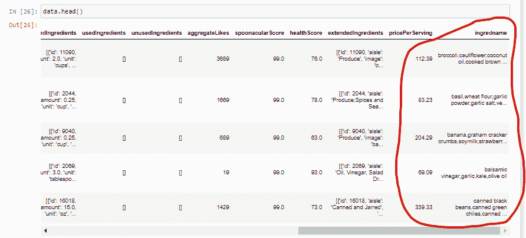
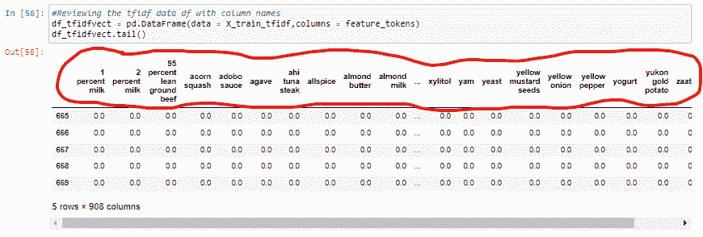

# 为 NLP 准备文本

> 原文：<https://medium.com/geekculture/prepping-text-for-nlp-fdbb993b7ac1?source=collection_archive---------66----------------------->

你是否曾经开始学习新的东西，却因为最初缺乏理解而感到不知所措？这和试图翻译一种你从未听过的语言是一样的感觉。

这正是我在数据科学之旅中尝试学习 NLP 时的感受。

尽管我知道这很有挑战性，但了解 NLP 在多个行业生产顶级应用程序，包括:

*   大量使用的情感分析(脸书，推特)
*   聊天机器人(Radius)
*   通过自然语言处理实现语音识别(Siri、谷歌助手、Cortana)
*   机器翻译——谷歌翻译:用于实时地将一种语言翻译成另一种语言
*   拼写检查
*   关键词搜索
*   信息提取—从任何文档或任何网站
*   广告匹配——根据你的历史推荐广告

那么 NLP 到底是什么？是人工智能的分支，让机器理解人类语言的庄园才是有价值的。

让我们通过视觉效果/例子详细地走一遍 NLP 文本处理步骤，以充分理解这种疯狂的方法。首先要解决的是，计算机不能像人类一样理解语言。已知的人类语言有 6500 种。所以，只懂 1 和 0 的计算机不能理解这些人类语言也就不足为奇了。所以，最终目标是将人类语言转化为计算机语言。

NLP 步骤:

**正文- > 1。分割- > 2。标记化- > 3。炮泥- > 4。词汇化- > 5。词性标注- > 6。命名身份识别- >解析文本**

1.  **分割**:将给定文本分割成组件。对于句子，它被分成它的组成句子，沿着标点符号。

《出埃及记》**甜茶很好，但她还是很渴。**被分割成以下内容:

a.甜茶很好

b.但是她还是很渴

**2。记号化**:将字符串分解成记号的过程。这是开发好模型的基础，有助于我们理解现有的文本。

标记化之前——在 ingredname 列的每个单元格中列出多个成分。

Before Tokenization

标记化之后——每个 ingredname 现在都有了自己的列。

After Tokenization

3.**词干化**:将单词规范化为基本或词根形式

*   它的工作原理是考虑到一系列常见的前缀和后缀，切断单词的开头或结尾
*   《出埃及记》以下所有单词都有相同的词根**影响:**

1.  **做作**
2.  **影响**
3.  **感情**
4.  **受影响的**
5.  **感情**
6.  **影响**

这个过程并不是在所有情况下都有效。

4.**词汇化**:承担单词的词法分析。算法通过一个详细的字典将表单链接回其原始单词或词根，也称为**引理**

*   有点类似于词干，因为它将几个单词映射到一个共同的词根
*   词汇化的输出是一个合适的词
*   《出埃及记》，一个 Lemmatiser 竟然把**走了，走了，走了**变成了**走了**

5.词性标签——说出单词的语法类型，可以是动词、名词、形容词、副词、冠词等等

*   指出单词在句子中的意义和语法功能
*   一个单词可以有一个以上的词性，这取决于它的上下文
*   《出埃及记》给我一个答案(答案是名词)，回答问题。(答案是动词)

6.**命名实体识别** —信息提取，将单词分类到子类别中。子类别包括:

*   人
*   量
*   位置
*   组织
*   电影
*   币值

《出埃及记》

所有 NLP 处理完成后，建模的乐趣就开始了！

 [## 如何进行命名实体识别 Python 教程

### 命名实体识别(NER)或命名实体提取是一种使用自然语言的关键字提取技术

monkeylearn.com](https://monkeylearn.com/blog/named-entity-recognition-python/) 

[10 分钟自然语言处理| NLP 初学者教程| NLP 培训| Edureka](https://www.youtube.com/watch?v=5ctbvkAMQO4)

[10 分钟自然语言处理|面向初学者的自然语言处理教程|自然语言处理培训| Simplilearn](https://www.youtube.com/watch?v=6I-Alfkr5K4&t=103s)