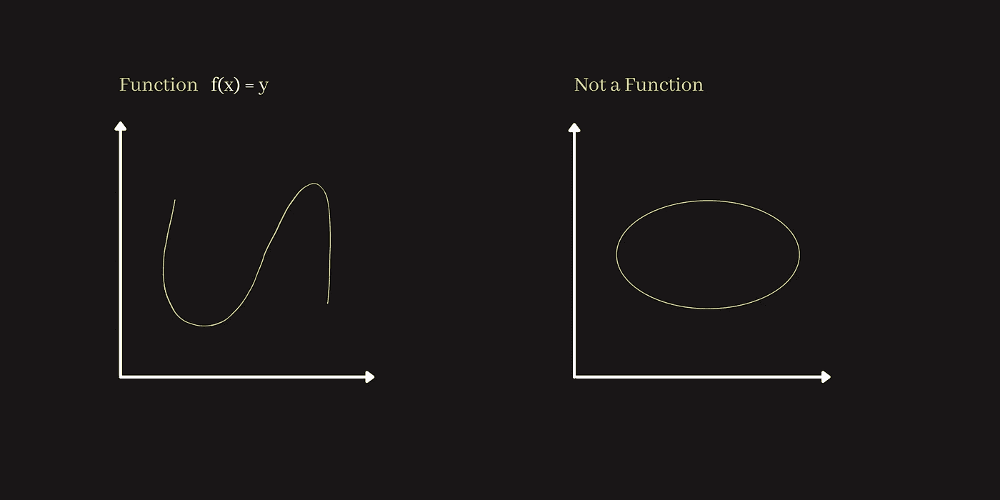

# 开始数据科学数学之前的先决条件

> 原文：<https://medium.com/geekculture/prerequisites-before-starting-mathematics-for-data-science-4834420baa6b?source=collection_archive---------29----------------------->

> 机器学习模型需要向量微积分、概率和优化，就像美味佳肴的配料一样。应用机器学习本质上就是将这些数学成分以巧妙的方式结合起来，创造出有用的(好吃？)模特。

# 设置

集合是数学中最基本的概念之一。它们是如此的基本，以至于不能用其他任何东西来定义它们。相反，数学的其他分支是用集合来定义的，包括线性代数。简单地说，**集合是对象**的明确定义的集合。这样的对象被称为集合中的**元素或成员**。一个板球队的球员，一个班级的学生分数列表，以及 IPL 球队都是集合的例子。板球队队长，分数榜第一的学生，孟买印度人队，都是他们对应集合的“成员”或“元素”的例子。我们将带有大写斜体字母的集合表示为 **A** 。在线性代数的上下文中，我们说一条直线是一组点，平面中所有直线的集合是一组集合。同样，我们可以说*向量*是点集，*矩阵*是向量集。

# 归属和包容

我们使用**隶属于**的概念来构建集合。我们用希腊字母 epsilon 表示 *a 属于*(或者是*元素*或*成员*)A*:*

*a ∈ A*

*另一个重要的想法是**包含**，它允许我们构建*子集*。考虑设置 ***A*** 和 ***B*** 。当 ***A*** 的每一个元素都是*B 的一个元素时，我们说 ***A*** 是***【B***的一个*子集，或者说 ***B*** *包括* ***A*** 。符号是:***

*A ⊂ B **或** B ⊃ A*

*归属与包含来源于**公理的扩展** : *两个集合相等当且仅当它们有相同的元素*。这个公理听起来似乎很简单，但却是使归属和包含变得严格所必需的。*

# *设置规格*

*一般来说，我们断言的关于集合元素的任何事情都会导致**生成子集**。换句话说，断言关于集合的事情是制造子集的一种方式。以所有狗的集合为例，我将其表示为 ***D*** 。我现在可以断言“ ***d*** 是黑的”。这种断言对所有狗的集合中的一些成员来说是正确的，而对另一些成员来说是错误的。于是，这样一个句子，为*所有*成员**D求值，生成一个子集:*所有黑狗*的集合。这表示为:***

*B={ d ∈ D : d 是黑的}*

*或者*

*B={ d ∈ D| d 是黑的}*

*冒号(::)或竖线(||)读作“这样”。所以我们可以把上面的表达式解读为:****D****在* **D** *这样* ***d*** *的所有元素都是黑色的*。这就是我们如何从 **A** 得到集合 **B** 的方法。**

**如前所述，集合生成依赖于规范的**公理:*对于每个集合****和每个条件* S(x) *都有一个对应的集合* **B** *，其元素恰好是那些元素* a∈A *，其中* S(x) *成立。*******

****条件 S(x)是关于元素 **A** 的任意*句子*或*断言*。有效句子是属于的*或等于*的*。当我们用逻辑运算符(not、if、and 或等)组合归属和相等断言时，我们可以构建任何合法的集合。*****

# ****有序对****

****成对器械包有两种类型:*无序*和*有序*。我们关心成对的集合，因为我们需要它们来定义关系和函数的概念(从这里开始，为了方便起见，我将用小写字母来表示集合，但是请记住，我们仍然在谈论集合)。****

****考虑一对套 ***x*** 和 ***y*** 。一个**无序对**是其元素为 *x，y* and ( *x，y)=(y，x)的集合。*因此，演示顺序并不重要，设置是一样的。****

****在机器学习中，我们通常会关心呈现顺序。为此，我们需要定义一个**有序对**(为了避免引入太多新概念，我将在直观的层面上介绍这个)。一个**有序对**记为 ***(x，y)*** ，其中 ***x*** 为*第一坐标*，*为*第二坐标*。一个有效的有序偶具有 **(x，y)≦(y，x)** 的性质。*****

# ****关系****

****从有序对中，我们可以导出集合之间或元素与集合之间的关系的概念。关系可以是二元、三元或多元的。这里我们只关心二元关系。在集合论中，**关系**被定义为有序对的*集合，记为 **R** 。因此，我们可以将 **x** 和 **y** 之间的关系表示为:*****

****x **R** y****

****此外，对于任何 z∈R，存在 x 和 y 使得 z=(x，y)。****

****从 R 的定义可以得到**域**和**值域**的概念。**域**是一个集合，定义为:****

******DOM**R = { x:for some y(x R y)}****

****这读作:x 的值使得对于 y 的至少一个元素，x 与 y 有关系。****

******范围**是一组定义为:****

******冉** R={y:对于某些 x (x R y)}****

****意思是:由 y 的值形成的集合，使得 x，x 中至少有一个元素与 y 有关系。****

# ******功能******

****考虑一对集合 X 和 Y。我们说从 X 到 Y 的**函数**是这样的关系:****

******dom** f= **X** 并且****

****使得对于每个 **x ∈ X** 都有一个唯一的元素 **y ∈ Y** 和 **(x，y) ∈ f.******

****一个函数“ *transform* ”或“ *maps* ”或“*send*”x 到 y 上，对于每个“*自变量*”x 都有一个唯一值 y，f“*取*”或“*取*”。****

****我们通常将从 X 到 Y 的关系或函数或变换或映射表示为:****

******f : X→Y******

****或者****

******f(x) = y******

****查看这个函数定义的效果的简单方法是用图表。在图 1 的**中，左窗格显示一个有效函数，即每个值 f(x) *将*唯一映射到 y 的一个值上。右窗格不是函数，因为每个值 f(x) *将*映射到 y 的多个值上。这也称为*垂直线测试。*******

********

******Fig . 1******

****对于 f:X→Y，f 的*域*等于 X，但是*范围*不一定等于 Y，只要回忆一下*范围*只包括 Y 与 X 有关系的元素。****

******机器学习的最终目标是从数据**中学习函数，即从函数的*域*到*范围*的转换或映射。这听起来很简单，但却是事实。*域* X 通常是*变量*或*特征*的向量(或集合)映射到*目标*值的向量上。最后，我想强调的是，在机器学习中，转换和映射这两个词可以互换使用，但两者都意味着功能。****

****这就是我要讲的关于集合和函数的全部内容。我的目标只是介绍:(1) **集合的概念**，(2) **基本集合符号**，(3) **集合是如何产生的**，(4) **集合如何允许函数的定义**，(5) **函数的概念**。集合论是一个不朽的领域，但没有必要学习关于集合的一切来理解线性代数。****

****在接下来的博客中，我将涵盖数据科学所需的线性代数的所有主题。****