# 使用凭据存储防止访问泄漏

> 原文：<https://medium.com/geekculture/prevent-access-leakage-using-credential-storage-471f5839e79f?source=collection_archive---------16----------------------->

## 数字原生企业(科技初创企业)在内部构建大部分科技生态系统。在过去的几年里，发生了几起针对该生态系统的访问泄漏事件。

Digital Native Business

在某些安全事件中，访问泄漏会导致更严重的事件，如业务数据泄露。看看数字原生业务是如何成长的，他们在几周内，如果不是几天内，就能建立新的功能。市场需求要求软件工程师和 DevOps 团队在他们的交付工作中关注速度。在这些努力之间，对网络、服务器或数据库的访问有时得不到充分的保护。从斜接[到此](https://cwe.mitre.org/data/definitions/798.html)的参考。

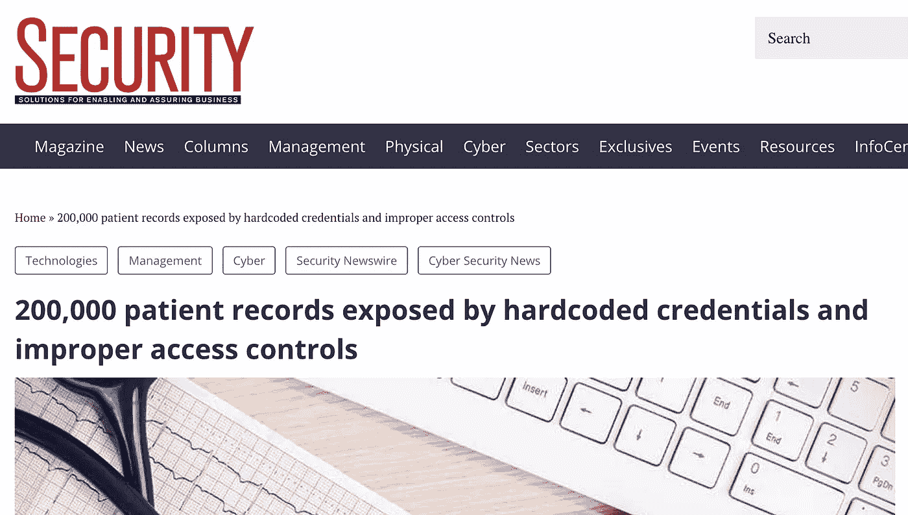

Recent exploit

# 目标

提供凭据存储解决方案，为应用程序运行提供所需的凭据。

在大多数现代应用程序中，它需要以下凭证。

*   数据库用户和密码
*   密钥
*   证书
*   云平台凭证
*   第三方 API 令牌

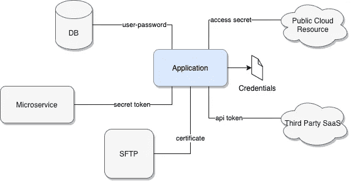

Simple Application Ecosystem

# 威胁向量

实际上，我们可以从过去的事件中观察到，威胁媒介是可以减轻的。但是我们有吗？

要回答这个问题，我们需要确定应用程序使用的访问泄漏的威胁向量。为了帮助识别，让我们看一下应用程序是如何开发和部署的。

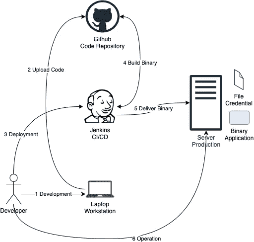

Common SDLC practice

基于以上常见的 SDLC，我们可以得出以下威胁向量。

# 开发工作站受损

当软件工程师从事应用程序开发时，他们通常需要测试试运行和生产资源。在数字本地业务中，调试情况一直在发生。在这种情况下，工程师还需要访问生产资源。一天结束时，工程师的工作站以证书、DB 连接字符串和 API 令牌的形式存储了几个凭证。

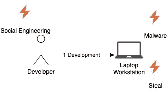

Development Workstation Threat

如果工作站遭到破坏，攻击者可以检索必要的凭据，并可以进行进一步的恶意操作。

# 硬编码凭据

在大多数开发团队中，git 是最常见的代码库。这有助于轻松地共享不同开发人员的代码。如果该开发人员正在进行硬编码，它也共享硬编码的凭据。增加了内部恶意访问使用的威胁。

如今，偶然向公众发布代码库的情况非常普遍。该公司丢失了源代码，但它也通过代码库中的硬编码凭证提供了对其系统的访问。

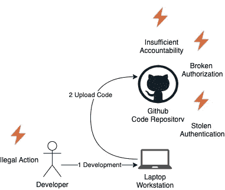

Hardcode Credential Threat

# 部署工具受损

CI/CD 是大多数当前开发团队的标准流程。这些部署工具帮助他们更快地部署新功能。它通过构建应用程序、在目标服务器中部署工件、提供凭证以及启动应用程序来工作。

Jenkins 和 CircleCI 等流行的 CI/CD 工具具有存储凭据的本机功能。就有效性而言，这是非常棒的。从安全性的角度来看，这种做法违背了最小特权和职责分离的概念。管理部署操作的人也管理凭证。大多数 CI/CD 工具没有足够的安全措施，如 RBAC 和审计。毫无疑问，CI/CD 工具对于数字原生业务的快速增长至关重要，但它并不是管理凭证的最佳工具。

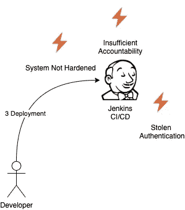

CI/CD Tool Threat

# 生产服务器受损

当应用程序在生产环境中运行时，它必须具有访问依赖关系资源的凭据。开发人员存储凭据的选择有限。选项包括文件上的凭据、操作系统变量上的凭据和注入到应用程序二进制文件中。当威胁行为者已经可以访问服务器时，所有这些都不会受到完全保护。

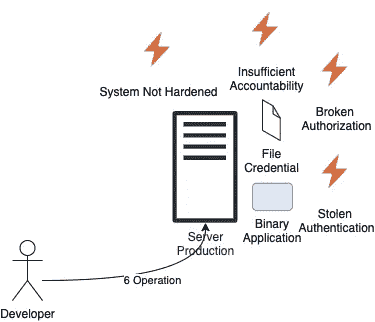

Production Server Threat

# 威胁分析

在 SDLC 的所有阶段，访问泄漏的威胁都存在。

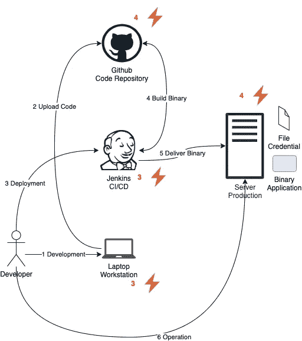

Access Leakage Threat in SDLC

为了确定威胁面，我们可以在下面的热图中展示威胁。

Access Leakage Threat Heatmap

# 凭据存储解决方案

凭据存储是一个安全存储一组数据的系统。数据通常是访问其他资源(如数据库和第三方 API 令牌)的凭证，但它可以存储简单的用户密码和复杂的证书。凭据存储将与其他应用程序交互，如面向客户的应用程序或内部企业应用程序。它将为其他应用程序提供适当操作所需的凭证。这种方法有助于将管理应用程序凭据的威胁转移到凭据存储系统。

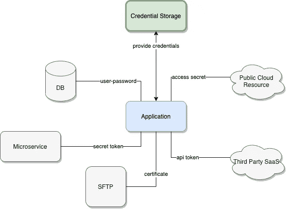

Application Ecosystem with Credential Storage

运行的凭证存储系统可以服务于多个应用。这种灵活性允许不同的应用程序检索它们所需的唯一凭证。

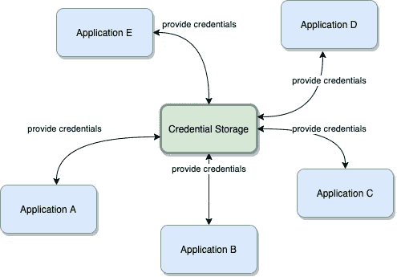

Credential Storage at Scale

与作为对象数据的凭证的交互遵循 AAA 模型。

*   证明
*   批准
*   有责任

使用 AAA 模型正确配置凭证存储将减少从其他应用程序传输的访问泄漏的威胁。

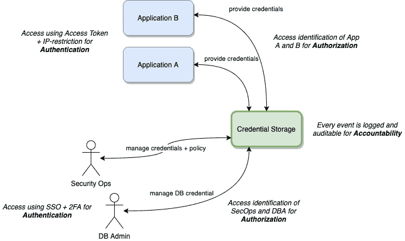

AAA model for credential data

凭证存储作为一个专用系统本身(本质上)有一个需要解决的威胁媒介。该系统将成为公司环境的核心系统。凭证存储实施必须遵循安全 CIA 模型。

*   机密
*   完整
*   有效性

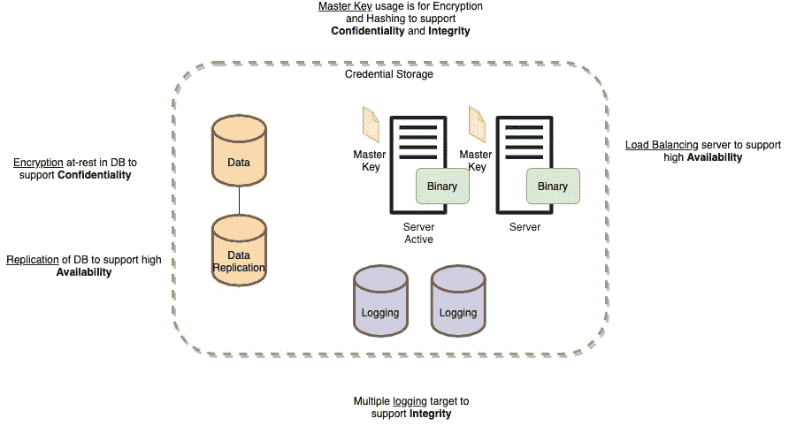

CIA model for credential storage system

# 凭据存储供应商

**哈西公司金库**

Vault 是来自 Harsicorp 的一个开源项目。任何人都可以在自己的环境中设置 Vault 系统作为凭证管理员。鉴于这个项目的公共许可性质，Vault 很受开发团队的欢迎，他们开始提升他们的安全游戏。

查看 https://www.vaultproject.io/的[了解更多信息。](https://www.vaultproject.io/)

**AWS 秘密经理**

AWS 的 Secrets Manager 是一个基于 SaaS 的存储凭证的解决方案。让系统运行在云中允许我们转移操作工作——有效地释放 CIA 模型需求。AWS Secrets Manager 按密钥数量和请求数量计费，具有成本效益。

查看[https://aws.amazon.com/secrets-manager/](https://aws.amazon.com/secrets-manager/)了解更多信息。

**GCP 秘密经理**

谷歌云平台(GCP)提供基于 SaaS 的名为 Secret Manager 的凭证存储。运营上有全云优势，Secret Manager 很便宜。

查看 https://cloud.google.com/secret-manager 的[了解更多信息。](https://cloud.google.com/secret-manager)

**赛博方舟魔法**

魔术师是来自 Cyberark 的开源凭证存储。它有一个企业版来支持那些没有资源自我管理开源版本的企业。该企业的名称是 CyberArk 应用访问管理器。

查看[https://www.conjur.org/](https://www.conjur.org/)了解更多信息。

# 履行

凭据存储是在相同的应用程序生态系统中实现的。系统访问和策略由安全运营部管理，以允许特定应用程序获取凭据。每个应用程序都有一个特定的路径来分隔应用程序之间的凭据。这样做是为了确保应用程序或用户只能读取为他们指定的凭证。应用程序和用户在访问凭据存储时需要提供身份验证。

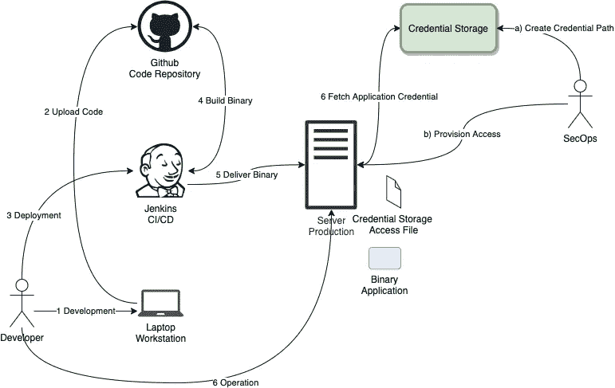

Credential Storage Implementation

作为这种实现的变形，我们可以想象我们出门时是如何锁门的。我们有许多有价值的资产，但是无论何时去都带着所有的资产是没有意义的。直觉思维是锁好房子，钥匙在我们手里。

Locked House Photo by [Eduard Militaru](https://unsplash.com/@eduardmilitaru?utm_source=ghost&utm_medium=referral&utm_campaign=api-credit) / [Unsplash](https://unsplash.com/?utm_source=ghost&utm_medium=referral&utm_campaign=api-credit)

现在，回到技术思维。我们可以使用威胁热图来验证实施。在我们的生态系统中添加凭据存储。凭据存储存储着许多重要数据，是一个具有许多威胁面的实体。

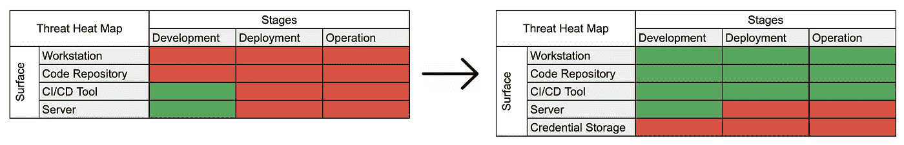

Threat Heatmap with Credential Storage

对于较小的团队来说，凭据存储的好处可能无法抵消实施和操作工作。这是正确的说法，因为从本质上讲，凭据存储正在转移威胁。对于运行十几个应用程序的大型团队来说，凭证存储对于控制威胁热点至关重要。此外，团队安全可以专注于保护重要资产—皇冠上的宝石。

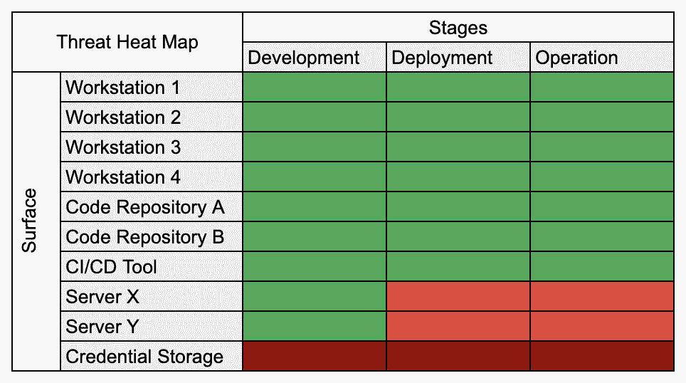

# 技术控制

凭据存储本身只是一个工具。它需要正确的配置，以确保 AAA 具有足够的安全性。

*   为用户和服务创建可靠的身份验证方法来管理凭据。大多数凭据存储供应商都有此功能，但正确配置它是用户的责任。

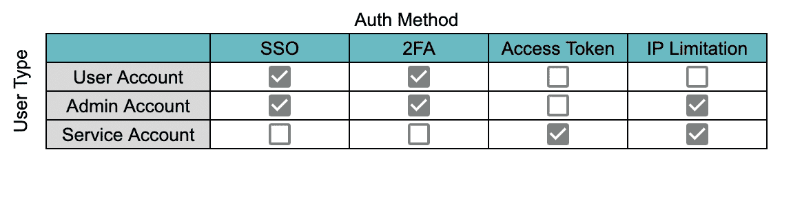

Robust Auth

*   遵循用户和服务访问角色的最小特权原则。通过清楚地了解“谁能做什么”并将其转化为系统 RBAC，我们可以防止非法活动。

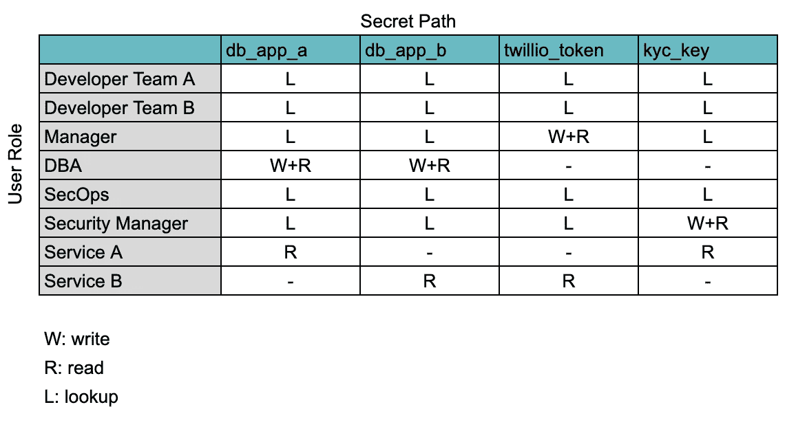

Least-privilege Principle

*   用于事件监控和审核目的的实时流审核日志。日志保留超出了凭据存储系统的范围。我们适当地设置了日志备份，以确保将来审计的信息可用性。

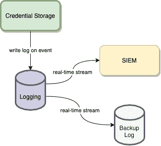

Non-Repudiation Log

# 行政控制

如果没有支持使用的策略，工具本身是无法运行的。

*   创建一个角色矩阵来定义对象交互行为。只有定义了组织的策略，才可能在系统中创建最低权限的 RBAC。该政策由人力资源部门和 IT 部门合作制定，以确保所有角色都得到管理。

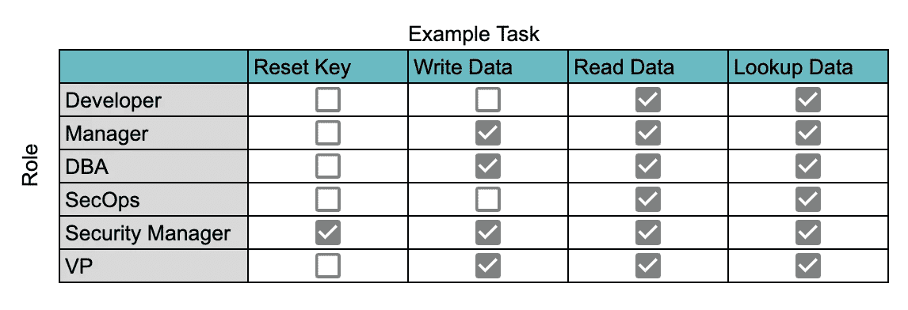

Example role-matrix

*   禁止在任何媒体上分发任何凭证。通过凭据存储，我们可以更好地控制威胁。但是，研究表明，人类是安全态势中最薄弱的环节。如果其中一名员工使用外部通信渠道分发凭据，我们无法保证该凭据的保密性。

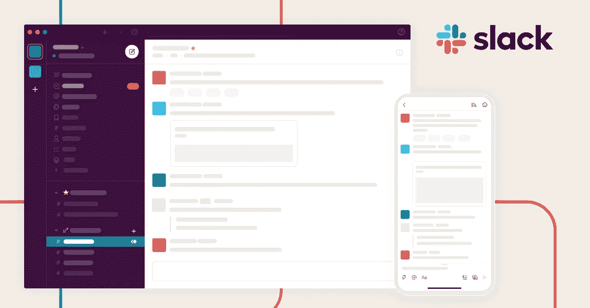

Slack Chat

*   保存和转移主密钥的严格政策。任何数据都被加密的凭证存储的本质是极好的安全控制。然而，有一个关于谁拥有密钥以及如何存储它的问题。更重要的是，如果钥匙持有人已不在公司，必须有更新主钥匙的政策。

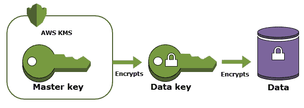

Master Key

# 裁决

凭证存储是控制访问泄漏威胁的完美解决方案。对于管理大量服务的团队来说，这是保持威胁热图正常运行的重要工具。