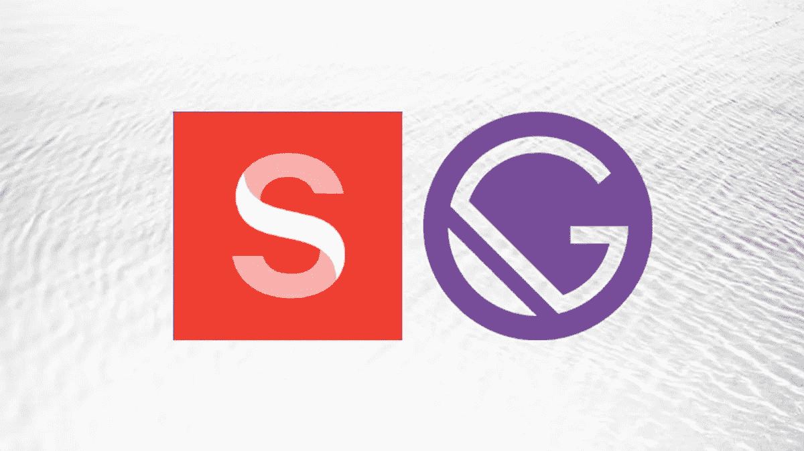

# 防止《神智清醒》和《盖茨比》中的图像布局变化

> 原文：<https://medium.com/geekculture/prevent-image-layout-shifts-in-sanity-gatsby-512b23cf759d?source=collection_archive---------37----------------------->

## 通过在 Sanity 和 Gatsby 中保持图像的纵横比来防止由于图像引起的布局偏移。

Image source: [blog.logrocket.com](https://blog.logrocket.com/sanity-cms-for-content-management-in-gatsby/)

这篇文章介绍了我在这篇博客中使用的方法，以防止图片加载时出现布局偏移。[我的网站](https://www.charistheo.io/)是用 [Gatsby.js](https://www.gatsbyjs.com/) 作为 web 框架，用 [Sanity.io](https://www.sanity.io/) 作为无头 CMS 搭建的。