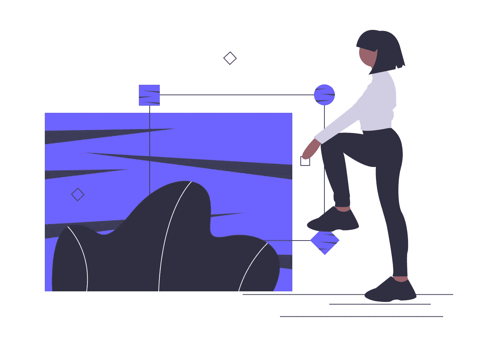

# 用回填充防止图像布局偏移

> 原文：<https://medium.com/geekculture/prevent-image-layout-shifts-with-padding-hack-4ed7a54929d8?source=collection_archive---------31----------------------->

## 通过使用 padding hack 保留图像的纵横比来防止由于图像引起的布局偏移。

Illustration by [unDraw](https://undraw.co/)

这是一个最小的、快速的、简单的指南，告诉你如何为具有宽高比的图像保留空间，并减少布局偏移。

从根本上减少[累积布局偏移](https://web.dev/cls/)，防止此类不良用户…