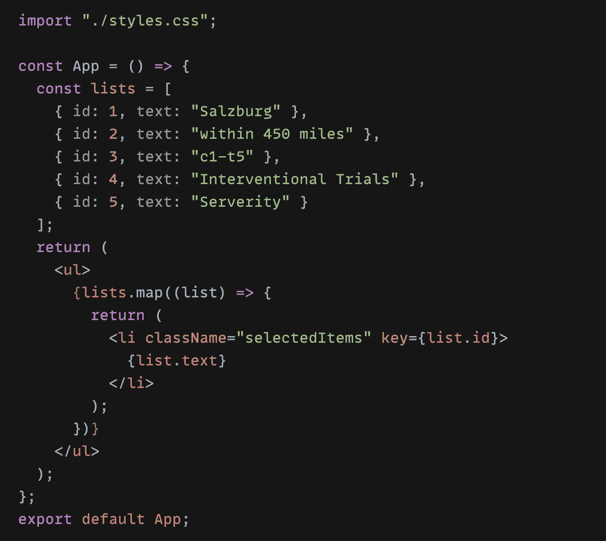
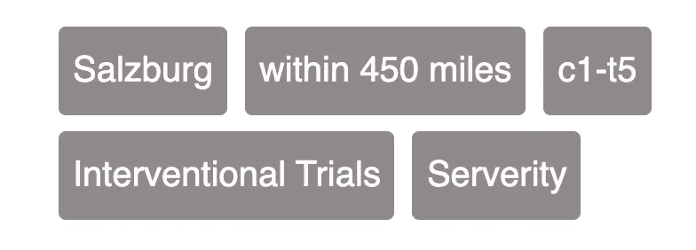
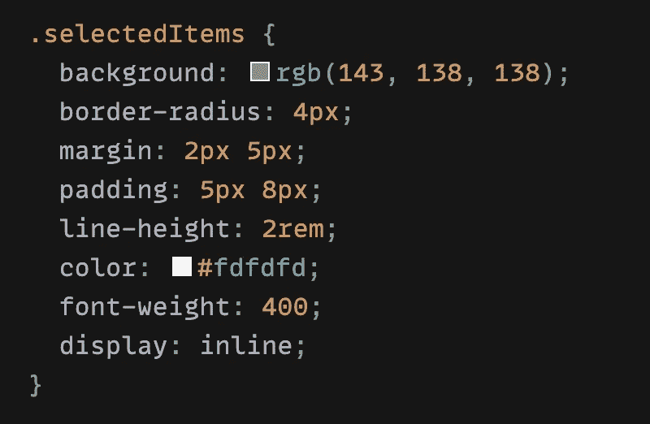
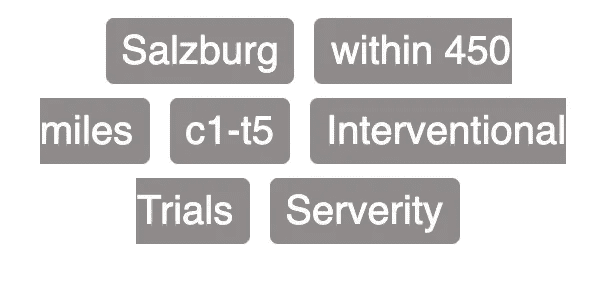
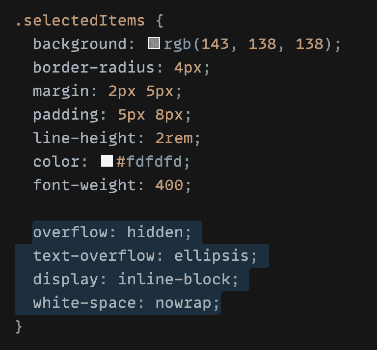

# 用 CSS 防止换行

> 原文：<https://medium.com/geekculture/prevent-line-breaks-with-css-68a9f066db60?source=collection_archive---------13----------------------->

—reactcomponent🧚中的 css 技巧

As long as the road is right, you are not afraid of the road far — 只要路是对的，就不怕路远

最近我遇到了一个有趣的问题，比方说，有一些**列表项**需要使用基本的 React 代码显示，如下所示👇

a very simple **<ul><li>** …

✨注意到这些条目应该并排(**内联**，当然没有任何**换行符**)，如下图所示👇

responsive lists view

我写了一些简单的 css: ✏️

I want that the items are side by side 👉**display: inline**

结果是💥

Ops, line breaks 🙅‍♀️

看到**断线**了吗？够丑的…

🤞我的简单解决方案来了:

prevent line breaks

就是这样！🌸

*`***white-space***`*CSS 属性设置如何处理元素内部的空白，*它折叠空白，但不允许换行。*

**`***overflow***`*CSS 速记属性在两个方向上为元素的溢出设置所需的行为，即当元素的内容太大而不适合其块格式上下文时。***

***`***text-overflow***`*CSS 属性设置如何将隐藏的溢出内容通知给用户。它可以被裁剪，显示一个省略号(*`*…*`*’)，或者显示一个自定义字符串。****

**这是一个快速简单的 css 技巧，希望你喜欢！💫**

**感谢阅读！**