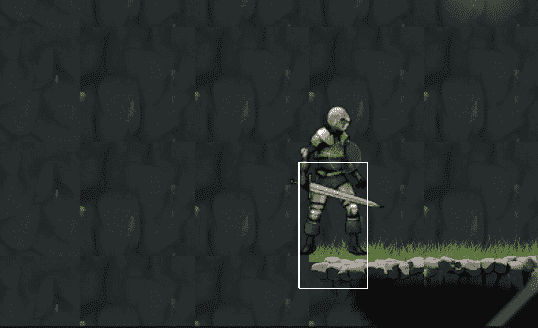

# 防止不必要的自碰撞—层碰撞矩阵

> 原文：<https://medium.com/geekculture/prevent-unwanted-self-collisions-layer-collision-matrix-33c52c562ad2?source=collection_archive---------11----------------------->

**目的**:用实例理解层碰撞矩阵

在上一个教程中，我们花了很大力气制作了一把剑**的 hitbox** ，它看起来棒极了。

但是一个**问题**自然出现了:剑碰撞器**通过**玩家一。这意味着当我们要进行代码冲突检测时，总会有一个…