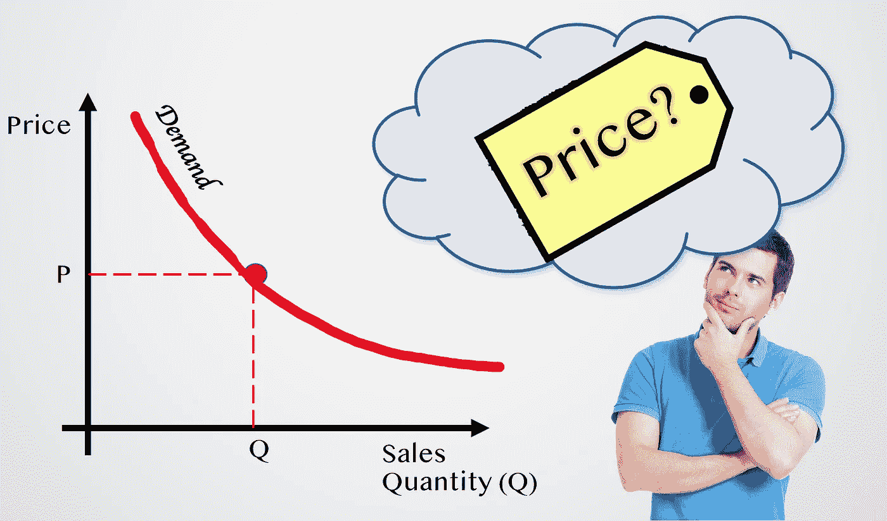
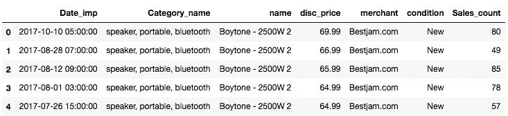
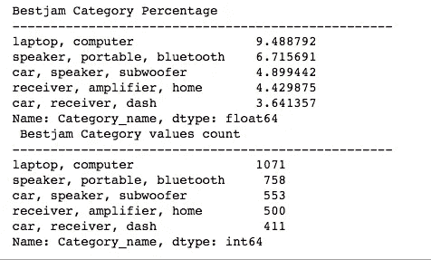
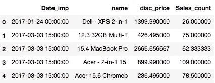
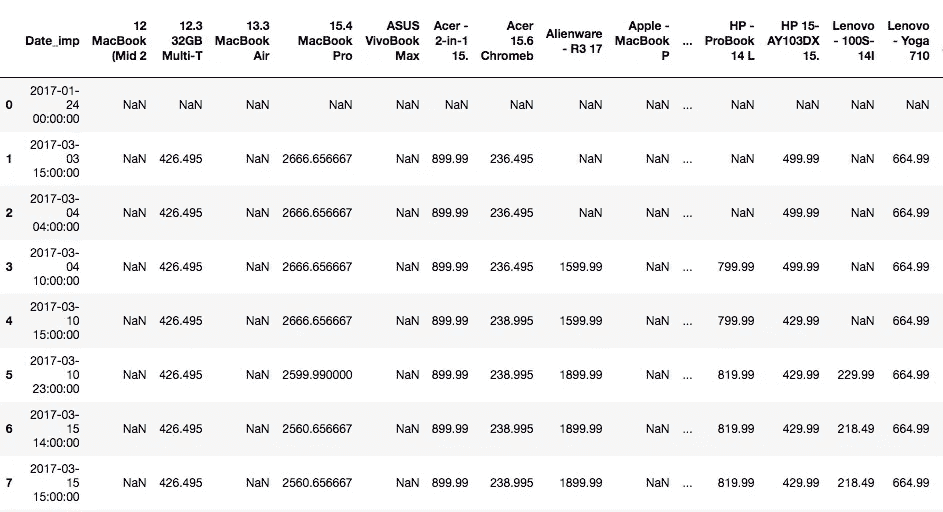
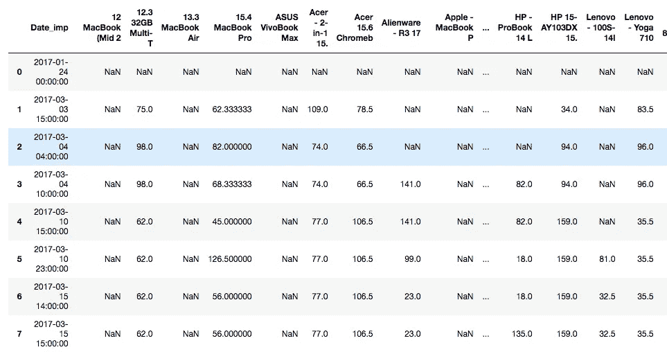
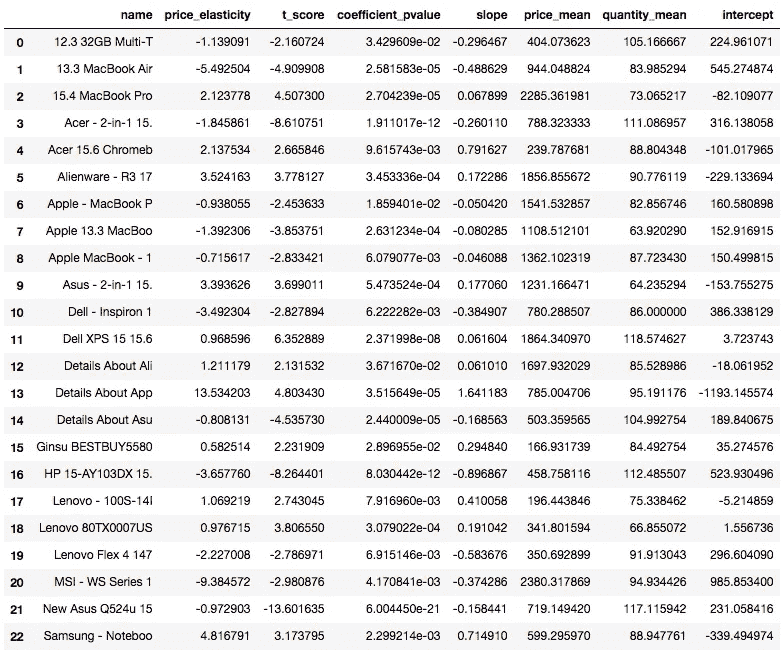
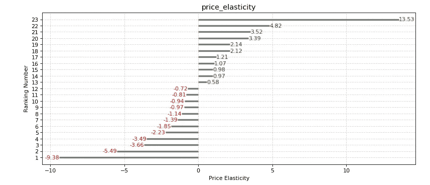
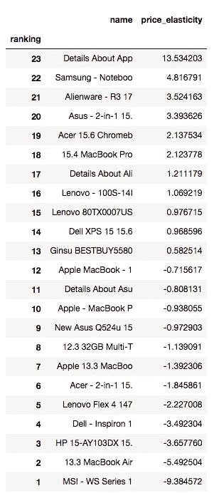

# 简单线性回归下的需求价格弹性(下)

> 原文：<https://medium.com/geekculture/price-elasticity-of-demand-using-linear-regression-in-python-part-2-8adb654328e7?source=collection_archive---------2----------------------->

Image 1 by the Author

> "如果产品价格发生变化，销售需求有多敏感？""如果我降低价格，我的销售额会增加多少？"

文章的第一部分通过详细解释什么是价格弹性以及如何解读数据，为你提供了价格弹性的简单解释。如果你想复习这些概念，我建议你点击下面的链接

 [## Python 中使用线性回归的需求价格弹性(第 1 部分)

### "如果产品价格发生变化，销售需求有多敏感？""如果我降低价格，我的销售额会增加多少？"

ileanacabada.medium.com](https://ileanacabada.medium.com/price-elasticity-of-demand-using-linear-regression-in-python-part-1-a28c844c1656) 

**文章的第二部分，也就是你现在正在阅读的那篇。它为您提供了完整的编码，并解释了如何使用 Python 中的线性回归来构建您自己的价格弹性模型。**

**那么，让我们开始有趣的部分吧:)**

# 数据收集:

# 收集什么数据？

我们知道没有数据就没有模型，第一步也是非常重要的一步是知道你需要什么样的数据。

该模型将为一个名为“Bestjam.com”的电子商务平台分析单一类别“笔记本电脑”中几种电子产品的价格弹性。没听说过平台吗？别担心，没人听说过它，:D，这是因为数据完全是为这个模型编造的。

为了分析价格弹性，我们需要具有历史价格和销售数量数据(销售需求)的产品，价格至少需要具有产品价格随其各自销售数量(销售需求)的一个以上的价格变化，以便能够观察销售需求对产品价格变化的反应。 ****

# 使用的 Python 库有:

我们将使用以下 python 库: **pandas、numpy、matplotlib 和 statsmodels。**

在这里，我在开始时导入了 pandas、numpy 和 matplotlib，但是在接下来的步骤中你会看到其中最重要的，它是主要用于**线性回归模型**的 **statsmodels** 。

Table 1

在你上面看到的数据框中，我们有制作模型所需的东西。您需要的主要指标是产品名称、价格和销售数量，它们反映了销售额。其他特征是我个人认为重要的分析的补充。接下来，我解释每个特性背后的原因。

# 数据框特征说明:

> **Date_imp:** 捕获数据时的日期时间印象
> 
> **Category _ name:**Category name 是一个特性，用于分析单一组的价格，如笔记本电脑、扬声器和其他
> 
> **名称:**产品名称
> 
> **disc_price:** 产品的价格。如果产品有折扣，包含的价格值是已经折扣的价格
> 
> **商家:**商家是产品所在的平台。建议从单一平台分析产品价格，因为消费者流量可能因平台而异，价格弹性分析可能不太准确
> 
> **条件:**产品条件。作为建议，从相同的条件下分析产品价格。否则，这可能会影响您的结果，因为条件为“二手”的产品价格通常比新产品价格便宜。
> 
> **Sales_count:** 销售计数是产品及其价格的销售需求

从数据来看，如上所述，只有一个商家被选中，以避免任何不一致，其他商家可能比其他商家拥有更多的用户流量(市场份额),因此我们的价格弹性可以改变。我们选择“Bestjam.com”电子商务平台，产品状态为“新”。然后我们检查了我们所有的类别值。

Figure 1

据了解，“笔记本电脑”类别是最大的类别。因此，在这种情况下，我们将分析这一类别的价格弹性。

Table 2

现在，我们将数据过滤到“Laptop，computer”类别，条件为“New”，我们选择数据框中的以下各列进行分析: ***Date_imp，name，disc_price 和 Sales_count。***

# **数据准备:**

为了构建线性回归模型，我们将“销售额”(y 值)设置为因变量，将“折扣价格”(x 值)设置为自变量。

因为这个模型的目的是估计一个类别中多种产品的价格弹性。它捕获了完整的“x_values”和完整的“y_values”，前者是其日期印象和名称中的产品价格，后者是其日期印象和名称中的产品销售数量，位于两个独立的数据框中，格式如下:

**自变量(disc_price)作为 x_values:**

Table 3

**因变量(销售数量)为 y_values:**

Table 4

现在，数据以正确的方式进行了线性回归。让我们建立我们的线性回归模型！

# 使用线性回归的价格弹性模型:

从本文的第一部分我们可能知道，价格弹性的计算如下:

**PED:**

**数量变化百分比(销售需求)/价格变化百分比**

使用线性回归将其改写如下:

**线性回归中的 PED:**

**系数(斜率)*价格平均值/数量平均值**

如线性回归所述，使用 **statsmodels 库**。在下面的 for 循环中，数据被转换并附加到几个数据框中，每个产品名称有 x 值和 y 值。稍后，用每个产品数据框及其各自的 x 和 y 值拟合线性回归。

Table 5

此外，还介绍了为您计算的每个指标，以便您在分析或构建自己的价格分析时加以考虑。

注意:我衷心建议你从你的价格弹性中检查 t-stats 和 p-values。

# 最终数据帧指标解释:

> **价格弹性:**每件产品的价格弹性
> 
> **t_score:** 等于 t-stats，表示发现的显著性。越接近 0，越可能没有显著性。t-stats 越大，无论是正面的还是负面的，研究结果的重要性就越大
> 
> **coefficient_pvalue:** 检验零假设，即**系数**等于零(无影响)。低 **p** - **值** ( < 0.05)表示您可以拒绝零假设
> 
> **斜率(系数)**:是一条线上两个不同点之间的“价格变化”与“销售量变化”的比率
> 
> **price_mean:** 每件产品的平均价格
> 
> **quantity_mean:** 每件产品的平均销售量
> 
> **截距:**当所有其他变量= 0 时，等于 X 的量

# **数据可视化:价格弹性的发散图:**

**作为奖励**，我增加了一个数据可视化功能，它将帮助你展示你的价格弹性，以及你如何从可视化中解读数据:)

上面，这个内置函数将帮助您可视化价格弹性。使用分歧图是因为它让读者对价格分析的**负和正价格弹性**之间有一个更清晰的概述。

根据 Python 中使用线性回归的需求价格弹性的第 1 部分:

0- 1 之间的弹性被认为是**无弹性**，因此从等级 9 到 15 的产品是**无弹性的。**

**负价格弹性**位于等级 1 至 8，这将告诉我们当价格下降时，销售需求增加的可能性，反之亦然。

**例如，让我们分析位于第 5 位的 Lenovo Flex，其价格弹性为负 2.22:**

> 联想 Flex 价格下降 10%，销售需求增加 22.2%；联想 Flex 价格上升 10%，销售需求减少 22.2%

# 现在你成功了，祝贺你走到这一步！:)

# 感谢阅读！

如果你想继续学习更多关于价格策略和如何发现你的价格竞争对手，我推荐你阅读下面的文章:

 [## 用交叉价格弹性识别价格竞争对手——一种实用的方法

### 确定谁是你的价格竞争对手是价格和促销分配的关键

ileanacabada.medium.com](https://ileanacabada.medium.com/identifying-your-price-competitors-with-cross-price-elasticities-a-practical-approach-26c19f12b1ee)