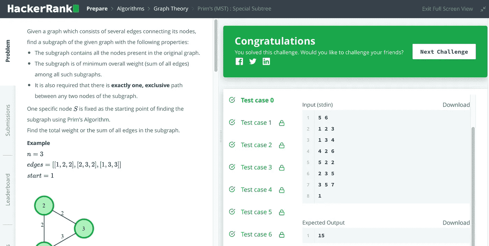

# prim(MST):特殊子树，已解释

> 原文：<https://medium.com/geekculture/prims-mst-special-subtree-explained-736307b8d822?source=collection_archive---------13----------------------->

## 用 Java 解释的 Prim 算法(最小生成树)


Photo by [AltumCode](https://unsplash.com/@altumcode?utm_source=medium&utm_medium=referral) on [Unsplash](https://unsplash.com?utm_source=medium&utm_medium=referral)

[Prim 的算法](https://en.wikipedia.org/wiki/Prim%27s_algorithm)很经典。你可以从维基链接了解它的历史和算法。但是理解和实现起来并不简单。这里将用 Java 实现它，以便于理解。

Prim 的算法可以从任意顶点开始。我们可以从一个特定的顶点开始寻找所有顶点的最小总距离。有两种常见的方法:1 .从最小距离开始扩展，一次一个或 2 个。一次从一个未访问的顶点开始探索。因此，我们可以看到，最小堆是构造边的一个很好的解决方案。这里用 HackerRank 难题来说明这一点。

## 问题

给定一个由连接其节点的几条边组成的图，找出给定图的一个具有以下性质的子图:

*   子图包含原始图中存在的所有节点。
*   在所有这样的子图中，该子图具有最小的总权重(所有边的和)。
*   还要求子图的任意两个节点之间有**且恰好有一条唯一的**路径。

一个特定的节点 S 被固定为使用 [Prim 的算法](https://en.wikipedia.org/wiki/Prim%27s_algorithm)寻找子图的起点。
求子图中所有边的总权重或和。

请看下面的原问题:

[](https://www.hackerrank.com/challenges/primsmstsub/problem) [## prim(MST):特殊子树| HackerRank

### 给定一个由连接其节点的几条边组成的图，找出给定图的一个子图，用…

www.hackerrank.com](https://www.hackerrank.com/challenges/primsmstsub/problem) 

## 解决办法

如上所述，我们可以使用最小堆来实现两种方法。这里将说明第二种方法。

```
import java.io.*;
import java.math.*;
import java.security.*;
import java.text.*;
import java.util.*;
import java.util.concurrent.*;
import java.util.function.*;
import java.util.regex.*;
import java.util.stream.*;
import static java.util.stream.Collectors.joining;
import static java.util.stream.Collectors.toList;

class Result {

    /*
     * Complete the 'prims' function below.
     *
     * The function is expected to return an INTEGER.
     * The function accepts following parameters:
     *  1\. INTEGER n
     *  2\. 2D_INTEGER_ARRAY edges
     *  3\. INTEGER start
     */

    public static int prims(int n, List<List<Integer>> edges, int start) {

        PriorityQueue<List<Integer>> heap = new PriorityQueue<>(
                                    (a,b) -> a.get(2) - b.get(2));
        heap.addAll(edges);

        Set<Integer> visited = new HashSet<>();
        visited.add(start);
        int minSum = 0;

        while(visited.size() < n) {
            List<List<Integer>> temp = new LinkedList<>();
            while(!heap.isEmpty()) {
                List<Integer> min = heap.poll();
                if (visited.contains(min.get(0)) && visited.contains(min.get(1))) {
                    continue;
                } else if (visited.contains(min.get(0)) && !visited.contains(min.get(1))) {
                    visited.add(min.get(1));
                    minSum += min.get(2);
                    break;
                } else if (visited.contains(min.get(1)) && !visited.contains(min.get(0))) {
                    visited.add(min.get(0));
                    minSum += min.get(2);
                    break;                    
                } else {
                    temp.add(min);
                }
            }
            heap.addAll(temp);
        }

        return minSum;
    }
}

public class Solution {
    public static void main(String[] args) throws IOException {
        BufferedReader bufferedReader = new BufferedReader(new InputStreamReader(System.in));
        BufferedWriter bufferedWriter = new BufferedWriter(new FileWriter(System.getenv("OUTPUT_PATH")));

        String[] firstMultipleInput = bufferedReader.readLine().replaceAll("\\s+$", "").split(" ");

        int n = Integer.parseInt(firstMultipleInput[0]);

        int m = Integer.parseInt(firstMultipleInput[1]);

        List<List<Integer>> edges = new ArrayList<>();

        IntStream.range(0, m).forEach(i -> {
            try {
                edges.add(
                    Stream.of(bufferedReader.readLine().replaceAll("\\s+$", "").split(" "))
                        .map(Integer::parseInt)
                        .collect(toList())
                );
            } catch (IOException ex) {
                throw new RuntimeException(ex);
            }
        });

        int start = Integer.parseInt(bufferedReader.readLine().trim());

        int result = Result.prims(n, edges, start);

        bufferedWriter.write(String.valueOf(result));
        bufferedWriter.newLine();

        bufferedReader.close();
        bufferedWriter.close();
    }
}
```

它使用 Java PriorityQueue 作为最小堆。它 100%通过了如下所有 HackerRank 测试案例:



编码快乐！

*问题，想法？在这里留下评论。跟随我成为有趣的解决问题之旅的一部分。*