# 主成分分析

> 原文：<https://medium.com/geekculture/principal-component-analysis-3d2b3a0bb93e?source=collection_archive---------3----------------------->

## 一种选择最重要特征的方法

Photo by [Jason Coudriet](https://unsplash.com/@jcoudriet?utm_source=unsplash&utm_medium=referral&utm_content=creditCopyText) on [Unsplash](https://unsplash.com/?utm_source=unsplash&utm_medium=referral&utm_content=creditCopyText)

## 介绍

主成分分析是机器学习中广泛使用的降维技术之一。在庞大的数据集中，以最小的信息损失降低维度。减小尺寸将减少所需的时间和存储空间。

因此，主要思想是在低维空间中寻找精确的数据表示。

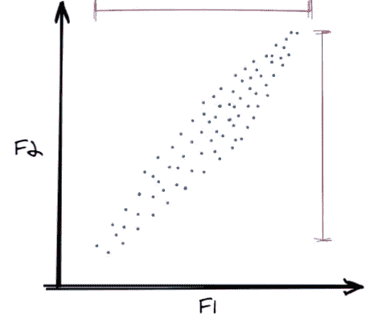

Two Features Data Points (Image by author)

假设我们有一个包含两个特征(列)的数据集，我们希望将数据集的维度降低到一维。现在简单地删除任何特征都会导致信息丢失。在上图中，我们可以观察到两个特性的方差都很高，删除任何一个特性都会导致几乎 50%的信息丢失。为了克服这个问题，我们使用 PCA，因为它保留了数据中最大的方差。

现在来看一组不同的数据点

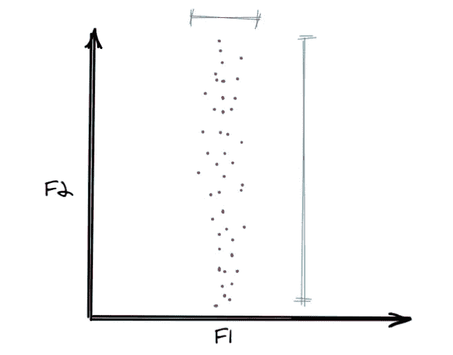

Two Features Data Points-2 (Image by author)

这里，我们可以观察到特征 F1 上的数据点的方差或分布非常小。因此，如果我们想在这种情况下跳过一个特性，那么就是 F1。

我们有没有办法在第一组数据点中做同样的事情？当你画了上面的两个图，并试着用同样的数据点做第三个图，但是在轴上有一些旋转，你就会明白这个概念了

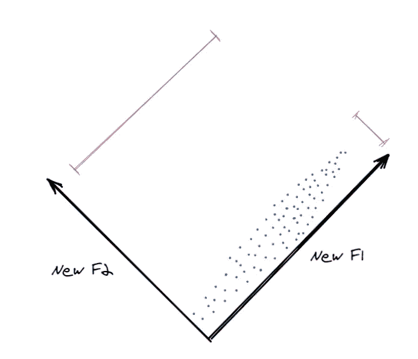

Two NEW Features Data Points-3 (Image by author)

轴旋转后，我们制作了两个新特性，这里 NewF2 中的扩散较小，我们可以跳过该特性。这些新功能是主要组件。主成分捕捉数据中最大的方差。

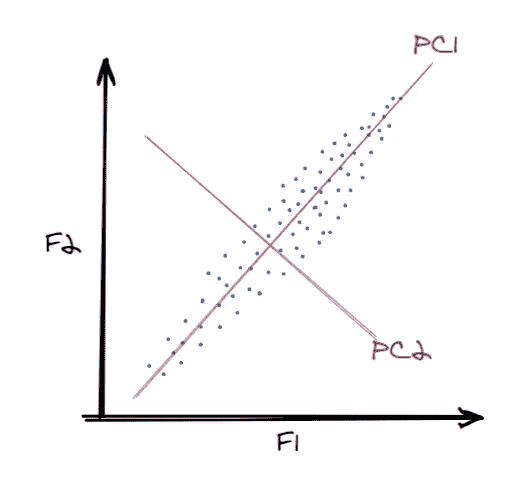

Two Features Data Points with PC-4 (Image by author)

记住，如果我们在一个数据集中有 n 个特征(列),我们将有 n 个主成分。但是我们只保留那些保存更多信息的。

# PCA 步骤

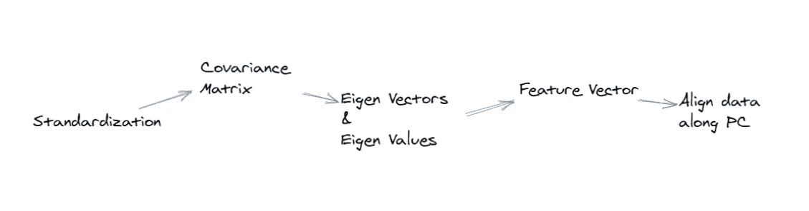

Steps in PCA (Image by author)

## 1.标准化

标准化是一种扩展数据的方法。如果给定数据集中的不同特征处于不同的尺度，则相应的方差将会不同，并且所有特征的贡献将不会相同。

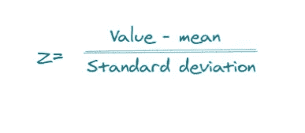

z value (Image by author)

具有高方差的变量将支配具有低方差的变量，导致有偏差的输出。

注意:标准化是一个重要的步骤，在盲目进行标准化之前，理解数据和使用什么类型的模型是很重要的。当使用基于距离的算法时，标准化就完成了。

## 2.协方差矩阵

协方差矩阵的计算将有助于我们理解变量是如何相互变化的。此外，协方差矩阵用于计算特征向量和特征值。

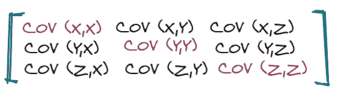

covariance matrix (Image by author)

变量与其自身的协方差就是方差。

COV(X，X)=VAR(X)，主对角线上的其他元素也是如此。

## 3.计算特征向量和特征值

特征向量是主成分，特征值告诉我们解释的信息(方差)的百分比。

特征向量和特征值的计算公式

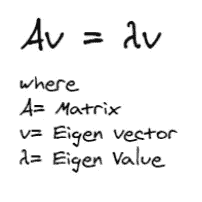

Eigenvector and Eigenvalue computation (Image by author)

上述公式用于计算特征向量和特征值。这里 A 是任何矩阵，在我们的例子中，我们将把我们的协方差矩阵代替 A .特征值是一个*标量。*

我们希望计算 v 和λ，以满足上述等式。让我们用一个给定的矩阵 a 来试试。

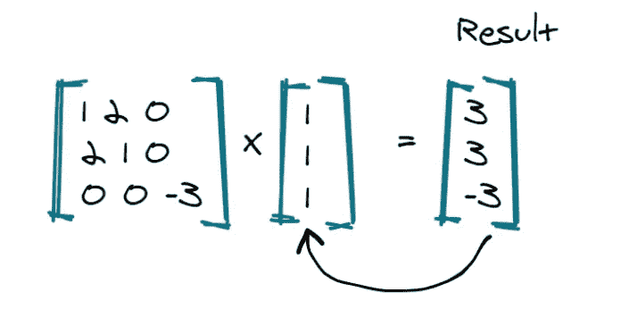

An X a vector (Image by author)

在这种情况下，我们选择了一个向量(1，1，1)，但结果与该向量无关。我不能取任何满足上述方程的标量。

让我们试试另一个向量(1，1，0)

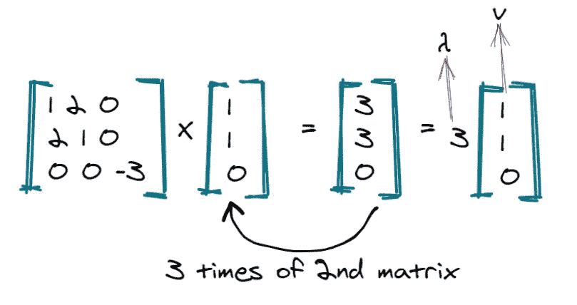

Image by author

在这种情况下，我们的向量和标量值 3 满足上面的等式。这就是 v 和λ的计算方法。

协方差矩阵的特征向量是解释的方差最大的方向，特征值是每个特征向量的系数，给出了每个主分量中的方差量。

10 维数据给出了 10 个主成分，但是 PCA 试图在第一个成分中保留尽可能多的信息，然后在第二个成分中保留尽可能多的信息，依此类推。

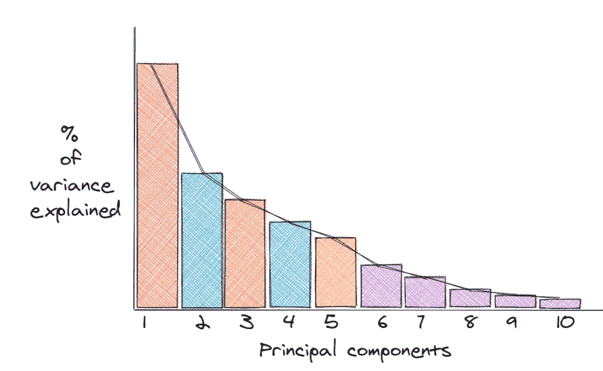

Image by author

第一台电脑的解释差异百分比最高(信息)。如果我们想把 10 维减少到 5 维，我们可以把主成分从 6 维减少到 10 维，因为它们存储的信息最少。

主成分或特征向量表示最大信息存在的方向，所有主成分相互垂直。这一独特的特征使得所有的 PCs 不相关，这就是为什么 PCA 用于消除多重共线性。

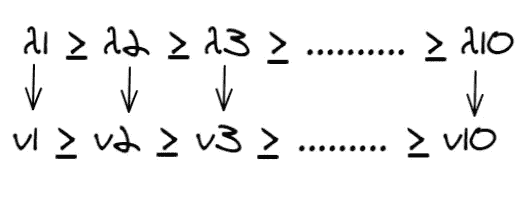

Image by author

现在，所有的特征值都是标量，那么，如何计算解释的方差百分比呢？

为了计算每个分量保留的%方差，我们将每个分量的特征值除以所有特征值的总和。

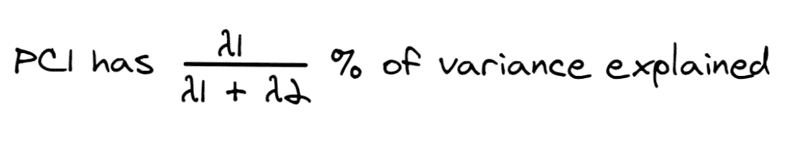

Image by author

在 2d 数据中

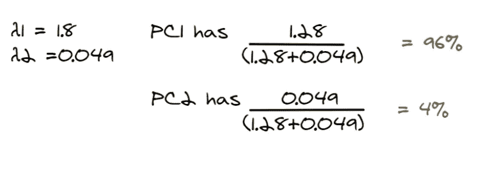

Image by author

PC1 解释了 96 %的方差，而 PC2 仅解释了 4 %。

## 4.特征向量

特征向量是所有特征向量的矩阵，我们决定按列保存这些特征向量。

如果我们选择从***【n】***中保留 ***m 个*** 特征向量，那么最终的数据将有 m 个维度。

## 5.沿着主成分对齐/重铸数据

到目前为止，除了标准化之外，我们没有对原始数据进行任何操作。具有特征向量(方向)的特征向量用于将数据从原始轴对准/重新定向到新的主分量轴。

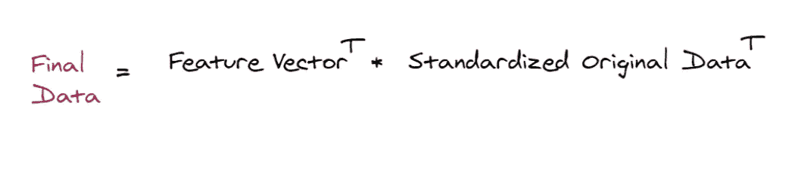

Image by author

## PCA 的优势

*   PCA 消除了多重共线性，因为所有 PC 都是相互垂直的，因此是独立的。
*   更多的特征导致过度拟合，PCA 移除不必要的信息减少过度拟合。

## PCA 的局限性

*   PCA 后形成的新特征是不可解释的，即它们是某些方向上的数字。
*   PCA 试图保留数据的全局形状，而不保留局部结构。

爱情！活下去！笑！干杯

**参考文献**:

*   [Steven M. Holland，佐治亚大学]:主成分分析
*   【skymind.ai】:特征向量、特征值、PCA、协方差、熵
*   [Lindsay I. Smith]:主成分分析教程
*   greatlearning.com