# 主成分分析:在执行降维时丢失最小信息

> 原文：<https://medium.com/geekculture/principal-component-analysis-losing-out-minimum-information-while-performing-dimension-reduction-85862b116d72?source=collection_archive---------29----------------------->

在这个数据量不断增长的世界中，我们一直在寻找最佳的方法来存储可能存在于多维空间中的巨大数据，并对其进行压缩或缩减，以适应可用的存储空间。然而，我们希望在尝试减少或压缩原始数据时不要丢失太多信息。

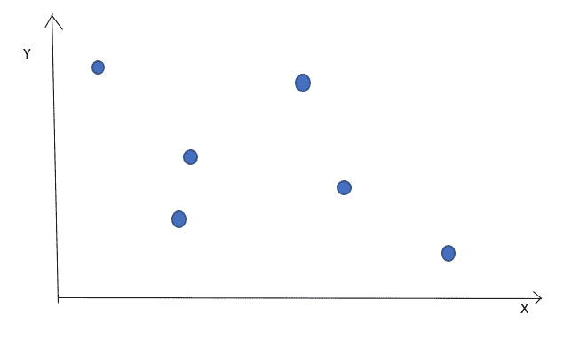

Data points distributed in a 2D plane

假设我们有以下分布在 2D 平面上的数据点。但是，我们的系统没有足够的空间来存储它，为了便于存储，我们希望将它简化为一维数据。

现在，我们有以下选择:我们可以只保留数据点的 x 值，或者只保留 y 值。无论哪种方式，我们都会丢失一些关于数据的信息。有没有什么方法可以将数据点投影到新的行上，这样我们就不会丢失太多信息。我们要做的是找到数据点之间的最佳分离方向，因为它们是在原始维度上分离的，即信息损失最小的方向。试着想象一个场景，一群朋友正在拍集体照。摄影师尝试了几个角度，并在那个角度投射相机，在那里他可以清晰地捕捉到所有的脸，并且它们之间的重叠最小。

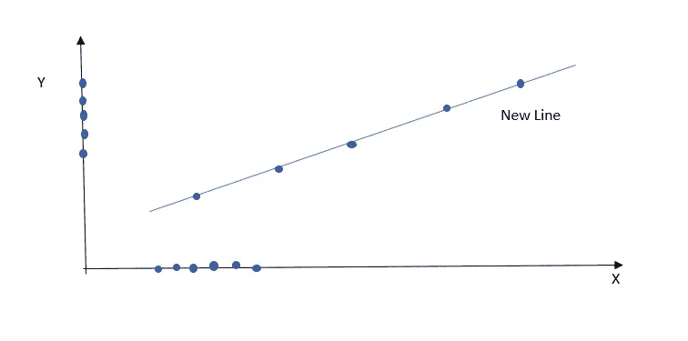

Data points overlap when projected solely on X axis or Y axis, separation between points is maximized when projected on the new line

这种将数据从多维空间投影到较低维度，而不丢失太多信息，最大化数据点之间的变化或分离的想法是通过称为**主成分分析(PCA)** 的过程实现的。在机器学习算法中，它是处理具有大量维度的庞大数据集时最重要的降维方法之一。

**如何找到最大变化的方向？**

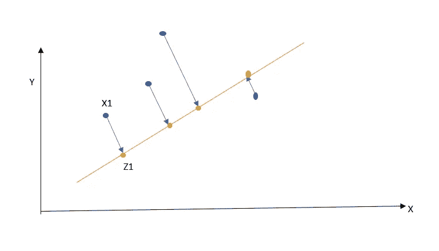

Original data points are shown in blue, projected data points shown in yellow

让我们的原始数据集分布在一个 X-Y 平面上，数据点是 x1，x2 等等，如蓝色圆圈所示。现在，我们希望将数据点投影到一个新行上。如果 u 是这条新直线的方向，那么从几何学上讲，新数据或**新嵌入的数据点**由下式给出:

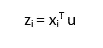

数据应该是**均值居中(标准化)**，即数据的均值= 0。这是 PCA 的第一步。如果我们回忆一下方差公式，就可以理解为什么数据需要以平均值为中心。方差由下式给出

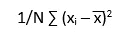

如果平均值为 0，那么方差项减少到

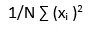

假设均值= 0，新嵌入数据的方差由下式给出

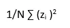

Variance of embedded data

我们的主要目标是最大化这个方差，以便我们在这个新投影的数据点中丢失最少的信息。

找出新嵌入数据的差异:

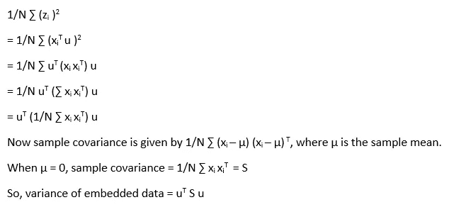

**S 是样本数据的协方差矩阵**。我们必须找到使上述表达式最大化的 u，使得 u 是一个单位向量，即

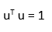

u needs to be a unit vector

使用拉格朗日方法求解上述表达式的 argmax，我们得到如下结果:

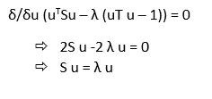

Using Lagrange method to solve for maximum value

s 是 D*D 矩阵，或数据的协方差矩阵，u 是 D*1 向量。

所以我们得到的解决方案，就是协方差矩阵 s 的**本征分解**

简单回顾一下:**特征向量**是一个向量，当对其应用线性变换时，它会随标量而变化。向量缩放的因子称为**特征值**。这里，u 是本征向量，λ是本征值。

我们将投影数据的方向由本征向量 u 给出。现在，为了最大化嵌入数据的方差，这是 PCA 的主要目标，我们需要找到具有最大本征值或λ的本征向量。

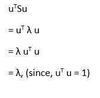

Maximizing the variance of embedded data, boils down to finding the largest eigen value obtained by the eigen decomposition of the covariance matrix of the data.

**现在，选择哪个特征值？**

最佳嵌入是具有**最大特征值**的协方差矩阵的特征向量。如果我们希望在一个一维上投影，选择顶部特征值，对于 k 维，选择具有顶部 k 个特征值的那些特征向量。

第一主成分:具有最大特征值的特征向量

第二主分量:具有下一个最大特征值的特征向量

……

分数或加载分数被定义为原始数据(以平均值为中心)乘以特征向量的权重或因子。我们可以这样形象化:设 X1，X2，X3 为输入数据的三维或特征，乘以特征向量[2 1 0]。使用矩阵向量乘法规则，我们可以看到，那些权重较小或为 0 的特征，在乘法之后，将具有较小的重要性或者将减少到 0。因此，PCA 有助于保存更重要的特征，并排除不太重要的特征。

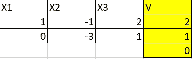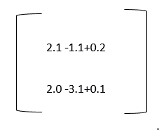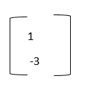

这就是二维数据在乘以一个本征向量后，现在被简化为一维数据的方式。因此，1 和-3 被称为第一主成分的加载分数。

**了解碎石地块**:

碎石图是一个线形图，它告诉我们应该用多少个主成分来描述数据的最大变化。它描绘了当使用主成分时发生了多少损失，并且在该图中，主成分按照特征值排序。

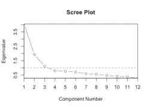

Scree Plot

上面的 scree 图表明，当我们使用一个主成分时，产生的损失最高，随着我们继续增加主成分的数量，产生的损失不断减少，当我们使用全部 12 个主成分时，基本上是全部数据，我们没有产生信息损失。该图显示了元件数量为 4 时的陡峭波谷，之后保持相当恒定，这意味着如果我们使用具有前 4 个本征值的本征向量，我们将导致最小的损耗，此后，即使我们增加元件数量，损耗也将保持不变。因此，不是使用上述数据的所有 12 个维度，而是仅使用 4 个主成分，将捕获最大变化，如原始数据所述。

**r studio 中的 PCA 模拟，使用白葡萄酒数据:**

白葡萄酒数据总共由 12 个变量组成，其中前 11 个是自变量，最后一列是第 12 个，“质量”是因变量，它取决于 11 个自变量。

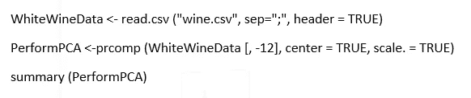

PCA simulation in R

主成分分析的总结产生以下输出，其描述了主成分描述了多少方差。

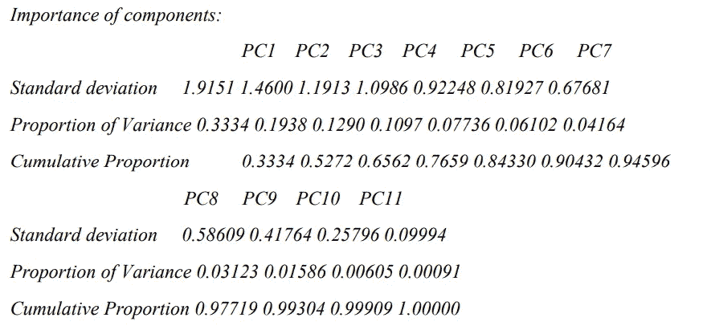

First PC is built with the eigen vector having the largest eigen value: describes the highest variance, followed by second PC and so on, all 11 PCs cumulatively describe 100% or the total variance.

**PCA 的局限性:**

1.  在进行 PCA 之前，必须对数据进行标准化。
2.  独立变量很难用主成分分析来解释。由于 PCA 涉及协方差矩阵 S，如果数据之间没有协方差，例如，如果数据分布在均匀的圆上，那么 PCA 可能没有帮助。